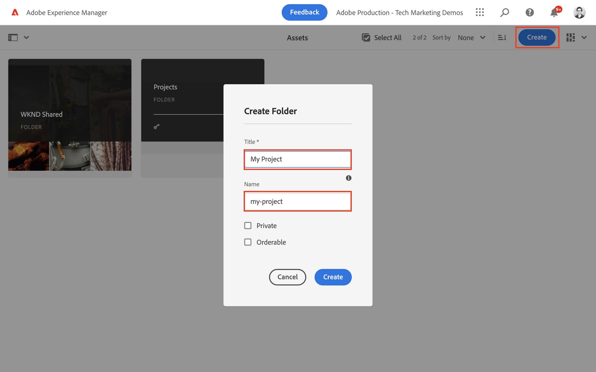
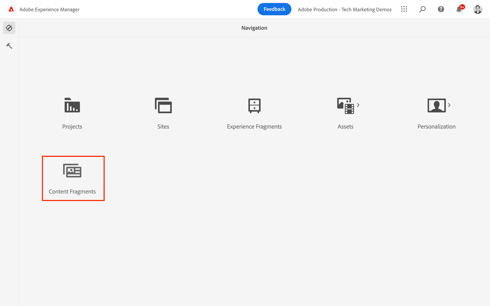
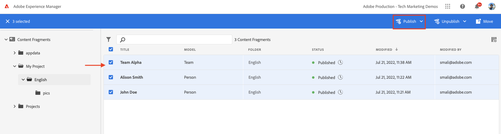

# Inhoudsfragment ontwerpen {#authoring-content-fragments}

In dit hoofdstuk maakt en bewerkt u een nieuw inhoudsfragment op basis van de [nieuw gedefinieerd inhoudsfragmentmodel](./content-fragment-models.md). U leert ook hoe u variaties van inhoudsfragmenten kunt maken.

## Vereisten {#prerequisites}

Dit is een meerdelige zelfstudie en er wordt aangenomen dat de stappen die in het dialoogvenster [Modellen voor inhoudsfragmenten definiëren](./content-fragment-models.md) zijn voltooid.

## Doelstellingen {#objectives}

* Een inhoudsfragment maken op basis van een model van een inhoudsfragment
* Een variatie in een inhoudsfragment maken

## Een map met middelen maken

Inhoudsfragmenten worden opgeslagen in mappen in AEM Assets. Als u inhoudsfragmenten wilt maken op basis van de modellen die u in het vorige hoofdstuk hebt gemaakt, moet u een map maken waarin u de fragmenten kunt opslaan. Er is een configuratie vereist voor de map om het maken van fragmenten van specifieke modellen mogelijk te maken.

1. Navigeer in het scherm AEM starten naar **Activa** > **Bestanden**.

   

1. Tikken **Maken** in de rechterbovenhoek en tik op **Map**. In het resulterende dialoogvenster voert u in:

   * Titel*: **Mijn project**
   * Naam: **mijn-project**

   

1. Selecteer de **Mijn map** map en tik **Eigenschappen**.

   

1. Tik op de knop **Cloud Servicen** tab. Selecteer op het tabblad Cloudconfiguratie de padFinder **Mijn project** configuratie. De waarde moet `/conf/my-project`.

   

   Als u deze eigenschap instelt, kunnen inhoudsfragmenten worden gemaakt met behulp van de modellen die in het vorige hoofdstuk zijn gemaakt.

1. Tik op de knop **Beleid** onder de **Modellen voor toegestane inhoudsfragmenten** veld gebruikt padzoeker om de **Persoon** en **Team** eerder gemaakt model.

   

   Dit beleid wordt automatisch door submappen overgeërfd en kan worden overschreven. U kunt modellen door markeringen ook toestaan of modellen van andere projectconfiguraties toelaten. Dit mechanisme biedt een krachtige manier om uw inhoudshiërarchie te beheren.

1. Tikken **Opslaan en sluiten** om de wijzigingen in de mapeigenschappen op te slaan.

1. Navigeren in het deelvenster **Mijn project** map.

1. Maak een andere map met de volgende waarden:

   * Titel*: **Engels**
   * Naam: **en**

   De beste praktijken zijn het opzetten van projecten voor meertalige ondersteuning. Zie [de volgende documentpagina voor meer informatie](https://experienceleague.adobe.com/docs/experience-manager-cloud-service/content/assets/admin/translate-assets.html).

## Een inhoudsfragment maken {#create-content-fragment}

>[!TIP]
>
>Voor lokale AEM SDK-gebruikers: gebruik de interface van AEM Assets om inhoudsfragmenten te maken en te maken in plaats van de hieronder beschreven interface voor inhoudsfragmenten. Raadpleeg voor gedetailleerde instructies de [AEM](https://experienceleague.adobe.com/docs/experience-manager-cloud-service/content/assets/content-fragments/content-fragments-managing.html).

Er worden nu verschillende inhoudsfragmenten gemaakt op basis van de **Team** en **Persoon** modellen.

1. Tik vanaf het AEM beginscherm op **Inhoudsfragmenten** om de interface voor inhoudsfragmenten te openen.

   

1. Breid in de linkerspoorstaaf uit **Mijn project** en tikken **Engels**.
1. Tikken **Maken** om de **Nieuw inhoudsfragment** en voert u de volgende waarden in:

   * Locatie: `/content/dam/my-project/en`
   * Inhoudsfragmentmodel: **Persoon**
   * Titel: **John Doe**
   * Naam: `john-doe`

   
1. Tikken **Maken**.
1. Herhaal bovenstaande stappen om een fragment te maken dat **Alison Smith**:

   * Locatie: `/content/dam/my-project/en`
   * Inhoudsfragmentmodel: **Persoon**
   * Titel: **Alison Smith**
   * Naam: `alison-smith`

   Tikken **Maken** om het persoonlijk fragment te maken.

1. Herhaal de stappen om een **Team** fragment dat **TeamAlpha**:

   * Locatie: `/content/dam/my-project/en`
   * Inhoudsfragmentmodel: **Team**
   * Titel: **TeamAlpha**
   * Naam: `team-alpha`

   Tikken **Maken** om het fragment Team te maken.

1. Er moeten drie inhoudsfragmenten onder zijn **Mijn project** > **Engels**:

   

## Inhoudsfragmenten voor personen bewerken {#edit-person-content-fragments}

Vervolgens vult u de nieuwe fragmenten met gegevens.

1. Tik op het selectievakje naast **John Doe** en tikken **Openen**.

   

1. De Inhoudsfragmenteditor bevat een formulier dat is gebaseerd op het model Inhoudsfragment. Vul de verschillende velden in die u aan de **John Doe** fragment. Upload voor Profielafbeelding uw eigen afbeelding naar AEM Assets.

   

1. Tikken **Opslaan en sluiten** om de wijzigingen in het fragment Jan Smit op te slaan.
1. Ga terug naar de interface van het inhoudsfragment en open de interface **Alison Smith** bestand voor bewerking.
1. Herhaal de bovenstaande stappen om de **Alison Smith** met inhoud.

## Inhoudsfragment team bewerken {#edit-team-content-fragment}

1. Open de **TeamAlpha** Inhoudsfragment met de gebruikersinterface van het inhoudsfragment.
1. Vul de velden in voor **Titel**, **Korte naam**, en **Beschrijving**.
1. Selecteer de **John Doe** en **Alison Smith** Inhoudsfragmenten om de **Teamleden** veld:

   

   >[!NOTE]
   >
   >U kunt inhoudsfragmenten ook online maken met de opdracht **Nieuw inhoudsfragment** knop.

1. Tikken **Opslaan en sluiten** om de veranderingen in het fragment van de Alpha van het Team op te slaan.

## Inhoudsfragmenten publiceren

>[!TIP]
>
>Voor lokale AEM SDK-gebruikers: gebruik de interface van AEM Assets om inhoudsfragmenten te publiceren in plaats van de hieronder beschreven interface voor inhoudsfragmenten. Raadpleeg voor gedetailleerde instructies de [AEM](https://experienceleague.adobe.com/docs/experience-manager-cloud-service/content/assets/content-fragments/content-fragments-managing.html#publishing-and-referencing-a-fragment).

Publiceer de geautoriseerde `Content Fragments`

1. Tik vanaf het AEM beginscherm op **Inhoudsfragmenten** om de interface voor inhoudsfragmenten te openen.

1. Breid in de linkerspoorstaaf uit **Mijn project** en tikken **Engels**.

1. Tik op het selectievakje naast de inhoudsfragmenten en tik op **Publiceren**.
   

## Gefeliciteerd! {#congratulations}

U hebt meerdere inhoudsfragmenten gemaakt en een variatie gemaakt.

## Volgende stappen {#next-steps}

In het volgende hoofdstuk: [GraphQL API&#39;s verkennen](explore-graphql-api.md), kunt u zoeken AEM GraphQL API&#39;s met het ingebouwde GrapiQL-gereedschap. Leer hoe AEM automatisch een GraphQL-schema genereert op basis van een model voor inhoudsfragmenten. U gaat experimenteren met het samenstellen van basisquery&#39;s met de GraphQL-syntaxis.

## Verwante documentatie

* [Contentfragmenten beheren](https://experienceleague.adobe.com/docs/experience-manager-cloud-service/content/assets/content-fragments/content-fragments-managing.html)
* [Variaties - Authoring van content voor fragmenten](https://experienceleague.adobe.com/docs/experience-manager-cloud-service/content/assets/content-fragments/content-fragments-variations.html)
