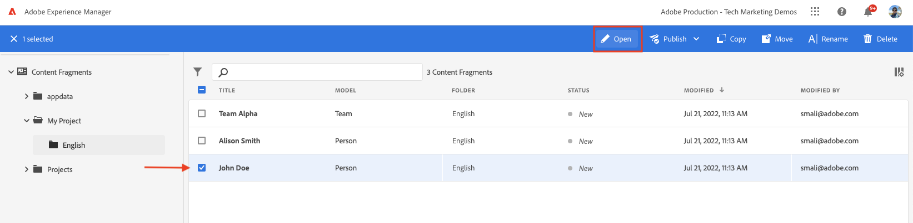

# Inhoudsfragment ontwerpen {#authoring-content-fragments}

In dit hoofdstuk, creeert u en geeft een nieuw die Fragment uit van de Inhoud op het [ wordt gebaseerd onlangs bepaalde Model van het Fragment van de Inhoud ](./content-fragment-models.md). U leert ook hoe u variaties van inhoudsfragmenten kunt maken.

## Vereisten {#prerequisites}

Dit is een meerdelig leerprogramma en het wordt verondersteld dat de stappen die in [ worden geschetst die de Modellen van het Fragment van de Inhoud ](./content-fragment-models.md) worden bepaald zijn voltooid.

## Doelstellingen {#objectives}

* Een inhoudsfragment maken op basis van een model van een inhoudsfragment
* Een variatie in een inhoudsfragment maken

## Een map met middelen maken

Inhoudsfragmenten worden opgeslagen in mappen in AEM Assets. Als u inhoudsfragmenten wilt maken op basis van de modellen die u in het vorige hoofdstuk hebt gemaakt, moet u een map maken waarin u de fragmenten kunt opslaan. Er is een configuratie vereist voor de map om het maken van fragmenten van specifieke modellen mogelijk te maken.

1. Van het AEM scherm van het Begin, navigeer aan **Assets** > **Dossiers**.

   

1. Tik **creeer** in de hoogste juiste hoek en tik **Omslag**. In het resulterende dialoogvenster voert u in:

   * Titel*: **Mijn Project**
   * Naam: **my-project**

   

1. Selecteer de **Mijn omslag van de Omslag** en ontvang **Eigenschappen**.

   

1. Tik de **Cloud Servicen** tabel. Onder het lusje van de Configuratie van de Wolk, gebruik de wegvinder om **Mijn Project** te selecteren configuratie. De waarde moet `/conf/my-project` zijn.

   

   Als u deze eigenschap instelt, kunnen inhoudsfragmenten worden gemaakt met behulp van de modellen die in het vorige hoofdstuk zijn gemaakt.

1. Tik het **lusje van Beleid**, onder het **Toegestane modelleren van het Fragment van de Inhoud** gebied gebruikt de wegvinder om de **persoon** te selecteren en **vroeger gecreeerd model van het Team**.

   

   Dit beleid wordt automatisch door submappen overgeërfd en kan worden overschreven. U kunt modellen door markeringen ook toestaan of modellen van andere projectconfiguraties toelaten. Dit mechanisme biedt een krachtige manier om uw inhoudshiërarchie te beheren.

1. Tik **sparen &amp; sluit** om de veranderingen in de omslageigenschappen te bewaren.

1. Navigeer binnen de **Mijn omslag van het Project**.

1. Maak een andere map met de volgende waarden:

   * Titel*: **Engels**
   * Naam: **nl**

   De beste praktijken zijn het opzetten van projecten voor meertalige ondersteuning. Zie [ de volgende documentenpagina voor meer informatie ](https://experienceleague.adobe.com/docs/experience-manager-cloud-service/content/assets/admin/translate-assets.html).

## Een inhoudsfragment maken {#create-content-fragment}

>[!TIP]
>
>Voor lokale AEM SDK-gebruikers: gebruik de interface van AEM Assets om inhoudsfragmenten te maken en te maken in plaats van de hieronder beschreven interface voor inhoudsfragmenten. Voor gedetailleerde instructies, verwijs naar de [ AEM documentatie ](https://experienceleague.adobe.com/docs/experience-manager-cloud-service/content/assets/content-fragments/content-fragments-managing.html).

Volgende verscheidene Fragmenten van de Inhoud worden gecreeerd gebaseerd op het **Team** en **Persoon** modellen.

1. Van het AEM Scherm van het Begin, tik **de Fragmenten van de Inhoud** om de UI van de Fragmenten van de Inhoud te openen.

   

1. In het linkerspoor, breid **Mijn Project** uit en tik **Engels**.
1. Tik **creeer** om de **Nieuwe dialoog van het Fragment van de Inhoud** omhoog te brengen en de volgende waarden in te gaan:

   * Locatie: `/content/dam/my-project/en`
   * Het model van het Fragment van de inhoud: **Persoon**
   * Titel: **Jan Smit**
   * Naam: `john-doe`

   
1. Tik **creeer**.
1. Herhaal de bovengenoemde stappen om een fragment tot stand te brengen dat **Alison Smith** vertegenwoordigt:

   * Locatie: `/content/dam/my-project/en`
   * Het model van het Fragment van de inhoud: **Persoon**
   * Titel: **Alison Smith**
   * Naam: `alison-smith`

   Tik **creeer** om het fragment van de Persoon tot stand te brengen.

1. Daarna, herhaal de stappen om a **fragment tot stand te brengen van het Team** dat **Alpha van het Team** vertegenwoordigt:

   * Locatie: `/content/dam/my-project/en`
   * Het model van het Fragment van de inhoud: **Team**
   * Titel: **de Alpha van het Team**
   * Naam: `team-alpha`

   Tik **creeer** om het fragment van het Team tot stand te brengen.

1. Er zouden drie Fragmenten van de Inhoud onder **Mijn Project** > **Engels** moeten zijn:

   

## Inhoudsfragmenten voor personen bewerken {#edit-person-content-fragments}

Vervolgens vult u de nieuwe fragmenten met gegevens.

1. Tik checkbox naast **Sint Jansen doet** en tik **Open**.

   

1. De Inhoudsfragmenteditor bevat een formulier dat is gebaseerd op het model Inhoudsfragment. Vul de diverse gebieden uit om inhoud aan het **Sint Jansen** fragment toe te voegen. Upload voor Profielafbeelding uw eigen afbeelding naar AEM Assets.

   

1. Tik **sparen &amp; sluit** om de veranderingen in het Sint Smit fragment op te slaan.
1. Keer terug naar het Fragment UI van de Inhoud en open het **Alison Smith** dossier voor het uitgeven.
1. Herhaal de bovengenoemde stappen om het **Alison Smith** fragment met inhoud te bevolken.

## Inhoudsfragment team bewerken {#edit-team-content-fragment}

1. Open het **tevreden Fragment van de Alpha van het 0} Team dat de UI van het Fragment van de Inhoud gebruikt.**
1. Vul de gebieden voor **Titel**, **Korte Naam**, en **Beschrijving**.
1. Selecteer **Jansen doet** en **Alison Smith** de Fragmenten van de Inhoud om het **5} gebied van de Leden van het Team te bevolken:**

   

   >[!NOTE]
   >
   >U kunt inhoudsfragmenten in-lijn ook tot stand brengen door de **Nieuwe knoop van het Fragment van de Inhoud** te gebruiken.

1. Tik **sparen &amp; sluit** om de veranderingen in het fragment van de Alpha van het Team te bewaren.

## Publish-inhoudsfragmenten

>[!TIP]
>
>Voor lokale AEM SDK-gebruikers: gebruik de interface van AEM Assets om inhoudsfragmenten te publiceren in plaats van de hieronder beschreven interface voor inhoudsfragmenten. Voor gedetailleerde instructies, verwijs naar de [ AEM documentatie ](https://experienceleague.adobe.com/docs/experience-manager-cloud-service/content/assets/content-fragments/content-fragments-managing.html#publishing-and-referencing-a-fragment).

Publiceer de geautoriseerde `Content Fragments` tijdens revisie en verificatie

1. Van het AEM Scherm van het Begin, tik **de Fragmenten van de Inhoud** om de UI van de Fragmenten van de Inhoud te openen.

1. In het linkerspoor, breid **Mijn Project** uit en tik **Engels**.

1. Tik checkbox naast de inhoudsfragmenten en tik **Publish**.
   

## Gefeliciteerd! {#congratulations}

U hebt meerdere inhoudsfragmenten gemaakt en een variatie gemaakt.

## Volgende stappen {#next-steps}

In het volgende hoofdstuk, [ ontdekken GraphQL APIs ](explore-graphql-api.md), zult u AEM GraphQL APIs gebruikend het ingebouwde hulpmiddel GrapiQL onderzoeken. Leer hoe AEM automatisch een GraphQL-schema genereert op basis van een model voor inhoudsfragmenten. U gaat experimenteren met het samenstellen van basisquery&#39;s met de GraphQL-syntaxis.

## Verwante documentatie

* [Contentfragmenten beheren](https://experienceleague.adobe.com/docs/experience-manager-cloud-service/content/assets/content-fragments/content-fragments-managing.html)
* [Variaties - Authoring van content voor fragmenten](https://experienceleague.adobe.com/docs/experience-manager-cloud-service/content/assets/content-fragments/content-fragments-variations.html)
