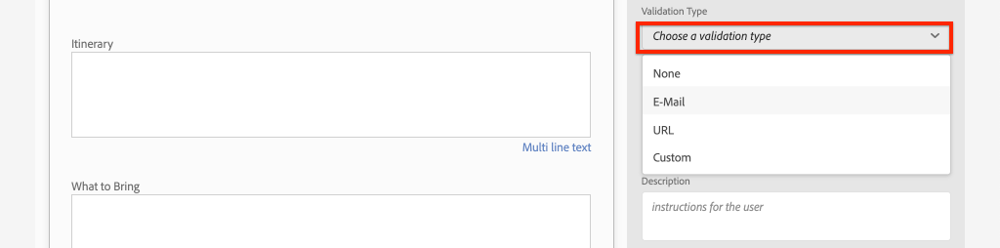
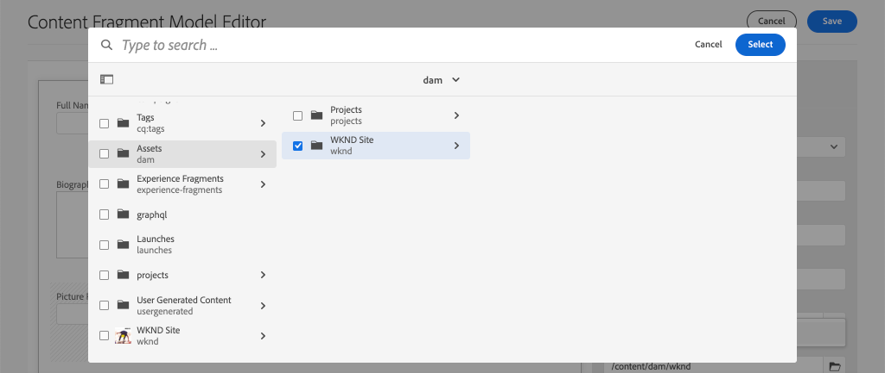

# Modellen voor inhoudsfragmenten definiëren {#content-fragment-models}

In dit hoofdstuk leert u hoe u inhoud kunt modelleren en een schema kunt maken met **Modellen van inhoudsfragmenten**. U controleert bestaande modellen en maakt een nieuw model. U zult ook over de verschillende gegevenstypes leren die kunnen worden gebruikt om een schema als deel van het model te bepalen.

In dit hoofdstuk maakt u een nieuw model voor een **Medewerker**, het gegevensmodel voor gebruikers die inhoud voor tijdschriften en avontuur maken als onderdeel van het WKND-merk.

## Vereisten {#prerequisites}

Dit is een meerdelige zelfstudie en er wordt aangenomen dat de stappen die worden beschreven in het dialoogvenster [Snelle installatie](../quick-setup/local-sdk.md) zijn voltooid.

## Doelstellingen {#objectives}

* Maak een nieuw model voor inhoudsfragmenten.
* Beschikbare gegevenstypen en validatieopties identificeren voor het samenstellen van modellen.
* Begrijp hoe het model van het Inhoudsfragment bepaalt **beide** het gegevensschema en het auteursmalplaatje voor een Fragment van de Inhoud.

## Overzicht van het inhoudsfragmentmodel {#overview}

>[!VIDEO](https://video.tv.adobe.com/v/22452/?quality=12&learn=on)

De video hierboven biedt een uitgebreid overzicht van het werken met Content Fragment Models.

>[!CAUTION]
>
> In de video hierboven ziet u hoe het **Medewerker** model met de naam `Contributors`. Wanneer u de stappen uitvoert in uw eigen omgeving, moet u ervoor zorgen dat de titel de unieke vorm gebruikt: `Contributor` zonder **s**. De naamgeving van het model van het inhoudsfragment bepaalt de aanroepen van de GraphQL API die later in de zelfstudie worden uitgevoerd.

## Inspect the Adventure Content Fragment Model

In het vorige hoofdstuk zijn verschillende Adventures Content Fragments bewerkt en weergegeven op een externe toepassing. Controleer het Model van het Fragment van de Inhoud van de Avontuur om het onderliggende gegevensschema van deze fragmenten te begrijpen.

1. Van de **AEM starten** menu navigeren naar **Gereedschappen** > **Activa** > **Modellen van inhoudsfragmenten**.

   

1. Navigeer in de **WKND-site** en houd de muis boven de **Adventure** Inhoudsfragmentmodel en klik op **Bewerken** pictogram (potlood) om het model te openen.

   

1. Hierdoor wordt het **Inhoudsfragmentmodeleditor**. Merk op dat de gebieden het model van het avontuur bepalen verschillend omvatten **Gegevenstypen** leuk **Tekst met één regel**, **Tekst met meerdere regels**, **Opsomming**, en **Content Reference**.

1. De rechterkolom van de redacteur maakt een lijst van beschikbare **Gegevenstypen** Hiermee definieert u de formuliervelden die worden gebruikt voor het ontwerpen van inhoudsfragmenten.

1. Selecteer **Titel** in het hoofddeelvenster. Klik in de rechterkolom op de knop **Eigenschappen** tab:

   

   Waarnemen **Eigenschapnaam** veld is ingesteld op `adventureTitle`. Dit bepaalt de naam van het bezit dat aan AEM wordt voortgeduurd. De **Eigenschapnaam** definieert ook de **key** name for this property as part of the data schema. Dit **key** wordt gebruikt wanneer de gegevens van het inhoudsfragment via GraphQL API&#39;s worden weergegeven.

   >[!CAUTION]
   >
   > Het wijzigen van **Eigenschapnaam** van een veld **na** Inhoudsfragmenten worden afgeleid van het model en hebben downstreameffecten. Er wordt niet langer verwezen naar veldwaarden in bestaande fragmenten en het gegevensschema dat door GraphQL wordt weergegeven, wordt gewijzigd, wat invloed heeft op bestaande toepassingen.

1. Omlaag schuiven in het deelvenster **Eigenschappen** en bekijk de **Validatietype** vervolgkeuzelijst.

   

   Formuliervalidaties uit het vak zijn beschikbaar voor **E-mail** en **URL**. Het is ook mogelijk een **Aangepast** validatie met een reguliere expressie.

1. Klikken **Annuleren** om de Editor van het inhoudsfragmentmodel te sluiten.

## Een bijdragemodel maken

Maak vervolgens een nieuw model voor een **Medewerker**, het gegevensmodel voor gebruikers die inhoud voor tijdschriften en avontuur maken als onderdeel van het WKND-merk.

1. Klikken **Maken** in de rechterbovenhoek om de **Model maken** wizard.
1. Voor **Modeltitel** enter: **Medewerker** en klik op **Maken**

   

   Klikken **Openen** om het nieuwe model te openen.

1. Sleep een **Tekst met één regel** element aan het belangrijkste paneel. Voer de volgende eigenschappen in op de knop **Eigenschappen** tab:

   * **Veldlabel**: **Volledige naam**
   * **Eigenschapnaam**: `fullName`
   * Controleren **Vereist**

   

1. Klik op de knop **Gegevenstypen** en sleep een **Tekst met meerdere regels** veld onder de **Volledige naam** veld. Voer de volgende eigenschappen in:

   * **Veldlabel**: **Biografie**
   * **Eigenschapnaam**: `biographyText`
   * **Standaardtype**: **RTF**

1. Klik op de knop **Gegevenstypen** en sleep een **Content Reference** veld. Voer de volgende eigenschappen in:

   * **Veldlabel**: **Referentie afbeelding**
   * **Eigenschapnaam**: `pictureReference`
   * **Hoofdpad**: `/content/dam/wknd`

   Wanneer het vormen van **Hoofdpad** u kunt klikken op **map** pictogram om een modaal weer te geven om het pad te selecteren. Hierdoor wordt beperkt welke mappen auteurs kunnen gebruiken om het pad te vullen.

   

1. Een validatie toevoegen aan de **Referentie afbeelding** zodat alleen inhoudstypen **Afbeeldingen** kan worden gebruikt om het veld te vullen.

   

1. Klik op de knop **Gegevenstypen** en sleep een **Opsomming**  gegevenstype onder de **Referentie afbeelding** veld. Voer de volgende eigenschappen in:

   * **Veldlabel**: **Beroep**
   * **Eigenschapnaam**: `occupation`

1. Diverse toevoegen **Opties** met de **Een optie toevoegen** knop. Dezelfde waarde gebruiken voor **Option-label** en **Optiewaarde**:

   **Artiest**, **Influencer**, **Fotograaf**, **Reiziger**, **Schrijver**, **YouTuber**

   

1. De definitieve **Medewerker** Het model moet er als volgt uitzien:

   

1. Klikken **Opslaan** om de wijzigingen op te slaan.

## Enable the Contributor Model

Modellen voor inhoudsfragmenten moeten **Ingeschakeld** voordat de auteur van de inhoud deze kan gebruiken. Het is mogelijk **Uitschakelen** Een Content Fragment Model (Inhoudsfragmentmodel), waardoor auteurs het niet kunnen gebruiken. Herinneren dat het wijzigen van **Eigenschapnaam** van een veld in het model wijzigt het onderliggende gegevensschema en kan aanzienlijke downstreameffecten hebben op bestaande fragmenten en externe toepassingen. Het wordt aanbevolen de naamgevingsconventie die wordt gebruikt voor de **Eigenschapnaam** van velden voordat het model Inhoudsfragment voor gebruikers wordt ingeschakeld.

1. Zorg ervoor dat de **Medewerker** model bevindt zich momenteel in een **Ingeschakeld** status.

   

   U kunt de status van een inhoudsfragmentmodel in- of uitschakelen door de muisaanwijzer op de kaart te plaatsen en op de knop **Uitschakelen** / **Inschakelen** pictogram.

## Gefeliciteerd! {#congratulations}

U hebt zojuist het eerste inhoudsfragmentmodel gemaakt.

## Volgende stappen {#next-steps}

In het volgende hoofdstuk: [Modellen voor inhoudsfragmenten ontwerpen](author-content-fragments.md), maakt en bewerkt u een nieuw inhoudsfragment op basis van een inhoudsfragmentmodel. U leert ook hoe u variaties van inhoudsfragmenten kunt maken.
