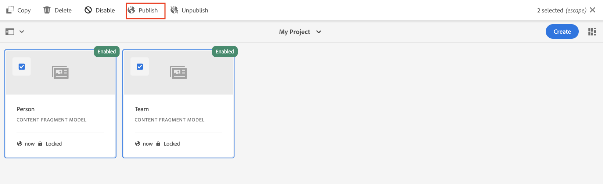

# Modellen voor inhoudsfragmenten definiëren {#content-fragment-models}

In dit hoofdstuk leert u hoe u inhoud kunt modelleren en een schema kunt maken met **Modellen van inhoudsfragmenten**. U zult over de verschillende gegevenstypes leren die kunnen worden gebruikt om een schema als deel van het model te bepalen.

In dit hoofdstuk worden twee eenvoudige modellen gemaakt: **Team** en **Persoon**. De **Team** gegevensmodel heeft naam, korte naam en beschrijving en verwijst naar **Persoon** gegevensmodel met volledige naam, biodetails, profielafbeelding en lijst van beroepen.

U bent ook welkom om uw eigen model na de basisstappen tot stand te brengen en de respectieve stappen zoals vragen GraphQL, en Reageer de code van de App te richten of eenvoudig de stappen te volgen die in deze hoofdstukken worden geschetst.

## Vereisten {#prerequisites}

Dit is een meerdelige zelfstudie en er wordt aangenomen dat een [AEM auteursomgeving is beschikbaar](./overview.md#prerequisites)

## Doelstellingen {#objectives}

* Maak een nieuw model voor inhoudsfragmenten.
* Beschikbare gegevenstypen en validatieopties identificeren voor het samenstellen van modellen.
* Begrijp hoe het model van het Inhoudsfragment bepaalt **beide** het gegevensschema en het auteursmalplaatje voor een Fragment van de Inhoud.

## Een nieuwe projectconfiguratie maken

Een projectconfiguratie bevat alle modellen van het Fragment van de Inhoud verbonden aan een bepaald project en verstrekt een middel om modellen te organiseren. Er moet ten minste één project worden gemaakt **voor** het maken van een nieuw Content Fragment-model.

1. Aanmelden bij de AEM **Auteur** milieu (bijv. `https://author-pYYYY-eXXXX.adobeaemcloud.com/`)
1. Navigeer in het scherm AEM starten naar **Gereedschappen** > **Algemeen** > **Configuratiebrowser**.

   
1. Klikken **Maken**.
1. In het resulterende dialoogvenster voert u in:

   * Titel*: **Mijn project**
   * Naam*: **mijn-project** (Gebruik bij voorkeur alleen kleine letters als u woorden van elkaar scheidt. Dit koord zal het unieke eindpunt beïnvloeden GraphQL dat de cliënttoepassingen verzoeken tegen zullen uitvoeren.)
   * Controleren **Modellen van inhoudsfragmenten**
   * Controleren **GrafiekQL blijvende vragen**

   

## Modellen voor inhoudsfragmenten maken

Maak vervolgens twee modellen voor een **Team** en **Persoon**.

### Het personenmodel maken

Een nieuw model maken voor een **Persoon**, dit is het gegevensmodel dat een persoon vertegenwoordigt die deel uitmaakt van een team.

1. Navigeer in het scherm AEM starten naar **Gereedschappen** > **Algemeen** > **Modellen van inhoudsfragmenten**.

   

1. Navigeer in de **Mijn project** map.
1. Tikken **Maken** in de rechterbovenhoek om de **Model maken** wizard.
1. Voor **Modeltitel** enter: **Persoon** en tikken **Maken**.

   Tikken **Openen** in het resulterende dialoogvenster om het nieuwe model te openen.

1. Sleep een **Tekst met één regel** element aan het belangrijkste paneel. Voer de volgende eigenschappen in op de knop **Eigenschappen** tab:

   * **Veldlabel**: **Volledige naam**
   * **Eigenschapnaam**: `fullName`
   * Controleren **Vereist**

   

   De **Eigenschapnaam** Hiermee definieert u de naam van de eigenschap die wordt AEM. De **Eigenschapnaam** definieert ook de **key** name for this property as part of the data schema. Dit **key** wordt gebruikt wanneer de gegevens van het Fragment van de Inhoud via GraphQL APIs worden blootgesteld.

1. Tik op de knop **Gegevenstypen** en sleep een **Tekst met meerdere regels** veld onder de **Volledige naam** veld. Voer de volgende eigenschappen in:

   * **Veldlabel**: **Biografie**
   * **Eigenschapnaam**: `biographyText`
   * **Standaardtype**: **RTF**

1. Klik op de knop **Gegevenstypen** en sleep een **Content Reference** veld. Voer de volgende eigenschappen in:

   * **Veldlabel**: **Profielafbeelding**
   * **Eigenschapnaam**: `profilePicture`
   * **Hoofdpad**: `/content/dam`

   Wanneer het vormen van **Hoofdpad** u kunt klikken op **map** pictogram om een modaal weer te geven om het pad te selecteren. Hierdoor wordt beperkt welke mappen auteurs kunnen gebruiken om het pad te vullen. `/content/dam` is de basis waarin alle AEM elementen (afbeeldingen, video&#39;s, andere inhoudsfragmenten) zijn opgeslagen.

1. Een validatie toevoegen aan de **Referentie afbeelding** zodat alleen inhoudstypen **Afbeeldingen** kan worden gebruikt om het veld te vullen.

   

1. Klik op de knop **Gegevenstypen** en sleep een **Opsomming**  gegevenstype onder de **Referentie afbeelding** veld. Voer de volgende eigenschappen in:

   * **Renderen als**: **Selectievakjes**
   * **Veldlabel**: **Beroep**
   * **Eigenschapnaam**: `occupation`

1. Diverse toevoegen **Opties** met de **Een optie toevoegen** knop. Dezelfde waarde gebruiken voor **Option-label** en **Optiewaarde**:

   **Artiest**, **Influencer**, **Fotograaf**, **Reiziger**, **Schrijver**, **YouTuber**

1. De definitieve **Persoon** Het model moet er als volgt uitzien:

   

1. Klikken **Opslaan** om de wijzigingen op te slaan.

### Het teammodel maken

Een nieuw model maken voor een **Team**, het gegevensmodel voor een team van mensen. Het model van het Team zal het model van de Persoon van verwijzingen voorzien om de leden van het team te vertegenwoordigen.

1. In de **Mijn project** map, tikken **Maken** in de rechterbovenhoek om de **Model maken** wizard.
1. Voor **Modeltitel** enter: **Team** en tikken **Maken**.

   Tikken **Openen** in het resulterende dialoogvenster om het nieuwe model te openen.

1. Sleep een **Tekst met één regel** element aan het belangrijkste paneel. Voer de volgende eigenschappen in op de knop **Eigenschappen** tab:

   * **Veldlabel**: **Titel**
   * **Eigenschapnaam**: `title`
   * Controleren **Vereist**

1. Tik op de knop **Gegevenstypen** en sleep een **Tekst met één regel** element aan het belangrijkste paneel. Voer de volgende eigenschappen in op de knop **Eigenschappen** tab:

   * **Veldlabel**: **Korte naam**
   * **Eigenschapnaam**: `shortName`
   * Controleren **Vereist**
   * Controleren **Uniek**
   * Onder **Validatietype** > kiezen **Aangepast**
   * Onder **Aangepast validatieoverzicht** > Enter `^[a-z0-9\-_]{5,40}$` - Op deze manier kunnen alleen alfanumerieke waarden in kleine letters en streepjes tussen 5 en 40 tekens worden ingevoerd.

   De `shortName` het bezit zal ons een manier verstrekken om een individueel team te vragen dat op een verkort weg wordt gebaseerd. De **Uniek** Met deze instelling zorgt u ervoor dat de waarde altijd uniek is per inhoudsfragment van dit model.

1. Tik op de knop **Gegevenstypen** en sleep een **Tekst met meerdere regels** veld onder de **Korte naam** veld. Voer de volgende eigenschappen in:

   * **Veldlabel**: **Beschrijving**
   * **Eigenschapnaam**: `description`
   * **Standaardtype**: **RTF**

1. Klik op de knop **Gegevenstypen** en sleep een **Fragmentverwijzing** veld. Voer de volgende eigenschappen in:

   * **Renderen als**: **Meerdere velden**
   * **Veldlabel**: **Teamleden**
   * **Eigenschapnaam**: `teamMembers`
   * **Modellen voor toegestane inhoudsfragmenten**: Gebruik het mappictogram om het **Persoon** model.

1. De definitieve **Team** Het model moet er als volgt uitzien:

   

1. Klikken **Opslaan** om de wijzigingen op te slaan.

1. U moet nu twee modellen hebben waaruit u kunt werken:

   

## Projectconfiguratie en modellen voor inhoudsfragmenten publiceren

Na revisie en verificatie publiceert u de `Project Configuration` &amp; `Content Fragment Model`

1. Navigeer in het scherm AEM starten naar **Gereedschappen** > **Algemeen** > **Configuratiebrowser**.

1. Tik op het selectievakje naast **Mijn project** en tikken **Publiceren**

   

1. Navigeer in het scherm AEM starten naar **Gereedschappen** > **Algemeen** > **Modellen van inhoudsfragmenten**.

1. Navigeer in de **Mijn project** map.

1. Tikken **Persoon** en **Team** modellen en tikken **Publiceren**

   

## Gefeliciteerd! {#congratulations}

Gefeliciteerd, u hebt zojuist uw eerste modellen van inhoudsfragmenten gemaakt!

## Volgende stappen {#next-steps}

In het volgende hoofdstuk: [Modellen voor inhoudsfragmenten ontwerpen](author-content-fragments.md), maakt en bewerkt u een nieuw inhoudsfragment op basis van een inhoudsfragmentmodel. U leert ook hoe u variaties van inhoudsfragmenten kunt maken.

## Verwante documentatie

* [Modellen van contentfragmenten](https://experienceleague.adobe.com/docs/experience-manager-cloud-service/content/assets/content-fragments/content-fragments-models.html)

