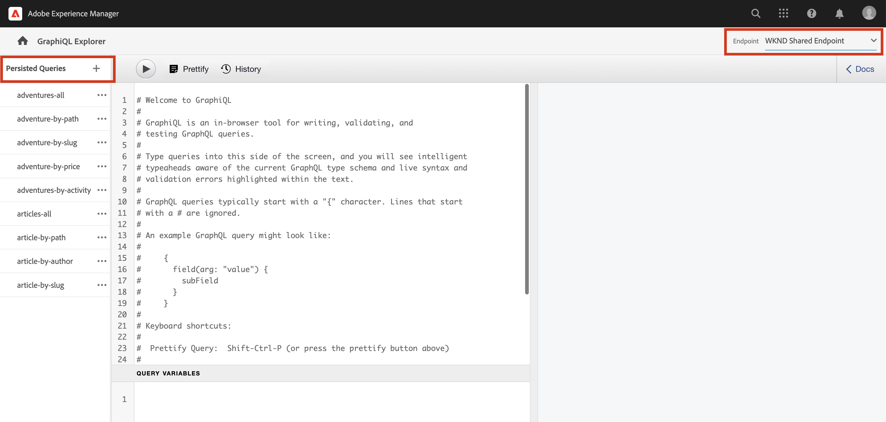

# GraphQL API&#39;s verkennen {#explore-graphql-apis}

De GraphQL API van AEM verstrekt een krachtige vraagtaal om gegevens van de Fragmenten van de Inhoud aan stroomafwaartse toepassingen bloot te stellen. De modellen van het Fragment van de inhoud bepalen het gegevensschema dat door de Fragmenten van de Inhoud wordt gebruikt. Wanneer een model van het Fragment van de Inhoud wordt gecreeerd of bijgewerkt, wordt het schema vertaald en toegevoegd aan de &quot;grafiek&quot;die omhoog GraphQL API maakt.

In dit hoofdstuk, zullen wij sommige gemeenschappelijke vragen GraphQL onderzoeken om inhoud te verzamelen gebruikend winde genoemd [GraphiQL](https://github.com/graphql/graphiql). Met GraphiQL IDE kunt u snel de geretourneerde query&#39;s en gegevens testen en verfijnen. GraphiQL biedt ook eenvoudige toegang tot de documentatie, waardoor u gemakkelijk kunt leren welke methoden beschikbaar zijn en begrijpen.

## Vereisten {#prerequisites}

Dit is een meerdelige zelfstudie en er wordt aangenomen dat de stappen die worden beschreven in het dialoogvenster [Inhoudsfragmenten ontwerpen](./author-content-fragments.md) zijn voltooid.

## Doelstellingen {#objectives}

* Leer om het hulpmiddel te gebruiken GraphiQL om een vraag te construeren gebruikend syntaxis GraphQL.
* Leer hoe u een lijst met inhoudsfragmenten en één inhoudsfragment kunt opvragen.
* Leer hoe u specifieke gegevenskenmerken kunt filteren en aanvragen.
* Leer hoe u verbinding maakt met een query voor meerdere modellen van inhoudsfragmenten
* Leer hoe te om vraag te blijven GraphQL.

## GraphQL-eindpunt inschakelen {#enable-graphql-endpoint}

Een eindpunt GraphQL is nodig om vraag GraphQL API voor Inhoudsfragmenten toe te laten.

1. Navigeer van het scherm AEM Start naar **Gereedschappen** > **Algemeen** > **GraphQL**.

   

1. Tikken **Maken** in de rechterbovenhoek. Voer in het dialoogvenster de volgende waarden in:

   * Naam*: **Mijn eindpunt van project**.
   * GrafiekQL-schema gebruiken dat is opgegeven door ... *: **Mijn project**

   

   Tikken **Maken** om het eindpunt te bewaren.

   De eindpunten GraphQL die op een projectconfiguratie worden gecreeerd zullen slechts vragen tegen modellen toelaten die tot dat project behoren. In dit geval worden de enige vragen tegen de **Persoon** en **Team** modellen kunnen worden gebruikt.

   >[!NOTE]
   >
   > Een Globaal eindpunt kan ook worden gecreeerd dat vragen tegen modellen over projecten zal toelaten. Bijvoorbeeld als u een vraag wilt combineren die de modellen in het **WKND gedeeld** en in de **Mijn project**. Dit dient met voorzichtigheid te worden gebruikt en alleen indien nodig omdat het de omgeving mogelijk opent voor extra beveiligingsproblemen.

1. U zou nu twee eindpunten moeten zien GraphQL die op uw milieu worden toegelaten (veronderstellend u de Gedeelde inhoud WKND installeerde).

   

## GraphiQL IDE gebruiken

De [GraphiQL](https://experienceleague.adobe.com/docs/experience-manager-cloud-service/content/headless/graphql-api/graphiql-ide.html) laat ontwikkelaars toe om vragen tegen inhoud op het huidige AEM milieu tot stand te brengen en te testen. Met het gereedschap GraphiQL kunnen gebruikers ook **aanhouden** of sla vragen op die door cliënttoepassingen in een productie het plaatsen moeten worden gebruikt.

Verken vervolgens de kracht van AEM GraphQL API met behulp van de ingebouwde GraphiQL IDE.

1. Navigeer van het scherm AEM Start naar **Gereedschappen** > **Algemeen** > **GraphQL Query Editor**.

   

   >[!NOTE]
   >
   > Voor oudere versies van AEM kan GraphiQL IDE niet worden ingebouwd. Hierna kunt u het programma handmatig installeren [instructies](#install-graphiql).

1. Stel in de rechterbovenhoek het **Endpoint** tot **Mijn eindpunt van project**.

   

   Dit zal alle vragen aan modellen behandelen die in **Mijn project** project. Bericht dat er ook een eindpunt voor is **WKND gedeeld**.

### Een query uitvoeren op een lijst met inhoudsfragmenten {#query-list-cf}

Een algemene vereiste zal zijn om voor veelvoudige Fragments van de Inhoud te vragen.

1. Plak de volgende query in het hoofdvenster (vervang de lijst met opmerkingen):

   ```graphql
   query allTeams {
     teamList {
       items {
         _path
         title
       }
     }
   } 
   ```

1. Druk op **Afspelen** in het bovenste menu om de query uit te voeren. De resultaten van de inhoudsfragmenten uit het vorige hoofdstuk worden weergegeven:

   

1. De cursor onder de cursor plaatsen `title` tekst en typ **CTRL+Space** om codehints te activeren. Toevoegen `shortname` en `description` naar de query.

   

1. Voer de vraag opnieuw uit door te drukken **Afspelen** en u zou de resultaten moeten zien omvatten extra eigenschappen van `shortname` en `description`.

   

   De `shortname` is een eenvoudige eigenschap en `description` is een tekstveld met meerdere regels en met de GraphQL API kunnen we verschillende indelingen kiezen voor de resultaten, zoals `html`, `markdown`, `json` of `plaintext`.

### Query voor geneste fragmenten

Experimenteer vervolgens met vragen om geneste fragmenten op te halen. Vergeet niet dat de **Team** model verwijst naar de **Persoon** model.

1. Werk de vraag bij om te omvatten `teamMembers` eigenschap. Er zij aan herinnerd dat dit een **Fragmentverwijzing** aan het Person Model. Eigenschappen van het Person-model kunnen worden geretourneerd:

   ```graphql
   query allTeams {
       teamList {
           items {
               _path
               title
               shortName
               description {
                   plaintext
               }
               teamMembers {
                   fullName
                   occupation
               }
           }
       }
   }
   ```

   JSON-reactie:

   ```json
   {
       "data": {
           "teamList": {
           "items": [
               {
               "_path": "/content/dam/my-project/en/team-alpha",
               "title": "Team Alpha",
               "shortName": "team-alpha",
               "description": {
                   "plaintext": "This is a description of Team Alpha!"
               },
               "teamMembers": [
                   {
                   "fullName": "John Doe",
                   "occupation": [
                       "Artist",
                       "Influencer"
                   ]
                   },
                   {
                   "fullName": "Alison Smith",
                   "occupation": [
                       "Photographer"
                   ]
                   }
                 ]
           }
           ]
           }
       }
   }
   ```

   De mogelijkheid om te zoeken op geneste fragmenten is een krachtig middel van de AEM GraphQL API. In dit eenvoudige voorbeeld is het nesten slechts twee niveaus diep. De mogelijkheid om fragmenten nog verder te nesten. Als er bijvoorbeeld een **Adres** model gekoppeld aan een **Persoon** het zou mogelijk zijn om gegevens van alle drie modellen in één enkele vraag terug te keren.

### Een lijst met inhoudsfragmenten filteren {#filter-list-cf}

Daarna, kijken hoe het mogelijk is om de resultaten aan een ondergroep van Inhoudsfragmenten te filtreren die op een bezitswaarde worden gebaseerd.

1. Ga de volgende vraag in GraphiQL UI in:

   ```graphql
   query personByName($name:String!){
     personList(
       filter:{
         fullName:{
           _expressions:[{
             value:$name
             _operator:EQUALS
           }]
         }
       }
     ){
       items{
         _path
         fullName
         occupation
       }
     }
   }  
   ```

   De bovenstaande query voert een zoekopdracht uit tegen alle Person-fragmenten in het systeem. Het toegevoegde filter aan het begin van de vraag zal een vergelijking op uitvoeren `name` veld en variabele tekenreeks `$name`.

1. In de **Query-variabelen** voert u het volgende in:

   ```json
   {"name": "John Doe"}
   ```

1. Voer de vraag uit, wordt verwacht dat slechts **Personen** wordt geretourneerd met de waarde &quot;Jan Smit&quot;.

   

   Er zijn vele andere opties voor het filtreren en het creëren van complexe vragen, zie [Leren gebruiken GraphQL met AEM - Voorbeeldinhoud en query&#39;s](https://experienceleague.adobe.com/docs/experience-manager-cloud-service/assets/admin/content-fragments-graphql-samples.html).

1. Verbeter bovenstaande query om profielafbeelding op te halen

   ```graphql
   query personByName($name:String!){
     personList(
       filter:{
         fullName:{
           _expressions:[{
             value:$name
             _operator:EQUALS
           }]
         }
       }
     ){
       items{  
         _path
         fullName
         occupation
         profilePicture{
           ... on ImageRef{
             _path
             _authorUrl
             _publishUrl
             height
             width
   
           }
         }
       }
     }
   } 
   ```

   De `profilePicture` is een inhoudsverwijzing en wordt verwacht dat het een afbeelding is, en daarom is ingebouwd `ImageRef` wordt gebruikt. Op deze manier kunnen we aanvullende gegevens opvragen over de afbeelding waarnaar wordt verwezen, zoals de `width` en `height`.

### Een query uitvoeren op één inhoudsfragment {#query-single-cf}

Het is ook mogelijk rechtstreeks een query uit te voeren op één inhoudsfragment. Inhoud in AEM wordt hiërarchisch opgeslagen en de unieke id voor een fragment is gebaseerd op het pad van het fragment.

1. Ga de volgende vraag in de redacteur GraphiQL in:

   ```graphql
   query personByPath($path: String!) {
       personByPath(_path: $path) {
           item {
           fullName
           occupation
           }
       }
   }
   ```

1. Voer het volgende in voor de **Query-variabelen**:

   ```json
   {"path": "/content/dam/my-project/en/alison-smith"}
   ```

1. Voer de vraag uit en neem waar dat het enige resultaat is teruggekeerd.

## Vragen behouden {#persist-queries}

Zodra een ontwikkelaar met de vraag en de teruggekeerde gegevens gelukkig is, moet de volgende stap de vraag opslaan of voortzetten aan AEM. [Blijvende query&#39;s](https://experienceleague.adobe.com/docs/experience-manager-cloud-service/content/headless/graphql-api/persisted-queries.html) is het aangewezen mechanisme om GraphQL API aan cliënttoepassingen bloot te stellen. Zodra een vraag is voortgeduurd, kan het worden gevraagd gebruikend een verzoek van de GET en in het voorgeheugen ondergebracht bij de lagen van de Verzender en CDN. De prestaties van persisted query&#39;s zijn veel beter. Naast prestatievoordelen zorgen permanente query&#39;s ervoor dat extra gegevens niet per ongeluk aan clienttoepassingen worden blootgesteld. Meer informatie over [Hier kunt u permanente query&#39;s vinden](https://experienceleague.adobe.com/docs/experience-manager-cloud-service/content/headless/graphql-api/persisted-queries.html).

Daarna, persisteert twee eenvoudige vragen, zullen zij in het volgende hoofdstuk worden gebruikt.

1. In GrahiQL winde ga de volgende vraag in:

   ```graphql
   query allTeams {
       teamList {
           items {
               _path
               title
               shortName
               description {
                   plaintext
               }
               teamMembers {
                   fullName
                   occupation
               }
           }
       }
   }
   ```

   Controleer of de query werkt.

1. Volgende tikken **Opslaan als** en betreden `all-teams` als de **Naam query**.

   De query moet nu worden weergegeven onder **Blijvende query&#39;s** in het linkerspoor.

   
1. Tik vervolgens op de uiteinden **...** naast de permanente query en tik op **URL kopiëren** om het pad naar het klembord te kopiëren.

   

1. Open een nieuw tabblad en plak het gekopieerde pad in uw browser:

   ```plain
   https://$YOUR-AEMasCS-INSTANCEID$.adobeaemcloud.com/graphql/execute.json/my-project/all-teams
   ```

   Het moet er ongeveer zo uitzien als het bovenstaande pad. De JSON-resultaten van de geretourneerde query worden weergegeven.

   De URL onderbreken:

   | Naam | Beschrijving |
   | ---------|---------- |
   | `/graphql/execute.json` | Blijvend zoekeindpunt |
   | `/my-project` | Projectconfiguratie voor `/conf/my-project` |
   | `/all-teams` | Naam van de huidige query |

1. Terugkeer naar GrahiQL winde en gebruik de plus knoop **+** om de NIEUWE query uit te voeren

   ```graphql
   query personByName($name: String!) {
     personList(
       filter: {
         fullName:{
           _expressions: [{
             value: $name
             _operator:EQUALS
           }]
         }
       }){
       items {
         _path
         fullName
         occupation
         biographyText {
           json
         }
         profilePicture {
           ... on ImageRef {
             _path
             _authorUrl
             _publishUrl
             width
             height
           }
         }
       }
     }
   }
   ```

1. Sla de query op als: **per persoon**.
1. U moet twee doorlopende query&#39;s hebben opgeslagen:

   

## Oplossingsbestanden {#solution-files}

Download de inhoud, de modellen, en de permanente vragen die in de laatste drie hoofdstukken worden gecreeerd: [tutorial-solution-content.zip](assets/explore-graphql-api/tutorial-solution-content.zip)

## Doorlopende WKND-query&#39;s verkennen (optioneel) {#explore-wknd-content-fragments}

Als u [De WKND Shared-voorbeeldinhoud geïnstalleerd](./overview.md#install-sample-content) u kunt Geëxisteerde Vragen als avonturen-allen, avontuur-door-activiteit, avontuur-door-weg, enz. herzien en uitvoeren.




## Aanvullende bronnen

Voor veel meer voorbeelden van vragen GraphQL zie: [Leren gebruiken GraphQL met AEM - Voorbeeldinhoud en query&#39;s](https://experienceleague.adobe.com/docs/experience-manager-cloud-service/assets/admin/content-fragments-graphql-samples.html).

## Gefeliciteerd! {#congratulations}

Gefeliciteerd, u creeerde en uitvoerde enkel verscheidene vragen GraphQL!

## Volgende stappen {#next-steps}

In het volgende hoofdstuk: [React-app ontwikkelen](./graphql-and-react-app.md), zult u onderzoeken hoe een externe toepassing AEM eindpunten GraphQL kan vragen en hefboomwerking deze twee persisted vragen. Er wordt ook een aantal standaardfoutafhandeling geïntroduceerd.

## Het gereedschap GraphiQL installeren (optioneel) {#install-graphiql}

Voor sommige versies van AEM moet het hulpmiddel van winde GraphiQL manueel worden geïnstalleerd. Volg de onderstaande instructies om handmatig te installeren:

1. Ga naar de **[Software Distribution Portal](https://experience.adobe.com/#/downloads/content/software-distribution/en/aemcloud.html)** > **AEM as a Cloud Service**.
1. Zoek naar &quot;GraphiQL&quot; (zorg ervoor dat u de **i** in **GraphiQL**.
1. Download de nieuwste **GraphiQL Content Package v.x.x.x**

   

   Het ZIP-bestand is een AEM pakket dat rechtstreeks kan worden geïnstalleerd.

1. Van de **AEM starten** menu navigeren naar **Gereedschappen** > **Implementatie** > **Pakketten**.
1. Klikken **Pakket uploaden** en kiest u het pakket dat u in de vorige stap hebt gedownload. Klikken **Installeren** om het pakket te installeren.

   
