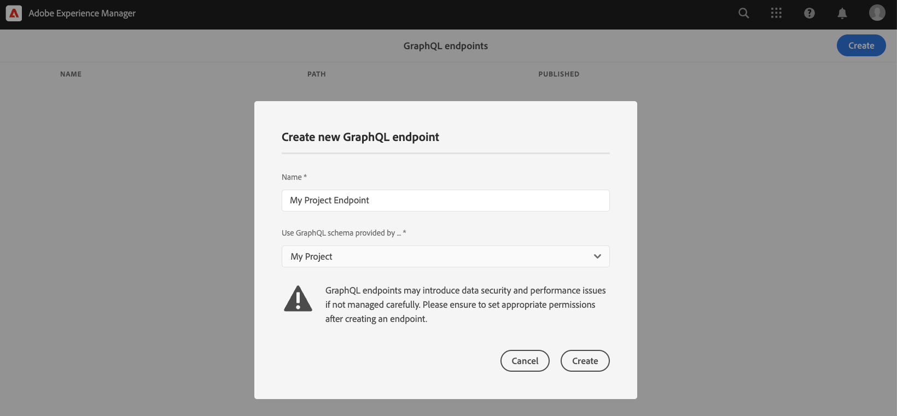
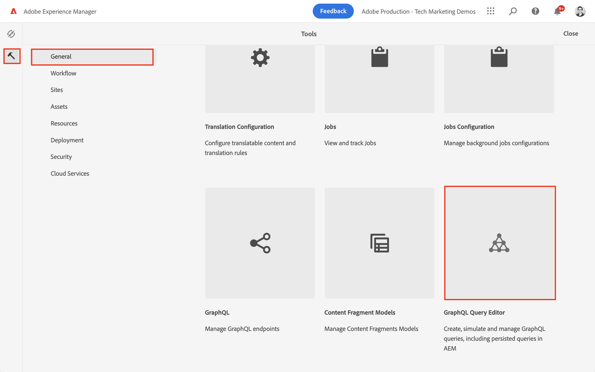

# GraphQL API&#39;s verkennen {#explore-graphql-apis}

GraphQL API van AEM verstrekt een krachtige vraagtaal om gegevens van de Fragments van de Inhoud aan stroomafwaartse toepassingen bloot te stellen. De modellen van het Fragment van de inhoud bepalen het gegevensschema dat door de Fragmenten van de Inhoud wordt gebruikt. Wanneer een Content Fragment Model wordt gemaakt of bijgewerkt, wordt het schema vertaald en toegevoegd aan de &quot;grafiek&quot; die de GraphQL API vormt.

In dit hoofdstuk, onderzoeken sommige gemeenschappelijke vragen van GraphQL om inhoud te verzamelen gebruikend winde genoemd [ GraphiQL ](https://github.com/graphql/graphiql). Met GraphiQL IDE kunt u snel de geretourneerde query&#39;s en gegevens testen en verfijnen. Het biedt ook eenvoudige toegang tot de documentatie, waardoor u gemakkelijk kunt leren en begrijpen welke methoden beschikbaar zijn.

## Vereisten {#prerequisites}

Dit is een meerdelig leerprogramma en het wordt verondersteld dat de stappen die in [ worden geschetst de Begeleidende Fragmenten van de Inhoud ](./author-content-fragments.md) zijn voltooid.

## Doelstellingen {#objectives}

* Leer om het hulpmiddel te gebruiken GraphiQL om een vraag te construeren gebruikend de syntaxis van GraphQL.
* Leer hoe u een lijst met inhoudsfragmenten en één inhoudsfragment kunt opvragen.
* Leer hoe u specifieke gegevenskenmerken kunt filteren en aanvragen.
* Leer hoe u een query uitvoert op meerdere modellen van inhoudsfragmenten
* Leer hoe je GraphQL query kunt voortzetten.

## GraphQL-eindpunt inschakelen {#enable-graphql-endpoint}

Een eindpunt van GraphQL moet worden gevormd om GraphQL API vragen voor de Fragments van de Inhoud toe te laten.

1. Van het scherm van het Begin van AEM, navigeer aan **Hulpmiddelen** > **Algemeen** > **GraphQL**.

   

1. Tik **creeer** in de hoger-juiste hoek, in de resulterende dialoog ga de volgende waarden in:

   * Naam*: **Mijn Eindpunt van het Project**.
   * Het schema van GraphQL van het gebruik door... * wordt verstrekt: **Mijn Project**

   

   Tik **creeer** om het eindpunt te bewaren.

   De GraphQL eindpunten die op een projectconfiguratie worden gecreeerd laten slechts vragen tegen modellen toe die tot dat project behoren. In dit geval, kunnen de enige vragen tegen de **Persoon** en **modellen van het Team** worden gebruikt.

   >[!NOTE]
   >
   > Een Globaal eindpunt kan ook worden gecreeerd om vragen tegen modellen over veelvoudige configuraties toe te laten. Dit moet met voorzichtigheid worden gebruikt omdat het de omgeving kan openen voor extra kwetsbaarheden op het gebied van beveiliging en de algehele complexiteit van het beheer van AEM kan vergroten.

1. Er moet nu één GraphQL-eindpunt worden weergegeven dat op uw omgeving is ingeschakeld.

   

## GraphiQL IDE gebruiken

Het [ GraphiQL ](https://experienceleague.adobe.com/docs/experience-manager-cloud-service/content/headless/graphql-api/graphiql-ide.html?lang=nl-NL) hulpmiddel laat ontwikkelaars toe om vragen tegen inhoud op het huidige milieu van AEM tot stand te brengen en te testen. Het hulpmiddel GraphiQL laat ook gebruikers toe om **voort te zetten of** vragen te bewaren die door cliënttoepassingen in een productie het plaatsen moeten worden gebruikt.

Verken vervolgens de kracht van de AEM GraphQL API met behulp van de ingebouwde GraphiQL IDE.

1. Van het scherm van het Begin van AEM, navigeer aan **Hulpmiddelen** > **Algemeen** > **de Redacteur van de Vraag van GraphQL**.

   

   >[!NOTE]
   >
   > In de oudere versies van AEM is GraphiQL IDE mogelijk niet ingebouwd. Het kan manueel na deze [ instructies ](#install-graphiql) worden geïnstalleerd.

1. In de hoger-juiste hoek, zorg ervoor dat het Eindpunt aan **Mijn Eindpunt van het Project** wordt geplaatst.

   

Dit zal werkingsgebied alle vragen aan modellen die in het **Mijn project van het Project** worden gecreeerd.

### Een query uitvoeren op een lijst met inhoudsfragmenten {#query-list-cf}

Een algemene vereiste is om te zoeken naar meerdere inhoudsfragmenten.

1. Plak de volgende query in het hoofdvenster (vervang de lijst met opmerkingen):

   ```graphql
   query allTeams {
     teamList {
       items {
         _path
         title
       }
     }
   } 
   ```

1. Druk de **knoop van het Spel** in het hoogste menu om de vraag uit te voeren. De resultaten van de inhoudsfragmenten uit het vorige hoofdstuk worden weergegeven:

   

1. Plaats de curseur onder de `title` tekst en ga **CTRL+Space** in om coderingstips teweeg te brengen. Voeg `shortname` en `description` toe aan de query.

   

1. Voer opnieuw de vraag uit door de **Spel** knoop te drukken en u zou moeten zien dat de resultaten de extra eigenschappen van `shortname` en `description` omvatten.

   

   `shortname` is een eenvoudige eigenschap en `description` is een tekstveld met meerdere regels en met de GraphQL API kunnen we verschillende indelingen kiezen voor de resultaten zoals `html` , `markdown` , `json` of `plaintext` .

### Query voor geneste fragmenten

Daarna, experiment met het vragen wint genestelde fragmenten terug, herinner eraan dat het **Team** modelverwijzingen het **Person** model.

1. Werk de query bij om de eigenschap `teamMembers` op te nemen. Rappel dat dit a **gebied van de Verwijzing van het 0&rbrace; Fragment &lbrace;aan het Model van de Persoon is.** Eigenschappen van het Person-model kunnen worden geretourneerd:

   ```graphql
   query allTeams {
       teamList {
           items {
               _path
               title
               shortName
               description {
                   plaintext
               }
               teamMembers {
                   fullName
                   occupation
               }
           }
       }
   }
   ```

   JSON-reactie:

   ```json
   {
       "data": {
           "teamList": {
           "items": [
               {
               "_path": "/content/dam/my-project/en/team-alpha",
               "title": "Team Alpha",
               "shortName": "team-alpha",
               "description": {
                   "plaintext": "This is a description of Team Alpha!"
               },
               "teamMembers": [
                   {
                   "fullName": "John Doe",
                   "occupation": [
                       "Artist",
                       "Influencer"
                   ]
                   },
                   {
                   "fullName": "Alison Smith",
                   "occupation": [
                       "Photographer"
                   ]
                   }
                 ]
           }
           ]
           }
       }
   }
   ```

   De mogelijkheid om te zoeken op geneste fragmenten is een krachtige functie van de AEM GraphQL API. In dit eenvoudige voorbeeld is het nesten slechts twee niveaus diep. Maar het is mogelijk om fragmenten nog verder te nesten. Bijvoorbeeld, als er een **1&rbrace; model van het Adres &lbrace;verbonden aan a** Persoon **was zou het mogelijk zijn om gegevens van alle drie modellen in één enkele vraag terug te keren.**

### Een lijst met inhoudsfragmenten filteren {#filter-list-cf}

Daarna, kijken hoe het mogelijk is om de resultaten aan een ondergroep van Inhoudsfragmenten te filtreren die op een bezitswaarde worden gebaseerd.

1. Ga de volgende vraag in GraphiQL UI in:

   ```graphql
   query personByName($name:String!){
     personList(
       filter:{
         fullName:{
           _expressions:[{
             value:$name
             _operator:EQUALS
           }]
         }
       }
     ){
       items{
         _path
         fullName
         occupation
       }
     }
   }  
   ```

   De bovenstaande query voert een zoekopdracht uit tegen alle Person-fragmenten in het systeem. Het toegevoegde filter aan het begin van de query voert een vergelijking uit op het veld `name` en de variabele tekenreeks `$name` .

1. In het **paneel van de Variabelen van de Vraag** ga het volgende in:

   ```json
   {"name": "John Doe"}
   ```

1. Voer de vraag uit, wordt het verwacht dat slechts **het Fragment van de Inhoud van de Personen** met een waarde van `John Doe` is teruggekeerd.

   

   Er zijn vele andere opties voor het filtreren en het creëren van complexe vragen, zie [ Lerend om GraphQL met AEM te gebruiken - de Inhoud van de Steekproef en Vragen ](https://experienceleague.adobe.com/docs/experience-manager-cloud-service/content/headless/graphql-api/sample-queries.html?lang=nl-NL).

1. Verbeter bovenstaande query om profielafbeelding op te halen

   ```graphql
   query personByName($name:String!){
     personList(
       filter:{
         fullName:{
           _expressions:[{
             value:$name
             _operator:EQUALS
           }]
         }
       }
     ){
       items{  
         _path
         fullName
         occupation
         profilePicture{
           ... on ImageRef{
             _path
             _authorUrl
             _publishUrl
             height
             width
   
           }
         }
       }
     }
   } 
   ```

   `profilePicture` is een inhoudsverwijzing en wordt verwacht dat het een afbeelding is; daarom wordt een ingebouwd `ImageRef` -object gebruikt. Op deze manier kunnen we aanvullende gegevens opvragen over de afbeelding waarnaar wordt verwezen, zoals de `width` en `height` .

### Een query uitvoeren op één inhoudsfragment {#query-single-cf}

Het is ook mogelijk rechtstreeks een query uit te voeren op één inhoudsfragment. Inhoud in AEM wordt hiërarchisch opgeslagen en de unieke id voor een fragment is gebaseerd op het pad van het fragment.

1. Ga de volgende vraag in de redacteur GraphiQL in:

   ```graphql
   query personByPath($path: String!) {
       personByPath(_path: $path) {
           item {
           fullName
           occupation
           }
       }
   }
   ```

1. Ga het volgende voor de **Variabelen van de Vraag** in:

   ```json
   {"path": "/content/dam/my-project/en/alison-smith"}
   ```

1. Voer de vraag uit en neem waar dat het enige resultaat is teruggekeerd.

## Zoekopdrachten behouden {#persist-queries}

Zodra een ontwikkelaar met de vraag en resultaatgegevens tevreden is die van de vraag zijn teruggekeerd, moet de volgende stap de vraag opslaan of voortzetten aan AEM. De [ Verlengde vragen ](https://experienceleague.adobe.com/docs/experience-manager-cloud-service/content/headless/graphql-api/persisted-queries.html?lang=nl-NL) zijn het aangewezen mechanisme om GraphQL API aan cliënttoepassingen bloot te stellen. Zodra een vraag is voortgeduurd, kan het worden gevraagd gebruikend een verzoek van GET en caching bij de lagen van Dispatcher en CDN. De prestaties van de gepresteerde vragen zijn veel beter. Naast prestatievoordelen zorgen permanente query&#39;s ervoor dat extra gegevens niet per ongeluk aan clienttoepassingen worden blootgesteld. Meer details over [ Verblijfsde vragen kunnen hier ](https://experienceleague.adobe.com/docs/experience-manager-cloud-service/content/headless/graphql-api/persisted-queries.html?lang=nl-NL) worden gevonden.

Daarna, persisteert twee eenvoudige vragen, worden zij gebruikt in het volgende hoofdstuk.

1. Ga de volgende vraag in GrahiQL winde in:

   ```graphql
   query allTeams {
       teamList {
           items {
               _path
               title
               shortName
               description {
                   plaintext
               }
               teamMembers {
                   fullName
                   occupation
               }
           }
       }
   }
   ```

   Controleer of de query werkt.

1. De volgende tikken **sparen als** en gaan `all-teams` als **Naam van de Vraag** in.

   De vraag zou onder **Verlengde Vragen** in het linkerspoor moeten worden getoond.

   
1. Tik daarna de ellipsen **...** naast de blijvende vraag en tik **Exemplaar URL** om de weg aan uw klembord te kopiëren.

   

1. Open een nieuw tabblad en plak het gekopieerde pad in uw browser:

   ```plain
   https://$YOUR-AEMasCS-INSTANCEID$.adobeaemcloud.com/graphql/execute.json/my-project/all-teams
   ```

   Het moet er ongeveer zo uitzien als het bovenstaande pad. U moet zien dat de JSON-resultaten van de geretourneerde query.

   De bovenstaande URL opsplitsen:

   | Naam | Beschrijving |
   | ---------|---------- |
   | `/graphql/execute.json` | Blijvend zoekeindpunt |
   | `/my-project` | Projectconfiguratie voor `/conf/my-project` |
   | `/all-teams` | Naam van de voortgezette query |

1. Terugkeer naar GrahiQL winde en gebruik de plus knoop **+** om de NIEUWE vraag voort te zetten

   ```graphql
   query personByName($name: String!) {
     personList(
       filter: {
         fullName:{
           _expressions: [{
             value: $name
             _operator:EQUALS
           }]
         }
       }){
       items {
         _path
         fullName
         occupation
         biographyText {
           json
         }
         profilePicture {
           ... on ImageRef {
             _path
             _authorUrl
             _publishUrl
             width
             height
           }
         }
       }
     }
   }
   ```

1. Sla de query op als: `person-by-name`.
1. Er moeten twee doorlopende query&#39;s worden opgeslagen:

   


## GraphQL-eindpunt en doorlopende query&#39;s publiceren

Publiceer na revisie en verificatie de `GraphQL Endpoint` &amp; `Persisted Queries`

1. Van het scherm van het Begin van AEM, navigeer aan **Hulpmiddelen** > **Algemeen** > **GraphQL**.

1. Tik checkbox naast **Mijn Eindpunt van het Project** en tik **publiceren**

   

1. Van het scherm van het Begin van AEM, navigeer aan **Hulpmiddelen** > **Algemeen** > **de Redacteur van de Vraag van GraphQL**

1. Tik **alle-teams** vraag van het Persisted paneel van Vragen en de Tik **publiceer**

   

1. Bovenste stap herhalen voor `person-by-name` -query

## Oplossingsbestanden {#solution-files}

Download de inhoud, de modellen, en de voortgezette vragen die in de laatste drie hoofdstukken worden gecreeerd: [ basis-tutorial-solution.content.zip ](assets/explore-graphql-api/basic-tutorial-solution.content.zip)

## Aanvullende bronnen

Leer meer over de vragen van GraphQL bij [ het Leren om GraphQL met AEM te gebruiken - de Inhoud en Vragen van de Steekproef ](https://experienceleague.adobe.com/docs/experience-manager-cloud-service/content/headless/graphql-api/sample-queries.html?lang=nl-NL).

## Gefeliciteerd! {#congratulations}

U hebt verschillende GraphQL-query&#39;s gemaakt en uitgevoerd.

## Volgende stappen {#next-steps}

In het volgende hoofdstuk, [ bouwt Reageren app ](./graphql-and-react-app.md), verkent u hoe een externe toepassing AEM eindpunten van GraphQL kan vragen en deze twee voortgeduurde vragen gebruiken. Er is ook een aantal standaardfoutafhandeling geïntroduceerd tijdens het uitvoeren van GraphQL-query&#39;s.

## GraphiQL installeren (optioneel) {#install-graphiql}

In, moeten sommige versies van AEM (6.X.X) het hulpmiddel van winde GraphiQL manueel worden geïnstalleerd, gebruik de [ instructies van hier ](../how-to/install-graphiql-aem-6-5.md).

