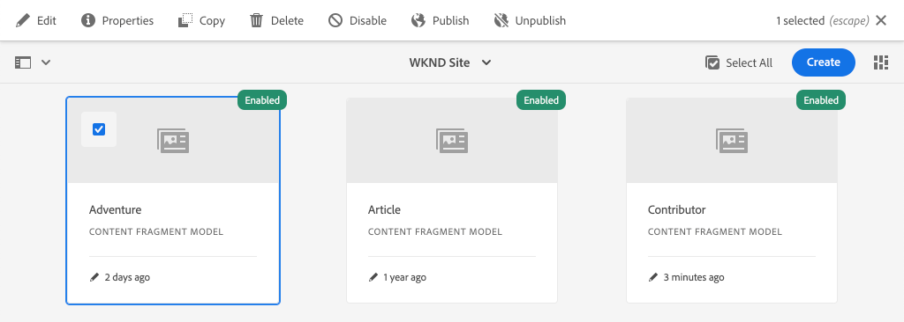
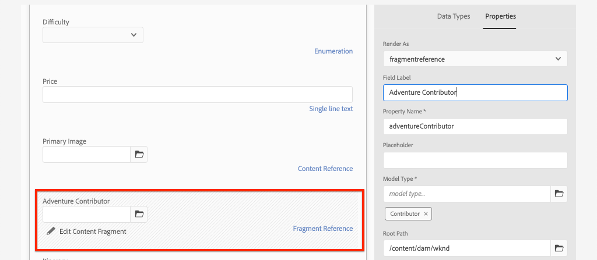

# Geavanceerde gegevensmodellering met fragmentverwijzingen

Het is mogelijk te verwijzen naar een inhoudsfragment vanuit een ander inhoudsfragment. Dit laat een gebruiker toe om complexe gegevensmodellen met verhoudingen tussen Fragments te bouwen.

In dit hoofdstuk wordt het Adventure-model bijgewerkt en wordt een verwijzing naar het model van de Contributor opgenomen met behulp van het **Fragmentverwijzing** veld. U zult ook leren hoe te om een vraag te wijzigen GraphQL om gebieden van een referenced model te omvatten.

## Vereisten

Dit is een meerdelige zelfstudie en er wordt aangenomen dat de in de vorige onderdelen beschreven stappen zijn voltooid.

## Doelstellingen

In dit hoofdstuk leert u hoe u:

* Een inhoudsfragmentmodel bijwerken voor het veld Fragmentverwijzing
* Creeer een vraag GraphQL die gebieden van een referenced model terugkeert

## Een fragmentverwijzing toevoegen {#add-fragment-reference}

Werk het model van het Fragment van de Fragment van de Inhoud van de Avontuur bij om een verwijzing naar het model van de Medewerker toe te voegen.

1. Open een nieuwe browser en navigeer naar AEM.
1. Van de **AEM starten** menu navigeren naar **Gereedschappen** > **Activa** > **Modellen van inhoudsfragmenten** > **WKND-site**.
1. Open de **Adventure** Inhoudsfragmentmodel

   

1. Onder **Gegevenstypen**, slepen en neerzetten **Fragmentverwijzing** in het hoofddeelvenster.

   

1. Werk de **Eigenschappen** voor dit veld:

   * Renderen als - `fragmentreference`
   * Veldlabel - **Adventure Contributor**
   * Eigenschapnaam - `adventureContributor`
   * Modeltype - Selecteer de optie **Medewerker** model
   * Hoofdpad - `/content/dam/wknd`

   

   De eigenschapsnaam `adventureContributor` kan nu worden gebruikt om te verwijzen naar een Contribute-inhoudsfragment.

1. Sla de wijzigingen in het model op.

## Wijs een Medewerker aan een Avontuur toe

Nu het model van het Fragmentmodel van de Inhoud van het Avontuur is bijgewerkt, kunnen wij een bestaand fragment uitgeven en een Medewerker van verwijzingen voorzien. Opgemerkt moet worden dat het model Inhoudsfragment wordt bewerkt *beïnvloedt* eventuele bestaande inhoudsfragmenten die daaruit zijn gemaakt.

1. Navigeren naar **Activa** > **Bestanden** > **WKND-site** > **Engels** > **avonturen** > **[Bali Surf Camp](http://localhost:4502/assets.html/content/dam/wknd/en/adventures/bali-surf-camp)**.

   

1. Klik in de **Bali Surf Camp** inhoudfragment om de Inhoudsfragmenteditor te openen.
1. Werk de **Adventure Contributor** en selecteer een medewerker door op het mappictogram te klikken.

   

   *Een pad naar een Contribute-fragment selecteren*

   

   Alleen fragmenten die zijn gemaakt met de **Medewerker** model kunnen worden geselecteerd.

1. Sla de wijzigingen in het fragment op.

1. Herhaal bovenstaande stappen om een medewerker aan avonturen toe te wijzen zoals [Yosemite-achtergrondverpakking](http://localhost:4502/editor.html/content/dam/wknd/en/adventures/yosemite-backpacking/yosemite-backpacking) en [Colorado Rock-beklimming](http://localhost:4502/editor.html/content/dam/wknd/en/adventures/colorado-rock-climbing/colorado-rock-climbing)

## Geneste inhoudsfragment zoeken met GraphiQL

Daarna, voer een vraag voor een Avontuur uit en voeg genestelde eigenschappen van het referenced model van de Medewerker toe. Wij zullen het hulpmiddel gebruiken GraphiQL om de syntaxis van de vraag snel te verifiëren.

1. Navigeer naar het gereedschap GraphiQL in AEM: [http://localhost:4502/content/graphiql.html](http://localhost:4502/content/graphiql.html)

1. Voer de volgende query in:

   ```graphql
   {
     adventureByPath(_path:"/content/dam/wknd/en/adventures/bali-surf-camp/bali-surf-camp") {
        item {
          _path
          adventureTitle
          adventureContributor {
            fullName
            occupation
            pictureReference {
           ...on ImageRef {
             _path
           }
         }
       }
     }
    }
   }
   ```

   De bovenstaande vraag is voor één enkel avontuur door het weg van het. De `adventureContributor` eigenschappen verwijzen naar het Contribute-model en we kunnen vervolgens eigenschappen aanvragen bij het geneste inhoudsfragment.

1. Voer de vraag uit en u zou een resultaat als het volgende moeten krijgen:

   ```json
   {
     "data": {
       "adventureByPath": {
           "item": {
               "_path": "/content/dam/wknd/en/adventures/bali-surf-camp/bali-surf-camp",
               "adventureTitle": "Bali Surf Camp",
               "adventureContributor": {
                   "fullName": "Stacey Roswells",
                   "occupation": "Photographer",
                   "pictureReference": {
                       "_path": "/content/dam/wknd/en/contributors/stacey-roswells.jpg"
                   }
               }
           }
        }
     }
   }
   ```

1. Experimenteer met andere query&#39;s, zoals `adventureList` en eigenschappen toevoegen voor het inhoudsfragment waarnaar wordt verwezen onder `adventureContributor`.

## De React-app bijwerken om de inhoud van de Contribute-server weer te geven

Werk vervolgens de query&#39;s bij die door de React-toepassing worden gebruikt om de nieuwe Contribute op te nemen en geef informatie over de Contribute weer als onderdeel van de weergave met Adventure-details.

1. Open de WKND GraphQL React-app in uw IDE.

1. Het bestand openen `src/components/AdventureDetail.js`.

   

1. De functie zoeken `adventureDetailQuery(_path)`. De `adventureDetailQuery(..)` functie verpakt eenvoudig een het filtreren vraag GraphQL, die AEM gebruikt `<modelName>ByPath` syntaxis voor het zoeken naar één inhoudsfragment dat wordt aangegeven door het JCR-pad.

1. Werk de vraag bij om informatie over referenced Medewerker te omvatten:

   ```javascript
   function adventureDetailQuery(_path) {
       return `{
           adventureByPath (_path: "${_path}") {
           item {
               _path
               adventureTitle
               adventureActivity
               adventureType
               adventurePrice
               adventureTripLength
               adventureGroupSize
               adventureDifficulty
               adventurePrice
               adventurePrimaryImage {
                   ... on ImageRef {
                   _path
                   mimeType
                   width
                   height
                   }
               }
               adventureDescription {
                   html
               }
               adventureItinerary {
                   html
               }
               adventureContributor {
                   fullName
                   occupation
                   pictureReference {
                       ...on ImageRef {
                           _path
                       }
                   }
               }
             }
          }
        }
       `;
   }
   ```

   In deze update zijn aanvullende eigenschappen beschikbaar over het dialoogvenster `adventureContributor`, `fullName`, `occupation`, en `pictureReference` wordt opgenomen in de query.

1. Inspect the `Contributor` component ingesloten in de `AdventureDetail.js` bestand bij `function Contributor(...)`. Deze component geeft de naam, het beroep en het beeld van de medewerker weer als de eigenschappen bestaan.

   De `Contributor` naar de component wordt verwezen in het dialoogvenster `AdventureDetail(...)` `return` methode:

   ```javascript
   function AdventureDetail(props) {
       ...
       return (
           ...
            <h2>Itinerary</h2>
           <hr />
           <div className="adventure-detail-itinerary"
                dangerouslySetInnerHTML={{__html: adventureData.adventureItinerary.html}}></div>
           {/* Contributor component is instaniated and 
               is passed the adventureContributor object from the GraphQL Query results */}
           <Contributer {...adventureData.adventureContributor} />
           ...
       )
   }
   ```

1. Sla de wijzigingen in het bestand op.
1. Start de React-app, indien deze nog niet wordt uitgevoerd:

   ```shell
   $ cd aem-guides-wknd-graphql/react-app
   $ npm start
   ```

1. Navigeren naar [http://localhost:3000](http://localhost:3000/) en klik op een avontuur met een Contribute-medewerker waarnaar wordt verwezen. U moet nu de informatie van de medewerker hieronder zien **Urinertie**:

   

## Gefeliciteerd!{#congratulations}

Gefeliciteerd! U hebt een bestaand Content Fragment-model bijgewerkt om te verwijzen naar een genest Content Fragment met de opdracht **Fragmentverwijzing** veld. U leerde ook hoe te om een vraag te wijzigen GraphQL om gebieden van een referenced model te omvatten.

## Volgende stappen {#next-steps}

In het volgende hoofdstuk: [Implementatie van productie met behulp van een AEM-publicatie-omgeving](./production-deployment.md)Meer informatie over AEM-auteur- en publicatieservices en het aanbevolen implementatiepatroon voor toepassingen zonder kop. U zult een bestaande toepassing bijwerken om omgevingsvariabelen te gebruiken om een eindpunt GraphQL dynamisch te veranderen dat op het doelmilieu wordt gebaseerd. U zult ook leren hoe te om behoorlijk AEM voor het middel het delen van de Cross-Origin (CORS) te vormen.
