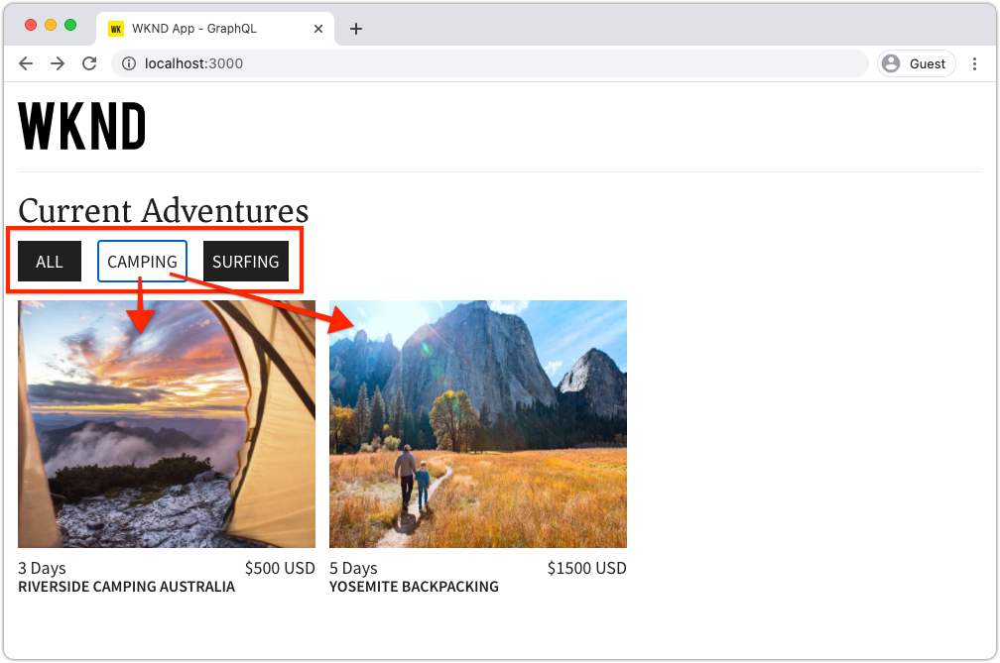

# Query AEM uitvoeren met GraphQL van een externe toepassing

In dit hoofdstuk, onderzoeken wij hoe AEM APIs GraphQL kan worden gebruikt om de ervaring in een externe toepassing te drijven.

Deze zelfstudie gebruikt een eenvoudige React-app om Adventure-inhoud te zoeken en weer te geven die door AEM GraphQL-API&#39;s wordt weergegeven. Het gebruik van React is grotendeels onbelangrijk, en de verbruikende externe toepassing zou in om het even welk kader voor om het even welk platform kunnen worden geschreven.

## Vereisten

Dit is een meerdelige zelfstudie en er wordt aangenomen dat de in de vorige onderdelen beschreven stappen zijn voltooid.

_IDE screenshots in dit hoofdstuk komen van [Visual Studio-code](https://code.visualstudio.com/)_

U kunt desgewenst een browserextensie installeren, zoals [GraphQL-netwerkcontrole](https://chrome.google.com/webstore/detail/graphql-network-inspector/ndlbedplllcgconngcnfmkadhokfaaln) om meer details over een vraag te kunnen bekijken GraphQL.

## Doelstellingen

In dit hoofdstuk leert u hoe u:

* De functionaliteit van de voorbeeldtoepassing React starten en begrijpen
* Onderzoek hoe de vraag van externe app aan AEM eindpunten GraphQL wordt gemaakt
* Definieer een query GraphQL om een lijst met avonturen van inhoudsfragmenten te filteren op activiteit
* Werk de React app bij om controles te verstrekken om via GraphQL, de lijst van avonturen door activiteit te filtreren

## De React-app starten

Aangezien dit hoofdstuk zich op het ontwikkelen van een cliënt concentreert om de Fragmenten van de Inhoud over GraphQL te verbruiken, de steekproef [WKND GraphQL React-broncode van app moet worden gedownload en ingesteld](../quick-setup/local-sdk.md) op uw lokale computer.

Het starten van de React-app wordt meer gedetailleerd beschreven in het gedeelte [Snelle installatie](../quick-setup/local-sdk.md) hoofdstuk , maar de verkorte instructies kunnen worden opgevolgd :

1. Kloont de voorbeeldtoepassing WKND GraphQL React, indien u dat nog niet hebt gedaan [Github.com](https://github.com/adobe/aem-guides-wknd-graphql)

   ```shell
   $ git clone --branch tutorial/react git@github.com:adobe/aem-guides-wknd-graphql.git
   ```

1. Open de WKND GraphQL React-app in uw IDE

   

1. Navigeer vanaf de opdrachtregel naar de `react-app` map
1. Start de WKND GraphQL React-app door de volgende opdracht uit te voeren vanuit de hoofdmap van het project (de `react-app` map)

   ```shell
   $ cd aem-guides-wknd-graphql/react-app
   $ npm start
   ```

1. Bekijk de app op [http://localhost:3000/](http://localhost:3000/). De voorbeeldtoepassing React bestaat uit twee hoofdonderdelen:

   * De ervaring van het huis doet dienst als index van avonturen WKND, door te vragen __Adventure__ Inhoudsfragmenten in AEM met behulp van GraphQL. In dit hoofdstuk, zullen wij deze mening wijzigen om het filtreren van avonturen door activiteit te steunen.

      

   * De ervaring van de adventure details, gebruikt GraphQL om specifiek te vragen __Adventure__ Inhoudsfragment en geeft meer gegevenspunten weer.

      

1. De ontwikkelgereedschappen van de browser en een browserextensie gebruiken als [GraphQL-netwerkcontrole](https://chrome.google.com/webstore/detail/graphql-network-inspector/ndlbedplllcgconngcnfmkadhokfaaln) om de vragen te inspecteren GraphQL die naar AEM en hun antwoorden JSON worden verzonden. Deze benadering kan worden gebruikt om verzoeken te controleren GraphQL en reacties om ervoor te zorgen zij correct worden geformuleerd, en hun reacties zijn zoals verwacht.

   

   *GraphQL-query verzonden naar AEM vanuit de React-app*

   

   *JSON-reactie van AEM op de React-app*

   De vragen en de reactie zouden moeten aanpassen wat in GrahiQL winde werd gezien.

   >[!NOTE]
   >
   > Tijdens ontwikkeling, React wordt app gevormd aan volmachtHTTP- verzoeken door de webpack ontwikkelingsserver aan AEM. De React-app vraagt om  `http://localhost:3000` die deze levert aan de AEM Author-service die wordt uitgevoerd op `http://localhost:4502`. Het bestand bekijken `src/setupProxy.js` en `env.development` voor meer informatie.
   >
   > In niet-ontwikkelingsscenario&#39;s, React app zou direct verzoeken aan AEM worden gevormd.

## De GraphQL-code van de app verkennen

1. Open het bestand in uw IDE `src/api/useGraphQL.js`.

   Dit is een [React-haak](https://reactjs.org/docs/hooks-overview.html#effect-hook) die luistert naar wijzigingen in de app `query`en bij wijziging wordt een HTTP-POST aangevraagd bij het eindpunt AEM GraphQL en wordt de JSON-reactie op de app geretourneerd.

   Telkens wanneer de React-toepassing een GraphQL-query moet uitvoeren, wordt deze aangepaste query aangeroepen `useGraphQL(query)` haak, die in GraphQL overgaan naar AEM te verzenden.

   In deze handleiding wordt gebruikgemaakt van de eenvoudige `fetch` module om het verzoek van GraphicsQL van de POST van HTTP te maken, maar andere modules zoals [Apollo GraphQL-client](https://www.apollographql.com/docs/react/) kan op dezelfde manier worden gebruikt.

1. Openen `src/components/Adventures.js` in IDE, die verantwoordelijk is voor de lijst van avonturen van de mening van het huis, en herzie de aanroeping van `useGraphQL` haak.

   Met deze code wordt de standaardinstelling ingesteld `query` de `allAdventuresQuery` zoals onderaan gedefinieerd in dit bestand.

   ```javascript
   const [query, setQuery] = useState(allAdventuresQuery);
   ```

   ... en op elk moment `query` variabele wijzigingen, de `useGraphQL` De haak wordt aangehaald, die beurtelings de vraag GraphQL tegen AEM uitvoert, die JSON aan JSON terugkeert `data` variabele, die vervolgens wordt gebruikt om de lijst met avonturen weer te geven.

   ```javascript
   const { data, errorMessage } = useGraphQL(query);
   ```

   De `allAdventuresQuery` is een constante vraag GraphQL die in het dossier wordt bepaald, die alle Fragmenten van de Inhoud van het Avontuur, zonder het filtreren vraagt, en slechts de gegevenspunten terugkeert moet de huismening teruggeven.

   ```javascript
   const allAdventuresQuery = `
   {
       adventureList {
         items {
           _path
           adventureTitle
           adventurePrice
           adventureTripLength
           adventurePrimaryImage {
           ... on ImageRef {
               _path
               mimeType
               width
               height
             }
           }
         }
     }
   }
   `;
   ```

1. Openen `src/components/AdventureDetail.js`, de React component verantwoordelijk voor het tonen van de ervaring van de avontuurdetails. In deze weergave wordt een specifiek inhoudsfragment opgevraagd, waarbij het JCR-pad wordt gebruikt als unieke id en de opgegeven details worden weergegeven.

   Op dezelfde manier als `Adventures.js`, de aangepaste `useGraphQL` React Hook wordt opnieuw gebruikt om die vraag GraphQL tegen AEM uit te voeren.

   Het pad van het inhoudsfragment wordt verzameld van het pad van de component `props` top gebruikt om het Content Fragment op te geven waarop moet worden gezocht.

   ```javascript
   const contentFragmentPath = props.location.pathname.substring(props.match.url.length);
   ```

   ... en de parameter van GraphQL parameterized vraag wordt geconstrueerd gebruikend `adventureDetailQuery(..)` en doorgegeven aan `useGraphQL(query)` die de vraag GraphQL tegen AEM uitvoert en de resultaten aan terugkeert `data` variabele.

   ```javascript
   const { data, errorMessage } = useGraphQL(adventureDetailQuery(contentFragmentPath));
   ```

   De `adventureDetailQuery(..)` functie verpakt eenvoudig een het filtreren vraag GraphQL, die AEM gebruikt `<modelName>ByPath` syntaxis om één enkel die Fragment van de Inhoud te vragen door zijn weg wordt geïdentificeerd JCR, en keert alle gespecificeerde gegevenspunten terug die worden vereist om de details van het avontuur terug te geven.

   ```javascript
   function adventureDetailQuery(_path) {
   return `{
       adventureByPath (_path: "${_path}") {
         item {
           _path
           adventureTitle
           adventureActivity
           adventureType
           adventurePrice
           adventureTripLength
           adventureGroupSize
           adventureDifficulty
           adventurePrice
           adventurePrimaryImage {
               ... on ImageRef {
               _path
               mimeType
               width
               height
               }
           }
           adventureDescription {
               html
           }
           adventureItinerary {
               html
           }
         }
       }
   }
   `;
   }
   ```

## Een geparameterized GraphQL-query maken

Daarna, wijzigen wij React app om geparameterized, filtrerende vragen uit te voeren GraphQL die de huismening door de activiteit van avonturen beperken.

1. Open het bestand in uw IDE: `src/components/Adventures.js`. Dit dossier vertegenwoordigt de avonturencomponent van de huiservaring, die naar de kaarten van avonturen zoekt en toont.
1. Inspect de functie `filterQuery(activity)`, die niet wordt gebruikt, maar is bereid om een vraag te formuleren GraphQL die filters avonturen door `activity`.

   Merk op dat de parameter `activity` wordt geïnjecteerd in de vraag GraphQL als deel van a `filter` op de `adventureActivity` veld, waarbij de waarde van dat veld moet overeenkomen met de waarde van de parameter.

   ```javascript
   function filterQuery(activity) {
       return `
           {
           adventures (filter: {
               adventureActivity: {
               _expressions: [
                   {
                   value: "${activity}"
                   }
                 ]
               }
           }){
               items {
               _path
               adventureTitle
               adventurePrice
               adventureTripLength
               adventurePrimaryImage {
               ... on ImageRef {
                   _path
                   mimeType
                   width
                   height
               }
               }
             }
         }
       }
       `;
   }
   ```

1. De component React Adventures bijwerken `return` instructie om knoppen toe te voegen die de nieuwe parameters aanroepen `filterQuery(activity)` om de avonturen aan lijst te verstrekken.

   ```javascript
   function Adventures() {
       ...
       return (
           <div className="adventures">
   
           {/* Add these three new buttons that set the GraphQL query accordingly */}
   
           {/* The first button uses the default `allAdventuresQuery` */}
           <button onClick={() => setQuery(allAdventuresQuery)}>All</button>
   
           {/* The 2nd and 3rd button use the `filterQuery(..)` to filter by activity */}
           <button onClick={() => setQuery(filterQuery('Camping'))}>Camping</button>
           <button onClick={() => setQuery(filterQuery('Surfing'))}>Surfing</button>
   
           <ul className="adventure-items">
           ...
       )
   }
   ```

1. Sla de wijzigingen op en laad de React-app opnieuw in de webbrowser. De drie nieuwe knopen verschijnen bij de bovenkant, en klikkend hen automatisch opnieuw vragen AEM voor de Fragmenten van de Inhoud van het Avontuur met de passende activiteit.

   

1. Voeg meer filterknoppen voor de activiteiten toe: `Rock Climbing`, `Cycling` en `Skiing`

## GrafiekQL-fouten verwerken

GraphQL wordt sterk getypt en kan daarom nuttige foutenmeldingen terugkeren als de vraag ongeldig is. Daarna, simuleren wij een onjuiste vraag om het teruggekeerde foutenbericht te zien.

1. Het bestand opnieuw openen `src/api/useGraphQL.js`. Inspect het volgende fragment om de foutafhandeling te bekijken:

   ```javascript
   //useGraphQL.js
   .then(({data, errors}) => {
           //If there are errors in the response set the error message
           if(errors) {
               setErrors(mapErrors(errors));
           }
           //Otherwise if data in the response set the data as the results
           if(data) {
               setData(data);
           }
       })
       .catch((error) => {
           setErrors(error);
       });
   ```

   De reactie wordt geïnspecteerd om te zien of omvat het een `errors` object. De `errors` Het object wordt verzonden door AEM als er problemen zijn met de query GraphQL, zoals een niet-gedefinieerd veld dat is gebaseerd op het schema. Als er geen `errors` het object `data` wordt ingesteld en geretourneerd.

   De `window.fetch` omvat een `.catch` instructie to *catch* algemene fouten zoals een ongeldige HTTP-aanvraag of als de verbinding met de server niet tot stand kan worden gebracht.

1. Het bestand openen `src/components/Adventures.js`.
1. De `allAdventuresQuery` om een ongeldige eigenschap op te nemen `adventurePetPolicy`:

   ```javascript
   /**
    * Query for all Adventures
    * adventurePetPolicy has been added beneath items
   */
   const allAdventuresQuery = `
   {
       adventureList {
         items {
           adventurePetPolicy
           _path
           adventureTitle
           adventurePrice
           adventureTripLength
           adventurePrimaryImage {
           ... on ImageRef {
               _path
               mimeType
               width
               height
           }
           }
         }
       }
   }
   `;
   ```

   We weten dat `adventurePetPolicy` maakt geen deel uit van het model van het Avontuur, zodat zou dit een fout moeten teweegbrengen.

1. Sla de wijzigingen op en ga terug naar de browser. Er wordt een foutbericht weergegeven zoals in het volgende voorbeeld:

   

   De GraphQL API detecteert dat `adventurePetPolicy` is ongedefinieerd in het dialoogvenster `AdventureModel` en retourneert een geschikt foutbericht.

1. Inspect de reactie van AEM met de ontwikkelaarsgereedschappen van de browser om de `errors` JSON-object:

   

   De `errors` Het object is uitgebreid en bevat informatie over de locatie van de onjuist gevormde query en de classificatie van de fout.

1. Terug naar `Adventures.js` en de wijziging van de query herstellen om de juiste status van de app te herstellen.

## Gefeliciteerd!{#congratulations}

Gefeliciteerd! U hebt met succes de code van de steekproefWKND GraphQL React app verkend en bijgewerkt aan het gebruiken van geparametrized, het filtreren vragen GraphQL aan lijstavonturen door activiteit! Je hebt ook de kans om de basisfoutafhandeling te verkennen.

## Volgende stappen {#next-steps}

In het volgende hoofdstuk: [Geavanceerde gegevensmodellering met fragmentverwijzingen](./fragment-references.md) U leert hoe u de functie Fragmentverwijzing gebruikt om een relatie te maken tussen twee verschillende inhoudsfragmenten. U zult ook leren hoe te om een vraag te wijzigen GraphQL om gebied van een referenced model te omvatten.
