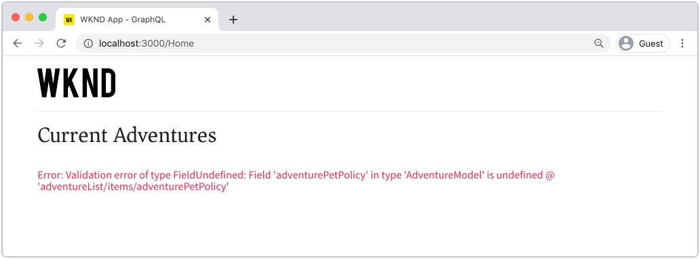

# Query AEM uitvoeren met GraphQL van een externe toepassing

In dit hoofdstuk, onderzoeken wij hoe AEM APIs GraphQL kan worden gebruikt om de ervaring in een externe toepassing te drijven.

Deze zelfstudie gebruikt een eenvoudige React-app om Adventure-inhoud te zoeken en weer te geven die door AEM GraphQL-API&#39;s wordt weergegeven. Het gebruik van React is grotendeels onbelangrijk, en de verbruikende externe toepassing zou in om het even welk kader voor om het even welk platform kunnen worden geschreven.

## Vereisten

Dit is een meerdelige zelfstudie en er wordt aangenomen dat de in de vorige onderdelen beschreven stappen zijn voltooid.

_IDE screenshots in dit hoofdstuk komen uit de Code van  [Visual Studio](https://code.visualstudio.com/)_

Desgewenst, installeer een browser uitbreiding zoals [GraphQL Netwerk](https://chrome.google.com/webstore/detail/graphql-network/igbmhmnkobkjalekgiehijefpkdemocm) om meer details over een vraag te kunnen bekijken GraphQL.

## Doelstellingen

In dit hoofdstuk leert u hoe u:

* De functionaliteit van de voorbeeldtoepassing React starten en begrijpen
* Onderzoek hoe de vraag van externe app aan AEM eindpunten GraphQL wordt gemaakt
* Definieer een query GraphQL om een lijst met avonturen van inhoudsfragmenten te filteren op activiteit
* Werk de React app bij om controles te verstrekken om via GraphQL, de lijst van avonturen door activiteit te filtreren

## De React-app starten

Aangezien dit hoofdstuk zich richt op het ontwikkelen van een client om inhoudsfragmenten te verbruiken via GraphQL, moet de voorbeeldbroncode [WKND GraphQL React app worden gedownload en ingesteld](./setup.md#react-app) op uw lokale computer. De [AEM SDK wordt uitgevoerd als de Auteur-service](./setup.md#aem-sdk) met de [voorbeeldsite WKND](./setup.md#wknd-site).

De aanvang van React app wordt gedetailleerd geschetst in [Snelle Opstelling](./setup.md) hoofdstuk, nochtans kunnen de verkorte instructies worden gevolgd:

1. Kloont u, indien nodig, het voorbeeld WKND GraphQL React app van [Github.com](https://github.com/adobe/aem-guides-wknd-graphql)

   ```shell
   $ git clone --branch tutorial/react git@github.com:adobe/aem-guides-wknd-graphql.git
   ```

1. Open de WKND GraphQL React-app in uw IDE

   

1. Navigeer vanaf de opdrachtregel naar de map `react-app`
1. Start de WKND GraphQL React-app door de volgende opdracht uit te voeren vanuit de hoofdmap van het project (de map `react-app`)

   ```shell
   $ cd aem-guides-wknd-graphql/react-app
   $ npm start
   ```

1. Reviseer de app op [http://localhost:3000/](http://localhost:3000/). De voorbeeldtoepassing React bestaat uit twee hoofdonderdelen:

   * De huiservaring doet dienst als index van avonturen WKND, door __Adventure__ de Fragments van de Inhoud in AEM het gebruiken van GraphQL te vragen. In dit hoofdstuk, zullen wij deze mening wijzigen om het filtreren van avonturen door activiteit te steunen.

      

   * De ervaring van de avontuurdetails, gebruikt GraphQL om specifiek __Adventure__ het Fragment van de Inhoud te vragen, en toont meer gegevenspunten.

      

1. Gebruik de de ontwikkelingshulpmiddelen van browser en een browser uitbreiding zoals [GraphQL Netwerk](https://chrome.google.com/webstore/detail/graphql-network/igbmhmnkobkjalekgiehijefpkdemocm) om de vragen te inspecteren GraphQL die naar AEM en hun antwoorden JSON worden verzonden. Deze benadering kan worden gebruikt om verzoeken te controleren GraphQL en reacties om ervoor te zorgen zij correct worden geformuleerd, en hun reacties zijn zoals verwacht.

   

   *GraphQL-query verzonden naar AEM vanuit de React-app*

   

   *JSON-reactie van AEM op de React-app*

   De vragen en de reactie zouden moeten aanpassen wat in GrahiQL winde werd gezien.

   >[!NOTE]
   >
   > Tijdens ontwikkeling, React wordt app gevormd aan volmachtHTTP- verzoeken door de webpack ontwikkelingsserver aan AEM. De toepassing React doet verzoeken aan `http://localhost:3000` die hen aan de dienst van de Auteur van AEM die op `http://localhost:4502` loopt. Bekijk het bestand `src/setupProxy.js` en `env.development` voor meer informatie.
   >
   > In niet-ontwikkelingsscenario&#39;s, React app zou direct verzoeken aan AEM worden gevormd.

## De GraphQL-code van de app verkennen

1. Open het bestand `src/api/useGraphQL.js` in uw IDE.

   Dit is een [React Effect Hook](https://reactjs.org/docs/hooks-overview.html#effect-hook) die op veranderingen in `query` van app let, en bij verandering doet een verzoek van de POST van HTTP aan het eind-punt van AEM GraphQL, en keert de JSON reactie op app terug.

   Telkens wanneer React app een vraag moet maken GraphQL, roept het deze douane `useGraphQL(query)` haak aan, die in GraphQL overgaat om naar AEM te verzenden.

   Deze Hook gebruikt de eenvoudige `fetch` module om het verzoek van GraphQL van de POST van HTTP uit te voeren, maar andere modules zoals [Apollo GraphQL cliënt](https://www.apollographql.com/docs/react/) kunnen zo ook worden gebruikt.

1. Open `src/components/Adventures.js` in winde, die voor de lijst van avonturen van de huismening verantwoordelijk is, en herzie de aanroeping van `useGraphQL` haak.

   Met deze code wordt de standaard `query` ingesteld op `allAdventuresQuery`, zoals onderaan gedefinieerd in dit bestand.

   ```javascript
   const [query, setQuery] = useState(allAdventuresQuery);
   ```

   ... en wanneer de `query` veranderlijke veranderingen, `useGraphQL` haak wordt aangehaald, die beurtelings de vraag GraphQL tegen AEM uitvoert, die JSON aan `data` variabele terugkeert, die dan wordt gebruikt om de lijst van avonturen terug te geven.

   ```javascript
   const { data, errorMessage } = useGraphQL(query);
   ```

   `allAdventuresQuery` is een constante vraag GraphQL die in het dossier wordt bepaald, die alle Fragmenten van de Inhoud van het Avontuur, zonder het filtreren vraagt, en slechts de gegevenspunten terugkeert moet de huismening teruggeven.

   ```javascript
   const allAdventuresQuery = `
   {
       adventureList {
         items {
           _path
           adventureTitle
           adventurePrice
           adventureTripLength
           adventurePrimaryImage {
           ... on ImageRef {
               _path
               mimeType
               width
               height
             }
           }
         }
     }
   }
   `;
   ```

1. Open `src/components/AdventureDetail.js`, de React component verantwoordelijk voor het tonen van de ervaring van de avontuurdetails. In deze weergave wordt een specifiek inhoudsfragment opgevraagd, waarbij het JCR-pad wordt gebruikt als unieke id en de opgegeven details worden weergegeven.

   Op dezelfde manier als `Adventures.js`, wordt de douane `useGraphQL` React Hook opnieuw gebruikt om die vraag GraphQL tegen AEM uit te voeren.

   Het pad van het inhoudsfragment wordt verzameld vanaf de `props`-bovenkant van de component die moet worden gebruikt om het inhoudsfragment op te geven waarop moet worden gezocht.

   ```javascript
   const contentFragmentPath = props.location.pathname.substring(props.match.url.length);
   ```

   ... en de parameter van GraphQL parameterized vraag wordt geconstrueerd gebruikend de `adventureDetailQuery(..)` functie, en overgegaan tot `useGraphQL(query)` die de vraag GraphQL tegen AEM uitvoert en de resultaten aan `data` variabele terugkeert.

   ```javascript
   const { data, errorMessage } = useGraphQL(adventureDetailQuery(contentFragmentPath));
   ```

   De functie `adventureDetailQuery(..)` verpakt eenvoudig een het filtreren vraag GraphQL, die AEM `<modelName>ByPath` syntaxis gebruikt om één enkel die Fragment van de Inhoud te vragen door zijn weg JCR wordt geïdentificeerd, en keert alle gespecificeerde gegevenspunten terug die worden vereist om de details van het avontuur terug te geven.

   ```javascript
   function adventureDetailQuery(_path) {
   return `{
       adventureByPath (_path: "${_path}") {
         item {
           _path
           adventureTitle
           adventureActivity
           adventureType
           adventurePrice
           adventureTripLength
           adventureGroupSize
           adventureDifficulty
           adventurePrice
           adventurePrimaryImage {
               ... on ImageRef {
               _path
               mimeType
               width
               height
               }
           }
           adventureDescription {
               html
           }
           adventureItinerary {
               html
           }
         }
       }
   }
   `;
   }
   ```

## Een geparameterized GraphQL-query maken

Daarna, wijzigen wij React app om geparameterized, filtrerende vragen uit te voeren GraphQL die de huismening door de activiteit van avonturen beperken.

1. Open het bestand in uw IDE: `src/components/Adventures.js`. Dit dossier vertegenwoordigt de avonturencomponent van de huiservaring, die naar de kaarten van avonturen zoekt en toont.
1. Inspect de functie `filterQuery(activity)`, die ongebruikt is, maar bereid is om een vraag te formuleren GraphQL die avonturen door `activity` filtreert.

   Merk op dat parameter `activity` in de vraag GraphQL als deel van `filter` op het `adventureActivity` gebied wordt ingespoten, die de waarde van dat gebied vereisen om de waarde van de parameter aan te passen.

   ```javascript
   function filterQuery(activity) {
       return `
           {
           adventures (filter: {
               adventureActivity: {
               _expressions: [
                   {
                   value: "${activity}"
                   }
                 ]
               }
           }){
               items {
               _path
               adventureTitle
               adventurePrice
               adventureTripLength
               adventurePrimaryImage {
               ... on ImageRef {
                   _path
                   mimeType
                   width
                   height
               }
               }
             }
         }
       }
       `;
   }
   ```

1. Werk de React verklaring `return` van de Adventures van de component bij om knopen toe te voegen die nieuw geparameterized `filterQuery(activity)` aanhalen om de avonturen aan lijst te verstrekken.

   ```javascript
   function Adventures() {
       ...
       return (
           <div className="adventures">
   
           {/* Add these three new buttons that set the GraphQL query accordingly */}
   
           {/* The first button uses the default `allAdventuresQuery` */}
           <button onClick={() => setQuery(allAdventuresQuery)}>All</button>
   
           {/* The 2nd and 3rd button use the `filterQuery(..)` to filter by activity */}
           <button onClick={() => setQuery(filterQuery('Camping'))}>Camping</button>
           <button onClick={() => setQuery(filterQuery('Surfing'))}>Surfing</button>
   
           <ul className="adventure-items">
           ...
       )
   }
   ```

1. Sla de wijzigingen op en laad de React-app opnieuw in de webbrowser. De drie nieuwe knopen verschijnen bij de bovenkant, en klikkend hen automatisch opnieuw vragen AEM voor de Fragmenten van de Inhoud van het Avontuur met de passende activiteit.

   

1. Voeg meer filterknoppen voor de activiteiten toe: `Rock Climbing`, `Cycling` en `Skiing`

## GrafiekQL-fouten verwerken

GraphQL wordt sterk getypt en kan daarom nuttige foutenmeldingen terugkeren als de vraag ongeldig is. Daarna, simuleren wij een onjuiste vraag om het teruggekeerde foutenbericht te zien.

1. Open het bestand `src/api/useGraphQL.js` opnieuw. Inspect het volgende fragment om de foutafhandeling te bekijken:

   ```javascript
   //useGraphQL.js
   .then(({data, errors}) => {
           //If there are errors in the response set the error message
           if(errors) {
               setErrors(mapErrors(errors));
           }
           //Otherwise if data in the response set the data as the results
           if(data) {
               setData(data);
           }
       })
       .catch((error) => {
           setErrors(error);
       });
   ```

   De reactie wordt geïnspecteerd om te zien of omvat het een `errors` voorwerp. Het `errors` voorwerp zal door AEM worden verzonden als er kwesties met de vraag GraphQL, zoals een niet bepaald gebied zijn dat op het schema wordt gebaseerd. Als er geen `errors`-object is, wordt `data` ingesteld en geretourneerd.

   De `window.fetch` bevat een `.catch`-instructie voor *catch* alle algemene fouten zoals een ongeldige HTTP-aanvraag of als de verbinding met de server niet tot stand kan worden gebracht.

1. Open het bestand `src/components/Adventures.js`.
1. Wijzig `allAdventuresQuery` om een ongeldige eigenschap `adventurePetPolicy` op te nemen:

   ```javascript
   /**
    * Query for all Adventures
    * adventurePetPolicy has been added beneath items
   */
   const allAdventuresQuery = `
   {
       adventureList {
         items {
           adventurePetPolicy
           _path
           adventureTitle
           adventurePrice
           adventureTripLength
           adventurePrimaryImage {
           ... on ImageRef {
               _path
               mimeType
               width
               height
           }
           }
         }
       }
   }
   `;
   ```

   Wij weten dat `adventurePetPolicy` geen deel van het model van het avontuur uitmaakt, zodat zou dit een fout moeten teweegbrengen.

1. Sla de wijzigingen op en ga terug naar de browser. Er wordt een foutbericht weergegeven zoals in het volgende voorbeeld:

   

   De GraphQL API ontdekt dat `adventurePetPolicy` ongedefinieerd in `AdventureModel` is en keert een aangewezen foutenmelding terug.

1. Inspect de reactie van AEM met de ontwikkelaarsgereedschappen van de browser om het JSON-object `errors` weer te geven:

   

   Het object `errors` is uitgebreid en bevat informatie over de locatie van de onjuist gevormde query en classificatie van de fout.

1. Ga terug naar `Adventures.js` en herstel de wijziging van de query om de toepassing naar de juiste status te retourneren.

## Gefeliciteerd!{#congratulations}

Gefeliciteerd! U hebt met succes de code van de steekproefWKND GraphQL React app verkend en bijgewerkt aan het gebruiken van geparametrized, het filtreren vragen GraphQL aan lijstavonturen door activiteit! Je hebt ook de kans om de basisfoutafhandeling te verkennen.

## Volgende stappen {#next-steps}

In het volgende hoofdstuk, [Geavanceerde gegevensmodellering met de Verwijzingen van het Fragment](./fragment-references.md) zult u leren hoe de eigenschap van de Verwijzing van het Fragment gebruikt om een verhouding tussen twee verschillende Fragmenten van de Inhoud tot stand te brengen. U zult ook leren hoe te om een vraag te wijzigen GraphQL om gebied van een referenced model te omvatten.
