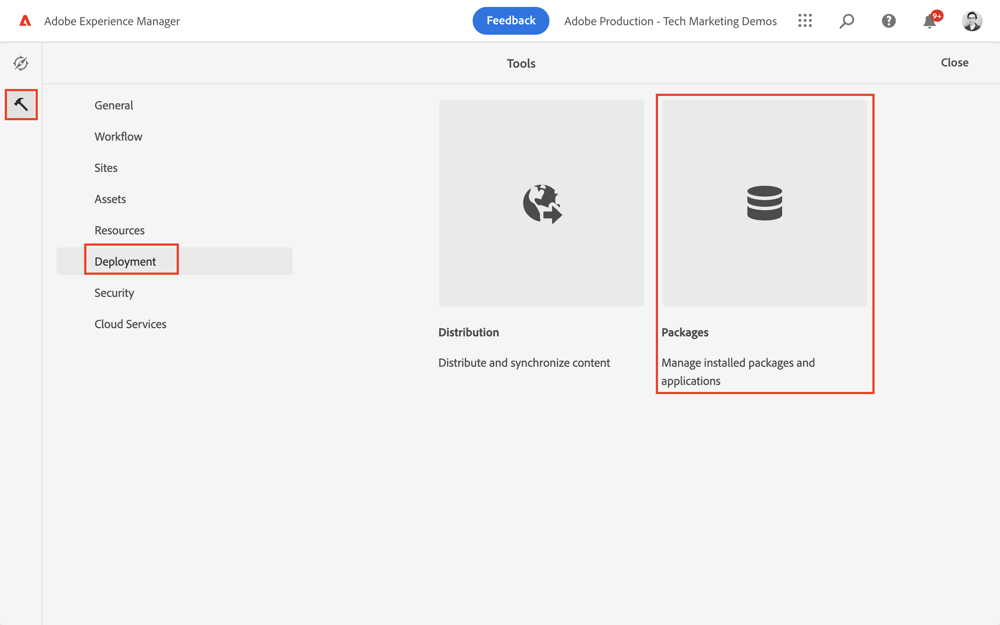
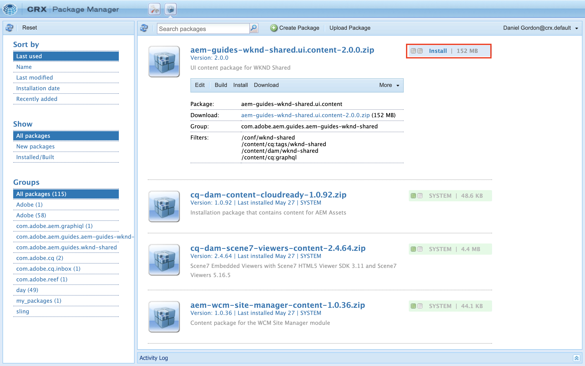

# Aan de slag met AEM zonder kop - GraphQL

Een end-to-end zelfstudie waarin wordt geïllustreerd hoe u inhoud kunt samenstellen en beschikbaar maken met behulp van AEM GraphQL API&#39;s en die door een externe toepassing wordt verbruikt, in een headless CMS-scenario.

In deze zelfstudie wordt onderzocht hoe AEM GraphQL API&#39;s en headless mogelijkheden kunnen worden gebruikt om de ervaring die in een externe app wordt opgedaan, kracht bij te zetten.

In deze zelfstudie worden de volgende onderwerpen behandeld:

* Creeer een nieuwe Configuratie van het Project
* Nieuwe modellen van inhoudsfragmenten maken om gegevens te modelleren
* Maak nieuwe inhoudsfragmenten op basis van de eerder gemaakte modellen.
* Onderzoek hoe de Fragments van de Inhoud in AEM kunnen worden betwist gebruikend het geïntegreerde ontwikkelingshulpmiddel GraphiQL.
* Om de vragen GraphQL op te slaan of voort te zetten aan AEM
* Verbruik voortgezette vragen GraphQL van een steekproef React app

## Vereisten {#prerequisites}

U hebt het volgende nodig om deze zelfstudie te volgen:

* Basis HTML- en JavaScript-vaardigheden
* De volgende gereedschappen moeten lokaal zijn geïnstalleerd:
   * [Node.js v10+](https://nodejs.org/en/)
   * [npm 6+](https://www.npmjs.com/)
   * [Git](https://git-scm.com/)
   * Een IDE (bijvoorbeeld [Microsoft® Visual Studio-code](https://code.visualstudio.com/))

### AEM

Voor het voltooien van deze zelfstudie is een Adobe Experience Manager-omgeving vereist. U kunt elk van de volgende handelingen gebruiken (screenshots worden opgenomen vanuit een AEM as a Cloud Service omgeving):

* as a Cloud Service omgeving AEM met:
   * [Toegang tot AEM as a Cloud Service en Cloud Manager](/help/cloud-service/accessing/overview.md)
      * **AEM** toegang tot AEM as a Cloud Service
      * **Cloud Manager - Ontwikkelaar** toegang tot Cloud Manager

### Voorbeeldinhoud installeren {#install-sample-content}

Het kan handig zijn om voorbeeldinhoud die al beschikbaar is in de AEM-omgeving als referentie te gebruiken.

1. Ga naar de [Gedeeld WKND-project AEM](https://github.com/adobe/aem-guides-wknd-shared/releases).
1. Download de nieuwste uitgebrachte middelen: `aem-guides-wknd-shared.ui.content-x.x.x.zip`.
1. Meld u aan bij de AEM ontwikkelomgeving die u wilt gebruiken voor de zelfstudie.
1. Navigeer van het AEM beginscherm naar **Gereedschappen** > **Implementatie** > **Pakketten**:

   

1. Tikken **Pakket uploaden** en kiest u `aem-guides-wknd-shared.ui.content-x.x.x.zip` eerder gedownload bestand. Tikken **OK** om te uploaden.
1. Tik op **Installeren** om de inhoud te installeren.

   

1. Voorbeeldfragmenten voor inhoud, modellen van inhoudsfragmenten, afbeeldingen en meer worden voor fictieve [WKND-merk](https://wknd.site/). In de zelfstudie wordt later naar de voorbeeldinhoud verwezen.

## Laten we beginnen!

1. Zelfstudie starten met [Modellen voor inhoudsfragmenten definiëren](content-fragment-models.md).

## GitHub-project

De broncode en inhoudspakketten zijn beschikbaar op de [AEM - WKND GraphQL GitHub Project](https://github.com/adobe/aem-guides-wknd-graphql).

Als u een probleem hebt met de zelfstudie of de code, kunt u een [GitHub-probleem](https://github.com/adobe/aem-guides-wknd-graphql/issues).

De Fragmenten, de modellen, en de vragen van de Inhoud van de steekproef kunnen in worden gevonden [Gedeeld WKND-project AEM](https://github.com/adobe/aem-guides-wknd-shared)
