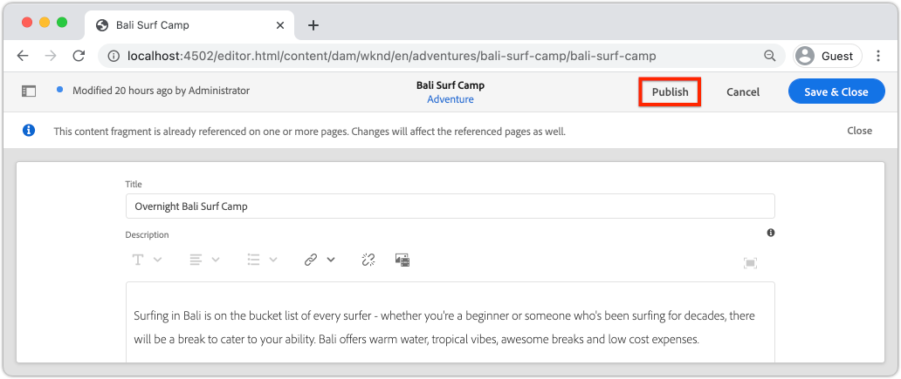

# Implementatie van productie met een AEM-publicatieservice

In deze zelfstudie stelt u een lokale omgeving in om inhoud te simuleren die wordt gedistribueerd van een instantie Auteur naar een instantie Publish. U genereert ook een productiebuild van een React-app die is geconfigureerd om inhoud te verbruiken vanuit de AEM-publicatieomgeving met behulp van de GraphQL API&#39;s. Tijdens het werken leert u hoe u omgevingsvariabelen effectief kunt gebruiken en hoe u de AEM CORS-configuraties kunt bijwerken.

## Vereisten

Deze zelfstudie maakt deel uit van een meerdelige zelfstudie. Aangenomen wordt dat de in de vorige delen beschreven stappen zijn voltooid.

## Doelstellingen

Leer hoe u:

* Begrijp de AEM-auteur- en -publicatiearchitectuur.
* Leer beste praktijken voor het beheren van omgevingsvariabelen.
* Leer hoe u AEM for Cross-Origin Resource sharing (CORS) correct configureert.

## Implementatiepatroon voor auteur publiceren {#deployment-pattern}

Een volledige AEM-omgeving bestaat uit een Auteur, Publish en Dispatcher. In deze service maken, beheren en voorvertonen interne gebruikers inhoud. De publicatieservice wordt beschouwd als de &quot;live&quot;-omgeving en is doorgaans de omgeving waarmee eindgebruikers werken. Inhoud wordt na bewerking en goedkeuring in de service Auteur gedistribueerd naar de service Publiceren.

Het meest gangbare implementatiepatroon met AEM-toepassingen zonder kop is dat de productieversie van de toepassing verbinding maakt met een AEM-publicatieservice.


Het diagram hierboven toont dit gemeenschappelijke plaatsingspatroon.

1. A **de auteur van de Inhoud** gebruikt de de auteursdienst van AEM om, inhoud tot stand te brengen uit te geven en te beheren.
2. De **auteur van de Inhoud** en andere interne gebruikers kunnen de inhoud op de dienst van de Auteur direct voorproef. Er kan een voorvertoningsversie van de toepassing worden ingesteld die verbinding maakt met de service Auteur.
3. Zodra de inhoud is goedgekeurd, kan het **worden gepubliceerd** aan de dienst van de Publicatie van AEM.
4. **Eindgebruikers** interactie met de versie van de Productie van de toepassing. De productietoepassing maakt verbinding met de publicatieservice en gebruikt de GraphQL API&#39;s om inhoud aan te vragen en te gebruiken.

In de zelfstudie wordt de bovenstaande implementatie gesimuleerd door een AEM-publicatieexemplaar toe te voegen aan de huidige installatie. In vorige hoofdstukken werkte de React App als voorproef door rechtstreeks met de instantie van de Auteur te verbinden. Een productie bouwt van React App wordt opgesteld aan een statische server Node.js die met de nieuwe Publish instantie verbindt.

Uiteindelijk worden drie lokale servers uitgevoerd:

* http://localhost:4502 - Auteur-instantie
* http://localhost:4503 - Instantie publiceren
* http://localhost:5000 - React App in productiemodus, verbindend met de Publish instantie.

## AEM SDK installeren - Publicatiemodus {#aem-sdk-publish}

Momenteel hebben wij een lopende geval van SDK op **Auteur** wijze. SDK kan ook op **zijn begonnen publiceert** wijze om een AEM te simuleren publiceer milieu.

Een meer gedetailleerde gids voor vestiging een lokale ontwikkelomgeving [ kan hier ](https://experienceleague.adobe.com/docs/experience-manager-learn/cloud-service/local-development-environment-set-up/overview.html?lang=nl-NL#local-development-environment-set-up) worden gevonden.

1. Maak in uw lokale bestandssysteem een specifieke map voor de installatie van de instantie Publiceren, met de naam `~/aem-sdk/publish` .
1. Kopieer het QuickStart-jar-bestand dat in vorige hoofdstukken voor de instantie Auteur is gebruikt en plak het in de map `publish` . Alternatief navigeer aan het [ Portaal van de Distributie van de Software ](https://experience.adobe.com/#/downloads/content/software-distribution/en/aemcloud.html) en download recentste SDK en extraheer het Jar dossier van QuickStart.
1. Wijzig de naam van het jar-bestand in `aem-publish-p4503.jar` .

   De tekenreeks `publish` geeft aan dat de QuickStart-jar begint in de publicatiemodus. `p4503` geeft aan dat de Quickstart-server wordt uitgevoerd op poort 4503.

1. Open een nieuw terminalvenster en navigeer naar de map die het jar-bestand bevat. Installeer en start de AEM-instantie:

   ```shell
   $ cd ~/aem-sdk/publish
   $ java -jar aem-publish-p4503.jar
   ```

1. Geef een beheerderswachtwoord op als `admin` . Om het even welk admin wachtwoord is aanvaardbaar, nochtans wordt het geadviseerd om het gebrek voor lokale ontwikkeling te gebruiken om extra configuraties te vermijden.
1. Wanneer de instantie van AEM het installeren heeft gebeëindigd, zal een nieuw browser venster in [ http://localhost:4503/content.html ](http://localhost:4503/content.html) openen

   De verwachting is dat deze een pagina van 404 niet gevonden retourneert. Dit is een gloednieuw AEM-exemplaar en er is geen inhoud geïnstalleerd.

## Voorbeeldinhoud en GraphQL-eindpunten installeren {#wknd-site-content-endpoints}

Net als bij de instantie Auteur moet de instantie Publiceren de GraphQL-eindpunten hebben ingeschakeld en voorbeeldinhoud nodig hebben. Installeer vervolgens de WKND Reference Site op de instantie Publish.

1. Download het recentste gecompileerde Pakket van AEM voor Plaats WKND: [ aem-guides-wknd.all-x.x.x.zip ](https://github.com/adobe/aem-guides-wknd/releases/latest).

   >[!NOTE]
   >
   > Zorg ervoor om de standaardversie compatibel met AEM as a Cloud Service te downloaden en **niet** de `classic` versie.

1. Login aan de Publish instantie door rechtstreeks te navigeren aan: [ http://localhost:4503/libs/granite/core/content/login.html ](http://localhost:4503/libs/granite/core/content/login.html) met de gebruikersnaam `admin` en het wachtwoord `admin`.
1. Daarna, navigeer aan de Manager van het Pakket in [ http://localhost:4503/crx/packmgr/index.jsp ](http://localhost:4503/crx/packmgr/index.jsp).
1. Klik **Upload Pakket** en kies het pakket WKND dat in de vroegere stap wordt gedownload. Klik **installeren** om het pakket te installeren.
1. Na het installeren van het pakket, is de WKND verwijzingsplaats nu beschikbaar in [ http://localhost:4503/content/wknd/us/en.html ](http://localhost:4503/content/wknd/us/en.html).
1. Meld u af als de `admin` -gebruiker door op de knop Afmelden op de menubalk te klikken.

   

   In tegenstelling tot de AEM-instantie Auteur worden in de AEM-publicatie-instanties anonieme alleen-lezen toegang standaard ingesteld. Wij willen de ervaring van een anonieme gebruiker wanneer het runnen van de React toepassing simuleren.

## Omgevingsvariabelen bijwerken om naar de instantie Publiceren te verwijzen {#react-app-publish}

Werk vervolgens de omgevingsvariabelen bij die door de toepassing React worden gebruikt om naar de instantie Publish te verwijzen. React zou App **slechts** met de Publish instantie op productiemodus moeten verbinden.

Voeg vervolgens een nieuw bestand `.env.production.local` toe om de productieervaring te simuleren.

1. Open de WKND GraphQL React-app in uw IDE.

1. Voeg onder `aem-guides-wknd-graphql/react-app` een bestand met de naam `.env.production.local` toe.
1. Vul `.env.production.local` met het volgende:

   ```plain
   REACT_APP_HOST_URI=http://localhost:4503
   REACT_APP_GRAPHQL_ENDPOINT=/content/graphql/global/endpoint.json
   ```

    toe

   Met behulp van omgevingsvariabelen kunt u eenvoudig het GraphQL-eindpunt tussen een auteur- of publicatieomgeving schakelen zonder extra logica toe te voegen in de toepassingscode. Meer informatie over [ variabelen van het douanemilieu voor React kan hier ](https://create-react-app.dev/docs/adding-custom-environment-variables) worden gevonden.

   >[!NOTE]
   >
   > Merk op dat geen authentificatieinformatie inbegrepen is aangezien de Publish milieu&#39;s anonieme toegang tot inhoud door gebrek verlenen.

## Een statische Node-server implementeren {#static-server}

De React-app kan worden gestart met behulp van de webpack-server, maar dit is alleen voor ontwikkeling. Daarna, simuleer een productieplaatsing door [ te gebruiken dient ](https://github.com/vercel/serve) om een productie te ontvangen bouwt van React app gebruikend Node.js.

1. Open een nieuw terminalvenster en ga naar de map `aem-guides-wknd-graphql/react-app`

   ```shell
   $ cd aem-guides-wknd-graphql/react-app
   ```

1. Installeer [ server ](https://github.com/vercel/serve) met het volgende bevel:

   ```shell
   $ npm install serve --save-dev
   ```

1. Open het bestand `package.json` om `react-app/package.json` . Voeg een script met de naam `serve` toe:

   ```diff
    "scripts": {
       "start": "react-scripts start",
       "build": "react-scripts build",
       "test": "react-scripts test",
       "eject": "react-scripts eject",
   +   "serve": "npm run build && serve -s build"
   },
   ```

   Het `serve` -script voert twee handelingen uit. Ten eerste wordt een productiebuild van de React App gegenereerd. Ten tweede, begint de server Node.js en gebruikt de productie bouwt.

1. Terugkeer aan de terminal en ga het bevel in om de statische server te beginnen:

   ```shell
   $ npm run serve
   
   ┌────────────────────────────────────────────────────┐
   │                                                    │
   │   Serving!                                         │
   │                                                    │
   │   - Local:            http://localhost:5000        │
   │   - On Your Network:  http://192.168.86.111:5000   │
   │                                                    │
   │   Copied local address to clipboard!               │
   │                                                    │
   └────────────────────────────────────────────────────┘
   ```

1. Open nieuwe browser en navigeer aan [ http://localhost:5000/ ](http://localhost:5000/). De React App moet worden weergegeven.

   

   De GraphQL-query werkt op de homepage. Inspecteer het **XHR** verzoek gebruikend uw ontwikkelaarshulpmiddelen. Houd er rekening mee dat de GraphQL POST naar de Publish-instantie op `http://localhost:4503/content/graphql/global/endpoint.json` gaat.

   Alle afbeeldingen worden echter wel afgebroken op de startpagina!

1. Klik in één van de pagina&#39;s van het Detail van het avontuur.

   

   Er wordt een GraphQL-fout gegenereerd voor `adventureContributor` . In de volgende oefeningen zijn de verbroken afbeeldingen en de `adventureContributor` -problemen opgelost.

## Absolute verwijzingen naar afbeeldingen {#absolute-image-references}

De afbeeldingen worden verbroken weergegeven omdat het kenmerk `` samenstelt:

   ```diff
   - 
   + 
   ```

1. Open het bestand `AdventureDetail.js` om `react-app/src/components/AdventureDetail.js` .
1. Herhaal dezelfde stappen om de GraphQL-query te wijzigen en de eigenschap `_publishUrl` voor het avontuur toe te voegen

   ```diff
    adventureByPath (_path: "${_path}") {
       item {
           _path
           adventureTitle
           adventureActivity
           adventureType
           adventurePrice
           adventureTripLength
           adventureGroupSize
           adventureDifficulty
           adventurePrice
           adventurePrimaryImage {
               ... on ImageRef {
               _path
   +           _publishUrl
               mimeType
               width
               height
               }
           }
           adventureDescription {
               html
           }
           adventureItinerary {
               html
           }
           adventureContributor {
               fullName
               occupation
               pictureReference {
                   ...on ImageRef {
                       _path
   +                   _publishUrl
                   }
               }
           }
       }
       }
   } 
   ```

1. Wijzig de twee `` -tags voor de primaire afbeelding van Adventure en de naslaggids voor Contribute in `AdventureDetail.js` :

   ```diff
   /* AdventureDetail.js */
   ...
   
   ...
   pictureReference =  
   ```

1. Terugkeer aan de terminal en begin de statische server:

   ```shell
   $ npm run serve
   ```

1. Navigeer aan [ http://localhost:5000/ ](http://localhost:5000/) en neem waar dat de beelden verschijnen en dat het `` attribuut aan `http://localhost:4503` richt.

   

## Publiceren van inhoud simuleren {#content-publish}

Er wordt een GraphQL-fout gegenereerd voor `adventureContributor` wanneer een pagina Adventure Details wordt opgevraagd. Het **Model van het Fragment van de Inhoud 0&rbrace; Medewerker &lbrace;bestaat nog niet op de Publish instantie.** De updates die aan het **Model van het Fragment van de Adventure** worden gemaakt van de Inhoud zijn ook niet beschikbaar op de Publish instantie. Deze wijzigingen zijn rechtstreeks aangebracht in de instantie Auteur en moeten worden verspreid naar de instantie Publiceren.

Dit is iets waarmee u rekening moet houden wanneer u nieuwe updates wilt uitvoeren voor een toepassing die afhankelijk is van updates van een inhoudsfragment of een inhoudsfragmentmodel.

Vervolgens kunt u het publiceren van inhoud simuleren tussen de lokale auteur- en publicatie-instanties.

1. Begin de instantie van de Auteur (als niet reeds begonnen) en navigeer aan de Manager van het Pakket in [ http://localhost:4502/crx/packmgr/index.jsp ](http://localhost:4502/crx/packmgr/index.jsp)
1. Download het pakket [ EnableReplicationAgent.zip ](./assets/publish-deployment/EnableReplicationAgent.zip) en installeer het gebruikend de Manager van het Pakket.

   Met dit pakket wordt een configuratie geïnstalleerd waarmee de instantie Auteur inhoud kan publiceren naar de instantie Publiceren. De handstappen voor [ deze configuratie kunnen hier ](https://experienceleague.adobe.com/docs/experience-manager-learn/cloud-service/local-development-environment-set-up/aem-runtime.html?lang=nl-NL#content-distribution) worden gevonden.

   >[!NOTE]
   >
   > In een AEM as a Cloud Service-omgeving wordt de laag Auteur automatisch ingesteld op het distribueren van inhoud naar de laag Publiceren.

1. Van het **Begin van AEM** menu, navigeer aan **Hulpmiddelen** > **Assets** > **Modellen van het Fragment van de Inhoud**.

1. Klik in de **omslag van de Plaats WKND**.

1. Selecteer alle drie modellen en klik **publiceren**:

   

   Een bevestigingsdialoog verschijnt, publiceert de klik **&#x200B;**.

1. Navigeer aan het Fragment van de Inhoud van de Camp Bali Surf in [ http://localhost:4502/editor.html/content/dam/wknd/en/adventures/bali-surf-camp/bali-surf-camp ](http://localhost:4502/editor.html/content/dam/wknd/en/adventures/bali-surf-camp/bali-surf-camp).

1. Klik **publiceren** knoop in de hoogste menubar.

   

1. De wizard Publiceren toont alle afhankelijke elementen die moeten worden gepubliceerd. In dit geval, wordt het referenced fragment **stapel-roswells** vermeld en verscheidene beelden worden ook van verwijzingen voorzien. De middelen waarnaar wordt verwezen, worden samen met het fragment gepubliceerd.

   

   Klik opnieuw de **publiceren** knoop om het Fragment van de Inhoud en afhankelijke activa te publiceren.

1. Terugkeer aan React App die in [ http://localhost:5000/ ](http://localhost:5000/) loopt. U kunt nu in de Camp van Bali Surf klikken om de avontuurdetails te zien.

1. De schakelaar terug naar de instantie van de Auteur van AEM in [ http://localhost:4502/editor.html/content/dam/wknd/en/adventures/bali-surf-camp/bali-surf-camp ](http://localhost:4502/editor.html/content/dam/wknd/en/adventures/bali-surf-camp/bali-surf-camp) en werkt de **Titel** van het fragment bij. **sparen en sluit** het fragment. Dan **publiceer** het fragment.
1. Terugkeer aan [ http://localhost:5000/adventure:/content/dam/wknd/en/adventures/bali-surf-camp/bali-surf-camp ](http://localhost:5000/adventure:/content/dam/wknd/en/adventures/bali-surf-camp/bali-surf-camp) en bekijk de gepubliceerde veranderingen.

   

## COR-configuratie bijwerken

AEM is standaard beveiligd en staat niet toe dat niet-AEM-webeigenschappen aanroepen op de client uitvoeren. Met de configuratie CORS (Cross-Origin Resource Sharing) van AEM kunnen specifieke domeinen oproepen naar AEM uitvoeren.

Experimenteer vervolgens met de CORS-configuratie van de AEM Publish-instantie.

1. Keer terug naar het eindvenster waar React App met het bevel `npm run serve` loopt:

   ```shell
   ┌────────────────────────────────────────────────────┐
   │                                                    │
   │   Serving!                                         │
   │                                                    │
   │   - Local:            http://localhost:5000        │
   │   - On Your Network:  http://192.168.86.205:5000   │
   │                                                    │
   │   Copied local address to clipboard!               │
   │                                                    │
   └────────────────────────────────────────────────────┘
   ```

   Controleer of er twee URL&#39;s zijn opgegeven. Het ene gebruik van `localhost` en het andere gebruik van het lokale IP-adres van het netwerk.

1. Navigeer aan het adres dat met [ http://192.168.86.XXX:5000 ](http://192.168.86.XXX:5000) begint. Het adres is iets verschillend voor elke lokale computer. Merk op dat er een fout CORS wanneer het halen van de gegevens is. Dit komt doordat de huidige CORS-configuratie alleen aanvragen van `localhost` toestaat.

   

   Werk vervolgens de AEM Publish CORS-configuratie bij om aanvragen van het IP-adres van het netwerk toe te staan.

1. Navigeer aan [ http://localhost:4503/content/wknd/us/en/errors/sign-in.html ](http://localhost:4503/content/wknd/us/en/errors/sign-in.html) en onderteken binnen met de gebruikersnaam `admin` en het wachtwoord `admin`.

1. Navigeer aan [ http://localhost:4503/system/console/configMgr ](http://localhost:4503/system/console/configMgr) en vind de configuratie van WKND GraphQL bij `com.adobe.granite.cors.impl.CORSPolicyImpl~wknd-graphql`.

1. Werk het **Toegestane gebied van Oorsprong** bij om het netwerkIP adres te omvatten:

   

   Het is ook mogelijk een reguliere expressie op te nemen om alle aanvragen van een specifiek subdomein toe te staan. Sla de wijzigingen op.

1. Onderzoek naar **Apache het Verdelen Filter van de Referateur** en herzie de configuratie. **staat Lege** configuratie toe is ook nodig om de verzoeken van GraphQL van een extern domein toe te laten.

   

   Deze zijn gevormd als deel van de WKND verwijzingsplaats. U kunt de volledige reeks configuraties bekijken OSGi via [ de bewaarplaats GitHub ](https://github.com/adobe/aem-guides-wknd/tree/master/ui.config/src/main/content/jcr_root/apps/wknd/osgiconfig).

   >[!NOTE]
   >
   > De configuraties OSGi worden beheerd in een project van AEM dat aan broncontrole wordt geëngageerd. Een AEM-project kan als Cloud Service-omgeving worden geïmplementeerd met Cloud Manager. Het [ Archetype van het Project van AEM ](https://github.com/adobe/aem-project-archetype) kan helpen een project voor een specifieke implementatie produceren.

1. Terugkeer aan React App die met [ http://192.168.86.XXX:5000 ](http://192.168.86.XXX:5000) begint en merk op dat de toepassing niet meer een fout CORS veroorzaakt.

   

## Gefeliciteerd! {#congratulations}

Gefeliciteerd! U hebt nu een volledige productieplaatsing gesimuleerd gebruikend AEM publiceer milieu. U leerde ook hoe te om de configuratie CORS in AEM te gebruiken.

## Overige bronnen

Zie de volgende bronnen voor meer informatie over Content Fragments en GraphQL:

* [ Hoofdloze Levering van de Inhoud gebruikend de Fragmenten van de Inhoud met GraphQL ](https://experienceleague.adobe.com/docs/experience-manager-cloud-service/assets/content-fragments/content-fragments-graphql.html?lang=nl-NL)
* [ AEM GraphQL API voor gebruik met de Fragmenten van de Inhoud ](https://experienceleague.adobe.com/docs/experience-manager-cloud-service/assets/admin/graphql-api-content-fragments.html?lang=nl-NL)
* [ symbolisch-Gebaseerde Authentificatie ](https://experienceleague.adobe.com/docs/experience-manager-learn/getting-started-with-aem-headless/authentication/overview.html?lang=nl-NL#authentication)
* [ het Opstellen van code aan AEM as a Cloud Service ](https://experienceleague.adobe.com/docs/experience-manager-learn/cloud-service/cloud-manager/devops/deploy-code.html?lang=nl-NL#cloud-manager)
