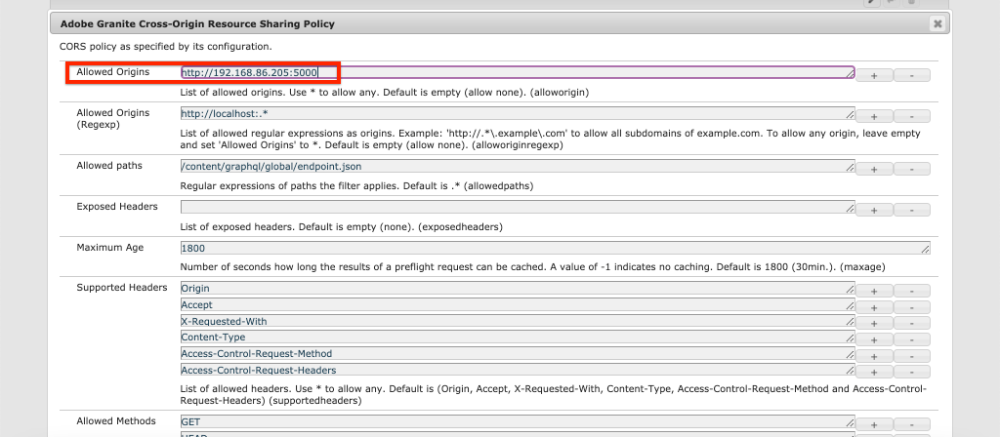

# Implementatie van productie met een AEM publicatieservice

In deze zelfstudie stelt u een lokale omgeving in om inhoud te simuleren die wordt gedistribueerd van een instantie Auteur naar een instantie Publish. U genereert ook een productiebuild van een React-app die is geconfigureerd om inhoud te verbruiken vanuit de AEM-publicatieomgeving met behulp van de GraphQL API&#39;s. Langs de manier, zult u leren hoe te om milieuvariabelen effectief te gebruiken en hoe te om de configuraties van AEM CORS bij te werken.

## Vereisten

Deze zelfstudie maakt deel uit van een meerdelige zelfstudie. Aangenomen wordt dat de in de vorige delen beschreven stappen zijn voltooid.

## Doelstellingen

Leer hoe u:

* Begrijp de AEM Auteur en publiceer architectuur.
* Leer beste praktijken voor het beheren van omgevingsvariabelen.
* Leer hoe u AEM voor het delen van bronnen tussen verschillende oorsprong (CORS) correct configureert.

## Implementatiepatroon voor auteur publiceren {#deployment-pattern}

Een volledige AEM omgeving bestaat uit een Auteur, Publish en Dispatcher. In deze service maken, beheren en voorvertonen interne gebruikers inhoud. De publicatieservice wordt beschouwd als de &quot;live&quot;-omgeving en is doorgaans de omgeving waarmee eindgebruikers werken. Inhoud wordt na bewerking en goedkeuring in de service Auteur gedistribueerd naar de service Publiceren.

Het gemeenschappelijkste plaatsingspatroon met AEM hoofdloze toepassingen moet de productieversie van de toepassing hebben met de AEM publicatieservice verbinden.


Het diagram hierboven toont dit gemeenschappelijke plaatsingspatroon.

1. A **Inhoudsauteur** gebruikt de AEM-auteurservice voor het maken, bewerken en beheren van inhoud.
2. De **Inhoudsauteur** en andere interne gebruikers kunnen de inhoud rechtstreeks op de service Auteur voorvertonen. Er kan een voorvertoningsversie van de toepassing worden ingesteld die verbinding maakt met de service Auteur.
3. Nadat de inhoud is goedgekeurd, kan deze **gepubliceerd** naar de AEM publicatieservice.
4. **Eindgebruikers** de productieversie van de toepassing beïnvloeden. De productietoepassing maakt verbinding met de publicatieservice en gebruikt de GraphQL API&#39;s om inhoud aan te vragen en te gebruiken.

De zelfstudie simuleert de bovenstaande implementatie door een AEM Publish-instantie toe te voegen aan de huidige installatie. In vorige hoofdstukken werkte de React App als voorproef door rechtstreeks met de instantie van de Auteur te verbinden. Een productie bouwt van React App wordt opgesteld aan een statische server Node.js die met de nieuwe Publish instantie verbindt.

Uiteindelijk worden drie lokale servers uitgevoerd:

* http://localhost:4502 - Auteur-instantie
* http://localhost:4503 - Instantie publiceren
* http://localhost:5000 - React App in productiemodus, verbindend met de Publish instantie.

## AEM SDK installeren - Publicatiemodus {#aem-sdk-publish}

Er is momenteel een actieve versie van de SDK in **Auteur** -modus. De SDK kan ook worden gestart in **Publiceren** om een AEM publicatieomgeving te simuleren.

Een meer gedetailleerde gids voor het opzetten van een lokale ontwikkelomgeving [hier te vinden](https://experienceleague.adobe.com/docs/experience-manager-learn/cloud-service/local-development-environment-set-up/overview.html?lang=en#local-development-environment-set-up).

1. Maak in uw lokale bestandssysteem een specifieke map voor de installatie van de instantie Publiceren, die een naam heeft `~/aem-sdk/publish`.
1. Kopieer het QuickStart-jar-bestand dat in vorige hoofdstukken voor de instantie Auteur is gebruikt en plak het in het dialoogvenster `publish` directory. U kunt ook naar de [Software Distribution Portal](https://experience.adobe.com/#/downloads/content/software-distribution/en/aemcloud.html) en download de nieuwste SDK en extraheer het QuickStart-jar-bestand.
1. De naam van het jar-bestand wijzigen in `aem-publish-p4503.jar`.

   De `publish` tekenreeks geeft aan dat de Quickstart-jar begint in de publicatiemodus. De `p4503` Geeft aan dat de Quickstart-server wordt uitgevoerd op poort 4503.

1. Open een nieuw terminalvenster en navigeer naar de map die het jar-bestand bevat. Installeer en start de AEM-instantie:

   ```shell
   $ cd ~/aem-sdk/publish
   $ java -jar aem-publish-p4503.jar
   ```

1. Een beheerderswachtwoord opgeven als `admin`. Om het even welk admin wachtwoord is aanvaardbaar, nochtans wordt het geadviseerd om het gebrek voor lokale ontwikkeling te gebruiken om extra configuraties te vermijden.
1. Wanneer het AEM-exemplaar is geïnstalleerd, wordt een nieuw browservenster geopend op [http://localhost:4503/content.html](http://localhost:4503/content.html)

   De verwachting is dat deze een pagina van 404 niet gevonden retourneert. Dit is een gloednieuw AEM-exemplaar en er is geen inhoud geïnstalleerd.

## Voorbeeldinhoud en GraphQL-eindpunten installeren {#wknd-site-content-endpoints}

Net als bij de instantie Auteur moet de instantie Publiceren de GraphQL-eindpunten hebben ingeschakeld en voorbeeldinhoud nodig hebben. Installeer vervolgens de WKND Reference Site op de instantie Publish.

1. Download het nieuwste gecompileerde AEM Package voor WKND Site: [aem-guides-wknd.all-x.x.x.zip](https://github.com/adobe/aem-guides-wknd/releases/latest).

   >[!NOTE]
   >
   > Zorg ervoor dat de standaardversie compatibel is met AEM as a Cloud Service en **niet** de `classic` versie.

1. Meld u aan bij de instantie Publiceren door rechtstreeks naar: [http://localhost:4503/libs/granite/core/content/login.html](http://localhost:4503/libs/granite/core/content/login.html) met de gebruikersnaam `admin` en wachtwoord `admin`.
1. Navigeer vervolgens naar Package Manager op [http://localhost:4503/crx/packmgr/index.jsp](http://localhost:4503/crx/packmgr/index.jsp).
1. Klikken **Pakket uploaden** en kiest u het WKND-pakket dat u in de vorige stap hebt gedownload. Klikken **Installeren** het pakket installeren.
1. Na de installatie van het pakket is de WKND-referentiesite nu beschikbaar op [http://localhost:4503/content/wknd/us/en.html](http://localhost:4503/content/wknd/us/en.html).
1. Afmelden als de `admin` door op de knop Afmelden op de menubalk te klikken.

   

   In tegenstelling tot de AEM instantie Auteur worden in de AEM Publish-instanties anonieme alleen-lezen toegang standaard ingesteld. Wij willen de ervaring van een anonieme gebruiker wanneer het runnen van de React toepassing simuleren.

## Omgevingsvariabelen bijwerken om naar de instantie Publiceren te verwijzen {#react-app-publish}

Werk vervolgens de omgevingsvariabelen bij die door de toepassing React worden gebruikt om naar de instantie Publish te verwijzen. De React App zou moeten **alleen** Maak verbinding met de instantie Publiceren in de productiemodus.

Voeg vervolgens een nieuw bestand toe `.env.production.local` om de ervaring met de productie te simuleren.

1. Open de WKND GraphQL React-app in uw IDE.

1. Beneath `aem-guides-wknd-graphql/react-app`, voegt u een bestand met de naam `.env.production.local`.
1. Vullen `.env.production.local` met het volgende:

   ```plain
   REACT_APP_HOST_URI=http://localhost:4503
   REACT_APP_GRAPHQL_ENDPOINT=/content/graphql/global/endpoint.json
   ```

   

   Met behulp van omgevingsvariabelen kunt u eenvoudig het GraphQL-eindpunt tussen een auteur- of publicatieomgeving schakelen zonder extra logica toe te voegen in de toepassingscode. Meer informatie over [Hier vindt u aangepaste omgevingsvariabelen voor React](https://create-react-app.dev/docs/adding-custom-environment-variables).

   >[!NOTE]
   >
   > Merk op dat geen authentificatieinformatie inbegrepen is aangezien de Publish milieu&#39;s anonieme toegang tot inhoud door gebrek verlenen.

## Een statische Node-server implementeren {#static-server}

De React-app kan worden gestart met behulp van de webpack-server, maar dit is alleen voor ontwikkeling. Daarna, simuleer een productiesplaatsing door te gebruiken [serveren](https://github.com/vercel/serve) om een productiebuild van de React-app te hosten met Node.js.

1. Open een nieuw terminalvenster en ga naar het `aem-guides-wknd-graphql/react-app` directory

   ```shell
   $ cd aem-guides-wknd-graphql/react-app
   ```

1. Installeren [serveren](https://github.com/vercel/serve) met de volgende opdracht:

   ```shell
   $ npm install serve --save-dev
   ```

1. Het bestand openen `package.json` om `react-app/package.json`. Een script toevoegen met de naam `serve`:

   ```diff
    "scripts": {
       "start": "react-scripts start",
       "build": "react-scripts build",
       "test": "react-scripts test",
       "eject": "react-scripts eject",
   +   "serve": "npm run build && serve -s build"
   },
   ```

   De `serve` -script voert twee handelingen uit. Ten eerste wordt een productiebuild van de React App gegenereerd. Ten tweede, begint de server Node.js en gebruikt de productie bouwt.

1. Terugkeer aan de terminal en ga het bevel in om de statische server te beginnen:

   ```shell
   $ npm run serve
   
   ┌────────────────────────────────────────────────────┐
   │                                                    │
   │   Serving!                                         │
   │                                                    │
   │   - Local:            http://localhost:5000        │
   │   - On Your Network:  http://192.168.86.111:5000   │
   │                                                    │
   │   Copied local address to clipboard!               │
   │                                                    │
   └────────────────────────────────────────────────────┘
   ```

1. Een nieuwe browser openen en naar [http://localhost:5000/](http://localhost:5000/). De React App moet worden weergegeven.

   

   De GraphQL-query werkt op de homepage. Inspect the **XHR** aanvragen met gebruik van de ontwikkelaarsgereedschappen. Merk op dat de POST van GraphQL op de Publish instantie is `http://localhost:4503/content/graphql/global/endpoint.json`.

   Alle afbeeldingen worden echter wel afgebroken op de startpagina!

1. Klik in één van de pagina&#39;s van het Detail van het avontuur.

   

   Er wordt een GraphQL-fout gegenereerd voor `adventureContributor`. In de volgende oefeningen, de gebroken beelden en `adventureContributor` problemen zijn opgelost.

## Absolute verwijzingen naar afbeeldingen {#absolute-image-references}

De afbeeldingen worden verbroken weergegeven omdat de `` tag:

   ```diff
   - 
   + 
   ```

1. Het bestand openen `AdventureDetail.js` om `react-app/src/components/AdventureDetail.js`.
1. Herhaal dezelfde stappen om de GraphQL-query te wijzigen en de `_publishUrl` bezit voor het avontuur

   ```diff
    adventureByPath (_path: "${_path}") {
       item {
           _path
           adventureTitle
           adventureActivity
           adventureType
           adventurePrice
           adventureTripLength
           adventureGroupSize
           adventureDifficulty
           adventurePrice
           adventurePrimaryImage {
               ... on ImageRef {
               _path
   +           _publishUrl
               mimeType
               width
               height
               }
           }
           adventureDescription {
               html
           }
           adventureItinerary {
               html
           }
           adventureContributor {
               fullName
               occupation
               pictureReference {
                   ...on ImageRef {
                       _path
   +                   _publishUrl
                   }
               }
           }
       }
       }
   } 
   ```

1. De twee opties wijzigen `` -tags voor de primaire afbeelding van het avontuur en de naslaggids voor de bijdrager in `AdventureDetail.js`:

   ```diff
   /* AdventureDetail.js */
   ...
   
   ...
   pictureReference =  
   ```

1. Terugkeer aan de terminal en begin de statische server:

   ```shell
   $ npm run serve
   ```

1. Navigeren naar [http://localhost:5000/](http://localhost:5000/) en ziet u dat er afbeeldingen worden weergegeven en dat de `` kenmerkpunten naar `http://localhost:4503`.

   

## Publiceren van inhoud simuleren {#content-publish}

Er wordt een GraphQL-fout gegenereerd `adventureContributor` wanneer een pagina van de Details van het Avontuur wordt gevraagd. De **Medewerker** Inhoudsfragmentmodel bestaat nog niet in de instantie Publiceren. Updates van de **Adventure** Content Fragment Model is ook niet beschikbaar in de instantie Publish. Deze wijzigingen zijn rechtstreeks aangebracht in de instantie Auteur en moeten worden verspreid naar de instantie Publiceren.

Dit is iets waarmee u rekening moet houden wanneer u nieuwe updates wilt uitvoeren voor een toepassing die afhankelijk is van updates van een inhoudsfragment of een inhoudsfragmentmodel.

Vervolgens kunt u het publiceren van inhoud simuleren tussen de lokale auteur- en publicatie-instanties.

1. Start de instantie Auteur (indien nog niet gestart) en navigeer naar Package Manager op [http://localhost:4502/crx/packmgr/index.jsp](http://localhost:4502/crx/packmgr/index.jsp)
1. Het pakket downloaden [EnableReplicationAgent.zip](./assets/publish-deployment/EnableReplicationAgent.zip) en installeer deze met Package Manager.

   Met dit pakket wordt een configuratie geïnstalleerd waarmee de instantie Auteur inhoud kan publiceren naar de instantie Publiceren. Handmatige stappen voor [deze configuratie is hier te vinden](https://experienceleague.adobe.com/docs/experience-manager-learn/cloud-service/local-development-environment-set-up/aem-runtime.html?lang=en#content-distribution).

   >[!NOTE]
   >
   > In een AEM as a Cloud Service omgeving wordt de laag Auteur automatisch ingesteld op het distribueren van inhoud naar de laag Publiceren.

1. Van de **AEM starten** menu, navigeren naar **Gereedschappen** > **Activa** > **Modellen van inhoudsfragmenten**.

1. Klik in het dialoogvenster **WKND-site** map.

1. Selecteer alle drie de modellen en klik **Publiceren**:

   

   Er verschijnt een bevestigingsvenster en klik op **Publiceren**.

1. Navigeer naar het Bali Surf Camp Content Fragment bij [http://localhost:4502/editor.html/content/dam/wknd/en/adventures/bali-surf-camp/bali-surf-camp](http://localhost:4502/editor.html/content/dam/wknd/en/adventures/bali-surf-camp/bali-surf-camp).

1. Klik op de knop **Publiceren** in de bovenste menubalk.

   

1. De wizard Publiceren toont alle afhankelijke elementen die moeten worden gepubliceerd. In dit geval wordt het fragment waarnaar wordt verwezen **stapelroswellen** wordt weergegeven en er wordt ook naar verschillende afbeeldingen verwezen. De middelen waarnaar wordt verwezen, worden samen met het fragment gepubliceerd.

   

   Klik op de knop **Publiceren** nogmaals klikken om het inhoudsfragment en afhankelijke elementen te publiceren.

1. Terug naar de React-app die wordt uitgevoerd op [http://localhost:5000/](http://localhost:5000/). U kunt nu in de Camp van Bali Surf klikken om de avontuurdetails te zien.

1. Ga terug naar de AEM Author-instantie op [http://localhost:4502/editor.html/content/dam/wknd/en/adventures/bali-surf-camp/bali-surf-camp](http://localhost:4502/editor.html/content/dam/wknd/en/adventures/bali-surf-camp/bali-surf-camp) en de **Titel** van het fragment. **Opslaan en sluiten** het fragment. Vervolgens **publish** het fragment.
1. Terug naar [http://localhost:5000/adventure:/content/dam/wknd/en/adventures/bali-surf-camp/bali-surf-camp](http://localhost:5000/adventure:/content/dam/wknd/en/adventures/bali-surf-camp/bali-surf-camp) en de gepubliceerde wijzigingen in acht te nemen.

   

## COR-configuratie bijwerken

AEM is standaard beveiligd en staat niet toe dat niet-AEM wegeigenschappen aanroepen aan de clientzijde uitvoeren. AEM configuratie het Delen van het Middel van de Cross-Origin (CORS) kan specifieke domeinen toestaan om vraag aan AEM te maken.

Experimenteer vervolgens met de CORS-configuratie van de AEM Publish-instantie.

1. Terugkeer aan het eindvenster waar React App met het bevel loopt `npm run serve`:

   ```shell
   ┌────────────────────────────────────────────────────┐
   │                                                    │
   │   Serving!                                         │
   │                                                    │
   │   - Local:            http://localhost:5000        │
   │   - On Your Network:  http://192.168.86.205:5000   │
   │                                                    │
   │   Copied local address to clipboard!               │
   │                                                    │
   └────────────────────────────────────────────────────┘
   ```

   Controleer of er twee URL&#39;s zijn opgegeven. Eén met `localhost` en een andere die het lokale netwerkIP adres gebruiken.

1. Navigeer naar het adres dat begint met [http://192.168.86.XXX:5000](http://192.168.86.XXX:5000). Het adres is iets verschillend voor elke lokale computer. Merk op dat er een fout CORS wanneer het halen van de gegevens is. Dit is omdat de huidige configuratie CORS slechts verzoeken van toestaat `localhost`.

   

   Werk vervolgens de AEM configuratie voor het publiceren van CORS bij om aanvragen van het IP-adres van het netwerk toe te staan.

1. Navigeren naar [http://localhost:4503/content/wknd/us/en/errors/sign-in.html](http://localhost:4503/content/wknd/us/en/errors/sign-in.html) en aanmelden met de gebruikersnaam `admin` en wachtwoord `admin`.

1. Navigeren naar [http://localhost:4503/system/console/configMgr](http://localhost:4503/system/console/configMgr) en zoek de WKND GraphQL-configuratie op `com.adobe.granite.cors.impl.CORSPolicyImpl~wknd-graphql`.

1. Werk de **Toegestane oorsprong** gebied om het netwerkIP adres te omvatten:

   

   Het is ook mogelijk een reguliere expressie op te nemen om alle aanvragen van een specifiek subdomein toe te staan. Sla de wijzigingen op.

1. Zoeken naar **Filter Apache Sling Referrer** en bekijk de configuratie. De **Lege waarden toestaan** De configuratie is ook nodig om GraphQL-aanvragen van een extern domein in te schakelen.

   

   Deze zijn gevormd als deel van de WKND verwijzingsplaats. U kunt de volledige reeks configuraties OSGi via bekijken [de GitHub-opslagplaats](https://github.com/adobe/aem-guides-wknd/tree/master/ui.config/src/main/content/jcr_root/apps/wknd/osgiconfig).

   >[!NOTE]
   >
   > De configuraties OSGi worden beheerd in een AEM project dat aan broncontrole wordt geëngageerd. Met Cloud Manager kunt u een AEM-project implementeren om AEM te maken als een Cloud Service. De [Projectarchetype AEM](https://github.com/adobe/aem-project-archetype) kan helpen een project voor een specifieke implementatie te produceren.

1. Terug naar de React-app die begint met [http://192.168.86.XXX:5000](http://192.168.86.XXX:5000) en merk op dat de toepassing niet meer een fout CORS veroorzaakt.

   

## Gefeliciteerd! {#congratulations}

Gefeliciteerd! U hebt nu een volledige productieplaatsing gesimuleerd gebruikend een AEM publiceer milieu. U leerde ook hoe te om de configuratie CORS in AEM te gebruiken.

## Overige bronnen

Zie de volgende bronnen voor meer informatie over Content Fragments en GraphQL:

* [Levering van inhoud zonder kop met gebruik van inhoudsfragmenten met GraphQL](https://experienceleague.adobe.com/docs/experience-manager-cloud-service/assets/content-fragments/content-fragments-graphql.html)
* [GraphQL API AEM voor gebruik met inhoudsfragmenten](https://experienceleague.adobe.com/docs/experience-manager-cloud-service/assets/admin/graphql-api-content-fragments.html)
* [Verificatie op basis van token](https://experienceleague.adobe.com/docs/experience-manager-learn/getting-started-with-aem-headless/authentication/overview.html?lang=en#authentication)
* [Code implementeren om as a Cloud Service te AEM](https://experienceleague.adobe.com/docs/experience-manager-learn/cloud-service/cloud-manager/devops/deploy-code.html?lang=en#cloud-manager)
