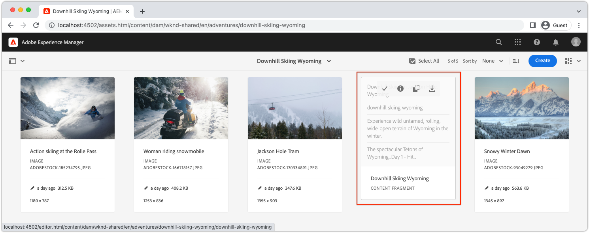

# Snelle installatie AEM zonder koppen met de lokale AEM SDK {#setup}

Met de snelle installatie zonder AEM Headless kunt u de inhoud in de praktijk brengen met AEM Headless via inhoud van het WKND-voorbeeldproject Site en een voorbeeldtoepassing React (een SPA) die de inhoud gebruikt boven AEM Headless GraphQL API&#39;s. Deze handleiding gebruikt de [AS A CLOUD SERVICE SDK AEM](https://experienceleague.adobe.com/docs/experience-manager-cloud-service/content/implementing/developing/aem-as-a-cloud-service-sdk.html).

## Vereisten {#prerequisites}

De volgende gereedschappen moeten lokaal worden geïnstalleerd:

* [11 JDK](https://experience.adobe.com/#/downloads/content/software-distribution/en/general.html?1_group.propertyvalues.property=.%2Fjcr%3Acontent%2Fmetadata%2Fdc%3AsoftwareType&amp;1_group.propertyvalues.operation=equals&amp;1_group.propertyvalues.0_values=software-type%3Atooling&amp;fulltext=Oracle%7E+JDK%7E+11%7E&amp;orderby=%40jcr%3Acontent%2 Fjcr%3AlastModified&amp;orderby.sort=desc&amp;layout=list&amp;p.offset=0&amp;p.limit=14)
* [Node.js v18](https://nodejs.org/en/)
* [Git](https://git-scm.com/)

## 1. Installeer de AEM SDK {#aem-sdk}

Deze instelling gebruikt de instelling [AS A CLOUD SERVICE SDK AEM](https://experienceleague.adobe.com/docs/experience-manager-cloud-service/implementing/developing/aem-as-a-cloud-service-sdk.html?#aem-as-a-cloud-service-sdk) voor het verkennen van AEM GraphQL API&#39;s. In deze sectie vindt u een snelle handleiding voor het installeren van de AEM SDK en het uitvoeren ervan in de modus Auteur. Een meer gedetailleerde gids voor het opzetten van een lokale ontwikkelomgeving [hier te vinden](https://experienceleague.adobe.com/docs/experience-manager-learn/cloud-service/local-development-environment-set-up/overview.html#local-development-environment-set-up).

>[!NOTE]
>
> Het is ook mogelijk de zelfstudie te volgen met een [AEM as a Cloud Service omgeving](./cloud-service.md). De zelfstudie bevat aanvullende notities voor het gebruik van een Cloud-omgeving.

1. Ga naar de **[Software Distribution Portal](https://experience.adobe.com/#/downloads/content/software-distribution/en/aemcloud.html?fulltext=AEM*+SDK*&amp;orderby=%40jcr%3Acontent%2Fjcr%3AlastModified&amp;orderby.sort=desc&amp;layout=list&amp;p.offset=0&amp;p.limit=1)** > **AEM as a Cloud Service** en download de nieuwste versie van de **AEM SDK**.

   

1. Pak het downloaden uit en kopieer de QuickStart-jar (`aem-sdk-quickstart-XXX.jar`) naar een specifieke map, d.w.z. `~/aem-sdk/author`.
1. De naam van het jar-bestand wijzigen in `aem-author-p4502.jar`.

   De `author` name specifies that the Quickstart jar start in Author mode. De `p4502` Geeft de QuickStart-uitvoering aan op poort 4502.

1. Als u de AEM wilt installeren en starten, opent u een opdrachtprompt in de map met het jar-bestand en voert u de volgende opdracht uit:

   ```shell
   $ cd ~/aem-sdk/author
   $ java -jar aem-author-p4502.jar
   ```

1. Een beheerderswachtwoord opgeven als `admin`. Om het even welk admin wachtwoord is aanvaardbaar, nochtans wordt het geadviseerd om te gebruiken `admin` voor lokale ontwikkeling om de noodzaak van een nieuwe configuratie te verminderen.
1. Wanneer de AEM-service is geïnstalleerd, wordt een nieuw browservenster geopend op [http://localhost:4502](http://localhost:4502).
1. Aanmelden met de gebruikersnaam `admin` en het wachtwoord dat tijdens AEM eerste opstarten is geselecteerd (gewoonlijk `admin`).

## 2. Voorbeeldinhoud installeren {#install-sample-content}

Voorbeeldinhoud uit de **WKND-referentiesite** wordt gebruikt om de zelfstudie te versnellen. De WKND is een fictief levensstijl, vaak gebruikt bij AEM training.

De WKND-site bevat configuraties die vereist zijn om een [GraphQL-eindpunt](https://experienceleague.adobe.com/docs/experience-manager-cloud-service/content/headless/graphql-api/content-fragments.html). In een implementatie in de praktijk, volg de gedocumenteerde stappen aan [inclusief de eindpunten van GraphQL](https://experienceleague.adobe.com/docs/experience-manager-cloud-service/content/headless/graphql-api/content-fragments.html) in uw klantenproject. A [CORS](#cors-config) is ook verpakt als onderdeel van de WKND-site. Een configuratie CORS wordt vereist om toegang tot een externe toepassing te verlenen, meer informatie over [CORS](#cors-config) vindt u hieronder.

1. Download het nieuwste gecompileerde AEM Package voor WKND Site: [aem-guides-wknd.all-x.x.x.zip](https://github.com/adobe/aem-guides-wknd/releases/latest).

   >[!NOTE]
   >
   > Zorg ervoor dat de standaardversie compatibel is met AEM as a Cloud Service en **niet** de `classic` versie.

1. Van de **AEM starten** menu, navigeren naar **Gereedschappen** > **Implementatie** > **Pakketten**.

   

1. Klikken **Pakket uploaden** en kiest u het WKND-pakket dat u in de vorige stap hebt gedownload. Klikken **Installeren** het pakket installeren.

1. Van de **AEM starten** menu, navigeren naar **Activa** > **Bestanden** > **WKND gedeeld** > **Engels** > **avonturen**.

   

   Dit is een map met alle middelen die bestaan uit de verschillende avonturen die door het WKND-merk worden bevorderd. Dit omvat traditionele mediatypen zoals afbeeldingen en video en media die specifiek zijn voor AEM **Inhoudsfragmenten**.

1. Klik in het dialoogvenster **Downhill Skiing Wyoming** en klik op de knop **Wyoming-inhoudsfragment afnemen** kaart:

   

1. De redacteur van het Fragment van de Inhoud opent voor het Downhill Scheidend Wyoming adventure.

   

   Houd er rekening mee dat verschillende velden, zoals **Titel**, **Beschrijving**, en **Activiteit** het fragment definiëren.

   **Inhoudsfragmenten** Dit is een van de manieren waarop inhoud in AEM kan worden beheerd. Inhoudsfragment is herbruikbaar, presentatie-agnostische inhoud die bestaat uit gestructureerde gegevenselementen zoals tekst, tekst met opmaak, datums of verwijzingen naar andere inhoudsfragmenten. Inhoudsfragmenten worden later in de snelle installatie gedetailleerder onderzocht.

1. Klikken **Annuleren** om het fragment te sluiten. U kunt vrij navigeren in sommige andere mappen en de andere Adventure-inhoud verkennen.

>[!NOTE]
>
> Als het gebruiken van een milieu van de Cloud Service zie de documentatie voor hoe te [Stel een codebasis zoals de plaats van de Verwijzing WKND aan een milieu van de Cloud Service op](https://experienceleague.adobe.com/docs/experience-manager-cloud-service/implementing/deploying/overview.html#coding-against-the-right-aem-version).

## 3. Download en voer de WKND React-app uit {#sample-app}

Een van de doelstellingen van deze zelfstudie is om te tonen hoe u AEM inhoud van een externe toepassing kunt gebruiken met de GraphQL API&#39;s. In deze zelfstudie wordt een voorbeeld van React App gebruikt. De React-app is opzettelijk eenvoudig en richt zich op de integratie met AEM GraphQL-API&#39;s.

1. Open een nieuwe bevelherinnering en kloon de steekproef React app van GitHub:

   ```shell
   $ git clone git@github.com:adobe/aem-guides-wknd-graphql.git
   $ cd aem-guides-wknd-graphql/react-app
   ```

1. De React-app openen in `aem-guides-wknd-graphql/react-app` in uw IDE van keuze.
1. Open het bestand in de IDE `.env.development` om `/.env.development`. Controleer de `REACT_APP_AUTHORIZATION` regel bevat geen opmerkingen en het bestand declareert de volgende variabelen:

   ```plain
   REACT_APP_HOST_URI=http://localhost:4502
   REACT_APP_GRAPHQL_ENDPOINT=/content/graphql/global/endpoint.json
   # Use Authorization when connecting to an AEM Author environment
   REACT_APP_AUTHORIZATION=admin:admin
   ```

   Zorgen `REACT_APP_HOST_URI` verwijst naar uw lokale AEM SDK. Voor het gemak wordt met deze snelle start de React-app verbonden met  **AEM auteur**. **Auteur** voor services is verificatie vereist, zodat de app de `admin` gebruiker om verbinding te maken. Het is gebruikelijk om tijdens de ontwikkeling een app te verbinden met AEM auteur, omdat dit het snel doorlopen van inhoud zonder dat wijzigingen hoeven te worden gepubliceerd vergemakkelijkt.

   >[!NOTE]
   >
   > In een productiescenario zal de App met een AEM verbinden **Publiceren** milieu. Dit wordt meer in detail besproken in het _Implementatie van productie_ sectie.


1. Installeer en start de React-app:

   ```shell
   $ cd aem-guides-wknd-graphql/react-app
   $ npm install
   $ npm start
   ```

1. De app wordt automatisch geopend in een nieuw browservenster [http://localhost:3000](http://localhost:3000).

   

   Er wordt een lijst met de avontuurlijke inhoud van AEM weergegeven.

1. Klik op een van de avontuurafbeeldingen om de details van het avontuur weer te geven. Er wordt een verzoek ingediend om AEM de details voor een avontuur te retourneren.

   

1. Gebruik de ontwikkelaarsgereedschappen van de browser om de **Netwerk** verzoeken. De weergave **XHR** verzoeken en nemen meerdere verzoeken van GET in acht `/graphql/execute.json/...`. Dit wegvoorvoegsel roept AEM voortgeduurde vraageindpunt aan, die de voortgeduurde uit te voeren vraag selecteren gebruikend de naam en gecodeerde parameters na de prefix.

   

## 4. Inhoud bewerken in AEM

Zorg dat de React-app actief is en werk de inhoud bij in de AEM en controleer of deze wijziging in de app wordt doorgevoerd.

1. Navigeren naar AEM [http://localhost:4502](http://localhost:4502).
1. Navigeren naar **Activa** > **Bestanden** > **WKND gedeeld** > **Engels** > **avonturen** > **[Bali Surf Camp](http://localhost:4502/assets.html/content/dam/wknd-shared/en/adventures/bali-surf-camp)**.

   

1. Klik in het dialoogvenster **Bali Surf Camp** inhoudfragment om de editor voor inhoudsfragmenten te openen.
1. Wijzig de **Titel** en de **Beschrijving** van het avontuur.

   

1. Klikken **Opslaan** om de wijzigingen op te slaan
1. De React-app vernieuwen op [http://localhost:3000](http://localhost:3000) om uw wijzigingen te zien:

   

## 5. Ontdek GraphiQL {#graphiql}

1. Openen [GraphiQL](http://localhost:4502/aem/graphiql.html) door naar **Gereedschappen** > **Algemeen** > **GraphQL Query-editor**
1. Selecteer bestaande voortgeduurde vragen op de linkerzijde, en stel hen in werking om de resultaten te zien.

   >[!NOTE]
   >
   > Het gereedschap GraphiQL en de GraphQL API zijn [later in de zelfstudie in detail besproken](../multi-step/explore-graphql-api.md).

## Gefeliciteerd!{#congratulations}

U hebt nu een externe toepassing die AEM inhoud verbruikt met GraphQL. U kunt de code in de app React bekijken en blijven experimenteren met het wijzigen van bestaande inhoudsfragmenten.

### Volgende stappen

* [Zelfstudie voor AEM zonder koppen starten](../multi-step/overview.md)
