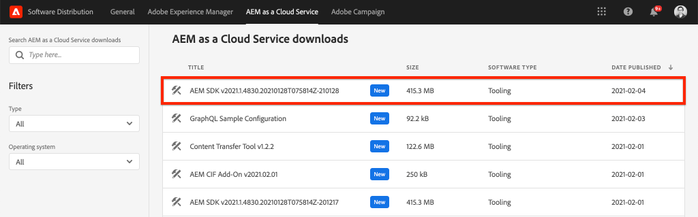

# Snelle installatie AEM zonder koppen met de lokale SDK {#setup}

Met de snelle installatie zonder AEM Headless kunt u de inhoud in de praktijk brengen met AEM Headless via inhoud van het WKND-sitevoorbeeldproject en een voorbeeldtoepassing React (een SPA) die de inhoud gebruikt in AEM Headless GraphQL API&#39;s. Deze handleiding gebruikt de [as a Cloud Service SDK AEM](https://experienceleague.adobe.com/docs/experience-manager-cloud-service/implementing/developing/aem-as-a-cloud-service-sdk.html?lang=en#aem-as-a-cloud-service-sdk).

## Vereisten {#prerequisites}

De volgende gereedschappen moeten lokaal worden geïnstalleerd:

* [11 JDK](https://experience.adobe.com/#/downloads/content/software-distribution/en/general.html?1_group.propertyvalues.property=.%2Fjcr%3Acontent%2Fmetadata%2Fdc%3AsoftwareType&amp;1_group.propertyvalues.operation=equals&amp;1_group.propertyvalues.0_values=software-type%3Atooling&amp;fulltext=Oracle%7E+JDK%7E+11%7E&amp;orderby=%40jcr%3Acontent%2 Fjcr%3AlastModified&amp;orderby.sort=desc&amp;layout=list&amp;p.offset=0&amp;p.limit=14)
* [Node.js v10+](https://nodejs.org/en/)
* [npm 6+](https://www.npmjs.com/)
* [Git](https://git-scm.com/)

## 1. De AEM SDK installeren {#aem-sdk}

Deze instelling gebruikt de instelling [as a Cloud Service SDK AEM](https://experienceleague.adobe.com/docs/experience-manager-cloud-service/implementing/developing/aem-as-a-cloud-service-sdk.html?lang=en#aem-as-a-cloud-service-sdk) om AEM GraphQL APIs te onderzoeken. In deze sectie vindt u een snelle handleiding voor het installeren van de AEM SDK en het uitvoeren ervan in de modus Auteur. Een meer gedetailleerde gids voor het opzetten van een lokale ontwikkelomgeving [hier te vinden](https://experienceleague.adobe.com/docs/experience-manager-learn/cloud-service/local-development-environment-set-up/overview.html?lang=en#local-development-environment-set-up).

>[!NOTE]
>
> Het is ook mogelijk de zelfstudie te volgen met een [AEM as a Cloud Service omgeving](./cloud-service.md). De zelfstudie bevat aanvullende notities voor het gebruik van een Cloud-omgeving.

1. Ga naar de **[Software Distribution Portal](https://experience.adobe.com/#/downloads/content/software-distribution/en/aemcloud.html)** > **AEM as a Cloud Service** en download de nieuwste versie van de **AEM SDK**.

   

   >[!CAUTION]
   >
   > De eigenschap GraphQL wordt toegelaten door gebrek slechts op AEM SDK van 2021-02-04 of nieuwer.

1. Pak het downloaden uit en kopieer de QuickStart-jar (`aem-sdk-quickstart-XXX.jar`) naar een specifieke map, d.w.z. `~/aem-sdk/author`.
1. Geef het jar-bestand een nieuwe naam `aem-author-p4502.jar`.

   De `author` name specifies that the Quickstart jar will start in Author mode. De `p4502` Geeft aan dat de Quickstart-server wordt uitgevoerd op poort 4502.

1. Open een nieuw terminalvenster en navigeer naar de map die het jar-bestand bevat. Voer de volgende opdracht uit om de AEM te installeren en te starten:

   ```shell
   $ cd ~/aem-sdk/author
   $ java -jar aem-author-p4502.jar
   ```

1. Een beheerderswachtwoord opgeven als `admin`. Om het even welk admin wachtwoord is aanvaardbaar, nochtans adviseert zijn gebruik `admin` voor lokale ontwikkeling om de noodzaak om opnieuw te configureren te verminderen.
1. Na een paar minuten zal de AEM-instantie klaar zijn met installeren en een nieuw browservenster moet worden geopend om [http://localhost:4502](http://localhost:4502).
1. Aanmelden met de gebruikersnaam `admin` en het wachtwoord dat tijdens AEM eerste opstarten is geselecteerd (gewoonlijk `admin`).

## 2. WKND-voorbeeldinhoud installeren {#wknd-site-content}

Voorbeeldinhoud uit de **WKND-referentiesite** wordt geïnstalleerd om de zelfstudie te versnellen. De WKND is een fictief levensstijl, vaak gebruikt in combinatie met AEM training.

De WKND-verwijzingssite bevat configuraties die nodig zijn om een [GraphQL-eindpunt](https://experienceleague.adobe.com/docs/experience-manager-cloud-service/assets/admin/graphql-api-content-fragments.html?lang=en#graphql-aem-endpoint). In een echte implementatie voert u de gedocumenteerde stappen uit om [include the GraphQL endpoints](https://experienceleague.adobe.com/docs/experience-manager-cloud-service/assets/admin/graphql-api-content-fragments.html?lang=en#graphql-aem-endpoint) in uw klantenproject. A [CORS](#cors-config) is ook verpakt als onderdeel van de WKND-site. Een configuratie CORS is nodig om toegang tot een externe toepassing te verlenen, meer informatie over [CORS](#cors-config) vindt u hieronder.

1. Download het nieuwste gecompileerde AEM Package voor WKND Site: [aem-guides-wknd.all-x.x.x.zip](https://github.com/adobe/aem-guides-wknd/releases/latest).

   >[!NOTE]
   >
   > Zorg ervoor dat de standaardversie compatibel is met AEM as a Cloud Service en **niet** de `classic` versie.

1. Van de **AEM starten** menu navigeren naar **Gereedschappen** > **Implementatie** > **Pakketten**.

   

1. Klikken **Pakket uploaden** en kiest u het WKND-pakket dat u in de vorige stap hebt gedownload. Klikken **Installeren** om het pakket te installeren.

1. Van de **AEM starten** menu navigeren naar **Activa** > **Bestanden**.
1. Klik door de omslagen om te navigeren aan **WKND-site** > **Engels** > **avonturen**.

   

   Dit is een map met alle middelen die bestaan uit de verschillende avonturen die door het WKND-merk worden bevorderd. Dit omvat traditionele mediatypen zoals afbeeldingen en video, en media die specifiek zijn voor AEM **Inhoudsfragmenten**.

1. Klik in de **Downhill Skiing Wyoming** en klik op de knop **Wyoming-inhoudsfragment afnemen** kaart:

   

1. De gebruikersinterface van de Content Fragment Editor wordt geopend voor het Adventure van de Wyoming-methode voor het afslanken van de afgrond.

   

   Houd er rekening mee dat verschillende velden, zoals **Titel**, **Beschrijving**, en **Activiteit** definieert u het fragment.

   **Inhoudsfragmenten** Dit is een van de manieren waarop inhoud in AEM kan worden beheerd. Inhoudsfragment is herbruikbaar, presentatie-agnostische inhoud die bestaat uit gestructureerde gegevenselementen zoals tekst, tekst met opmaak, datums of verwijzingen naar andere inhoudfragmenten. Inhoudsfragmenten worden later in de zelfstudie gedetailleerder onderzocht.

1. Klikken **Annuleren** om het fragment te sluiten. U kunt vrij navigeren in sommige andere mappen en de andere Adventure-inhoud verkennen.

>[!NOTE]
>
> Als het gebruiken van een milieu van de Cloud Service zie de documentatie voor hoe te [Stel een codebasis zoals de plaats van de Verwijzing WKND aan een milieu van de Cloud Service op](https://experienceleague.adobe.com/docs/experience-manager-cloud-service/implementing/deploying/overview.html?lang=en#coding-against-the-right-aem-version).

## 3. De WKND React-app downloaden en uitvoeren {#sample-app}

Één van de doelstellingen van deze zelfstudie moet tonen hoe te om AEM inhoud van een externe toepassing te verbruiken gebruikend GraphQL APIs. Deze zelfstudie gebruikt een voorbeeld React App dat gedeeltelijk is voltooid om de zelfstudie te versnellen. Dezelfde lessen en concepten gelden voor toepassingen die zijn gemaakt met iOS, Android of een ander platform. De React-app is opzettelijk eenvoudig om onnodige complexiteit te voorkomen. het is niet de bedoeling een referentie - uitvoering te zijn .

1. Open een nieuw terminalvenster en klonen de taktak van de leerprogramma&#39;s gebruikend Git:

   ```shell
   $ git clone --branch tutorial/react git@github.com:adobe/aem-guides-wknd-graphql.git
   ```

1. Open het bestand in de IDE van uw keuze `.env.development` om `aem-guides-wknd-graphql/react-app/.env.development`. Controleer of de `REACT_APP_AUTHORIZATION` De regel bevat geen opmerkingen en het bestand ziet er als volgt uit:

   ```plain
   REACT_APP_HOST_URI=http://localhost:4502
   REACT_APP_GRAPHQL_ENDPOINT=/content/graphql/global/endpoint.json
   # Use Authorization when connecting to an AEM Author environment
   REACT_APP_AUTHORIZATION=admin:admin
   ```

   Zorg ervoor dat `React_APP_HOST_URI` komt overeen met uw lokale AEM. In dit hoofdstuk verbinden we de React App rechtstreeks met de AEM **Auteur** milieu. **Auteur** Voor omgevingen is standaard verificatie vereist, zodat onze app verbinding maakt als de `admin` gebruiker. Dit is een gangbare praktijk tijdens de ontwikkeling, omdat het ons in staat stelt snel wijzigingen aan te brengen in de AEM omgeving en deze onmiddellijk in de app te bekijken.

   >[!NOTE]
   >
   > In een productiescenario zal de App met een AEM verbinden **Publiceren** milieu. Dit wordt meer in detail besproken in het _Implementatie van productie_ sectie.

1. Navigeer in de `aem-guides-wknd-graphql/react-app` map. Installeer en start de app:

   ```shell
   $ cd aem-guides-wknd-graphql/react-app
   $ npm install
   $ npm start
   ```

1. Een nieuw browservenster moet de app automatisch starten op [http://localhost:3000](http://localhost:3000).

   

   Een lijst van de huidige inhoud van het Avontuur van AEM zou moeten worden getoond.

1. Klik op een van de avontuurafbeeldingen om de details van het avontuur weer te geven. Er wordt een verzoek ingediend om AEM de details voor een avontuur te retourneren.

   

1. Gebruik de ontwikkelaarsgereedschappen van de browser om de **Netwerk** verzoeken. De weergave van **XHR** verzoeken en nemen veelvoudige verzoeken van de POST waar `/content/graphql/global/endpoint.json`, het eindpunt GraphQL dat voor AEM wordt gevormd.

   

1. U kunt de parameters en de reactie JSON ook bekijken door het netwerkverzoek te inspecteren. Het kan handig zijn om een browserextensie te installeren, zoals [GraphQL-netwerkcontrole](https://chrome.google.com/webstore/detail/graphql-network-inspector/ndlbedplllcgconngcnfmkadhokfaaln) voor Chrome om een beter inzicht in de vraag en de reactie te krijgen.

## 4. Inhoud bewerken in AEM

Nu de React-app wordt uitgevoerd, moet u de inhoud in AEM bijwerken en de wijziging in de app bekijken.

1. Navigeren naar AEM [http://localhost:4502](http://localhost:4502).
1. Navigeren naar **Activa** > **Bestanden** > **WKND-site** > **Engels** > **avonturen** > **[Bali Surf Camp](http://localhost:4502/assets.html/content/dam/wknd/en/adventures/bali-surf-camp)**.

   

1. Klik in de **Bali Surf Camp** inhoudfragment om de Inhoudsfragmenteditor te openen.
1. De **Titel** en de **Beschrijving** van het avontuur

   

1. Klikken **Opslaan** om de wijzigingen op te slaan.
1. Ga terug naar de React-app op [http://localhost:3000](http://localhost:3000) en vernieuwen om uw wijzigingen te zien:

   

## 5. Het gereedschap GraphiQL installeren {#install-graphiql}

[GraphiQL](https://github.com/graphql/graphiql) is een ontwikkelingsinstrument dat alleen nodig is voor omgevingen op een lager niveau, zoals een ontwikkelings- of lokale instantie. Met GraphiQL IDE kunt u snel de geretourneerde query&#39;s en gegevens testen en verfijnen. GraphiQL biedt ook eenvoudige toegang tot de documentatie, waardoor u gemakkelijk kunt leren welke methoden beschikbaar zijn en begrijpen.

1. Ga naar de **[Software Distribution Portal](https://experience.adobe.com/#/downloads/content/software-distribution/en/aemcloud.html)** > **AEM as a Cloud Service**.
1. Zoek naar &quot;GraphiQL&quot; (zorg ervoor dat u de **i** in **GraphiQL**.
1. Download de nieuwste **GraphiQL Content Package v.x.x.x**

   

   Het ZIP-bestand is een AEM pakket dat rechtstreeks kan worden geïnstalleerd.

1. Van de **AEM starten** menu navigeren naar **Gereedschappen** > **Implementatie** > **Pakketten**.
1. Klikken **Pakket uploaden** en kiest u het pakket dat u in de vorige stap hebt gedownload. Klikken **Installeren** om het pakket te installeren.

   
1. Navigeer aan GrahiQL winde bij [http://localhost:4502/content/graphiql.html](http://localhost:4502/content/graphiql.html) en begin met het verkennen van de GraphQL APIs.

   >[!NOTE]
   >
   > De GraphiQL-tool en GraphQL API zijn [later in de zelfstudie in detail besproken](../multi-step/explore-graphql-api.md).

## Gefeliciteerd! {#congratulations}

Gefeliciteerd, u hebt nu een externe toepassing die AEM inhoud met GraphQL verbruikt. U kunt de code in de app React bekijken en blijven experimenteren met het wijzigen van bestaande inhoudsfragmenten.

### Volgende stappen

* [Zelfstudie voor AEM zonder koppen starten](../multi-step/overview.md)

## (Bonus) Configuratie CORS {#cors-config}

AEM, die standaard beveiligd zijn, blokkeert aanvragen van verschillende oorsprong, zodat onbevoegde toepassingen geen verbinding kunnen maken met de inhoud en de inhoud ervan kunnen surfen.

Om React app van deze zelfstudie toe te staan om met AEM eindpunten van GraphQL API in wisselwerking te staan, is een dwars-oorsprong middel delende configuratie bepaald in het WKND project van de Verwijzing van de Plaats.


Om de configuratie te bekijken die wordt opgesteld:

1. Ga naar de webconsole van AEM SDK op [http://localhost:4502/system/console](http://localhost:4502/system/console).

   >[!NOTE]
   >
   > De webconsole is alleen beschikbaar op de SDK. In een AEM as a Cloud Service omgeving kan deze informatie worden bekeken via [de Developer Console](https://experienceleague.adobe.com/docs/experience-manager-learn/cloud-service/debugging/debugging-aem-as-a-cloud-service/developer-console.html).

1. Klik in het bovenste menu op **OSGI** > **Configuratie** om alle [OSGi-configuraties](http://localhost:4502/system/console/configMgr).
1. De pagina omlaag schuiven **Adobe Granite, bron van kruisoorsprong delen**.
1. Klik op de configuratie voor `com.adobe.granite.cors.impl.CORSPolicyImpl~wknd-graphql`.
1. De volgende velden zijn bijgewerkt:
   * Toegestane oorsprong (Regex): `http://localhost:.*`
      * Hiermee worden alle lokale hostverbindingen toegestaan.
   * Toegestane paden: `/content/graphql/global/endpoint.json`
      * Dit is het enige momenteel gevormde eindpunt GraphQL. Als beste praktijken, zouden de configuraties van CORs zo restrictief mogelijk moeten zijn.
   * Toegestane methoden: `GET`, `HEAD`, `POST`
      * Alleen `POST` is vereist voor GraphQL, maar de andere methoden kunnen nuttig zijn wanneer u zonder kop met AEM communiceert.
   * Ondersteunde kopteksten: **autorisatie** is toegevoegd om basisauthentificatie op het auteursmilieu over te gaan.
   * Ondersteunt referenties: `Yes`
      * Dit is vereist omdat onze React-app zal communiceren met de beveiligde GraphQL-eindpunten op de AEM-auteurservice.

Deze configuratie en de eindpunten GraphQL zijn een deel van het AEM WKND project. U kunt alle [OSGi-configuraties hier](https://github.com/adobe/aem-guides-wknd/tree/master/ui.config/src/main/content/jcr_root/apps/wknd/osgiconfig).
