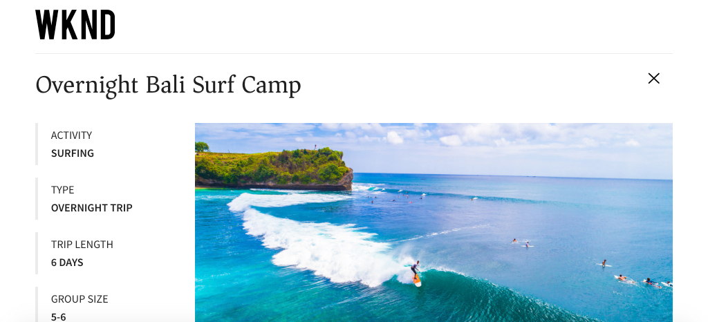

# Quick Setup {#setup}

Dit hoofdstuk biedt een snelle opstelling van een lokale milieu om een externe toepassing te zien die inhoud van AEM gebruikend AEM GraphQL APIs verbruikt. De recentere hoofdstukken in het leerprogramma zullen van deze opstelling bouwen.

## Vereisten {#prerequisites}

De volgende gereedschappen moeten lokaal worden geïnstalleerd:

* [11 JDK](https://experience.adobe.com/#/downloads/content/software-distribution/en/general.html?1_group.propertyvalues.property=.%2Fjcr%3Acontent%2Fmetadata%2Fdc%3AsoftwareType&amp;1_group.propertyvalues.operation=equals&amp;1_group.propertyvalues.0_values=software-type%3Atooling&amp;fulltext=Oracle%7E+JDK%7E+11%7E&amp;orderby=%40jcr%3Acontent%2fx jcr%3AlastModified&amp;orderby.sort=desc&amp;layout=list&amp;p.offset=0&amp;p.limit=14)
* [Node.js v10+](https://nodejs.org/en/)
* [npm 6+](https://www.npmjs.com/)
* [Git](https://git-scm.com/)

## Doelstellingen {#objectives}

1. Download en installeer de AEM SDK.
1. Download en installeer voorbeeldinhoud van de WKND-referentiesite.
1. Download en installeer een voorbeeld-app om inhoud te verbruiken met de GraphQL-API&#39;s.

## De AEM SDK installeren{#aem-sdk}

Deze zelfstudie gebruikt de [AEM als Cloud Service SDK](https://experienceleague.adobe.com/docs/experience-manager-cloud-service/implementing/developing/aem-as-a-cloud-service-sdk.html?lang=en#aem-as-a-cloud-service-sdk) om AEM GraphQL APIs te onderzoeken. In deze sectie vindt u een snelle handleiding voor het installeren van de AEM SDK en het uitvoeren ervan in de modus Auteur. Een meer gedetailleerde gids voor vestiging een lokale ontwikkelomgeving [kan hier worden gevonden](https://experienceleague.adobe.com/docs/experience-manager-learn/cloud-service/local-development-environment-set-up/overview.html?lang=en#local-development-environment-set-up).

>[!NOTE]
>
> Het is ook mogelijk om de zelfstudie te volgen met een AEM als een Cloud Service-omgeving. De zelfstudie bevat aanvullende notities voor het gebruik van een Cloud-omgeving.

1. Navigeer naar **[Software Distribution Portal](https://experience.adobe.com/#/downloads/content/software-distribution/en/aemcloud.html)** > **AEM als Cloud Service** en download de nieuwste versie van de **AEM SDK**.

   

   >[!CAUTION]
   >
   > De eigenschap GraphQL wordt toegelaten door gebrek slechts op AEM SDK van 2021-02-04 of nieuwer.

1. Pak de download uit en kopieer de QuickStart-jar (`aem-sdk-quickstart-XXX.jar`) naar een toegewezen map, d.w.z. `~/aem-sdk/author`.
1. Wijzig de naam van het jar-bestand in `aem-author-p4502.jar`.
1. Open een nieuw terminalvenster en navigeer naar de map die het jar-bestand bevat. Voer de volgende opdracht uit om de AEM te installeren en te starten:

   ```shell
   $ cd ~/aem-sdk/author
   $ java -jar aem-author-p4502.jar
   ```

1. Geef een beheerderswachtwoord op als `admin`. Om het even welk admin wachtwoord is aanvaardbaar, nochtans adviseert zijn om het gebrek voor lokale ontwikkeling te gebruiken om de behoefte te verminderen om te vormen.
1. Na een paar minuten wordt de AEM-instantie geïnstalleerd en wordt een nieuw browservenster geopend op [http://localhost:4502](http://localhost:4502).
1. Meld u aan met de gebruikersnaam `admin` en het wachtwoord `admin`.

## Voorbeeldinhoud installeren{#wknd-site}

Voorbeeldinhoud van de WKND Reference-site wordt geïnstalleerd om de zelfstudie te versnellen. De WKND is een fictief levensstijl, vaak gebruikt in combinatie met AEM training.

1. Download het nieuwste gecompileerde AEM Package voor WKND Site: [aem-guides-wknd.all-x.x.x.zip](https://github.com/adobe/aem-guides-wknd/releases/latest).

   >[!NOTE]
   >
   > Download de standaardversie die compatibel is met AEM als Cloud Service en **not** de `classic`-versie.

1. Navigeer in het menu **AEM Start** naar **Extra** > **Implementatie** > **Pakketten**.

   

1. Klik **Pakket uploaden** en kies het pakket WKND dat in de vorige stap wordt gedownload. Klik **Installeren** om het pakket te installeren.

1. Navigeer in het menu **AEM Start** naar **Middelen** > **Bestanden**.
1. Klik door de omslagen om aan **WKND Plaats** > **English** > **Adventures** te navigeren.

   

   Dit is een map met alle middelen die bestaan uit de verschillende avonturen die door het WKND-merk worden bevorderd. Dit omvat traditionele mediatypen zoals afbeeldingen en video, en media die specifiek zijn voor AEM zoals **Inhoudsfragmenten**.

1. Klik in de **Downhill Skiing Wyoming** map en klik op de **Downhill Skiing Wyoming Content Fragment**-kaart:

   

1. De gebruikersinterface van de Content Fragment Editor wordt geopend voor het Adventure van de Wyoming-methode voor het afslanken van de afgrond.

   

   Houd er rekening mee dat het fragment in verschillende velden, zoals **Title**, **Description** en **Activity**, wordt gedefinieerd.

   **Inhoudsfragmentatie** is een van de manieren waarop inhoud in AEM kan worden beheerd. Inhoudsfragment is herbruikbaar, presentatie-agnostische inhoud die bestaat uit gestructureerde gegevenselementen zoals tekst, tekst met opmaak, datums of verwijzingen naar andere inhoudfragmenten. Inhoudsfragmenten worden later in de zelfstudie gedetailleerder onderzocht.

1. Klik op **Annuleren** om het fragment te sluiten. U kunt vrij navigeren in sommige andere mappen en de andere Adventure-inhoud verkennen.

>[!NOTE]
>
> Als het gebruiken van een milieu van de Cloud Service zie de documentatie voor hoe te [een codebasis zoals de plaats van de Verwijzing WKND aan een milieu van de Cloud Service opstellen](https://experienceleague.adobe.com/docs/experience-manager-cloud-service/implementing/deploying/overview.html?lang=en#deploying).

## GraphQL-eindpunten installeren{#graphql-endpoint}

De eindpunten van GraphQL moeten worden gevormd. Dit geeft projectflexibiliteit in het bepalen van het nauwkeurige eindpunt dat GraphQL API wordt blootgesteld. Een [CORS](#cors-config) is ook nodig om toegang tot een externe toepassing te verlenen. Om de zelfstudie te versnellen, is een pakket vooraf gemaakt.

1. Download het pakket [aem-guides-wknd-graphql.all-1.0.0-SNAPSHOT.zip](./assets/setup/aem-guides-wknd-graphql.all-1.0.0-SNAPSHOT.zip).
1. Navigeer in het menu **AEM Start** naar **Extra** > **Implementatie** > **Pakketten**.
1. Klik **Pakket uploaden** en kies het pakket dat in de vorige stap is gedownload. Klik **Installeren** om het pakket te installeren.

Het bovenstaande pakket bevat ook het [GraphiQL-gereedschap](https://github.com/graphql/graphiql) dat in latere hoofdstukken wordt gebruikt. Meer informatie over de configuratie CORS kan [hieronder worden gevonden](#cors-config).

## Voorbeeldtoepassing installeren{#sample-app}

Één van de doelstellingen van deze zelfstudie moet tonen hoe te om AEM inhoud van een externe toepassing te verbruiken gebruikend GraphQL APIs. Deze zelfstudie gebruikt een voorbeeld React App dat gedeeltelijk is voltooid om de zelfstudie te versnellen. Dezelfde lessen en concepten gelden voor apps die zijn gemaakt met iOS, Android of een ander platform. De React-app is opzettelijk eenvoudig om onnodige complexiteit te voorkomen. het is niet de bedoeling een referentie - uitvoering te zijn .

1. Open een nieuw terminalvenster en klonen de taktak van de leerprogramma&#39;s gebruikend Git:

   ```shell
   $ git clone --branch tutorial/react git@github.com:adobe/aem-guides-wknd-graphql.git
   ```

1. Open in IDE van uw keuze het bestand `.env.development` om `aem-guides-wknd-graphql/react-app/.env.development`. Verwijder de commentaarmarkering van de regel `REACT_APP_AUTHORIZATION`, zodat het bestand er als volgt uitziet:

   ```plain
   REACT_APP_HOST_URI=http://localhost:4502
   REACT_APP_GRAPHQL_ENDPOINT=/content/graphql/endpoint.gql
   REACT_APP_AUTHORIZATION=admin:admin
   ```

   Zorg ervoor dat `React_APP_HOST_URI` overeenkomt met uw lokale AEM. In dit hoofdstuk verbinden wij React App direct met de AEM **Auteur** milieu en zullen daarom moeten voor authentiek verklaren. Dit is een gangbare praktijk tijdens de ontwikkeling, omdat het ons in staat stelt snel wijzigingen aan te brengen in de AEM omgeving en deze onmiddellijk in de app te bekijken.

   >[!NOTE]
   >
   > In een productiescenario zal App met een AEM **Publish** milieu verbinden. Dit wordt nader besproken, later in de zelfstudie.

1. Navigeer in de `aem-guides-wknd-graphql/react-app` omslag. Installeer en start de app:

   ```shell
   $ cd aem-guides-wknd-graphql/react-app
   $ npm install
   $ npm start
   ```

1. Een nieuw browservenster moet de app automatisch starten op [http://localhost:3000](http://localhost:3000).

   

   Een lijst van de huidige inhoud van het Avontuur van AEM zou moeten worden getoond.

1. Klik op een van de avontuurafbeeldingen om de details van het avontuur weer te geven. Er wordt een verzoek ingediend om AEM de details voor een avontuur te retourneren.

   

1. Gebruik de ontwikkelaarshulpmiddelen van browser om **Network** verzoeken te inspecteren. Bekijk **XHR** verzoeken en bekijk veelvoudige POST verzoeken aan `/content/graphql/endpoint.gql`, het eindpunt GraphQL dat voor AEM wordt gevormd.

   

1. U kunt de parameters en de reactie JSON ook bekijken door het netwerkverzoek te inspecteren. Het kan nuttig zijn om een browser uitbreiding als [GraphQL Netwerk](https://chrome.google.com/webstore/detail/graphql-network/igbmhmnkobkjalekgiehijefpkdemocm) voor Chrome te installeren om een beter inzicht in de vraag en de reactie te krijgen.

   

   *Het gebruiken van de uitbreiding van het Chroom GrafiekQL Netwerk*

## Een inhoudsfragment wijzigen

Nu de React-app wordt uitgevoerd, moet u de inhoud in AEM bijwerken en de wijziging in de app bekijken.

1. Navigeer naar AEM [http://localhost:4502](http://localhost:4502).
1. Navigeer naar **Middelen** > **Bestanden** > **WKND Site** > **Engels** > **Adventures** > **[Bali Surf Camp](http://localhost:4502/assets.html/content/dam/wknd/en/adventures/bali-surf-camp)**.

   

1. Klik op het inhoudsfragment **Bali Surf Camp** om de Content Fragment Editor te openen.
1. Wijzig **Titel** en **Beschrijving** van het avontuur

   

1. Klik **Opslaan** om de wijzigingen op te slaan.
1. Navigeer terug naar de React app op [http://localhost:3000](http://localhost:3000) en vernieuw om uw wijzigingen te zien:

   

## Gefeliciteerd! {#congratulations}

Gefeliciteerd, u hebt nu een externe toepassing die AEM inhoud met GraphQL verbruikt. U kunt de code in de app React bekijken en blijven experimenteren met het wijzigen van bestaande inhoudsfragmenten.

## Volgende stappen {#next-steps}

In het volgende hoofdstuk, [Defining Content Fragment Models](content-fragment-models.md), leert hoe te om inhoud te modelleren en een schema met **Content Fragment Models** te bouwen. U controleert bestaande modellen en maakt een nieuw model. U zult ook over de verschillende gegevenstypes leren die kunnen worden gebruikt om een schema als deel van het model te bepalen.

## (Bonus) CORS-configuratie {#cors-config}

AEM, die standaard beveiligd zijn, blokkeert aanvragen van verschillende oorsprong, zodat onbevoegde toepassingen geen verbinding kunnen maken met de inhoud en de inhoud ervan kunnen surfen.

Om React app van deze zelfstudie toe te staan om met AEM eindpunten van GraphQL API in wisselwerking te staan, is een dwars-oorsprong middel delende configuratie bepaald in het eindpuntpakket GraphQL.


Dit handmatig configureren:

1. Navigeer naar AEM webconsole van SDK op **Tools** > **Operations** > **Webconsole**
1. Klik op de rij met het label **Adobe Granite Cross-Origin Resource Sharing Policy** om een nieuwe configuratie te maken
1. Werk de volgende velden bij en laat de andere de standaardwaarden staan:
   * Toegestane oorsprong: `localhost:3000`
   * Toegestane oorsprong (Regex): `.* `
   * Toegestane paden: `/content/graphql/endpoint.gql`
   * Toegestane methoden: `GET`, `HEAD`, `POST`
      * Slechts `POST` wordt vereist voor GraphQL nochtans kunnen de andere methodes nuttig zijn wanneer het in wisselwerking staan met AEM op headless manier.
   * Ondersteunt referenties: `Yes`
      * Dit is vereist omdat onze React-app zal communiceren met de beveiligde GraphQL-eindpunten op de AEM-auteurservice.
1. Klik **Opslaan**

Met deze configuratie zijn HTTP-aanvragen van `POST` afkomstig van `localhost:3000` naar de AEM-auteurservice op pad `/content/graphql/endpoint.gql` toegestaan.

Deze configuratie en eindpunten GraphQL worden geproduceerd van een AEM Project. [Bekijk hier](https://github.com/adobe/aem-guides-wknd-graphql/tree/master/aem-project) de details.
