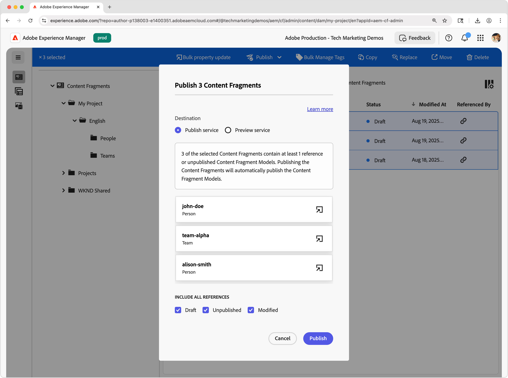

# Inhoudsfragmenten auteur

In dit hoofdstuk, creeert u en geeft nieuwe die Fragmenten uit van de Inhoud op het [ wordt gebaseerd Team en de Modellen van het Fragment van de Inhoud van de Persoon ](./1-content-fragment-models.md). Deze inhoudsfragmenten zijn de inhoud die wordt gebruikt door de React-app met AEM Content Fragment Delivery with OpenAPIs.

## Vereisten

Dit is een meerdelig leerprogramma en het wordt verondersteld dat de stappen die in [ worden geschetst die de Modellen van het Fragment van de Inhoud ](./1-content-fragment-models.md) worden bepaald zijn voltooid.

## Doelstellingen

* Maak een inhoudsfragment op basis van een inhoudsfragmentmodel.
* Maak een inhoudsfragment.
* Een inhoudsfragment publiceren.

## Mappen met elementen maken voor inhoudsfragmenten

Inhoudsfragmenten worden opgeslagen in mappen in AEM Assets. Als u inhoudsfragmenten wilt maken op basis van de modellen van inhoudsfragmenten die u in het vorige hoofdstuk hebt gemaakt, moet er een map zijn waarin u de fragmenten kunt opslaan. Voor de map is een configuratie vereist om het maken van inhoudsfragmenten op basis van specifieke modellen van inhoudsfragmenten mogelijk te maken.

AEM ondersteunt &quot;flat&quot;-maporganisatie. Dit betekent dat Content Fragments van verschillende Content Fragment Models worden samengevoegd in één map. Nochtans, in dit leerprogramma, wordt een omslagstructuur die met de Modellen van het Fragment van de Inhoud richt, gedeeltelijk gebruikt, om de **Lijst te onderzoeken van alle Fragmenten van de Inhoud door omslag** API in [ volgende hoofdstuk ](./3-explore-openapis.md). Wanneer u uw organisatie voor inhoudsfragmenten definieert, moet u rekening houden met de manier waarop u inhoudsfragmenten wilt ontwerpen en beheren en met de manier waarop u deze kunt leveren en gebruiken via de AEM Content Fragment Delivery met OpenAPI&#39;s.

1. Van het scherm van het Begin van AEM, navigeer aan **Assets** > **Dossiers**.
1. Selecteer **creeer** in de hoger-juiste hoek en selecteer **Omslag**. Enter:

   * Titel: **Mijn Project**
   * Naam: **my-project**

   Selecteer **creeer** om de omslag tot stand te brengen.

1. Open de nieuwe **Mijn omslag van het Project**, en creeer een subfolder onder de nieuwe **Mijn omslag van het Project** met de volgende waarden:

   * Titel: **Engels**
   * Naam: **nl**

   Er wordt een hoofdtaalmap gemaakt om de positie van het project te bepalen en de native lokalisatiefuncties van AEM te ondersteunen. De beste manier is om projecten in te stellen voor meertalige ondersteuning, zelfs als u vandaag geen lokalisatie nodig hebt. Zie [ de volgende documentenpagina voor meer informatie ](https://experienceleague.adobe.com/docs/experience-manager-cloud-service/content/assets/admin/translate-assets.html?lang=nl-NL).

1. Creeer twee subfolders onder nieuwe **Mijn Project > Engelse** omslag met de volgende waarden:

   A `teams` omslag die de **2&rbrace; Fragmenten van de Inhoud van het Team &lbrace;bevat**

   * Titel: **Teams**
   * Naam: **teams**

   ... en a `people` omslag die de **Persoon** Fragmenten van de Inhoud bevat.

   * Titel: **Mensen**
   * Naam: **mensen**

1. Navigeer terug naar **Mijn Project > Engelse** omslag en zorg ervoor de twee nieuwe omslagen worden gecreeerd.
1. Selecteer de **omslag van Teams** en selecteer **Eigenschappen** in de hoogste actiebar.
1. Selecteer het **Beleid** lusje, en uncheck **Geërft van`/content/dam/my-project`**.
1. Op het **lusje van het Beleid**, selecteer het **Model van het Fragment van de Inhoud van het Team** in het **Toegestane Modellen van het Fragment van de Inhoud door het gebied van de Weg**.

   

   Dit beleid wordt automatisch door submappen overgeërfd, maar kan worden overschreven. Modellen van inhoudsfragmenten kunnen worden toegestaan door tags of door modellen van inhoudsfragmenten van andere projectconfiguraties in te schakelen. Dit mechanisme biedt een krachtige manier om uw inhoudshiërarchie te beheren.

1. Selecteer **sparen &amp; sluit** om de veranderingen in de omslageigenschappen te bewaren.
1. Werk het **Beleid** voor de **3&rbrace; omslag van Mensen &lbrace;op de zelfde manier bij, maar selecteer in plaats daarvan het** Model van het Fragment van de Inhoud van de Persoon **.**

## Een personeninhoudsfragment maken

Creeer de Fragmenten van de Inhoud die op het **Model van het Fragment van de Persoon &lbrace;in het** Mijn Project > Engels > van Mensen **worden gebaseerd omslag.**

1. Van het Scherm van het Begin van AEM, uitgezochte **Fragments van de Inhoud** om de Console van Fragmenten van de Inhoud te openen.
1. Selecteer **tonen omslag** knoop om omslagbrowser te openen.
1. Selecteer **Mijn Project > Engels > de omslag van Mensen**.
1. Selecteer **creeer > het Fragment van de Inhoud** en ga de volgende waarden in:

   * Locatie: `/content/dam/my-project/en/people`
   * Het model van het Fragment van de inhoud: **Persoon**
   * Titel: **Jan Smit**
   * Naam: `john-doe`

   Onthoud deze **Titel**, **Naam**, en **Beschrijving** gebieden in de **Nieuwe dialoog van het Fragment van de Inhoud** wordt opgeslagen als meta-gegevens over het Fragment van de Inhoud, en geen deel van de gegevens van het Fragment van de Inhoud.

   

1. Selecteer **creeer en open**.
1. Vul de gebieden voor het **fragment van de Jansen**:

   * Volledige Naam: **Jansen**
   * Biografie: **John Doe houdt van sociale media en een reisliefhebber.**
   * Profielafbeelding: selecteer een afbeelding in `/content/dam` of upload een nieuwe afbeelding.
   * Bezetting: **Influencer**, **reiziger**

   Deze velden en waarden definiëren de inhoud van het inhoudsfragment die wordt gebruikt via de levering van AEM Content Fragment met OpenAPI&#39;s.

   

1. De veranderingen van het Fragment van de inhoud worden automatisch bewaard, zodat is er geen **sparen** knoop.
1. Keer terug naar de Console van het Fragment van de Inhoud en selecteer **Mijn Project > Engels > Persoon** om uw nieuw Fragment van de Inhoud te zien.

### Aanvullende Personen maken met inhoudsfragmenten

Herhaal de bovengenoemde stappen om extra **fragmenten van de Persoon** tot stand te brengen.

1. Creeer een Fragment van de Inhoud van de Persoon voor **Alison Smith** met de volgende eigenschappen:

   * Locatie: `/content/dam/my-project/en/people`
   * Het model van het Fragment van de inhoud: **Persoon**
   * Titel: **Alison Smith**
   * Naam: `alison-smith`

   Selecteer **creeer en open** en auteur volgende waarden:

   * Volledige Naam: **Alison Smith**
   * Biografie: **de Verbinding is een fotograaf en houdt van om over haar reizen te schrijven.**
   * Profielafbeelding: selecteer een afbeelding in `/content/dam` of upload een nieuwe afbeelding.
   * Bezetting: **Fotograaf**, **reiziger**, **Schrijver**.

U zou twee Fragments van de Inhoud in **Mijn Project > Engels > de omslag van Mensen** nu moeten hebben:

U kunt desgewenst nog een paar fragmenten voor persoonlijke inhoud maken om extra personen te vertegenwoordigen.

## Een teaminhoudsfragment maken

Gebruikend de zelfde benadering, creeer het fragment van het a **Team** dat op het **&#x200B;**&#x200B;Model van het Fragment van de Inhoud van het Team &lbrace;in **Mijn Project > Engels > de omslag van Teams** wordt gebaseerd.

1. Creeer het fragment van het a **Team** dat **Team Alpha** met de volgende eigenschappen vertegenwoordigt:

   * Locatie: `/content/dam/my-project/en`
   * Het Model van het Fragment van de inhoud: **Team**
   * Titel: **Team Alpha**
   * Naam: `team-alpha`

   Selecteer **creeer en open** en auteur volgende waarden:

   * Titel: **Team Alpha**
   * Beschrijving: **Team Alpha is een team van de reisinhoud dat in fotografie en reis het schrijven specialiseert.**
   * **Leden van het Team**: Selecteer **Jansen doet** en **Alison Smith** de Fragmenten van de Inhoud om het **7&rbrace; gebied van de Leden van het Team te bevolken.**

   

1. Selecteer **creeer en open** om het Fragment van de Inhoud van het Team tot stand te brengen
1. Er zou één Fragment van de Inhoud onder **Mijn Project > Engels > Team** moeten zijn:

U zou het Fragment van de Inhoud van Alpha van het a **Team** in het **Mijn Project > Engels > van Teams** omslag nu moeten hebben:

Naar keuze, creeer Omega van het a **Team** met een verschillende reeks mensen.

## Inhoudsfragmenten publiceren

Publiceer inhoudsfragmenten via OpenAPI&#39;s. Door te publiceren kunnen de Content Fragments worden benaderd via:

* **publiceer de dienst** - dient inhoud aan productietoepassingen
* **de dienst van de Voorproef** - dient inhoud aan voorproeftoepassingen

Typisch wordt de inhoud gepubliceerd eerst aan de **dienst van de Voorproef** en herzien op een voorproeftoepassing alvorens aan de **wordt gepubliceerd de dienst van de Publicatie**. Het publiceren aan de **publiceer dienst** publiceert niet ook aan de **dienst van de Voorproef**. U moet aan de **dienst van de Voorproef** afzonderlijk publiceren.

In dit leerprogramma zullen wij publiceren aan de publicatiedienst van AEM, echter het gebruiken van de dienst van de Voorproef van AEM is zo gemakkelijk zoals veranderend URL van de [ dienst van AEM in Reageren app ](./4-react-app.md)

1. In de Console van het Fragment van de Inhoud, bepaal de plaats van **Mijn Project > Engelse** omslag.
1. Selecteer alle Fragments van de Inhoud in de **Engelse** omslag - die alle Fragmenten van de Inhoud in alle subfolder toont - en selecteer **publiceren > nu** van de hoogste actiebar.

   

1. Selecteer de **publiceer dienst**, onder **omvat alle verwijzingen** uitgezocht **Niet gepubliceerd** en **Gewijzigd** en uitgezocht **publiceer**.

   

Nu de Fragmenten van de Inhoud, en alle Fragmenten van de Inhoud van de Persoon die door de Fragmenten van de Inhoud van het Team worden van verwijzingen voorzien, en om het even welke referenced activa, worden gepubliceerd aan de **publiceerdienst**.

U kunt aan de **dienst van de Voorproef** op de zelfde manier publiceren.

## Gefeliciteerd!

Gefeliciteerd, u hebt inhoudsfragmenten gemaakt die zijn gebaseerd op modellen van inhoudsfragmenten in AEM. U creeerde het Model van het Fragment van de Inhoud van de a **Persoon**, creeerde verscheidene **Fragmenten van de Inhoud van de Persoon &lbrace;, en creeerde het Fragment van de Inhoud van het a** Team **dat de verwijzingen veelvoudige** Inhoudsfragmenten van de Persoon **.**

Met gepubliceerde inhoudsfragmenten kunt u deze nu openen via de AEM Content Fragment Delivery met OpenAPI&#39;s.

## Volgende stappen

In het volgende hoofdstuk, [ ontdekken OpenAPIs ](3-explore-openapis.md), zult u de Levering van het Fragment van de Inhoud van AEM met OpenAPIs onderzoeken gebruikend het **probeert het** vermogen dat in de API documentatie wordt gebouwd.

