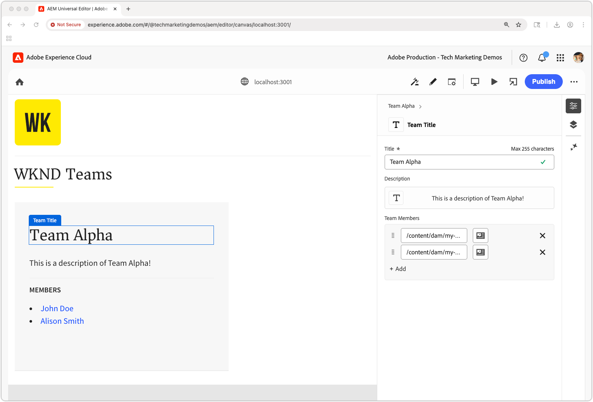

# De React-app bewerken met de Universal Editor

In dit hoofdstuk, leert u hoe te Reageren app maken die in het [&#x200B; vorige hoofdstuk &#x200B;](./4-react-app.md) bewerkbaar wordt gebouwd gebruikend de Universele Redacteur van AEM. Met de Universal Editor kunnen auteurs van inhoud inhoud inhoud rechtstreeks bewerken binnen de context van de React-app-ervaring, terwijl de foutloze ervaring van een toepassing zonder kop behouden blijft.


De Universal Editor biedt een krachtige manier om in-context bewerken in te schakelen voor elke webtoepassing, zodat auteurs inhoud kunnen bewerken zonder te schakelen tussen verschillende ontwerpinterfaces.

## Vereisten

* De vorige stappen van dit leerprogramma zijn voltooid, specifiek [&#x200B; bouwt een React app die AEM het Leveren OpenAPIs van het Fragment van de Inhoud gebruikt &#x200B;](./4-react-app.md)
* Een het werk kennis van [&#x200B; om Universele Redacteur &#x200B;](https://experienceleague.adobe.com/nl/docs/experience-manager-cloud-service/content/implementing/developing/universal-editor/introduction) te gebruiken en uit te voeren.

## Doelstellingen

Leer hoe u:

* Voeg instrumenten van de Universal Editor toe aan de React-app.
* Configureer de React-app voor Universal Editor.
* Schakel het rechtstreeks bewerken van inhoud in de interface van de React-app in met de Universal Editor.

## Universal Editor-instrumenten

De universele Redacteur vereist [&#x200B; attributen van HTML en metatags &#x200B;](https://experienceleague.adobe.com/nl/docs/experience-manager-cloud-service/content/implementing/developing/universal-editor/attributes-types) om editable inhoud te identificeren en de verbinding tussen de inhoud van UI en van AEM te vestigen.

### Universal Editor-tags toevoegen

Voeg eerst de benodigde metatags toe om te bepalen dat de toepassing Reageren compatibel is met de Universal Editor.

1. Open `public/index.html` in de React-app.
1. Voeg de [&#x200B; Universele metatags van de Redacteur en het manuscript van CORS &#x200B;](https://experienceleague.adobe.com/nl/docs/experience-manager-cloud-service/content/implementing/developing/universal-editor/getting-started) in de `<head>` sectie van React toe app:

   ```html
   <!DOCTYPE html>
   <html lang="en">
   <head>
       <meta charset="utf-8" />
       <link rel="icon" href="%PUBLIC_URL%/favicon.ico" />
       <meta name="viewport" content="width=device-width, initial-scale=1" />
       <meta name="theme-color" content="#000000" />
       <meta name="description" content="WKND Teams React App" />
   
       <!-- Universal Editor meta tags and CORS script -->
       <meta name="urn:adobe:aue:system:aemconnection" content="aem:%REACT_APP_AEM_AUTHOR_HOST_URI%" />
       <script src="https://universal-editor-service.adobe.io/cors.js"></script>
   
       <link rel="apple-touch-icon" href="%PUBLIC_URL%/logo192.png" />
       <link rel="manifest" href="%PUBLIC_URL%/manifest.json" />
       <title>WKND Teams</title>
   </head>
   <body>
       <noscript>You need to enable JavaScript to run this app.</noscript>
       <div id="root"></div>
   </body>
   </html>
   ```

1. Werk het `.env` -bestand van de React-app bij en voeg de AEM Author-service-host toe voor ondersteuning van terugschrijfbewerkingen in de Universal Editor (wordt gebruikt in de waarde van de `urn:adobe:aue:system:aemconnection` metat-tag).

   ```bash
   # The AEM Publish (or Preview) service
   REACT_APP_HOST_URI=https://publish-p123-e456.adobeaemcloud.com
   
   # The AEM Author service
   REACT_APP_AEM_AUTHOR_HOST_URI=https://author-p123-e456.adobeaemcloud.com
   ```

### Instrument voor de teamcomponent

Voeg nu Universal Editor-kenmerken toe om de component Teams bewerkbaar te maken.

1. Open `src/components/Teams.js`.
1. Werk de `Team` component bij om [&#x200B; Universele de gegevensattributen van de Redacteur &#x200B;](https://experienceleague.adobe.com/nl/docs/experience-manager-cloud-service/content/implementing/developing/universal-editor/attributes-types) te omvatten:

   Wanneer u het kenmerk `data-aue-resource` instelt, moet u ervoor zorgen dat het AEM-pad naar het inhoudsfragment, dat wordt geretourneerd door de AEM Content Fragment Delivery with OpenAPIs, wordt gepost met het subpad naar de variatie van het inhoudsfragment; in dit geval `/jcr:content/data/master` .

   ```javascript
   import { useEffect, useState } from "react";
   import { Link } from "react-router-dom";
   import "./Teams.scss";
   
   function Teams() {
   
   // The teams folder is the only folder-tree that is allowed to contain Team Content Fragments.
   const TEAMS_FOLDER = '/content/dam/my-project/en/teams';
   
   // State to store the teams data
   const [teams, setTeams] = useState(null);
   
   useEffect(() => {
       /**
       * Fetches all teams and their associated member details
       * This is a two-step process:
       * 1. First, get all team content fragments from the specified folder
       * 2. Then, for each team, fetch the full details including hydrated references to get the team member names
       */
       const fetchData = async () => {
       try {
           // Step 1: Fetch all teams from the teams folder
           const response = await fetch(
           `${process.env.REACT_APP_HOST_URI}/adobe/contentFragments?path=${TEAMS_FOLDER}`
           );
           const allTeams = (await response.json()).items || [];
   
           // Step 2: Fetch detailed information for each team with hydrated references
           const hydratedTeams = [];
           for (const team of allTeams) {
               const hydratedTeamResponse = await fetch(
                   `${process.env.REACT_APP_HOST_URI}/adobe/contentFragments/${team.id}?references=direct-hydrated`
               );
               hydratedTeams.push(await hydratedTeamResponse.json());
           }
   
           setTeams(hydratedTeams);
       } catch (error) {
           console.error("Error fetching content fragments:", error);
       }
       };
   
       fetchData();
   }, [TEAMS_FOLDER]);
   
   // Show loading state while teams data is being fetched
   if (!teams) {
       return <div>Loading teams...</div>;
   }
   
   // Render the teams
   return (
       <div className="teams">
       {teams.map((team, index) => {
           return (
           <Team
               key={index}
               {...team}
           />
           );
       })}
       </div>
   );
   }
   
   /**
   * Team - renders a single team with its details and members
   * @param {Object} fields - The authored Content Fragment fields
   * @param {Object} references - Hydrated references containing member details such as fullName
   * @param {string} path - Path of the team content fragment
   */
   function Team({ fields, references, path }) {
   if (!fields.title || !fields.teamMembers) {
       return null;
   }
   
   return (
       <>
       {/* Specify the correct Content Fragment variation path suffix in the data-aue-resource attribute */}
       <div className="team"
           data-aue-resource={`urn:aemconnection:${path}/jcr:content/data/master`}
           data-aue-type="component"
           data-aue-label={fields.title}>
   
           <h2 className="team__title"
           data-aue-prop="title"
           data-aue-type="text"
           data-aue-label="Team Title">{fields.title}</h2>
           <p className="team__description"
           data-aue-prop="description"
           data-aue-type="richtext"
           data-aue-label="Team Description"
           dangerouslySetInnerHTML={{ __html: fields.description.value }}
           />
           <div>
           <h4 className="team__members-title">Members</h4>
           <ul className="team__members">
               {fields.teamMembers.map((teamMember, index) => {
               return (
                   <li key={index} className="team__member">
                   <Link to={`/person/${teamMember}`}>
                       {references[teamMember].value.fields.fullName}
                   </Link>
                   </li>
               );
               })}
           </ul>
           </div>
       </div>
       </>
   );
   }
   
   export default Teams;
   ```

### Instrument voor de personele component

U kunt ook Universal Editor-kenmerken toevoegen aan de component Person.

1. Open `src/components/Person.js`.
1. Werk de component bij om [&#x200B; Universele de gegevensattributen van de Redacteur &#x200B;](https://experienceleague.adobe.com/nl/docs/experience-manager-cloud-service/content/implementing/developing/universal-editor/attributes-types) te omvatten:

   Wanneer u het kenmerk `data-aue-resource` instelt, moet u ervoor zorgen dat het AEM-pad naar het inhoudsfragment, dat wordt geretourneerd door de AEM Content Fragment Delivery with OpenAPIs, wordt gepost met het subpad naar de variatie van het inhoudsfragment; in dit geval `/jcr:content/data/master` .

   ```javascript
   import "./Person.scss";
   import { useEffect, useState } from "react";
   import { useParams } from "react-router-dom";
   
   /**
   * Person component - displays detailed information about a single person
   * Fetches person data from AEM using the ID from the URL parameters
   */
   function Person() {
       const { id } = useParams();
       const [person, setPerson] = useState(null);
   
       useEffect(() => {
           const fetchData = async () => {
           try {
               const response = await fetch(
               `${process.env.REACT_APP_HOST_URI}/adobe/contentFragments/${id}?references=direct-hydrated`
               );
               const json = await response.json();
               setPerson(json || null);
           } catch (error) {
               console.error("Error fetching person data:", error);
           }
           };
           fetchData();
       }, [id]);
   
       if (!person) {
           return <div>Loading person...</div>;
       }
   
       /* Add the Universal Editor data-aue-* attirbutes to the rendered HTML */
       return (
           <div className="person"
               data-aue-resource={`urn:aemconnection:${person.path}/jcr:content/data/master`}
               data-aue-type="component"
               data-aue-label={person.fields.fullName}>
               
               <div className="person__occupations">
                   {person.fields.occupation.map((occupation, index) => {
                   return (
                       <span key={index} className="person__occupation">
                           {occupation}
                       </span>
                   );
                   })}
               </div>
   
               <div className="person__content">
                   <h1 className="person__full-name"
                       data-aue-prop="fullName"
                       data-aue-type="text"
                       data-aue-label="Full Name">
                       {person.fields.fullName}
                   </h1>
                   <div className="person__biography"
                       data-aue-prop="biographyText"
                       data-aue-type="richtext"
                       data-aue-label="Biography"
                       dangerouslySetInnerHTML={{ __html: person.fields.biographyText.value }}
                   />
               </div>
           </div>
       );
   }
   ```

### De voltooide code ophalen

De volledige broncode voor dit hoofdstuk is [&#x200B; beschikbaar op Github.com &#x200B;](https://github.com/adobe/aem-tutorials/tree/headless_open-api_basic_5-end).


```bash
$ git fetch --tags
$ git tag
$ git checkout tags/headless_open-api_basic_5-end
```

## Integratie van Universal Editor testen

Test nu de compatibiliteitsupdates van de Universal Editor door de React-app te openen in de Universal Editor.

### De React-app starten

1. Zorg ervoor dat de React-app actief is:

   ```bash
   $ cd ~/Code/aem-guides-wknd-openapi/basic-tutorial
   $ npm install
   $ npm start
   ```

1. Controleer of de app wordt geladen in `http://localhost:3000` en geef de teams en personele inhoud weer.

### Lokale SSL-proxy uitvoeren

De Universal Editor vereist dat de bewerkbare toepassing via HTTPS wordt geladen.

1. Om lokale Reactie app over HTTPS in werking te stellen, gebruik [&#x200B; lokaal-ssl-volmacht &#x200B;](https://www.npmjs.com/package/local-ssl-proxy) npm module van de bevellijn.

   ```bash
   $ npm install -g local-ssl-proxy
   $ local-ssl-proxy --source 3001 --target 3000
   ```

1. `https://localhost:3001` openen in uw webbrowser
1. Accepteer het zelfondertekende certificaat.
1. Controleer of de React-app is geladen.

### Openen in Universal Editor


1. Navigeer aan [&#x200B; Universele Redacteur &#x200B;](https://experience.adobe.com/#/@myOrg/aem/editor/canvas/).
1. Op het **gebied van URL van de Plaats**, ga HTTPS Reageer app URL: `https://localhost:3001` in.
1. Selecteer klik **Open**.

De Universal Editor moet uw React-app laden met de bewerkingsmogelijkheden ingeschakeld.

### Bewerkingsfunctionaliteit testen



1. Houd de muisaanwijzer in de Universal Editor boven bewerkbare elementen in de React-app.

1. Om binnen Reageren te navigeren app, knevel **wijze van de Voorproef** aan, en weg opnieuw om uit te geven. Herinner me, heeft de **Voorproef** niets met de dienst van de Voorproef van AEM te doen, eerder het knevels uitgeven chroom aan en weg in Universele Redacteur.

1. U moet bewerkingsindicatoren zien en de verschillende bewerkbare elementen van de React-app kunnen klikken.

1. Probeer een teamtitel te bewerken:
   * Klik op een teamtitel
   * De tekst in het deelvenster Eigenschappen bewerken
   * De wijzigingen opslaan

1. Bewerk de profielafbeelding van een persoon:
   * Klik op de profielafbeelding van een persoon
   * Een nieuwe afbeelding selecteren met de elementkiezer
   * De wijzigingen opslaan

1. De pers **publiceert** in het hoogste recht van Universele Redacteur om uitgeeft aan de dienst van de Publicatie van AEM (of van de Voorproef) te publiceren, zodat worden zij weerspiegeld in Reageren app in Universele Redacteur.

## Algemene gegevenskenmerken van de Editor

Voor volledige documentatie bij het van instrumenten voorzien van een toepassing voor Universele Redacteur, verwijs naar de [&#x200B; Universele documentatie van de Redacteur &#x200B;](https://experience.adobe.com/#/@myOrg/aem/editor/canvas/).

## Gefeliciteerd!

Gefeliciteerd! U hebt Universal Editor geïntegreerd met uw React-app. Inhoudsauteurs kunnen inhoudsfragmenten nu rechtstreeks bewerken in de interface van de React-app. Hierdoor wordt een naadloze ontwerpervaring geboden terwijl de voordelen van een architectuur zonder kop behouden blijven.

Herinner me, kunt u de definitieve broncode voor dit leerprogramma van de `main` tak van de [&#x200B; GitHub.com bewaarplaats &#x200B;](https://github.com/adobe/aem-tutorials/tree/main) altijd krijgen.
