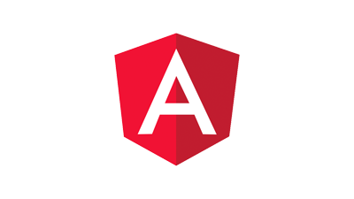

# Tutorials zonder kop AEM

Adobe Experience Manager (AEM) heeft meerdere opties om eindpunten zonder kop te definiëren en de inhoud ervan als JSON te leveren. Gebruik praktische zelfstudies om te verkennen hoe u de verschillende opties kunt gebruiken en te kiezen wat bij u past.

>[!TIP]
>
>This collection of tutorials are designed for those who prefer to **learn by doing**. Als u van de grond het leren van concepten verkiest, controleer uit [AEM Headless Developer Journey](https://experienceleague.adobe.com/docs/experience-manager-cloud-service/headless-journey/developer/overview.html). This set of tutorials and the journey complement each other.

## Tutorials via API

<table>
<tr>
  <td>
    
    

      <a href="https://experienceleague.adobe.com/docs/experience-manager-learn/getting-started-with-aem-headless/graphql/overview.html">
    <strong>GraphQL API</strong>
    </a>
    

    

    <em>Learn how an application can use AEM's GraphQL API to query content.</em>
    

  </td>
  <td>
    
    

    <a href="https://experienceleague.adobe.com/docs/experience-manager-learn/getting-started-with-aem-headless/authentication/overview.html">
    <strong>Token authentication</strong>
    </a>
    

    

    <em>Leer hoe een toepassing veilig kan worden geverifieerd met AEM.</em>
    

  </td>
  <td>
    
     

      <a href="https://experienceleague.adobe.com/docs/experience-manager-learn/getting-started-with-aem-headless/content-services/overview.html">
        <strong>Inhoudsservices</strong>
      </a>
    

    

    <em>Leer hoe een toepassing een REST API kan gebruiken om inhoud te verbruiken.</em>
    

  </td>
</tr>
</table>

## Example applications

Voorbeeldtoepassingen zijn een geweldige manier om de mogelijkheden zonder kop van Adobe Experience Manager (AEM) te verkennen. Download and install these finished examples to get started right away.

<table>
<tr>
  <td>
    
    

      <a href="https://experienceleague.adobe.com/docs/experience-manager-learn/getting-started-with-aem-headless/graphql/example-apps/ios-swiftui-app.html">
    <strong>iOS SwiftUI-voorbeeld</strong>
    </a>
    

    

    <em>Een iOS-toepassing die wordt aangedreven door AEM GraphQL API's.</em>
    

  </td>
  <td>
    
    

    <a href="https://experienceleague.adobe.com/docs/experience-manager-learn/getting-started-with-aem-headless/graphql/example-apps/android-app.html">
    <strong>Android™ Example</strong>
    </a>
    

    

    <em>An Android™ application powered by AEM's GraphQL APIs.</em>
    

  </td>
  <td>
    
     

      <a href="https://experienceleague.adobe.com/docs/experience-manager-learn/getting-started-with-aem-headless/graphql/example-apps/react-app.html">
        <strong>Voorbeeld Reageren</strong>
      </a>
    

    

    <em>A React application powered by AEM's GraphQL APIs.</em>
    

  </td>
</tr>
</table>

## Tutorials per kader

Browse the following tutorials based on the technology used. Leer hoe AEM meer kan betekenen dan alleen een hoofdloze kwestie, met opties voor in-context authoring en ervaringsbeheer.

<table>
<tr>
  <td>
    
    

      <a href="https://experienceleague.adobe.com/docs/experience-manager-learn/getting-started-with-aem-headless/graphql/overview.html">
    <strong>React - Headless</strong>
    </a>
    

    

    <em>Build a React JS app using GraphQL in a pure headless scenario.</em>
    

  </td>
  <td>
    
    

    <a href="https://experienceleague.adobe.com/docs/experience-manager-learn/getting-started-with-aem-headless/spa-editor/remote-spa/overview.html">
    <strong>Reageren - Externe editor</strong>
    </a>
    

    

    <em>Author in-context a portion of a remotely hosted React application.</em>
    

  </td>
  <td>
    
     

      <a href="https://experienceleague.adobe.com/docs/experience-manager-learn/getting-started-with-aem-headless/spa-editor/react/overview.html">
        <strong>Reageren - SPA Editor</strong>
      </a>
    

    

    <em>Gebruik de AEM SPA editor om de volledige ervaring van de React-app te beheren.</em>
    

  </td>
</tr>
<tr>
  <td>
    
    

      <a href="https://experienceleague.adobe.com/docs/experience-manager-learn/getting-started-with-aem-headless/spa-editor/angular/overview.html">
    <strong>Angular - SPA Editor</strong>
    </a>
    

    

    <em>Gebruik de AEM SPA editor om de volledige ervaring van de Angular-app te beheren.</em>
    

  </td>
  <td>
    
    

    <a href="https://experienceleague.adobe.com/docs/experience-manager-learn/getting-started-with-aem-headless/content-services/overview.html">
    <strong>Android - Content Services</strong>
    </a>
    

    

    <em>Gebruik Content Services en REST om een mobiele Android™-toepassing van stroom te voorzien.</em>
    

  </td>
  <td>
    
     

      <a href="https://experienceleague.adobe.com/docs/experience-manager-learn/getting-started-with-aem-headless/authentication/overview.html">
        <strong>Node.js - Authentication</strong>
      </a>
    

    

    <em>Maak een Node.js-app met ontwikkelaars- en servicetokens voor verificatie.</em>
    

  </td>
</tr>
</table>
