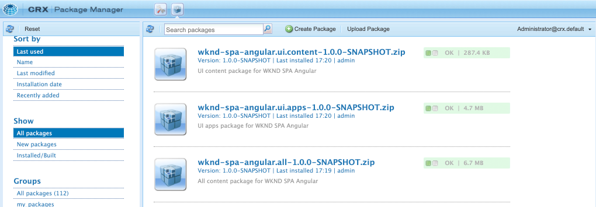

# SPA Editor-project {#create-project}

Leer hoe u een Adobe Experience Manager (AEM) Maven-project gebruikt als beginpunt voor een Angular-toepassing die is geïntegreerd met de AEM SPA Editor.

## Doelstelling

1. Begrijp de structuur van een nieuw AEM SPA van de Redacteur project dat van een Maven archetype wordt gebouwd.
2. Implementeer het startproject naar een lokale instantie van AEM.

## Wat u gaat maken

In dit hoofdstuk, wordt een nieuw AEM project opgesteld, gebaseerd op [Projectarchetype AEM](https://github.com/adobe/aem-project-archetype). Het AEM project wordt opgestart met een heel eenvoudig startpunt voor de SPA Angular. Het in dit hoofdstuk gebruikte project zal als basis dienen voor de tenuitvoerlegging van de WKND-SPA en is in toekomstige hoofdstukken gebaseerd.


*Een klassiek Hello World-bericht.*

## Vereisten

Controleer de vereiste gereedschappen en instructies voor het instellen van een [plaatselijke ontwikkelomgeving](overview.md#local-dev-environment). Zorg ervoor dat er een nieuw exemplaar van Adobe Experience Manager is gestart in **auteur** wordt lokaal uitgevoerd.

## Het project ophalen

Er zijn verscheidene opties om een Maven Multi-module project voor AEM tot stand te brengen. Deze zelfstudie gebruikte de nieuwste [Projectarchetype AEM](https://github.com/adobe/aem-project-archetype) als basis voor de zelfstudiecode. De projectcode is gewijzigd om veelvoudige versies van AEM te steunen. Controleer [de opmerking over achterwaartse compatibiliteit](overview.md#compatibility).

>[!CAUTION]
>
>Het is raadzaam de **nieuwste** van de [archetype](https://github.com/adobe/aem-project-archetype) een nieuw project voor een echte uitvoering te genereren. AEM projecten moeten gericht zijn op één enkele versie van AEM met behulp van de `aemVersion` eigenschap van het archetype.

1. Download het beginpunt voor deze zelfstudie via Git:

   ```shell
   $ git clone git@github.com:adobe/aem-guides-wknd-spa.git
   $ cd aem-guides-wknd-spa
   $ git checkout Angular/create-project-start
   ```

2. De volgende map en bestandsstructuur vertegenwoordigen het AEM Project dat is gegenereerd door het Maven-archetype op het lokale bestandssysteem:

   ```plain
   |--- aem-guides-wknd-spa
       |--- all/
       |--- core/
       |--- dispatcher/
       |--- ui.apps/
       |--- ui.apps.structure/
       |--- ui.content/
       |--- ui.frontend /
       |--- it.tests/
       |--- pom.xml
       |--- README.md
       |--- .gitignore
       |--- archetype.properties
   ```

3. De volgende eigenschappen werden gebruikt toen het produceren van het AEM project van [Project archetype AEM](https://github.com/Adobe-Marketing-Cloud/aem-project-archetype/releases/tag/aem-project-archetype-14):

   | Eigenschap | Waarde |
   |-----------------|---------------------------------------|
   | aemVersion | wolk |
   | appTitle | WKND SPA Angular |
   | appId | wknd-spa-angular |
   | groupId | com.adobe.aem.guides |
   | frontendModule | angular |
   | package | com.adobe.aem.guides.wknd.spa.angular |
   | includeExamples | n |

   >[!NOTE]
   >
   > Let op: `frontendModule=angular` eigenschap. Dit vertelt de Archetype van het Project van de AEM om het project met een aanzet te lassen [Angular code base](https://experienceleague.adobe.com/docs/experience-manager-core-components/using/developing/archetype/uifrontend-angular.html) te gebruiken met de AEM SPA Editor.

## Het project bouwen

Daarna, compileert, bouwt, en stelt de projectcode aan een lokale instantie van AEM op gebruikend Maven.

1. Verzeker een geval van AEM plaatselijk op haven loopt **4502**.
2. Van de terminal van de bevellijn verifieert dat Maven geïnstalleerd is:

   ```shell
   $ mvn --version
   Apache Maven 3.6.2
   Maven home: /Library/apache-maven-3.6.2
   Java version: 11.0.4, vendor: Oracle Corporation, runtime: /Library/Java/JavaVirtualMachines/jdk-11.0.4.jdk/Contents/Home
   ```

3. Voer de onderstaande opdracht Maven uit vanaf de `aem-guides-wknd-spa` directory om het project te bouwen en op te stellen aan AEM:

   ```shell
   $ mvn -PautoInstallSinglePackage clean install
   ```

   Als u [AEM 6,x](overview.md#compatibility):

   ```shell
   $ mvn clean install -PautoInstallSinglePackage -Pclassic
   ```

   De veelvoudige modules van het project zouden moeten worden gecompileerd en aan AEM worden opgesteld.

   ```plain
   [INFO] ------------------------------------------------------------------------
   [INFO] Reactor Summary for wknd-spa-angular 1.0.0-SNAPSHOT:
   [INFO] 
   [INFO] wknd-spa-angular ................................... SUCCESS [  0.473 s]
   [INFO] WKND SPA Angular - Core ............................ SUCCESS [ 54.866 s]
   [INFO] wknd-spa-angular.ui.frontend - UI Frontend ......... SUCCESS [02:10 min]
   [INFO] WKND SPA Angular - Repository Structure Package .... SUCCESS [  0.694 s]
   [INFO] WKND SPA Angular - UI apps ......................... SUCCESS [  6.351 s]
   [INFO] WKND SPA Angular - UI content ...................... SUCCESS [  2.885 s]
   [INFO] WKND SPA Angular - All ............................. SUCCESS [  1.736 s]
   [INFO] WKND SPA Angular - Integration Tests Bundles ....... SUCCESS [  2.563 s]
   [INFO] WKND SPA Angular - Integration Tests Launcher ...... SUCCESS [  1.846 s]
   [INFO] WKND SPA Angular - Dispatcher ...................... SUCCESS [  0.270 s]
   [INFO] ------------------------------------------------------------------------
   [INFO] BUILD SUCCESS
   [INFO] ------------------------------------------------------------------------
   ```

   Het profiel Maven ***autoInstallSinglePackage*** compileert de individuele modules van het project en stelt één enkel pakket aan de AEM instantie op. Dit pakket wordt standaard geïmplementeerd op een AEM-instantie die lokaal op de poort wordt uitgevoerd **4502** en met de geloofsbrieven van **admin:admin**.

4. Navigeren naar **[!UICONTROL Package Manager]** op uw lokale AEM: [http://localhost:4502/crx/packmgr/index.jsp](http://localhost:4502/crx/packmgr/index.jsp).

5. U moet drie pakketten zien voor `wknd-spa-angular.all`, `wknd-spa-angular.ui.apps` en `wknd-spa-angular.ui.content`.

   

   Alle aangepaste code die nodig is voor het project, wordt in deze pakketten gebundeld en op de AEM-runtime geïnstalleerd.

6. U moet ook verschillende pakketten zien voor `spa.project.core` en `core.wcm.components`. Dit zijn gebiedsdelen automatisch inbegrepen door archetype. Meer informatie over [AEM Core Components vindt u hier](https://experienceleague.adobe.com/docs/experience-manager-core-components/using/introduction.html).

## Inhoud auteur

Open vervolgens de SPA die is gegenereerd door het archetype en werk een deel van de inhoud bij.

1. Ga naar de **[!UICONTROL Sites]** console: [http://localhost:4502/sites.html/content](http://localhost:4502/sites.html/content).

   De WKND-SPA bevat een basissitestructuur met een land, taal en homepage. Deze hiërarchie is gebaseerd op de standaardwaarden van het archetype voor `language_country` en `isSingleCountryWebsite`. Deze waarden kunnen worden overschreven door het bijwerken van de [beschikbare eigenschappen](https://github.com/adobe/aem-project-archetype#available-properties) wanneer u een project genereert.

2. Open de **[!DNL us]** > **[!DNL en]** > **[!DNL WKND SPA Angular Home Page]** pagina door de pagina te selecteren en op de **[!UICONTROL Edit]** in de menubalk:

   

3. A **[!UICONTROL Text]** is al toegevoegd aan de pagina. U kunt deze component op dezelfde manier bewerken als elke andere component in AEM.

   

4. Voeg een extra **[!UICONTROL Text]** naar de pagina.

   U ziet dat de ontwerpervaring vergelijkbaar is met die van een traditionele AEM Sites-pagina. Momenteel is een beperkt aantal componenten beschikbaar die kunnen worden gebruikt. Tijdens de zelfstudie wordt meer toegevoegd.

## Inspect de toepassing Eén pagina

Controleer vervolgens of dit een toepassing voor één pagina is met gebruik van de ontwikkelaars van uw browser.

1. In de **[!UICONTROL Page Editor]** klikt u op de knop **[!UICONTROL Page Information]** menu > **[!UICONTROL View as Published]**:

   

   Hiermee wordt een nieuw tabblad met de queryparameter geopend `?wcmmode=disabled` waarmee de AEM-editor feitelijk wordt uitgeschakeld: [http://localhost:4502/content/wknd-spa-angular/us/en/home.html?wcmmode=disabled](http://localhost:4502/content/wknd-spa-angular/us/en/home.html?wcmmode=disabled)

2. De bron van de pagina weergeven. U ziet dat de tekstinhoud **[!DNL Hello World]** of een van de andere inhoud niet is gevonden. In plaats daarvan ziet u HTML als volgt:

   ```html
   ...
   <body>
       <noscript>You need to enable JavaScript to run this app.</noscript>
       <div id="spa-root"></div>
       <script type="text/javascript" src="/etc.clientlibs/wknd-spa-angular/clientlibs/clientlib-angular.min.js"></script>
       ...
   </body>
   ...
   ```

   `clientlib-angular.min.js` Dit is de Angular SPA die op de pagina wordt geladen en die verantwoordelijk is voor het weergeven van de inhoud.

   *Waar komt de inhoud vandaan?*

3. Terug naar de tab: [http://localhost:4502/content/wknd-spa-angular/us/en/home.html?wcmmode=disabled](http://localhost:4502/content/wknd-spa-angular/us/en/home.html?wcmmode=disabled)
4. Open de de ontwikkelaarshulpmiddelen van browser en inspecteer het netwerkverkeer van de pagina tijdens verfrissen zich. De weergave van **XHR** verzoeken:

   

   Er moet een verzoek worden ingediend om [http://localhost:4502/content/wknd-spa-angular/us/en.model.json](http://localhost:4502/content/wknd-spa-angular/us/en.model.json). Dit bevat alle inhoud, geformatteerd in JSON, die de SPA zal drijven.

5. In een nieuw tabblad opent u [http://localhost:4502/content/wknd-spa-angular/us/en.model.json](http://localhost:4502/content/wknd-spa-angular/us/en.model.json)

   Het verzoek `en.model.json` vertegenwoordigt het inhoudsmodel dat de toepassing zal drijven. Inspect de JSON-uitvoer en u moet het fragment kunnen vinden dat de **[!UICONTROL Text]** component(en).

   ```json
   ...
   ":items": {
       "text": {
           "text": "<p>Hello World! Updated content!</p>\r\n",
           "richText": true,
           ":type": "wknd-spa-angular/components/text"
       },
       "text_98796435": {
           "text": "<p>A new text component.</p>\r\n",
           "richText": true,
           ":type": "wknd-spa-angular/components/text"
   },
   ...
   ```

   In het volgende hoofdstuk zullen wij inspecteren hoe de inhoud JSON van AEM Componenten aan SPA Componenten wordt in kaart gebracht om de basis van de AEM SPA Ervaring van de Redacteur te vormen.

   >[!NOTE]
   >
   > Het kan handig zijn een browserextensie te installeren om de JSON-uitvoer automatisch op te maken.

## Gefeliciteerd! {#congratulations}

Gefeliciteerd, u hebt zojuist uw eerste AEM SPA Editor Project gemaakt!

Het is nu heel eenvoudig, maar in de volgende hoofdstukken wordt meer functionaliteit toegevoegd.

### Volgende stappen {#next-steps}

[De SPA integreren](integrate-spa.md) - Leer hoe de SPA broncode is geïntegreerd met het AEM Project en begrijp de beschikbare tools om de SPA snel te ontwikkelen.
