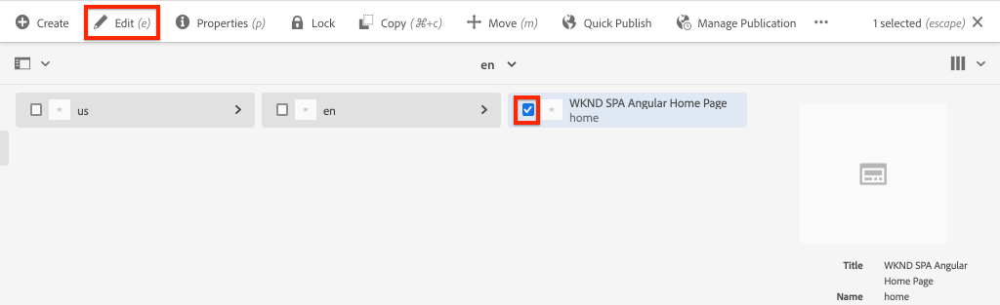

# SPA-editor-project {#create-project}

Leer hoe te om een Adobe Experience Manager (AEM) Gemaakt project als uitgangspunt voor een toepassing van Angular te gebruiken die met de Redacteur van het KUUROORD van AEM wordt geïntegreerd.

## Doelstelling

1. Begrijp de structuur van een nieuw project van de Redacteur van AEM SPA dat van een Maven archetype wordt gebouwd.
2. Implementeer het startproject in een lokale instantie van AEM.

## Wat u gaat maken

In dit hoofdstuk, wordt een nieuw project van AEM opgesteld, dat op [ wordt gebaseerd Archetype van het Project van AEM ](https://github.com/adobe/aem-project-archetype). Het AEM-project wordt opgestart met een eenvoudig startpunt voor de Angular SPA. Het in dit hoofdstuk gebruikte project zal als basis voor een implementatie van de KND SPA dienen en is voortgebouwd op in toekomstige hoofdstukken.


*een klassiek bericht van de Wereld van Hello.*

## Vereisten

Herzie het vereiste tooling en de instructies voor vestiging a [ lokale ontwikkelomgeving ](overview.md#local-dev-environment). Zorg ervoor dat een vers geval van Adobe Experience Manager, die op **auteur** wijze is begonnen, plaatselijk loopt.

## Het project ophalen

Er zijn verschillende opties voor het maken van een Maven Multi-Module-project voor AEM. Dit leerprogramma gebruikte het recentste [ Archetype van het Project van AEM ](https://github.com/adobe/aem-project-archetype) als basis voor de zelfstudiecode. De projectcode is gewijzigd om meerdere versies van AEM te ondersteunen. Gelieve te herzien [ de nota over achterwaartse verenigbaarheid ](overview.md#compatibility).

>[!CAUTION]
>
>Het is beste praktijken om de **recentste** versie van [ archetype ](https://github.com/adobe/aem-project-archetype) te gebruiken om een nieuw project voor een implementatie in de praktijk te produceren. AEM-projecten dienen zich te richten op één versie van AEM met behulp van de eigenschap `aemVersion` van het archetype.

1. Download het beginpunt voor deze zelfstudie via Git:

   ```shell
   $ git clone git@github.com:adobe/aem-guides-wknd-spa.git
   $ cd aem-guides-wknd-spa
   $ git checkout Angular/create-project-start
   ```

2. De volgende map en bestandsstructuur vertegenwoordigen het AEM-project dat is gegenereerd door het Maven-archetype op het lokale bestandssysteem:

   ```plain
   |--- aem-guides-wknd-spa
       |--- all/
       |--- core/
       |--- dispatcher/
       |--- ui.apps/
       |--- ui.apps.structure/
       |--- ui.content/
       |--- ui.frontend /
       |--- it.tests/
       |--- pom.xml
       |--- README.md
       |--- .gitignore
       |--- archetype.properties
   ```

3. De volgende eigenschappen werden gebruikt toen het produceren van het project van AEM van het [ archetype van het Project van AEM ](https://github.com/Adobe-Marketing-Cloud/aem-project-archetype/releases/tag/aem-project-archetype-14):

   | Eigenschap | Waarde |
   |-----------------|---------------------------------------|
   | aemVersion | wolk |
   | appTitle | WKND SPA Angular |
   | appId | wknd-spa-angulair |
   | groupId | com.adobe.aem.guides |
   | frontendModule | hoekig |
   | package | com.adobe.aem.guides.wknd.spa.angular |
   | includeExamples | n |

   >[!NOTE]
   >
   > Let op de eigenschap `frontendModule=angular` . Dit vertelt het Archetype van het Project van AEM om het project met een starter [ de codebasis van Angular ](https://experienceleague.adobe.com/docs/experience-manager-core-components/using/developing/archetype/uifrontend-angular.html) met de Redacteur van AEM te laarzen SPA.

## Het project bouwen

Daarna, compileert, bouwt, en stelt de projectcode aan een lokale instantie van AEM op gebruikend Maven.

1. Verzeker een geval van AEM plaatselijk op haven **4502** loopt.
2. Van de terminal van de bevellijn verifieert dat Maven geïnstalleerd is:

   ```shell
   $ mvn --version
   Apache Maven 3.6.2
   Maven home: /Library/apache-maven-3.6.2
   Java version: 11.0.4, vendor: Oracle Corporation, runtime: /Library/Java/JavaVirtualMachines/jdk-11.0.4.jdk/Contents/Home
   ```

3. Voer de onderstaande opdracht Maven uit vanuit de map `aem-guides-wknd-spa` om het project te maken en te implementeren in AEM:

   ```shell
   $ mvn -PautoInstallSinglePackage clean install
   ```

   Als het gebruiken van [ AEM 6.x ](overview.md#compatibility):

   ```shell
   $ mvn clean install -PautoInstallSinglePackage -Pclassic
   ```

   De veelvoudige modules van het project zouden moeten worden opgesteld en aan AEM worden opgesteld.

   ```plain
   [INFO] ------------------------------------------------------------------------
   [INFO] Reactor Summary for wknd-spa-angular 1.0.0-SNAPSHOT:
   [INFO] 
   [INFO] wknd-spa-angular ................................... SUCCESS [  0.473 s]
   [INFO] WKND SPA Angular - Core ............................ SUCCESS [ 54.866 s]
   [INFO] wknd-spa-angular.ui.frontend - UI Frontend ......... SUCCESS [02:10 min]
   [INFO] WKND SPA Angular - Repository Structure Package .... SUCCESS [  0.694 s]
   [INFO] WKND SPA Angular - UI apps ......................... SUCCESS [  6.351 s]
   [INFO] WKND SPA Angular - UI content ...................... SUCCESS [  2.885 s]
   [INFO] WKND SPA Angular - All ............................. SUCCESS [  1.736 s]
   [INFO] WKND SPA Angular - Integration Tests Bundles ....... SUCCESS [  2.563 s]
   [INFO] WKND SPA Angular - Integration Tests Launcher ...... SUCCESS [  1.846 s]
   [INFO] WKND SPA Angular - Dispatcher ...................... SUCCESS [  0.270 s]
   [INFO] ------------------------------------------------------------------------
   [INFO] BUILD SUCCESS
   [INFO] ------------------------------------------------------------------------
   ```

   Het Gemaakt profiel ***autoInstallSinglePackage*** compileert de individuele modules van het project en stelt één enkel pakket aan de instantie van AEM op. Door gebrek wordt dit pakket opgesteld aan een instantie van AEM die plaatselijk op haven **4502** loopt en met de geloofsbrieven van **admin:admin**.

4. Navigeer aan **[!UICONTROL Package Manager]** op uw lokale instantie van AEM: [ http://localhost:4502/crx/packmgr/index.jsp ](http://localhost:4502/crx/packmgr/index.jsp).

5. Er moeten drie pakketten worden weergegeven voor `wknd-spa-angular.all` , `wknd-spa-angular.ui.apps` en `wknd-spa-angular.ui.content` .

   

   Alle aangepaste code die nodig is voor het project, wordt in deze pakketten gebundeld en in de AEM-runtime geïnstalleerd.

6. Er moeten ook verschillende pakketten worden weergegeven voor `spa.project.core` en `core.wcm.components` . Dit zijn gebiedsdelen automatisch inbegrepen door archetype. Meer informatie over [ de Componenten van de Kern van AEM kan hier ](https://experienceleague.adobe.com/docs/experience-manager-core-components/using/introduction.html) worden gevonden.

## Inhoud auteur

Vervolgens opent u de starter-SPA die is gegenereerd door het archetype en werkt u een gedeelte van de inhoud bij.

1. Navigeer aan de **[!UICONTROL Sites]** console: [ http://localhost:4502/sites.html/content ](http://localhost:4502/sites.html/content).

   De WKND SPA omvat een basissitestructuur met een land, taal en homepage. Deze hiërarchie is gebaseerd op de standaardwaarden van het archetype voor `language_country` en `isSingleCountryWebsite` . Deze waarden kunnen worden beschreven door de [ beschikbare eigenschappen ](https://github.com/adobe/aem-project-archetype#available-properties) bij te werken wanneer het produceren van een project.

2. Open de pagina **[!DNL us]** > **[!DNL en]** > **[!DNL WKND SPA Angular Home Page]** door de pagina te selecteren en op de knop **[!UICONTROL Edit]** op de menubalk te klikken:

   

3. Er is al een component **[!UICONTROL Text]** toegevoegd aan de pagina. U kunt deze component op dezelfde manier bewerken als elke andere component in AEM.

   

4. Voeg een extra **[!UICONTROL Text]** -component aan de pagina toe.

   U ziet dat de ontwerpervaring vergelijkbaar is met die van een traditionele AEM Sites-pagina. Momenteel is een beperkt aantal componenten beschikbaar die kunnen worden gebruikt. Tijdens de zelfstudie wordt meer toegevoegd.

## De toepassing Eén pagina controleren

Controleer vervolgens of dit een toepassing voor één pagina is met gebruik van de ontwikkelaars van uw browser.

1. Klik in **[!UICONTROL Page Editor]** op het menu **[!UICONTROL Page Information]** > **[!UICONTROL View as Published]** :

   

   Dit zal een nieuw lusje met de vraagparameter `?wcmmode=disabled` openen die effectief de redacteur van AEM uitzet: [ http://localhost:4502/content/wknd-spa-angular/us/en/home.html?wcmmode=disabled ](http://localhost:4502/content/wknd-spa-angular/us/en/home.html?wcmmode=disabled)

2. Bekijk de bron van de pagina. U ziet dat de tekstinhoud **[!DNL Hello World]** of een van de andere inhoud niet is gevonden. In plaats daarvan ziet u HTML als volgt:

   ```html
   ...
   <body>
       <noscript>You need to enable JavaScript to run this app.</noscript>
       <div id="spa-root"></div>
       <script type="text/javascript" src="/etc.clientlibs/wknd-spa-angular/clientlibs/clientlib-angular.min.js"></script>
       ...
   </body>
   ...
   ```

   `clientlib-angular.min.js` is de Angular SPA die op de pagina wordt geladen en die verantwoordelijk is voor het renderen van de inhoud.

   *waar komt de inhoud uit?*

3. Terugkeer aan het lusje: [ http://localhost:4502/content/wknd-spa-angular/us/en/home.html?wcmmode=disabled](http://localhost:4502/content/wknd-spa-angular/us/en/home.html?wcmmode=disabled)
4. Open de de ontwikkelaarshulpmiddelen van browser en inspecteer het netwerkverkeer van de pagina tijdens verfrissen zich. Bekijk de **XHR** verzoeken:

   

   Er zou een verzoek aan [ http://localhost:4502/content/wknd-spa-angular/us/en.model.json ](http://localhost:4502/content/wknd-spa-angular/us/en.model.json) moeten zijn. Dit bevat alle inhoud, die in JSON wordt geformatteerd, die SPA zal drijven.

5. In een nieuw lusje, open [ http://localhost:4502/content/wknd-spa-angular/us/en.model.json](http://localhost:4502/content/wknd-spa-angular/us/en.model.json)

   De aanvraag `en.model.json` vertegenwoordigt het inhoudsmodel waarop de toepassing wordt gebaseerd. Controleer de JSON-uitvoer en u moet het fragment kunnen vinden dat de **[!UICONTROL Text]** -component(en) vertegenwoordigt.

   ```json
   ...
   ":items": {
       "text": {
           "text": "<p>Hello World! Updated content!</p>\r\n",
           "richText": true,
           ":type": "wknd-spa-angular/components/text"
       },
       "text_98796435": {
           "text": "<p>A new text component.</p>\r\n",
           "richText": true,
           ":type": "wknd-spa-angular/components/text"
   },
   ...
   ```

   In het volgende hoofdstuk zullen wij inspecteren hoe de inhoud JSON van de Componenten van AEM aan de Componenten van het KUUROORD wordt in kaart gebracht om de basis van de ervaring van de Redacteur van AEM te vormen SPA.

   >[!NOTE]
   >
   > Het kan handig zijn een browserextensie te installeren om de JSON-uitvoer automatisch op te maken.

## Gefeliciteerd! {#congratulations}

U hebt zojuist uw eerste AEM SPA Editor Project gemaakt.

Het is nu heel eenvoudig, maar in de volgende hoofdstukken wordt meer functionaliteit toegevoegd.

### Volgende stappen {#next-steps}

[ integreer het KUUROORD ](integrate-spa.md) - leer hoe de broncode van het KUUROORD met het Project van AEM wordt geïntegreerd en hulpmiddelen begrijpt beschikbaar om het KUUROORD snel te ontwikkelen.
