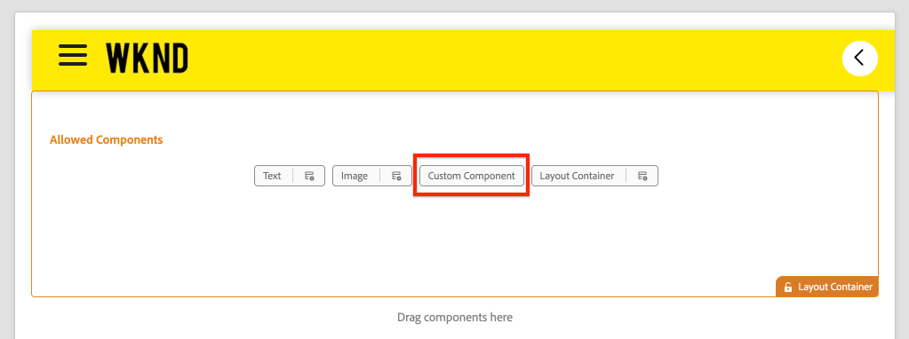

# Een aangepaste component maken {#custom-component}

Leer hoe te om een douanecomponent tot stand te brengen die met de Redacteur van AEM SPA moet worden gebruikt. Leer hoe u dialoogvensters met auteurs en Sling Models ontwikkelt om het JSON-model uit te breiden en een aangepaste component te vullen.

## Doelstelling

1. Begrijp de rol van Sling Models in het manipuleren van JSON model API die door AEM wordt verstrekt.
2. Begrijp hoe u dialoogvensters met AEM-componenten maakt.
3. Leer om de Component van AEM van de a **douane** tot stand te brengen die met het de redacteurskader van het KUUROORD compatibel is.

## Wat u gaat maken

De nadruk van vorige hoofdstukken ontwikkelde de componenten van het KUUROORD en in kaart brengend hen aan *bestaande* Componenten van de Kern van AEM. Dit hoofdstuk concentreert zich op hoe te om *nieuwe* componenten van AEM tot stand te brengen en uit te breiden en het model te manipuleren JSON dat door AEM wordt gediend.

Met een eenvoudige `Custom Component` worden de stappen geïllustreerd die nodig zijn om een nieuwe, net-nieuwe AEM-component te maken.

 wordt getoond

## Vereisten

Herzie het vereiste tooling en de instructies voor vestiging a [ lokale ontwikkelomgeving ](overview.md#local-dev-environment).

### De code ophalen

1. Download het beginpunt voor deze zelfstudie via Git:

   ```shell
   $ git clone git@github.com:adobe/aem-guides-wknd-spa.git
   $ cd aem-guides-wknd-spa
   $ git checkout Angular/custom-component-start
   ```

2. Implementeer de codebasis naar een lokale AEM-instantie met Maven:

   ```shell
   $ mvn clean install -PautoInstallSinglePackage
   ```

   Als het gebruiken van [ AEM 6.x ](overview.md#compatibility) voeg het `classic` profiel toe:

   ```shell
   $ mvn clean install -PautoInstallSinglePackage -Pclassic
   ```

3. Installeer het gebeëindigde pakket voor de traditionele [ WKND verwijzingsplaats ](https://github.com/adobe/aem-guides-wknd/releases/latest). De beelden die door [ worden verstrekt WKND verwijzingsplaats ](https://github.com/adobe/aem-guides-wknd/releases/latest) worden opnieuw gebruikt op WKND SPA. Het pakket kan worden geïnstalleerd gebruikend [ de Manager van het Pakket van AEM ](http://localhost:4502/crx/packmgr/index.jsp).

   

U kunt de gebeëindigde code op [ GitHub ](https://github.com/adobe/aem-guides-wknd-spa/tree/Angular/custom-component-solution) altijd bekijken of de code plaatselijk controleren door aan de tak `Angular/custom-component-solution` te schakelen.

## De AEM-component definiëren

Een AEM-component wordt gedefinieerd als een knooppunt en eigenschappen. In het project, worden deze knopen en eigenschappen vertegenwoordigd als dossiers van XML in de `ui.apps` module. Maak vervolgens de AEM-component in de module `ui.apps` .

>[!NOTE]
>
> Een snelle verfrisser op de [ grondbeginselen van de componenten van AEM kan nuttig zijn ](https://experienceleague.adobe.com/docs/experience-manager-learn/getting-started-wknd-tutorial-develop/project-archetype/component-basics.html).

1. Open de map `ui.apps` in de IDE van uw keuze.
2. Ga naar `ui.apps/src/main/content/jcr_root/apps/wknd-spa-angular/components` en maak een map met de naam `custom-component` .
3. Maak een bestand met de naam `.content.xml` onder de map `custom-component` . Vul de `custom-component/.content.xml` met het volgende:

   ```xml
   <?xml version="1.0" encoding="UTF-8"?>
   <jcr:root xmlns:sling="http://sling.apache.org/jcr/sling/1.0" xmlns:cq="http://www.day.com/jcr/cq/1.0" xmlns:jcr="http://www.jcp.org/jcr/1.0"
       jcr:primaryType="cq:Component"
       jcr:title="Custom Component"
       componentGroup="WKND SPA Angular - Content"/>
   ```

   

   `jcr:primaryType="cq:Component"` - Geeft aan dat dit knooppunt een AEM-component is.

   `jcr:title` is de waarde die wordt weergegeven aan Content Authors en `componentGroup` bepaalt de groepering van componenten in de ontwerpinterface.

4. Maak onder de map `custom-component` een andere map met de naam `_cq_dialog` .
5. Onder de map `_cq_dialog` maakt u een bestand met de naam `.content.xml` en vult u dit met het volgende:

   ```xml
   <?xml version="1.0" encoding="UTF-8"?>
   <jcr:root xmlns:sling="http://sling.apache.org/jcr/sling/1.0" xmlns:granite="http://www.adobe.com/jcr/granite/1.0" xmlns:cq="http://www.day.com/jcr/cq/1.0" xmlns:jcr="http://www.jcp.org/jcr/1.0" xmlns:nt="http://www.jcp.org/jcr/nt/1.0"
       jcr:primaryType="nt:unstructured"
       jcr:title="Custom Component"
       sling:resourceType="cq/gui/components/authoring/dialog">
       <content
           jcr:primaryType="nt:unstructured"
           sling:resourceType="granite/ui/components/coral/foundation/container">
           <items jcr:primaryType="nt:unstructured">
               <tabs
                   jcr:primaryType="nt:unstructured"
                   sling:resourceType="granite/ui/components/coral/foundation/tabs"
                   maximized="{Boolean}true">
                   <items jcr:primaryType="nt:unstructured">
                       <properties
                           jcr:primaryType="nt:unstructured"
                           jcr:title="Properties"
                           sling:resourceType="granite/ui/components/coral/foundation/container"
                           margin="{Boolean}true">
                           <items jcr:primaryType="nt:unstructured">
                               <columns
                                   jcr:primaryType="nt:unstructured"
                                   sling:resourceType="granite/ui/components/coral/foundation/fixedcolumns"
                                   margin="{Boolean}true">
                                   <items jcr:primaryType="nt:unstructured">
                                       <column
                                           jcr:primaryType="nt:unstructured"
                                           sling:resourceType="granite/ui/components/coral/foundation/container">
                                           <items jcr:primaryType="nt:unstructured">
                                               <message
                                                   jcr:primaryType="nt:unstructured"
                                                   sling:resourceType="granite/ui/components/coral/foundation/form/textfield"
                                                   fieldDescription="The text to display on the component."
                                                   fieldLabel="Message"
                                                   name="./message"/>
                                           </items>
                                       </column>
                                   </items>
                               </columns>
                           </items>
                       </properties>
                   </items>
               </tabs>
           </items>
       </content>
   </jcr:root>
   ```

   ](assets/custom-component/dialog-custom-component-defintion.png) de definitie van de Component van 0} Douane![

   Het bovenstaande XML-bestand genereert een eenvoudig dialoogvenster voor de `Custom Component` . Het kritieke deel van het bestand is de binnenste `<message>` -node. Dit dialoogvenster bevat een eenvoudige `textfield` naam `Message` en blijft de waarde van het veld textiel bevatten voor een eigenschap met de naam `message` .

   Er wordt een verkoopmodel gemaakt naast de waarde van de eigenschap `message` via het JSON-model.

   >[!NOTE]
   >
   > U kunt veel meer [ voorbeelden van dialogen bekijken door de definities van de Component van de Kern te bekijken ](https://github.com/adobe/aem-core-wcm-components/tree/master/content/src/content/jcr_root/apps/core/wcm/components). U kunt extra vormgebieden, zoals `select`, `textarea`, `pathfield` ook bekijken, beschikbaar onder `/libs/granite/ui/components/coral/foundation/form` in [ CRXDE-Lite ](http://localhost:4502/crx/de/index.jsp#/libs/granite/ui/components/coral/foundation/form).

   Met een traditionele component van AEM, wordt een [ HTML ](https://experienceleague.adobe.com/docs/experience-manager-htl/content/overview.html) manuscript typisch vereist. Aangezien SPA de component teruggeeft, is geen manuscript van HTML nodig.

## Het verkoopmodel maken

Sling-modellen zijn annotaties die worden aangedreven door Java™ &quot;POJO&#39;s&quot; (gewone oude Java™-objecten) en die het gemakkelijker maken gegevens van de JCR aan Java™-variabelen toe te wijzen. [ het Sling Modellen ](https://experienceleague.adobe.com/docs/experience-manager-learn/getting-started-wknd-tutorial-develop/project-archetype/component-basics.html#sling-models) functioneren typisch om complexe server-kant bedrijfslogica voor de Componenten van AEM in te kapselen.

In de context van de Redacteur van het KUUROORD, blootstellen het Verdelen Modellen de inhoud van een component door het model JSON door een eigenschap gebruikend [ het Verdelen ModelExporter ](https://experienceleague.adobe.com/docs/experience-manager-learn/foundation/development/develop-sling-model-exporter.html).

1. Open de module `core` in de IDE van uw keuze. `CustomComponent.java` en `CustomComponentImpl.java` zijn al gemaakt en uitgestald als onderdeel van de begincode van het hoofdstuk.

   >[!NOTE]
   >
   > Als het gebruiken van winde van de Code van Visual Studio, kan het nuttig zijn om [ uitbreidingen voor Java™ ](https://code.visualstudio.com/docs/java/extensions) te installeren.

2. Open de Java™-interface `CustomComponent.java` op `core/src/main/java/com/adobe/aem/guides/wknd/spa/angular/core/models/CustomComponent.java` :

   

   Dit is de Java™ interface die door het het Verkopen Model wordt uitgevoerd.

3. Werk `CustomComponent.java` bij zodat de interface van `ComponentExporter` wordt uitgebreid:

   ```java
   package com.adobe.aem.guides.wknd.spa.angular.core.models;
   import com.adobe.cq.export.json.ComponentExporter;
   
   public interface CustomComponent extends ComponentExporter {
   
       public String getMessage();
   
   }
   ```

   Het implementeren van de interface `ComponentExporter` is een vereiste dat het Sling-model automatisch wordt opgenomen door de JSON-model-API.

   De interface `CustomComponent` bevat één methode getter `getMessage()` . Dit is de methode die de waarde van de auteurdialoog door het model JSON blootstelt. Alleen methoden getter met lege parameters `()` worden geëxporteerd in het JSON-model.

4. Open `CustomComponentImpl.java` om `core/src/main/java/com/adobe/aem/guides/wknd/spa/angular/core/models/impl/CustomComponentImpl.java` .

   Dit is de implementatie van de interface `CustomComponent` . In de annotatie `@Model` wordt de Java™-klasse aangeduid als een Sling Model. Met de `@Exporter` -annotatie kan de Java™-klasse via serienummering worden geserialiseerd en geëxporteerd via de Sling Model Exporter.

5. Werk de statische variabele `RESOURCE_TYPE` bij om naar de AEM-component `wknd-spa-angular/components/custom-component` te verwijzen die in de vorige exercitie is gemaakt.

   ```java
   static final String RESOURCE_TYPE = "wknd-spa-angular/components/custom-component";
   ```

   Het hulpmiddeltype van de component is wat het het Schuintrekken Model aan de component van AEM bindt en uiteindelijk aan de component van Angular in kaart brengt.

6. Voeg de methode `getExportedType()` toe aan de klasse `CustomComponentImpl` om het type van componentbron te retourneren:

   ```java
   @Override
   public String getExportedType() {
       return CustomComponentImpl.RESOURCE_TYPE;
   }
   ```

   Deze methode is vereist bij het implementeren van de `ComponentExporter` -interface en stelt het brontype beschikbaar dat de toewijzing aan de Angular-component toestaat.

7. Werk de methode `getMessage()` bij om de waarde te retourneren van de eigenschap `message` die door het dialoogvenster van de auteur wordt voortgezet. Gebruik de `@ValueMap` -annotatie om de JCR-waarde `message` toe te wijzen aan een Java™-variabele:

   ```java
   import org.apache.commons.lang3.StringUtils;
   ...
   
   @ValueMapValue
   private String message;
   
   @Override
   public String getMessage() {
       return StringUtils.isNotBlank(message) ? message.toUpperCase() : null;
   }
   ```

   Er worden extra &#39;bedrijfslogica&#39; toegevoegd om de waarde van het bericht als hoofdletter te retourneren. Hierdoor kunnen we het verschil zien tussen de onbewerkte waarde die is opgeslagen door het dialoogvenster van de auteur en de waarde die wordt weergegeven door het model Sling.

   >[!NOTE]
   >
   > U kunt [ gebeëindigd CustomComponentImpl.java hier bekijken ](https://github.com/adobe/aem-guides-wknd-spa/blob/Angular/custom-component-solution/core/src/main/java/com/adobe/aem/guides/wknd/spa/angular/core/models/impl/CustomComponentImpl.java).

## De Angular-component bijwerken

De Angular-code voor de aangepaste component is al gemaakt. Voer vervolgens een aantal updates uit om de Angular-component toe te wijzen aan de AEM-component.

1. Open het bestand in de module `ui.frontend` `ui.frontend/src/app/components/custom/custom.component.ts`
2. Bekijk de regel `@Input() message: string;` . Verwacht wordt dat de getransformeerde hoofdletterwaarde aan deze variabele wordt toegewezen.
3. Importeer het `MapTo` -object uit de AEM SPA Editor JS SDK en gebruik dit om het toe te wijzen aan de AEM-component:

   ```diff
   + import {MapTo} from '@adobe/cq-angular-editable-components';
   
    ...
    export class CustomComponent implements OnInit {
        ...
    }
   
   + MapTo('wknd-spa-angular/components/custom-component')(CustomComponent, CustomEditConfig);
   ```

4. Open `cutom.component.html` en controleer of de waarde van `{{message}}` wordt weergegeven naast een `<h2>` -tag.
5. Open `custom.component.css` en voeg de volgende regel toe:

   ```css
   :host-context {
       display: block;
   }
   ```

   De tijdelijke aanduiding voor de weergave van de AEM Editor is alleen correct wanneer de component leeg is. `:host-context` of een andere `<div>` moet worden ingesteld op `display: block;` .

6. Implementeer de updates voor een lokale AEM-omgeving vanuit de hoofdmap van de projectmap met behulp van uw Maven-vaardigheden:

   ```shell
   $ cd aem-guides-wknd-spa
   $ mvn clean install -PautoInstallSinglePackage
   ```

## Sjabloonbeleid bijwerken

Navigeer vervolgens naar AEM om de updates te controleren en toe te staan dat de `Custom Component` wordt toegevoegd aan de SPA.

1. Verifieer de registratie van het nieuwe Verschuivende Model door aan [ http://localhost:4502/system/console/status-slingmodels ](http://localhost:4502/system/console/status-slingmodels) te navigeren.

   ```plain
   com.adobe.aem.guides.wknd.spa.angular.core.models.impl.CustomComponentImpl - wknd-spa-angular/components/custom-component
   
   com.adobe.aem.guides.wknd.spa.angular.core.models.impl.CustomComponentImpl exports 'wknd-spa-angular/components/custom-component' with selector 'model' and extension '[Ljava.lang.String;@6fb4a693' with exporter 'jackson'
   ```

   De bovenstaande twee regels geven aan dat de `CustomComponentImpl` is gekoppeld aan de `wknd-spa-angular/components/custom-component` -component en dat deze is geregistreerd via de Sling Model Exporter.

2. Navigeer aan het Malplaatje van de Pagina van het KUUROORD in [ http://localhost:4502/editor.html/conf/wknd-spa-angular/settings/wcm/templates/spa-page-template/structure.html ](http://localhost:4502/editor.html/conf/wknd-spa-angular/settings/wcm/templates/spa-page-template/structure.html).
3. Werk het beleid van de Container van de Lay-out bij om nieuwe `Custom Component` als toegestane component toe te voegen:

   

   Sla de wijzigingen in het beleid op en bekijk de `Custom Component` als een toegestane component:

   

## Auteur van de aangepaste component

Vervolgens ontwerpt u de `Custom Component` met gebruik van de AEM SPA Editor.

1. Navigeer aan [ http://localhost:4502/editor.html/content/wknd-spa-angular/us/en/home.html ](http://localhost:4502/editor.html/content/wknd-spa-angular/us/en/home.html).
2. Voeg in de modus `Edit` de `Custom Component` toe aan de `Layout Container` :

   

3. Open het dialoogvenster van de component en voer een bericht in dat kleine letters bevat.

   

   Dit is het dialoogvenster dat is gemaakt op basis van het XML-bestand dat eerder in het hoofdstuk is opgenomen.

4. Sla de wijzigingen op. Merk op dat het getoonde bericht in alle gekapitaliseerd is.

    wordt getoond

5. Bekijk het model JSON door aan [ http://localhost:4502/content/wknd-spa-angular/us/en.model.json ](http://localhost:4502/content/wknd-spa-angular/us/en.model.json) te navigeren. Zoeken naar `wknd-spa-angular/components/custom-component` :

   ```json
   "custom_component_208183317": {
       "message": "HELLO WORLD",
       ":type": "wknd-spa-angular/components/custom-component"
   }
   ```

   De JSON-waarde wordt ingesteld op alle hoofdletters op basis van de logica die aan het Sling-model is toegevoegd.

## Gefeliciteerd! {#congratulations}

U hebt geleerd hoe u een aangepaste AEM-component kunt maken en hoe de modellen en dialoogvensters voor verkopers werken met het JSON-model.

U kunt de gebeëindigde code op [ GitHub ](https://github.com/adobe/aem-guides-wknd-spa/tree/Angular/custom-component-solution) altijd bekijken of de code plaatselijk controleren door aan de tak `Angular/custom-component-solution` te schakelen.

### Volgende stappen {#next-steps}

[ breidt een Component van de Kern ](extend-component.md) uit - leer hoe te om een bestaande Component van de Kern uit te breiden die met de Redacteur van AEM SPA moet worden gebruikt. Het begrip hoe te om eigenschappen en inhoud aan een bestaande component toe te voegen is een krachtige techniek om de mogelijkheden van een implementatie van de Redacteur van AEM uit te breiden SPA.
