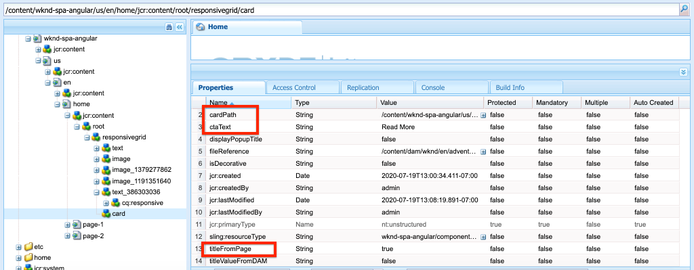

# Een kerncomponent uitbreiden {#extend-component}

Leer hoe te om een bestaande Component van de Kern uit te breiden die met de Redacteur van AEM SPA moet worden gebruikt. Begrijpen hoe te om een bestaande component uit te breiden is een krachtige techniek om de mogelijkheden van een implementatie van de Redacteur van AEM aan te passen en uit te breiden SPA.

## Doelstelling

1. Breid een bestaande Component van de Kern met extra eigenschappen en inhoud uit.
2. Begrijp de basis van Componentovererving met het gebruik van `sling:resourceSuperType`.
3. Leer hoe te om het [ Patroon van de Delegatie ](https://github.com/adobe/aem-core-wcm-components/wiki/Delegation-Pattern-for-Sling-Models) voor het Verdelen Modellen te gebruiken om bestaande logica en functionaliteit opnieuw te gebruiken.

## Wat u gaat maken

In dit hoofdstuk wordt een nieuwe component `Card` gemaakt. De `Card` component breidt de [ Component van de Kern van het Beeld ](https://experienceleague.adobe.com/docs/experience-manager-core-components/using/components/image.html) uit toevoegend extra inhoudsgebieden zoals een Titel en een Vraag aan de knoop van de Actie om de rol van een meetapparaat voor andere inhoud binnen het KUUROORD uit te voeren.


>[!NOTE]
>
> In een implementatie in de praktijk kan het geschikter zijn om de [ Component van de Taser ](https://experienceleague.adobe.com/docs/experience-manager-core-components/using/components/teaser.html) eenvoudig te gebruiken dan het uitbreiden van de [ Component van de Kern van het Beeld ](https://experienceleague.adobe.com/docs/experience-manager-core-components/using/components/image.html) om een `Card` component afhankelijk van projectvereisten te maken. Het wordt altijd geadviseerd om [ Componenten van de Kern ](https://experienceleague.adobe.com/docs/experience-manager-core-components/using/introduction.html) direct te gebruiken wanneer mogelijk.

## Vereisten

Herzie het vereiste tooling en de instructies voor vestiging a [ lokale ontwikkelomgeving ](overview.md#local-dev-environment).

### De code ophalen

1. Download het beginpunt voor deze zelfstudie via Git:

   ```shell
   $ git clone git@github.com:adobe/aem-guides-wknd-spa.git
   $ cd aem-guides-wknd-spa
   $ git checkout Angular/extend-component-start
   ```

2. Implementeer de codebasis naar een lokale AEM-instantie met Maven:

   ```shell
   $ mvn clean install -PautoInstallSinglePackage
   ```

   Als het gebruiken van [ AEM 6.x ](overview.md#compatibility) voeg het `classic` profiel toe:

   ```shell
   $ mvn clean install -PautoInstallSinglePackage -Pclassic
   ```

3. Installeer het gebeëindigde pakket voor de traditionele [ WKND verwijzingsplaats ](https://github.com/adobe/aem-guides-wknd/releases/tag/aem-guides-wknd-2.1.0). De beelden die door [ worden verstrekt WKND verwijzingsplaats ](https://github.com/adobe/aem-guides-wknd/releases/latest) wordt opnieuw gebruikt op WKND SPA. Het pakket kan worden geïnstalleerd gebruikend [ de Manager van het Pakket van AEM ](http://localhost:4502/crx/packmgr/index.jsp).

   

U kunt de gebeëindigde code op [ GitHub ](https://github.com/adobe/aem-guides-wknd-spa/tree/Angular/extend-component-solution) altijd bekijken of de code plaatselijk controleren door aan de tak `Angular/extend-component-solution` te schakelen.

## Eerste kaartimplementatie controleren

De begincode van het hoofdstuk bevat een eerste kaartcomponent. Inspecteer het beginpunt voor de implementatie van de Kaart.

1. Open de module `ui.apps` in de IDE van uw keuze.
2. Navigeer naar `ui.apps/src/main/content/jcr_root/apps/wknd-spa-angular/components/card` en bekijk het `.content.xml` -bestand.

   

   ```xml
   <?xml version="1.0" encoding="UTF-8"?>
   <jcr:root xmlns:sling="http://sling.apache.org/jcr/sling/1.0" xmlns:cq="http://www.day.com/jcr/cq/1.0" xmlns:jcr="http://www.jcp.org/jcr/1.0"
       jcr:primaryType="cq:Component"
       jcr:title="Card"
       sling:resourceSuperType="wknd-spa-angular/components/image"
       componentGroup="WKND SPA Angular - Content"/>
   ```

   De eigenschap `sling:resourceSuperType` verwijst naar `wknd-spa-angular/components/image` die aangeeft dat de component `Card` de functionaliteit overerft van de component WKND SPA Image.

3. Controleer het bestand `ui.apps/src/main/content/jcr_root/apps/wknd-spa-angular/components/image/.content.xml` :

   ```xml
   <?xml version="1.0" encoding="UTF-8"?>
   <jcr:root xmlns:sling="http://sling.apache.org/jcr/sling/1.0" xmlns:cq="http://www.day.com/jcr/cq/1.0" xmlns:jcr="http://www.jcp.org/jcr/1.0"
       jcr:primaryType="cq:Component"
       jcr:title="Image"
       sling:resourceSuperType="core/wcm/components/image/v2/image"
       componentGroup="WKND SPA Angular - Content"/>
   ```

   De `sling:resourceSuperType` verwijst naar `core/wcm/components/image/v2/image` . Dit wijst erop dat de component van het Beeld WKND SPA de functionaliteit van het Beeld van de Component van de Kern erft.

   Ook gekend als het [ patroon van de Volmacht ](https://experienceleague.adobe.com/docs/experience-manager-core-components/using/developing/guidelines.html#proxy-component-pattern) Verschuivende middelovererving is een krachtig ontwerppatroon voor het toestaan van kindcomponenten om functionaliteit te erven en gedrag uit te breiden/met voeten te treden wanneer gewenst. De overerving van de verkoop steunt veelvoudige niveaus van overerving, zodat erft de nieuwe `Card` component uiteindelijk functionaliteit van het Beeld van de Component van de Kern.

   Veel ontwikkelingsteams streven ernaar om D.R.Y. te zijn (herhaal jezelf niet). Dit is mogelijk met AEM als gevolg van het verkopen van erfenis.

4. Open het bestand `_cq_dialog/.content.xml` onder de map `card` .

   Dit bestand is de definitie in het dialoogvenster Component voor de component `Card` . Als het gebruiken van het Verdelen overerving, is het mogelijk om eigenschappen van de [ Verschuivende Fusie van het Middel ](https://experienceleague.adobe.com/docs/experience-manager-65/developing/platform/sling-resource-merger.html) te gebruiken om gedeelten van de dialoog met voeten te treden of uit te breiden. In dit voorbeeld is een nieuw tabblad toegevoegd aan het dialoogvenster om aanvullende gegevens van een auteur vast te leggen om de kaartcomponent te vullen.

   Met eigenschappen als `sling:orderBefore` kan een ontwikkelaar kiezen waar nieuwe tabbladen of formuliervelden moeten worden ingevoegd. In dit geval wordt de tab `Text` ingevoegd vóór de tab `asset` . Om volledig gebruik van de Verschuivende Fusie van het Middel te maken, is het belangrijk om de originele structuur van de dialoogknoop voor de [ de componentendialoog van het Beeld ](https://github.com/adobe/aem-core-wcm-components/blob/master/content/src/content/jcr_root/apps/core/wcm/components/image/v2/image/_cq_dialog/.content.xml) te kennen.

5. Open het bestand `_cq_editConfig.xml` onder de map `card` . Dit bestand schrijft het gedrag voor slepen en neerzetten voor in de AEM-ontwerpinterface. Wanneer het uitbreiden van de component van het Beeld, is het belangrijk dat het middeltype de component zelf aanpast. Controleer het knooppunt `<parameters>` :

   ```xml
   <parameters
       jcr:primaryType="nt:unstructured"
       sling:resourceType="wknd-spa-angular/components/card"
       imageCrop=""
       imageMap=""
       imageRotate=""/>
   ```

   De meeste componenten vereisen geen `cq:editConfig` , de Afbeelding en onderliggende afstammelingen van de component Image zijn uitzonderingen.

6. In de schakelaar IDE aan de `ui.frontend` module, navigerend aan `ui.frontend/src/app/components/card`:

   

7. Controleer het bestand `card.component.ts` .

   De component is al uitgestald om met behulp van de standaardfunctie `MapTo` toe te wijzen aan de AEM `Card` -component.

   ```js
   MapTo('wknd-spa-angular/components/card')(CardComponent, CardEditConfig);
   ```

   Controleer de drie parameters `@Input` in de klasse voor `src` , `alt` en `title` . Deze worden JSON-waarden van de AEM-component verwacht die worden toegewezen aan de Angular-component.

8. Open het bestand `card.component.html` :

   ```html
   <div class="card"  *ngIf="hasContent">
       <app-image class="card__image" [src]="src" [alt]="alt" [title]="title"></app-image>
   </div>
   ```

   In dit voorbeeld hebben we ervoor gekozen de bestaande Angular Image-component `app-image` opnieuw te gebruiken door de `@Input` -parameters vanuit `card.component.ts` door te geven. Verderop in de zelfstudie worden extra eigenschappen toegevoegd en weergegeven.

## Sjabloonbeleid bijwerken

Met deze eerste `Card` -implementatie controleert u de functionaliteit in de AEM SPA Editor. Als u de eerste `Card` -component wilt zien, moet het sjabloonbeleid worden bijgewerkt.

1. Implementeer de startcode naar een lokale instantie van AEM, als u dat nog niet hebt gedaan:

   ```shell
   $ cd aem-guides-wknd-spa
   $ mvn clean install -PautoInstallSinglePackage
   ```

2. Navigeer aan het Malplaatje van de Pagina van het KUUROORD in [ http://localhost:4502/editor.html/conf/wknd-spa-angular/settings/wcm/templates/spa-page-template/structure.html ](http://localhost:4502/editor.html/conf/wknd-spa-angular/settings/wcm/templates/spa-page-template/structure.html).
3. Werk het beleid van de container voor lay-out bij om de nieuwe component `Card` toe te voegen als een toegestane component:

   

   Sla de wijzigingen in het beleid op en bekijk de component `Card` als een toegestane component:

   

## Aanvankelijke kaartcomponent van auteur

Vervolgens ontwerpt u de component `Card` met gebruik van de AEM SPA Editor.

1. Navigeer aan [ http://localhost:4502/editor.html/content/wknd-spa-angular/us/en/home.html ](http://localhost:4502/editor.html/content/wknd-spa-angular/us/en/home.html).
2. Voeg in de modus `Edit` de component `Card` toe aan de component `Layout Container` :

    in

3. Sleep een afbeelding van de zoekfunctie voor middelen naar de component `Card` :

    toe

4. Open de `Card` componentendialoog en merk de toevoeging van a **Tekst** Lusje op.
5. Ga de volgende waarden op het **Tekst** lusje in:

   

   **Weg van de Kaart** - kies een pagina onder de homepage van het KUUROORD.

   **Tekst van CTA** - &quot;Lees meer&quot;

   **Titel van de Kaart** - verlaten leeg

   **krijgt titel van verbonden pagina** - controleer checkbox om waar te wijzen.

6. Werk het **lusje van Metagegevens van Activa** bij om waarden voor **Alternatieve Tekst** en **Titel** toe te voegen.

   Er worden momenteel geen aanvullende wijzigingen weergegeven na het bijwerken van het dialoogvenster. Als u de nieuwe velden toegankelijk wilt maken voor de Angular-component, moet het Sling-model voor de `Card` -component worden bijgewerkt.

7. Open een nieuw lusje en navigeer aan [ CRXDE-Lite ](http://localhost:4502/crx/de/index.jsp#/content/wknd-spa-angular/us/en/home/jcr%3Acontent/root/responsivegrid/card). Controleer de inhoudsknooppunten onder `/content/wknd-spa-angular/us/en/home/jcr:content/root/responsivegrid` om de inhoud van de component `Card` te zoeken.

   

   De eigenschappen `cardPath`, `ctaText`, `titleFromPage` blijven in het dialoogvenster behouden.

## Model voor kaartverkoop bijwerken

Als u uiteindelijk de waarden uit het dialoogvenster met componenten toegankelijk wilt maken voor de Angular-component, moet u het Sling-model bijwerken dat de JSON voor de `Card` -component vult. Wij hebben ook de kans om twee stukken bedrijfslogica uit te voeren:

* Als `titleFromPage` aan **waar**, de titel van de pagina terugkeert die door `cardPath` anders wordt gespecificeerd de waarde van `cardTitle` textfield terugkeren.
* Retourneer de laatste gewijzigde datum van de pagina die is opgegeven door `cardPath` .

Ga terug naar de IDE van uw keuze en open de module `core` .

1. Open het bestand `Card.java` om `core/src/main/java/com/adobe/aem/guides/wknd/spa/angular/core/models/Card.java` .

   Merk op dat de interface `Card` momenteel `com.adobe.cq.wcm.core.components.models.Image` uitbreidt en daarom de methoden van de interface `Image` overerft. De interface `Image` breidt reeds de `ComponentExporter` interface uit die het het Verdelen Model om als JSON toelaat worden uitgevoerd en door de redacteur van het KUUROORD in kaart gebracht. Daarom te hoeven wij niet uitdrukkelijk om `ComponentExporter` interface uit te breiden zoals wij in het [ hoofdstuk van de Component van de Douane ](custom-component.md) deden.

2. Voeg de volgende methodes aan de interface toe:

   ```java
   @ProviderType
   public interface Card extends Image {
   
       /***
       * The URL to populate the CTA button as part of the card.
       * The link should be based on the cardPath property that points to a page.
       * @return String URL
       */
       public String getCtaLinkURL();
   
       /***
       * The text to display on the CTA button of the card.
       * @return String CTA text
       */
       public String getCtaText();
   
   
   
       /***
       * The date to be displayed as part of the card.
       * This is based on the last modified date of the page specified by the cardPath
       * @return
       */
       public Calendar getCardLastModified();
   
   
       /**
       * Return the title of the page specified by cardPath if `titleFromPage` is set to true.
       * Otherwise return the value of `cardTitle`
       * @return
       */
       public String getCardTitle();
   }
   ```

   Deze methoden worden beschikbaar gesteld via de JSON-model-API en doorgegeven aan de Angular-component.

3. Openen `CardImpl.java` . Dit is de implementatie van `Card.java` interface. Deze implementatie is gedeeltelijk stopgezet om de zelfstudie te versnellen.  Let op het gebruik van de `@Model` - en `@Exporter` -aantekeningen om ervoor te zorgen dat het Sling-model via de Sling Model Exporter met serienummering kan worden gecodeerd als JSON.

   `CardImpl.java` gebruikt ook het [ patroon van de Delegatie voor het Verdelen Modellen ](https://github.com/adobe/aem-core-wcm-components/wiki/Delegation-Pattern-for-Sling-Models) om het herschrijven van de logica van de Component van de Kern van het Beeld te vermijden.

4. Neem de volgende regels in acht:

   ```java
   @Self
   @Via(type = ResourceSuperType.class)
   private Image image;
   ```

   De bovenstaande aantekening instantieert een afbeeldingsobject met de naam `image` op basis van de `sling:resourceSuperType` overerving van de component `Card` .

   ```java
   @Override
   public String getSrc() {
       return null != image ? image.getSrc() : null;
   }
   ```

   Het is dan mogelijk om het `image` -object eenvoudig te gebruiken voor het implementeren van methoden die zijn gedefinieerd door de `Image` -interface, zonder dat u zelf de logica hoeft te schrijven. Deze techniek wordt gebruikt voor `getSrc()` , `getAlt()` en `getTitle()` .

5. Implementeer vervolgens de methode `initModel()` om een variabele van het type private te initiëren `cardPage` op basis van de waarde van `cardPath`

   ```java
   @PostConstruct
   public void initModel() {
       if(StringUtils.isNotBlank(cardPath) && pageManager != null) {
           cardPage = pageManager.getPage(this.cardPath);
       }
   }
   ```

   `@PostConstruct initModel()` wordt geroepen wanneer het het Verdelen Model wordt geïnitialiseerd, daarom is het een goede gelegenheid om voorwerpen te initialiseren die door andere methodes in het model kunnen worden gebruikt. `pageManager` is één van verscheidene [ Java™ gesteunde globale voorwerpen ](https://experienceleague.adobe.com/docs/experience-manager-htl/content/global-objects.html) ter beschikking gesteld aan het Schuiven Modellen via de `@ScriptVariable` aantekening. De [ getPage ](https://developer.adobe.com/experience-manager/reference-materials/cloud-service/javadoc/com/day/cq/wcm/api/PageManager.html) methode neemt in een weg en keert een voorwerp van de Pagina van AEM [&#128279;](https://developer.adobe.com/experience-manager/reference-materials/cloud-service/javadoc/com/day/cq/wcm/api/Page.html) terug of ongeldig als de weg niet aan een geldige pagina richt.

   Hierdoor wordt de variabele `cardPage` geïnitialiseerd, die door de andere nieuwe methoden wordt gebruikt om gegevens over de onderliggende gekoppelde pagina te retourneren.

6. Bekijk de algemene variabelen die al zijn toegewezen aan de JCR-eigenschappen die in het dialoogvenster met auteurs zijn opgeslagen. De annotatie `@ValueMapValue` wordt gebruikt om de toewijzing automatisch uit te voeren.

   ```java
   @ValueMapValue
   private String cardPath;
   
   @ValueMapValue
   private String ctaText;
   
   @ValueMapValue
   private boolean titleFromPage;
   
   @ValueMapValue
   private String cardTitle;
   ```

   Deze variabelen worden gebruikt om de extra methodes voor de `Card.java` interface uit te voeren.

7. Voer de extra methodes uit die in de `Card.java` interface worden bepaald:

   ```java
   @Override
   public String getCtaLinkURL() {
       if(cardPage != null) {
           return cardPage.getPath() + ".html";
       }
       return null;
   }
   
   @Override
   public String getCtaText() {
       return ctaText;
   }
   
   @Override
   public Calendar getCardLastModified() {
      if(cardPage != null) {
          return cardPage.getLastModified();
      }
      return null;
   }
   
   @Override
   public String getCardTitle() {
       if(titleFromPage) {
           return cardPage != null ? cardPage.getTitle() : null;
       }
       return cardTitle;
   }
   ```

   >[!NOTE]
   >
   > U kunt [ gebeëindigde CardImpl.java hier bekijken ](https://github.com/adobe/aem-guides-wknd-spa/blob/Angular/extend-component-solution/core/src/main/java/com/adobe/aem/guides/wknd/spa/angular/core/models/impl/CardImpl.java).

8. Open een terminalvenster en implementeer alleen de updates voor de module `core` met behulp van het profiel Maven `autoInstallBundle` uit de map `core` .

   ```shell
   $ cd core/
   $ mvn clean install -PautoInstallBundle
   ```

   Als het gebruiken van [ AEM 6.x ](overview.md#compatibility) het `classic` profiel toevoegt.

9. Bekijk de JSON modelreactie bij: [ http://localhost:4502/content/wknd-spa-angular/us/en.model.json ](http://localhost:4502/content/wknd-spa-angular/us/en.model.json) en onderzoek naar `wknd-spa-angular/components/card`:

   ```json
   "card": {
       "ctaText": "Read More",
       "cardTitle": "Page 1",
       "title": "Woman chillaxing with river views in Australian bushland",
       "src": "/content/wknd-spa-angular/us/en/home/_jcr_content/root/responsivegrid/card.coreimg.jpeg/1595190732886/adobestock-216674449.jpeg",
       "alt": "Female sitting on a large rock relaxing in afternoon dappled light the Australian bushland with views over the river",
       "cardLastModified": 1591360492414,
       "ctaLinkURL": "/content/wknd-spa-angular/us/en/home/page-1.html",
       ":type": "wknd-spa-angular/components/card"
   }
   ```

   U ziet dat het JSON-model wordt bijgewerkt met extra sleutel-/waardeparen nadat de methoden in het `CardImpl` Sling-model zijn bijgewerkt.

## Angular-component bijwerken

Nu het JSON-model is gevuld met nieuwe eigenschappen voor `ctaLinkURL` , `ctaText` , `cardTitle` en `cardLastModified` , kunnen we de Angular-component bijwerken en deze weergeven.

1. Keer terug naar winde en open de `ui.frontend` module. Start eventueel de webpack-ontwikkelserver vanuit een nieuw terminalvenster om de wijzigingen in real-time te zien:

   ```shell
   $ cd ui.frontend
   $ npm install
   $ npm start
   ```

2. Open `card.component.ts` om `ui.frontend/src/app/components/card/card.component.ts` . Voeg de aanvullende `@Input` -annotaties toe om het nieuwe model vast te leggen:

   ```diff
   export class CardComponent implements OnInit {
   
        @Input() src: string;
        @Input() alt: string;
        @Input() title: string;
   +    @Input() cardTitle: string;
   +    @Input() cardLastModified: number;
   +    @Input() ctaLinkURL: string;
   +    @Input() ctaText: string;
   ```

3. Voeg methoden toe om te controleren of de oproep tot actie gereed is en om een datum-/tijdtekenreeks te retourneren op basis van de invoer `cardLastModified` :

   ```js
   export class CardComponent implements OnInit {
       ...
       get hasCTA(): boolean {
           return this.ctaLinkURL && this.ctaLinkURL.trim().length > 0 && this.ctaText && this.ctaText.trim().length > 0;
       }
   
       get lastModifiedDate(): string {
           const lastModifiedDate = this.cardLastModified ? new Date(this.cardLastModified) : null;
   
           if (lastModifiedDate) {
           return lastModifiedDate.toLocaleDateString();
           }
           return null;
       }
       ...
   }
   ```

4. Open `card.component.html` en voeg de volgende prijsverhoging toe om de titel, de vraag aan actie en laatste gewijzigde datum te tonen:

   ```html
   <div class="card"  *ngIf="hasContent">
       <app-image class="card__image" [src]="src" [alt]="alt" [title]="title"></app-image>
       <div class="card__content">
           <h2 class="card__title">
               {{cardTitle}}
               <span class="card__lastmod" *ngIf="lastModifiedDate">{{lastModifiedDate}}</span>
           </h2>
           <div class="card__action-container" *ngIf="hasCTA">
               <a [routerLink]="ctaLinkURL" class="card__action-link" [title]="ctaText">
                   {{ctaText}}
               </a>
           </div>
       </div>
   </div>
   ```

   Er zijn al sorteerregels toegevoegd bij `card.component.scss` om de titel, de aanroep van de handeling en de datum van de laatste wijziging op te maken.

   >[!NOTE]
   >
   > U kunt de gebeëindigde [ code van de kaartcomponent van Angular hier bekijken ](https://github.com/adobe/aem-guides-wknd-spa/tree/Angular/extend-component-solution/ui.frontend/src/app/components/card).

5. Implementeer de volledige wijzigingen in AEM vanaf de basis van het project met Maven:

   ```shell
   $ cd aem-guides-wknd-spa
   $ mvn clean install -PautoInstallSinglePackage
   ```

6. Navigeer aan [ http://localhost:4502/editor.html/content/wknd-spa-angular/us/en/home.html ](http://localhost:4502/editor.html/content/wknd-spa-angular/us/en/home.html) om de bijgewerkte component te zien:

   

7. U moet de bestaande inhoud opnieuw kunnen ontwerpen om een pagina te maken die lijkt op het volgende:

   

## Gefeliciteerd! {#congratulations}

Gefeliciteerd, u leerde hoe te om een component van AEM uit te breiden en hoe het Verdelen Modellen en dialogen met het model JSON werken.

U kunt de gebeëindigde code op [ GitHub ](https://github.com/adobe/aem-guides-wknd-spa/tree/Angular/extend-component-solution) altijd bekijken of de code plaatselijk controleren door aan de tak `Angular/extend-component-solution` te schakelen.
