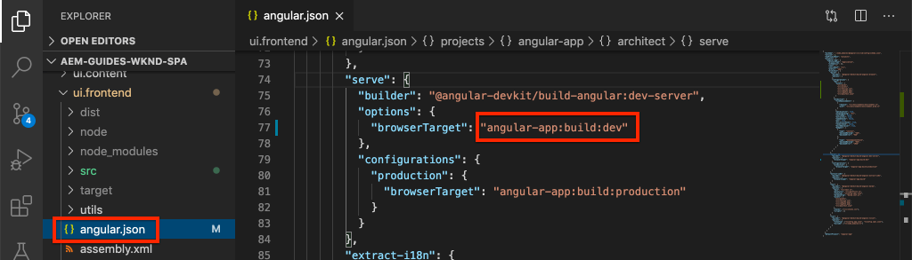

# Een SPA integreren {#integrate-spa}

Begrijp hoe de broncode voor een Enige die Toepassing van de Pagina (SPA) in Angular wordt geschreven met een Project van Adobe Experience Manager (AEM) kan worden geïntegreerd. Leer om moderne front-end hulpmiddelen, zoals een webpack dev server, te gebruiken om SPA tegen het modelAPI van AEM JSON snel te ontwikkelen.

## Doelstelling

1. Begrijp hoe het project van het KUUROORD met AEM met cliënt-zijbibliotheken geïntegreerd is.
2. Leer hoe u een lokale ontwikkelingsserver gebruikt voor speciale front-end ontwikkeling.
3. Onderzoek het gebruik van a **volmacht** en statisch **mock** dossier voor het ontwikkelen tegen AEM JSON model API

## Wat u gaat maken

Dit hoofdstuk zal een eenvoudige `Header` component aan het KUUROORD toevoegen. Tijdens het ontwikkelen van deze statische `Header` -component worden verschillende benaderingen voor AEM SPA-ontwikkeling gebruikt.


*het KUUROORD wordt uitgebreid om een statische `Header` component* toe te voegen

## Vereisten

Herzie het vereiste tooling en de instructies voor vestiging a [ lokale ontwikkelomgeving ](overview.md#local-dev-environment).

### De code ophalen

1. Download het beginpunt voor deze zelfstudie via Git:

   ```shell
   $ git clone git@github.com:adobe/aem-guides-wknd-spa.git
   $ cd aem-guides-wknd-spa
   $ git checkout Angular/integrate-spa-start
   ```

2. Implementeer de codebasis naar een lokale AEM-instantie met Maven:

   ```shell
   $ mvn clean install -PautoInstallSinglePackage
   ```

   Als het gebruiken van [ AEM 6.x ](overview.md#compatibility) voeg het `classic` profiel toe:

   ```shell
   $ mvn clean install -PautoInstallSinglePackage -Pclassic
   ```

U kunt de gebeëindigde code op [ GitHub ](https://github.com/adobe/aem-guides-wknd-spa/tree/Angular/integrate-spa-solution) altijd bekijken of de code uit controleren plaatselijk door aan de tak `Angular/integrate-spa-solution` te schakelen.

## Integratiebenadering {#integration-approach}

Er zijn twee modules gemaakt als onderdeel van het AEM-project: `ui.apps` en `ui.frontend` .

De `ui.frontend` module is a [ webpack ](https://webpack.js.org/) project dat alle broncode van het KUUROORD bevat. Een meerderheid van de ontwikkeling en het testen van SPA wordt gedaan in het webpack project. Wanneer een productie bouwt wordt teweeggebracht, wordt het KUUROORD gebouwd en gecompileerd gebruikend webpack. De gecompileerde artefacten (CSS en Javascript) worden gekopieerd in de module `ui.apps` die dan aan runtime van AEM wordt opgesteld.


*A high-level afbeelding van de integratie van het KUUROORD.*

De extra informatie over het front-end bouwt kan [ hier ](https://experienceleague.adobe.com/docs/experience-manager-core-components/using/developing/archetype/uifrontend-angular.html) worden gevonden.

## Inspecteer de integratie van SPA {#inspect-spa-integration}

Daarna, inspecteer de `ui.frontend` module om het KUUROORD te begrijpen dat door het [ archetype van het Project van AEM ](https://experienceleague.adobe.com/docs/experience-manager-core-components/using/developing/archetype/uifrontend-angular.html) auto-geproduceerd is.

1. In winde van uw keus open omhoog het Project van AEM voor het KND SPA. Dit leerprogramma zal [ winde van de Code van Visual Studio ](https://experienceleague.adobe.com/docs/experience-manager-learn/cloud-service/local-development-environment-set-up/development-tools.html#microsoft-visual-studio-code) gebruiken.

   

2. Vouw de map `ui.frontend` uit en inspecteer deze. Het bestand openen `ui.frontend/package.json`

3. Onder `dependencies` ziet u een aantal koppelingen die verwant zijn aan `@angular` :

   ```json
   "@angular/animations": "~9.1.11",
   "@angular/common": "~9.1.11",
   "@angular/compiler": "~9.1.11",
   "@angular/core": "~9.1.11",
   "@angular/forms": "~9.1.10",
   "@angular/platform-browser": "~9.1.10",
   "@angular/platform-browser-dynamic": "~9.1.10",
   "@angular/router": "~9.1.10",
   ```

   De `ui.frontend` module is een [ toepassing van Angular ](https://angular.io) die door het [ CLI hulpmiddel van Angular te gebruiken ](https://angular.io/cli) wordt geproduceerd die het verpletteren omvat.

4. Er zijn ook drie afhankelijkheden voorafgegaan door `@adobe` :

   ```json
   "@adobe/cq-angular-editable-components": "^2.0.2",
   "@adobe/cq-spa-component-mapping": "^1.0.3",
   "@adobe/cq-spa-page-model-manager": "^1.1.3",
   ```

   De bovengenoemde modules maken omhoog de [ Redacteur JS SDK van AEM SPA ](https://experienceleague.adobe.com/docs/experience-manager-65/developing/headless/spas/spa-blueprint.html) en verstrekken de functionaliteit om het mogelijk te maken om de Componenten van het KUUROORD aan de Componenten van AEM in kaart te brengen.

5. In het `package.json` -bestand zijn verschillende `scripts` gedefinieerd:

   ```json
   "scripts": {
       "start": "ng serve --open --proxy-config ./proxy.conf.json",
       "build": "ng lint && ng build && clientlib",
       "build:production": "ng lint && ng build --prod && clientlib",
       "test": "ng test",
       "sync": "aemsync -d -w ../ui.apps/src/main/content"
   }
   ```

   Deze manuscripten zijn gebaseerd op gemeenschappelijke [ Angular CLI bevelen ](https://angular.io/cli/build) maar lichtjes gewijzigd om met het grotere project van AEM te werken.

   `start` - voert de Angular-toepassing lokaal uit met een lokale webserver. Deze is bijgewerkt om de inhoud van een lokale AEM-instantie te profileren.

   `build` - compileert de Angular-app voor productiedistributie. De toevoeging van `&& clientlib` is de oorzaak van het kopiëren van gecompileerde SPA in de `ui.apps` module als cliënt-zijbibliotheek tijdens een bouwstijl. De npm module [ aem-clientlib-generator ](https://github.com/wcm-io-frontend/aem-clientlib-generator) wordt gebruikt om dit te vergemakkelijken.

   Meer details over de beschikbare manuscripten kunnen [ hier ](https://experienceleague.adobe.com/docs/experience-manager-core-components/using/developing/archetype/uifrontend-angular.html) worden gevonden.

6. Controleer het bestand `ui.frontend/clientlib.config.js` . Dit configuratiedossier wordt gebruikt door [ aem-clientlib-generator ](https://github.com/wcm-io-frontend/aem-clientlib-generator#clientlibconfigjs) om te bepalen hoe te om de cliëntbibliotheek te produceren.

7. Controleer het bestand `ui.frontend/pom.xml` . Dit dossier zet de `ui.frontend` omslag in a [ Gemaakt module ](https://maven.apache.org/guides/mini/guide-multiple-modules.html) om. Het `pom.xml` dossier is bijgewerkt om [ te gebruiken front-maven-plugin ](https://github.com/eirslett/frontend-maven-plugin) aan **test** en **bouwt** het KUUROORD tijdens een Gemaakt bouwt.

8. Inspecteer het bestand `app.component.ts` op `ui.frontend/src/app/app.component.ts` :

   ```js
   import { Constants } from '@adobe/cq-angular-editable-components';
   import { ModelManager } from '@adobe/cq-spa-page-model-manager';
   import { Component } from '@angular/core';
   
   @Component({
   selector: '#spa-root', // tslint:disable-line
   styleUrls: ['./app.component.css'],
   templateUrl: './app.component.html'
   })
   export class AppComponent {
       ...
   
       constructor() {
           ModelManager.initialize().then(this.updateData);
       }
   
       private updateData = pageModel => {
           this.path = pageModel[Constants.PATH_PROP];
           this.items = pageModel[Constants.ITEMS_PROP];
           this.itemsOrder = pageModel[Constants.ITEMS_ORDER_PROP];
       }
   }
   ```

   `app.component.js` is het ingangspunt van het KUUROORD. `ModelManager` wordt geleverd door de AEM SPA Editor JS SDK. Het is verantwoordelijk voor het aanroepen en injecteren van `pageModel` (de JSON-inhoud) in de toepassing.

## Een koptekstcomponent toevoegen {#header-component}

Daarna, voeg een nieuwe component aan SPA toe en stel de veranderingen in een lokale instantie van AEM op om de integratie te zien.

1. Open een nieuw terminalvenster en navigeer naar de map `ui.frontend` :

   ```shell
   $ cd aem-guides-wknd-spa/ui.frontend
   ```

2. Installeer [ CLI van Angular ](https://angular.io/cli#installing-angular-cli) globaal dit wordt gebruikt om de componenten van Angular te produceren evenals de toepassing van Angular via het **ng** bevel te bouwen en te dienen.

   ```shell
   $ npm install -g @angular/cli
   ```

   >[!CAUTION]
   >
   > De versie van **@angular/cli** die door dit project wordt gebruikt is **9.1.7**. Het wordt aanbevolen de Angular CLI-versies synchroon te houden.

3. Maak een nieuwe `Header` -component door de Angular CLI `ng generate component` -opdracht uit te voeren vanuit de map `ui.frontend` .

   ```shell
   $ ng generate component components/header
   
   CREATE src/app/components/header/header.component.css (0 bytes)
   CREATE src/app/components/header/header.component.html (21 bytes)
   CREATE src/app/components/header/header.component.spec.ts (628 bytes)
   CREATE src/app/components/header/header.component.ts (269 bytes)
   UPDATE src/app/app.module.ts (1809 bytes)
   ```

   Hiermee wordt een skelet gemaakt voor de nieuwe Angular Header-component in `ui.frontend/src/app/components/header` .

4. Open het `aem-guides-wknd-spa` project in winde van uw keus. Navigeer naar de map `ui.frontend/src/app/components/header` .

   

5. Open het bestand `header.component.html` en vervang de inhoud door:

   ```html
   <!--/* header.component.html */-->
   <header className="header">
       <div className="header-container">
           <h1>WKND</h1>
       </div>
   </header>
   ```

   Op deze manier wordt statische inhoud weergegeven. Voor deze Angular-component is dus geen aanpassing van de gegenereerde standaard vereist `header.component.ts` .

6. Open het dossier **app.component.html** bij `ui.frontend/src/app/app.component.html`. Voeg de lus `app-header` toe:

   ```html
   <app-header></app-header>
   <router-outlet></router-outlet>
   ```

   Dit omvat de component `header` boven alle pagina-inhoud.

7. Open een nieuwe terminal, navigeer naar de map `ui.frontend` en voer de opdracht `npm run build` uit:

   ```shell
   $ cd ui.frontend
   $ npm run build
   
   Linting "angular-app"...
   All files pass linting.
   Generating ES5 bundles for differential loading...
   ES5 bundle generation complete.
   ```

8. Navigeer naar de map `ui.apps` . Onder `ui.apps/src/main/content/jcr_root/apps/wknd-spa-angular/clientlibs/clientlib-angular` zou u de gecompileerde dossiers van het KUUROORD van de `ui.frontend/build` omslag moeten zien zijn gekopieerd.

    wordt geproduceerd

9. Ga terug naar de terminal en navigeer naar de map `ui.apps` . Voer het volgende Geweven bevel uit:

   ```shell
   $ cd ../ui.apps
   $ mvn clean install -PautoInstallPackage
   ...
   [INFO] ------------------------------------------------------------------------
   [INFO] BUILD SUCCESS
   [INFO] ------------------------------------------------------------------------
   [INFO] Total time:  9.629 s
   [INFO] Finished at: 2020-05-04T17:48:07-07:00
   [INFO] ------------------------------------------------------------------------
   ```

   Hiermee wordt het `ui.apps` -pakket geïmplementeerd in een lokale actieve instantie van AEM.

10. Open een browser lusje en navigeer aan [ http://localhost:4502/editor.html/content/wknd-spa-angular/us/en/home.html ](http://localhost:4502/editor.html/content/wknd-spa-angular/us/en/home.html). U zou nu de inhoud van de `Header` component moeten zien die in SPA wordt getoond.

   

   De stappen **7-9** worden uitgevoerd automatisch wanneer het teweegbrengen van een Maven bouwt van de wortel van het project (d.w.z. `mvn clean install -PautoInstallSinglePackage`). U zou nu de grondbeginselen van de integratie tussen het KUUROORD en de cliënt-zijbibliotheken van AEM moeten begrijpen. U kunt wel `Text` -componenten bewerken en toevoegen in AEM, maar de `Header` -component kan niet worden bewerkt.

## Webpack Dev Server - Proxy de JSON API {#proxy-json}

Zoals u in de vorige oefeningen hebt gezien, duurt het maken van een build en het synchroniseren van de clientbibliotheek naar een lokale instantie van AEM enkele minuten. Dit is aanvaardbaar voor het definitieve testen, maar is niet ideaal voor de meerderheid van de ontwikkeling van SPA.

A [ webpack dev server ](https://webpack.js.org/configuration/dev-server/) kan worden gebruikt om het KUUROORD snel te ontwikkelen. De SPA wordt aangestuurd door een JSON-model dat door AEM wordt gegenereerd. In deze oefening is de inhoud JSON van een lopende instantie van AEM **proxied** in de ontwikkelingsserver die door het [ project van Angular ](https://angular.io/guide/build) wordt gevormd.

1. Terugkeer aan winde en open het dossier **proxy.conf.json** bij `ui.frontend/proxy.conf.json`.

   ```json
   [
       {
           "context": [
                       "/content/**/*.(jpg|jpeg|png|model.json)",
                       "/etc.clientlibs/**/*"
                   ],
           "target": "http://localhost:4502",
           "auth": "admin:admin",
           "logLevel": "debug"
       }
   ]
   ```

   De [ app van Angular ](https://angular.io/guide/build#proxying-to-a-backend-server) verstrekt een gemakkelijk mechanisme aan volmacht API verzoeken. De patronen die u opgeeft in `context` , worden beschreven in `localhost:4502` , de lokale AEM quickstart.

2. Open het dossier **index.html** bij `ui.frontend/src/index.html`. Dit is het basisbestand van HTML dat door de Dev-server wordt gebruikt.

   Er is een vermelding voor `base href="/"` . De [ basismarkering ](https://angular.io/guide/deployment#the-base-tag) is kritiek voor app om relatieve URLs op te lossen.

   ```html
   <base href="/">
   ```

3. Open een terminalvenster en navigeer naar de map `ui.frontend` . Voer de opdracht `npm start` uit:

   ```shell
   $ cd ui.frontend
   $ npm start
   
   > wknd-spa-angular@0.1.0 start /Users/dgordon/Documents/code/aem-guides-wknd-spa/ui.frontend
   > ng serve --open --proxy-config ./proxy.conf.json
   
   10% building 3/3 modules 0 active[HPM] Proxy created: [ '/content/**/*.(jpg|jpeg|png|model.json)', '/etc.clientlibs/**/*' ]  ->  http://localhost:4502
   [HPM] Subscribed to http-proxy events:  [ 'error', 'close' ]
   ℹ ｢wds｣: Project is running at http://localhost:4200/webpack-dev-server/
   ℹ ｢wds｣: webpack output is served from /
   ℹ ｢wds｣: 404s will fallback to //index.html
   ```

4. Open een nieuw browser lusje (als niet reeds geopend) en navigeer aan [ http://localhost:4200/content/wknd-spa-angular/us/en/home.html ](http://localhost:4200/content/wknd-spa-angular/us/en/home.html).

   

   Dezelfde inhoud moet worden weergegeven als in AEM, maar zonder dat een van de ontwerpmogelijkheden is ingeschakeld.

5. Keer terug naar winde en creeer een nieuwe omslag genoemd `img` bij `ui.frontend/src/assets`.
6. Download en voeg het volgende WKND-logo toe aan de map `img` :

   

7. Open **header.component.html** bij `ui.frontend/src/app/components/header/header.component.html` en omvat het embleem:

   ```html
   <header class="header">
       <div class="header-container">
           <div class="logo">
               
           </div>
       </div>
   </header>
   ```

   Sparen de veranderingen in **header.component.html**.

8. Ga terug naar de browser. De wijzigingen in de app worden meteen weerspiegeld.

    wordt toegevoegd

   U kunt inhoudsupdates in **AEM** blijven maken en hen zien die in **webpack dev server** worden weerspiegeld, aangezien wij de inhoud proxying. Merk op dat de inhoudsveranderingen slechts zichtbaar in **webpack dev server** zijn.

9. Stop de lokale webserver met `ctrl+c` in de terminal.

## Webpack Dev Server - Mock JSON API {#mock-json}

Een andere manier om snel te ontwikkelen is het gebruik van een statisch JSON-bestand als JSON-model. Door de JSON te &#39;rokken&#39; verwijderen we de afhankelijkheid van een lokale AEM-instantie. Het staat ook een front-end ontwikkelaar toe om het model JSON bij te werken om functionaliteit te testen en veranderingen in JSON API te drijven die dan door een achterste-eindontwikkelaar zou worden uitgevoerd.

De aanvankelijke opstelling van het model JSON **vereist een lokale instantie van AEM**.

1. In browser navigeer aan [ http://localhost:4502/content/wknd-spa-angular/us/en.model.json ](http://localhost:4502/content/wknd-spa-angular/us/en.model.json).

   Dit is de JSON die door AEM wordt geëxporteerd en die de toepassing stuurt. Kopieer de JSON-uitvoer.

2. Terugkeer aan winde navigeert aan `ui.frontend/src` en voegt nieuwe omslagen genoemd **mocks** en **json** toe om de volgende omslagstructuur aan te passen:

   ```plain
   |-- ui.frontend
       |-- src
           |-- mocks
               |-- json
   ```

3. Creeer een nieuw dossier genoemd **en.model.json** hieronder `ui.frontend/public/mocks/json`. Plak de output JSON van **Stap 1** hier.

   

4. Creeer een nieuw dossier **proxy.mock.conf.json** onder `ui.frontend`. Vul het bestand met het volgende:

   ```json
   [
       {
       "context": [
           "/content/**/*.model.json"
       ],
       "pathRewrite": { "^/content/wknd-spa-angular/us" : "/mocks/json"} ,
       "target": "http://localhost:4200",
       "logLevel": "debug"
       }
   ]
   ```

   Deze proxyconfiguratie herschrijft aanvragen die beginnen met `/content/wknd-spa-angular/us` met `/mocks/json` en die het overeenkomstige statische JSON-bestand leveren, bijvoorbeeld:

   ```plain
   /content/wknd-spa-angular/us/en.model.json -> /mocks/json/en.model.json
   ```

5. Open het dossier **angular.json**. Voeg een nieuwe **dev** configuratie met een bijgewerkte **activa** serie toe om de **gemaakte mocks** omslag van verwijzingen te voorzien.

   ```json
    "dev": {
             "assets": [
               "src/mocks",
               "src/assets",
               "src/favicon.ico",
               "src/logo192.png",
               "src/logo512.png",
               "src/manifest.json"
             ]
       },
   ```

   

   Creërend een specifieke **dev** configuratie zorgt ervoor dat de **mocks** omslag slechts tijdens ontwikkeling wordt gebruikt en nooit aan AEM in een productie wordt opgesteld bouwt.

6. In het {**dossier 0} angular.json, werk volgende de** browserTarget **configuratie bij om de nieuwe** te gebruiken dev **configuratie:**

   ```diff
     ...
     "serve": {
         "builder": "@angular-devkit/build-angular:dev-server",
         "options": {
   +       "browserTarget": "angular-app:build:dev"
   -       "browserTarget": "angular-app:build"
         },
     ...
   ```

   

7. Open het dossier `ui.frontend/package.json` en voeg een nieuw **begin toe:mock** bevel om het {**dossier 3} proxy.mock.conf.json van verwijzingen te voorzien.**

   ```diff
       "scripts": {
           "start": "ng serve --open --proxy-config ./proxy.conf.json",
   +       "start:mock": "ng serve --open --proxy-config ./proxy.mock.conf.json",
           "build": "ng lint && ng build && clientlib",
           "build:production": "ng lint && ng build --prod && clientlib",
           "test": "ng test",
           "sync": "aemsync -d -w ../ui.apps/src/main/content"
       }
   ```

   Door een nieuwe opdracht toe te voegen, kunt u gemakkelijk schakelen tussen de proxyconfiguraties.

8. Als momenteel lopend, stop **webpack dev server**. Begin **webpack dev server** gebruikend het **begin:mock** manuscript:

   ```shell
   $ npm run start:mock
   
   > wknd-spa-angular@0.1.0 start:mock /Users/dgordon/Documents/code/aem-guides-wknd-spa/ui.frontend
   > ng serve --open --proxy-config ./proxy.mock.conf.json
   ```

   Navigeer aan [ http://localhost:4200/content/wknd-spa-angular/us/en/home.html ](http://localhost:4200/content/wknd-spa-angular/us/en/home.html) en u zou het zelfde KUUROORD moeten zien maar de inhoud wordt nu getrokken uit het **mock** JSON- dossier.

9. Maak een kleine verandering in het {**vroeger gecreeerd dossier 0} en.model.json.** De bijgewerkte inhoud zou onmiddellijk in de **webpack dev server** moeten worden weerspiegeld.

   

   Als u het JSON-model kunt manipuleren en de effecten op een live-SPA kunt zien, kan een ontwikkelaar de JSON-model-API beter begrijpen. Het maakt ook zowel front-end als back-end ontwikkeling parallel mogelijk.

## Stijlen met klasse toevoegen

Vervolgens wordt een bijgewerkte stijl toegevoegd aan het project. Dit project zal [&#128279;](https://sass-lang.com/) steun van de Klasse  voor een paar nuttige eigenschappen zoals variabelen toevoegen.

1. Open een eindvenster en stop **webpack dev server** als begonnen. Voer vanuit de `ui.frontend` -map de volgende opdracht in om de Angular-toepassing bij te werken naar **.scss** -bestanden.

   ```shell
   $ cd ui.frontend
   $ ng config schematics.@schematics/angular:component.styleext scss
   ```

   Hiermee werkt u het `angular.json` -bestand bij met een nieuwe vermelding onder aan het bestand:

   ```json
   "schematics": {
       "@schematics/angular:component": {
       "styleext": "scss"
       }
   }
   ```

2. Installeer `normalize-scss` om de stijlen in verschillende browsers te normaliseren:

   ```shell
   $ npm install normalize-scss --save
   ```

3. Ga terug naar de IDE en maak onder `ui.frontend/src` een nieuwe map met de naam `styles` .
4. Maak een nieuw bestand onder `ui.frontend/src/styles` genaamd `_variables.scss` en vult het met de volgende variabelen:

   ```scss
   //_variables.scss
   
   //== Colors
   //
   //## Gray and brand colors for use across theme.
   
   $black:                  #202020;
   $gray:                   #696969;
   $gray-light:             #EBEBEB;
   $gray-lighter:           #F7F7F7;
   $white:                  #FFFFFF;
   $yellow:                 #FFEA00;
   $blue:                   #0045FF;
   
   
   //== Typography
   //
   //## Font, line-height, and color for body text, headings, and more.
   
   $font-family-sans-serif:  "Helvetica Neue", Helvetica, Arial, sans-serif;
   $font-family-serif:       Georgia, "Times New Roman", Times, serif;
   $font-family-base:        $font-family-sans-serif;
   $font-size-base:          18px;
   
   $line-height-base:        1.5;
   $line-height-computed:    floor(($font-size-base * $line-height-base));
   
   // Functional Colors
   $brand-primary:             $yellow;
   $body-bg:                   $white;
   $text-color:                $black;
   $text-color-inverse:        $gray-light;
   $link-color:                $blue;
   
   //Layout
   $max-width: 1024px;
   $header-height: 75px;
   
   // Spacing
   $gutter-padding: 12px;
   ```

5. Wijzig de uitbreiding van het dossier **styles.css** bij `ui.frontend/src/styles.css` aan **styles.scss**. Vervang de inhoud door het volgende:

   ```scss
   /* styles.scss * /
   
   /* Normalize */
   @import '~normalize-scss/sass/normalize';
   
   @import './styles/variables';
   
   body {
       background-color: $body-bg;
       font-family: $font-family-base;
       margin: 0;
       padding: 0;
       font-size: $font-size-base;
       text-align: left;
       color: $text-color;
       line-height: $line-height-base;
   }
   
   body.page {
       max-width: $max-width;
       margin: 0 auto;
       padding: $gutter-padding;
       padding-top: $header-height;
   }
   ```

6. Werk **angular.json** bij en hernoem alle verwijzingen naar **style.css** met **styles.scss**. Er moeten drie verwijzingen zijn.

   ```diff
     "styles": [
   -    "src/styles.css"
   +    "src/styles.scss"
      ],
   ```

## Koptekststijlen bijwerken

Voeg daarna sommige merkspecifieke stijlen aan de **component van de Kopbal** toe gebruikend Sass.

1. Begin **webpack dev server** om de stijlen te zien die in real time bijwerken:

   ```shell
   $ npm run start:mock
   ```

2. Onder `ui.frontend/src/app/components/header` re-name **header.component.css** aan **header.component.scss**. Vul het bestand met het volgende:

   ```scss
   @import "~src/styles/variables";
   
   .header {
       width: 100%;
       position: fixed;
       top: 0;
       left:0;
       z-index: 99;
       background-color: $brand-primary;
       box-shadow: 0px 0px 10px 0px rgba(0, 0, 0, 0.24);
   }
   
   .header-container {
       display: flex;
       max-width: $max-width;
       margin: 0 auto;
       padding-left: $gutter-padding;
       padding-right: $gutter-padding;
   }
   
   .logo {
       z-index: 100;
       display: flex;
       padding-top: $gutter-padding;
       padding-bottom: $gutter-padding;
   }
   
   .logo-img {
       width: 100px;
   }
   ```

3. Update **header.component.ts** aan verwijzing **header.component.scss**:

   ```diff
   ...
     @Component({
       selector: 'app-header',
       templateUrl: './header.component.html',
   -   styleUrls: ['./header.component.css']
   +   styleUrls: ['./header.component.scss']
     })
   ...
   ```

4. Terugkeer aan browser en **webpack dev server**:

   

   U zou de bijgewerkte stijlen nu moeten zien die aan de **worden toegevoegd van de Kopbal** component.

## SPA-updates voor AEM implementeren

De veranderingen die aan de **Kopbal** worden aangebracht zijn momenteel slechts zichtbaar door **webpack dev server**. Stel het bijgewerkte KUUROORD aan AEM op om de veranderingen te zien.

1. Stop de **webpack dev server**.
2. Navigeer naar de hoofdmap van het project `/aem-guides-wknd-spa` en implementeer het project in AEM met Maven:

   ```shell
   $ cd ..
   $ mvn clean install -PautoInstallSinglePackage
   ```

3. Navigeer aan [ http://localhost:4502/editor.html/content/wknd-spa-angular/us/en/home.html ](http://localhost:4502/editor.html/content/wknd-spa-angular/us/en/home.html). U zou de bijgewerkte **Kopbal** met toegepast embleem en stijlen moeten zien:

   

   Nu het bijgewerkte KUUROORD in AEM is, kan het ontwerpen verdergaan.

## Gefeliciteerd! {#congratulations}

Gefeliciteerd, u hebt de SPA bijgewerkt en de integratie met AEM verkend! U kent nu twee verschillende benaderingen voor het ontwikkelen van het KUUROORD tegen AEM JSON model API gebruikend a **webpack dev server**.

U kunt de gebeëindigde code op [ GitHub ](https://github.com/adobe/aem-guides-wknd-spa/tree/Angular/integrate-spa-solution) altijd bekijken of de code uit controleren plaatselijk door aan de tak `Angular/integrate-spa-solution` te schakelen.

### Volgende stappen {#next-steps}

[ de componenten van het KaartKUUROORD aan de componenten van AEM ](map-components.md) - Leer hoe te om de componenten van Angular aan Adobe Experience Manager (AEM) componenten met de Redacteur JS SDK van AEM SPA in kaart te brengen. De afbeelding van de component laat auteurs toe om dynamische updates aan de componenten van het KUUROORD binnen de Redacteur van AEM te maken SPA, gelijkend op traditionele het auteursrecht van AEM.
