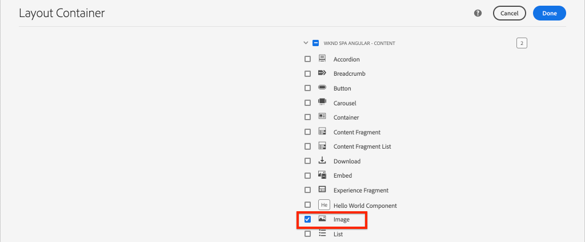

# SPA componenten toewijzen aan AEM componenten {#map-components}

Leer hoe u Angulars aan Adobe Experience Manager-componenten (AEM) toewijst met de AEM SPA Editor JS SDK. Met componenttoewijzing kunnen gebruikers dynamische updates uitvoeren naar SPA componenten in de AEM SPA Editor, net als bij traditionele AEM ontwerpen.

In dit hoofdstuk wordt dieper ingegaan op de AEM JSON-model-API en wordt uitgelegd hoe de JSON-inhoud die door een AEM wordt aangeboden, automatisch als props in een Angular-component kan worden geïnjecteerd.

## Doelstelling

1. Leer hoe u AEM componenten kunt toewijzen aan SPA Componenten.
2. Begrijp het verschil tussen **Container** componenten en **Inhoud** componenten.
3. Maak een nieuwe Angular die aan een bestaande AEM wordt toegewezen.

## Wat u gaat maken

In dit hoofdstuk wordt geïnspecteerd hoe de `Text` SPA component wordt toegewezen aan de AEM `Text`component. Een nieuwe `Image` Er wordt SPA component gemaakt die in de SPA kan worden gebruikt en in AEM kan worden geschreven. De functies van het selectievakje **Layout Container** en **Sjablooneditor** het beleid zal ook worden gebruikt om een mening tot stand te brengen die wat gevarieerder van verschijning is.


## Vereisten

Controleer de vereiste gereedschappen en instructies voor het instellen van een [plaatselijke ontwikkelomgeving](overview.md#local-dev-environment).

### De code ophalen

1. Download het beginpunt voor deze zelfstudie via Git:

   ```shell
   $ git clone git@github.com:adobe/aem-guides-wknd-spa.git
   $ cd aem-guides-wknd-spa
   $ git checkout Angular/map-components-start
   ```

2. Implementeer de basis van de code op een lokale AEM met Maven:

   ```shell
   $ mvn clean install -PautoInstallSinglePackage
   ```

   Als u [AEM 6,x](overview.md#compatibility) toevoegen `classic` profiel:

   ```shell
   $ mvn clean install -PautoInstallSinglePackage -Pclassic
   ```

U kunt de voltooide code altijd weergeven op [GitHub](https://github.com/adobe/aem-guides-wknd-spa/tree/Angular/map-components-solution) of controleer de code plaatselijk door aan de tak over te schakelen `Angular/map-components-solution`.

## Toewijzingsmethode

Het basisconcept is om een SPA Component aan een AEM Component in kaart te brengen. AEM componenten, voer server-kant in, voer inhoud als deel van JSON model API uit. De JSON-inhoud wordt door de SPA verbruikt en wordt in de browser op de client uitgevoerd. Er wordt een 1:1-toewijzing gemaakt tussen SPA componenten en een AEM component.


*Overzicht op hoog niveau van het toewijzen van een AEM component aan een component van de Angular*

## De tekstcomponent Inspect

De [Projectarchetype AEM](https://github.com/adobe/aem-project-archetype) verstrekt `Text` component die is toegewezen aan de AEM [Tekstcomponent](https://experienceleague.adobe.com/docs/experience-manager-core-components/using/components/text.html). Dit is een voorbeeld van een **content** component, in die zin dat deze wordt gerenderd *content* van AEM.

Laten we eens kijken hoe de component werkt.

### Inspect het JSON-model

1. Voordat u in de SPA code springt, is het belangrijk dat u het JSON-model begrijpt dat AEM biedt. Ga naar de [Core Component Library](https://www.aemcomponents.dev/content/core-components-examples/library/core-content/text.html) en bekijk de pagina voor de component Text. De Core Component Library bevat voorbeelden van alle AEM Core Components.
2. Selecteer **JSON** tabblad voor een van de voorbeelden:

   

   Er moeten drie eigenschappen worden weergegeven: `text`, `richText`, en `:type`.

   `:type` is een gereserveerde eigenschap die de `sling:resourceType` (of pad) van de AEM Component. De waarde van `:type` is wat wordt gebruikt om de AEM component aan de SPA component in kaart te brengen.

   `text` en `richText` Dit zijn aanvullende eigenschappen die aan de SPA component worden blootgesteld.

### De component Text Inspect

1. Open een nieuwe terminal en navigeer naar de `ui.frontend` in het project. Uitvoeren `npm install` en vervolgens `npm start` om de **webpack-ontwikkelserver**:

   ```shell
   $ cd ui.frontend
   $ npm run start:mock
   ```

   De `ui.frontend` momenteel is ingesteld op het gebruik van de [model van mock JSON](./integrate-spa.md#mock-json).

2. Er wordt een nieuw browservenster geopend voor [http://localhost:4200/content/wknd-spa-angular/us/en/home.html](http://localhost:4200/content/wknd-spa-angular/us/en/home.html)

   

3. In winde van uw keus open omhoog het AEM Project voor de SPA WKND. Breid uit `ui.frontend` en het bestand openen **text.component.ts** krachtens `ui.frontend/src/app/components/text/text.component.ts`:

   

4. Het eerste gebied dat moet worden geïnspecteerd is het `class TextComponent` op ~regel 35:

   ```js
   export class TextComponent {
       @Input() richText: boolean;
       @Input() text: string;
       @Input() itemName: string;
   
       @HostBinding('innerHtml') get content() {
           return this.richText
           ? this.sanitizer.bypassSecurityTrustHtml(this.text)
           : this.text;
       }
       @HostBinding('attr.data-rte-editelement') editAttribute = true;
   
       constructor(private sanitizer: DomSanitizer) {}
   }
   ```

   [@Input()](https://angular.io/api/core/Input) Decorator wordt gebruikt om velden te declareren die de waarden via het toegewezen JSON-object hebben ingesteld, dat eerder is gecontroleerd.

   `@HostBinding('innerHtml') get content()` is een methode die de geschreven tekstinhoud weergeeft van de waarde van `this.text`. Als de inhoud bestaat uit tekst met opmaak (bepaald door de `this.richText` markering) de ingebouwde veiligheid van de Angular wordt overgeslagen. Angular [DomSanitizer](https://angular.io/api/platform-browser/DomSanitizer) wordt gebruikt om de onbewerkte HTML te &#39;scrubben&#39; en kwetsbaarheden met scripts die verwijzen naar andere sites te voorkomen. De methode is gebonden aan de `innerHtml` eigenschap met de [@HostBinding](https://angular.io/api/core/HostBinding) decorator.

5. Ga als volgt te werk `TextEditConfig` op ~regel 24:

   ```js
   const TextEditConfig = {
       emptyLabel: 'Text',
       isEmpty: cqModel =>
           !cqModel || !cqModel.text || cqModel.text.trim().length < 1
   };
   ```

   De bovenstaande code bepaalt wanneer de tijdelijke aanduiding in de AEM auteursomgeving moet worden weergegeven. Als de `isEmpty` methode retourneert **true** wordt de tijdelijke aanduiding weergegeven.

6. Kijk ten slotte naar de `MapTo` bellen bij ~line 53:

   ```js
   MapTo('wknd-spa-angular/components/text')(TextComponent, TextEditConfig );
   ```

   **MapTo** wordt geleverd door de AEM SPA Editor JS SDK (`@adobe/cq-angular-editable-components`). Het pad `wknd-spa-angular/components/text` vertegenwoordigt `sling:resourceType` van de AEM component. Dit pad komt overeen met het `:type` door het JSON-model dat eerder werd waargenomen. **MapTo** parseert de JSON-modelreactie en geeft de juiste waarden door aan de `@Input()` variabelen van de SPA component.

   U kunt de AEM vinden `Text` componentdefinitie bij `ui.apps/src/main/content/jcr_root/apps/wknd-spa-angular/components/text`.

7. Experimenteer door de **en.model.json** bestand bij `ui.frontend/src/mocks/json/en.model.json`.

   Bij ~regel 62 werkt u de eerste `Text` te gebruiken waarde **`H1`** en **`u`** tags:

   ```json
       "text": {
           "text": "<h1><u>Hello World!</u></h1>",
           "richText": true,
           ":type": "wknd-spa-angular/components/text"
       }
   ```

   Ga terug naar de browser om de effecten te zien die door de **webpack-ontwikkelserver**:

   

   Probeer de `richText` eigenschap tussen **true** / **false** om de renderlogica in actie te zien.

8. Inspect **text.component.html** om `ui.frontend/src/app/components/text/text.component.html`.

   Dit bestand is leeg omdat de volledige inhoud van de component wordt ingesteld door de `innerHTML` eigenschap.

9. Inspect the **app.module.ts** om `ui.frontend/src/app/app.module.ts`.

   ```js
   @NgModule({
   imports: [
       BrowserModule,
       SpaAngularEditableComponentsModule,
       AppRoutingModule
   ],
   providers: [ModelManagerService, { provide: APP_BASE_HREF, useValue: '/' }],
   declarations: [AppComponent, TextComponent, PageComponent, HeaderComponent],
   entryComponents: [TextComponent, PageComponent],
   bootstrap: [AppComponent]
   })
   export class AppModule {}
   ```

   De **TextComponent** is niet expliciet opgenomen, maar wel dynamisch via **AEMResponsiveGridComponent** verstrekt door de AEM SPA Editor JS SDK. Daarom moet in de **app.module.ts**&#39; [entryComponents](https://angular.io/guide/entry-components) array.

## De afbeeldingscomponent maken

Maak vervolgens een `Image` Angular die aan de AEM in kaart wordt gebracht [Afbeeldingscomponent](https://experienceleague.adobe.com/docs/experience-manager-core-components/using/components/image.html). De `Image` is een ander voorbeeld van een component **content** component.

### Inspect the JSON

Voordat u in de SPA code gaat springen, moet u het JSON-model controleren dat AEM biedt.

1. Ga naar de [Voorbeelden van afbeeldingen in de Core Component-bibliotheek](https://www.aemcomponents.dev/content/core-components-examples/library/core-content/image.html).

   

   Eigenschappen van `src`, `alt`, en `title` wordt gebruikt om de SPA te vullen `Image` component.

   >[!NOTE]
   >
   > Er zijn andere afbeeldingseigenschappen blootgesteld (`lazyEnabled`, `widths`) waarmee een ontwikkelaar een adaptieve en uitgestelde component kan maken. De component die in deze zelfstudie is ingebouwd, is eenvoudig en **niet** gebruik deze geavanceerde eigenschappen.

2. Ga terug naar uw IDE en open de `en.model.json` om `ui.frontend/src/mocks/json/en.model.json`. Aangezien dit een netto-nieuwe component voor ons project is, moeten we de Image JSON &quot;modelleren&quot;.

   Voeg bij ~regel 70 een JSON-item toe voor de `image` model (vergeet niet de volgkomma `,` na de tweede `text_386303036`) en de `:itemsOrder` array.

   ```json
   ...
   ":items": {
               ...
               "text_386303036": {
                   "text": "<p>A new text component.</p>\r\n",
                   "richText": true,
                   ":type": "wknd-spa-angular/components/text"
                   },
               "image": {
                   "alt": "Rock Climber in New Zealand",
                   "title": "Rock Climber in New Zealand",
                   "src": "/mocks/images/adobestock-140634652.jpeg",
                   ":type": "wknd-spa-angular/components/image"
               }
           },
           ":itemsOrder": [
               "text",
               "text_386303036",
               "image"
           ],
   ```

   Het project bevat een voorbeeldafbeelding op `/mock-content/adobestock-140634652.jpeg` die samen met de **webpack-ontwikkelserver**.

   U kunt de volledige [en.model.json hier](https://github.com/adobe/aem-guides-wknd-spa/blob/Angular/map-components-solution/ui.frontend/src/mocks/json/en.model.json).

3. Voeg een stockfoto toe die door de component moet worden weergegeven.

   Een nieuwe map maken met de naam **afbeeldingen** beneide `ui.frontend/src/mocks`. Downloaden [adobestock-140634652.jpeg](assets/map-components/adobestock-140634652.jpeg) en deze in het nieuwe ontwerp plaatsen **afbeeldingen** map. Voel u vrij om desgewenst uw eigen afbeelding te gebruiken.

### De component Image implementeren

1. Stop de **webpack-ontwikkelserver** indien gestart.
2. Creeer een nieuwe component van het Beeld door Angular CLI in werking te stellen `ng generate component` opdracht van binnen `ui.frontend` map:

   ```shell
   $ ng generate component components/image
   ```

3. In winde, open **image.component.ts** om `ui.frontend/src/app/components/image/image.component.ts` en als volgt bijwerken:

   ```js
   import {Component, Input, OnInit} from '@angular/core';
   import {MapTo} from '@adobe/cq-angular-editable-components';
   
   const ImageEditConfig = {
   emptyLabel: 'Image',
   isEmpty: cqModel =>
       !cqModel || !cqModel.src || cqModel.src.trim().length < 1
   };
   
   @Component({
   selector: 'app-image',
   templateUrl: './image.component.html',
   styleUrls: ['./image.component.scss']
   })
   export class ImageComponent implements OnInit {
   
   @Input() src: string;
   @Input() alt: string;
   @Input() title: string;
   
   constructor() { }
   
   get hasImage() {
       return this.src && this.src.trim().length > 0;
   }
   
   ngOnInit() { }
   }
   
   MapTo('wknd-spa-angular/components/image')(ImageComponent, ImageEditConfig);
   ```

   `ImageEditConfig` is de configuratie om te bepalen of om auteursplaceholder in AEM terug te geven, gebaseerd op als `src` eigenschap is gevuld.

   `@Input()` van `src`, `alt`, en `title` zijn de eigenschappen die zijn toegewezen via de JSON API.

   `hasImage()` is een methode die bepaalt of de afbeelding moet worden gerenderd.

   `MapTo` wijst de SPA component aan de AEM component toe die bij wordt gevestigd `ui.apps/src/main/content/jcr_root/apps/wknd-spa-angular/components/image`.

4. Openen **image.component.html** en deze als volgt bij te werken:

   ```html
   <ng-container *ngIf="hasImage">
       
   </ng-container>
   ```

   Hierdoor wordt de `` element if `hasImage` retourneert **true**.

5. Openen **image.component.scss** en deze als volgt bij te werken:

   ```scss
   :host-context {
       display: block;
   }
   
   .image {
       margin: 1rem 0;
       width: 100%;
       border: 0;
   }
   ```

   >[!NOTE]
   >
   > De `:host-context` regel is **kritisch** voor de tijdelijke aanduiding voor de AEM SPA editor correct werkt. Alle SPA componenten die bedoeld zijn om in de AEM paginaredacteur te worden ontworpen zullen deze regel bij een minimum vereisen.

6. Openen `app.module.ts` en voeg de `ImageComponent` aan de `entryComponents` array:

   ```js
   entryComponents: [TextComponent, PageComponent, ImageComponent],
   ```

   Zoals de `TextComponent`de `ImageComponent` dynamisch is geladen en moet worden opgenomen in de `entryComponents` array.

7. Start de **webpack-ontwikkelserver** om de `ImageComponent` renderen.

   ```shell
   $ npm run start:mock
   ```

   

   *Afbeelding toegevoegd aan de SPA*

   >[!NOTE]
   >
   > **Bonusuitdaging**: Voer een nieuwe methode uit om de waarde van te tonen `title` als een bijschrift onder de afbeelding.

## Beleid bijwerken in AEM

De `ImageComponent` component is alleen zichtbaar in het dialoogvenster **webpack-ontwikkelserver**. Implementeer vervolgens de bijgewerkte SPA om het sjabloonbeleid te AEM en bij te werken.

1. Stop de **webpack-ontwikkelserver** en van de **basis** van het project, zet de veranderingen in AEM gebruikend uw Maven vaardigheden op:

   ```shell
   $ cd aem-guides-wknd-spa
   $ mvn clean install -PautoInstallSinglePackage
   ```

2. Navigeer van het scherm AEM Start naar **[!UICONTROL Tools]** > **[!UICONTROL Templates]** > **[WKND SPA Angular](http://localhost:4502/libs/wcm/core/content/sites/templates.html/conf/wknd-spa-angular)**.

   Selecteer en bewerk de **SPA pagina**:

   

3. Selecteer **Layout Container** en klik op **beleid** pictogram om het beleid te bewerken:

   

4. Onder **Toegestane componenten** > **WKND SPA Angular - Inhoud** > controleer de **Afbeelding** component:

   

   Onder **Standaardcomponenten** > **Toewijzing toevoegen** en kiest u **Afbeelding - WKND SPA Angular - Inhoud** component:

   

   Voer een **mime-type** van `image/*`.

   Klikken **Gereed** om de beleidsupdates op te slaan.

5. In de **Layout Container** klik op **beleid** pictogram voor de **Tekst** component:

   

   Een nieuw beleid maken met de naam **WKND-SPA**. Onder **Plug-ins** > **Opmaak** > schakel alle vakken in om extra opmaakopties in te schakelen:

   

   Onder **Plug-ins** > **Alineastijlen** > schakel het selectievakje in op **Alineastijlen inschakelen**:

   

   Klikken **Gereed** om de beleidsupdate op te slaan.

6. Ga naar de **Homepage** [http://localhost:4502/editor.html/content/wknd-spa-angular/us/en/home.html](http://localhost:4502/editor.html/content/wknd-spa-angular/us/en/home.html).

   U moet ook de opdracht `Text` en voeg extra alineastijlen toe in **volledig scherm** in.

   

7. U moet ook een afbeelding kunnen slepen en neerzetten vanuit de **Asset Finder**:

   

8. Voeg uw eigen afbeeldingen toe via [AEM Assets](http://localhost:4502/assets.html/content/dam) of installeer de voltooide codebasis voor de norm [WKND-referentiesite](https://github.com/adobe/aem-guides-wknd/releases/latest). De [WKND-referentiesite](https://github.com/adobe/aem-guides-wknd/releases/latest) bevat veel afbeeldingen die opnieuw kunnen worden gebruikt op de WKND-SPA. Het pakket kan worden geïnstalleerd met [AEM Package Manager](http://localhost:4502/crx/packmgr/index.jsp).

   

## Inspect the Layout Container

Steun voor de **Layout Container** wordt automatisch verstrekt door de AEM SPA Editor SDK. De **Layout Container**, zoals aangegeven door de naam, **container** component. Containercomponenten zijn componenten die JSON-structuren accepteren die *overige* componenten te maken en ze dynamisch te instantiëren.

Laten we de container voor lay-out verder inspecteren.

1. In de winde open **responsive-grid.component.ts** om `ui.frontend/src/app/components/responsive-grid`:

   ```js
   import { AEMResponsiveGridComponent,MapTo } from '@adobe/cq-angular-editable-components';
   
   MapTo('wcm/foundation/components/responsivegrid')(AEMResponsiveGridComponent);
   ```

   De `AEMResponsiveGridComponent` wordt geïmplementeerd als onderdeel van de AEM SPA Editor SDK en wordt opgenomen in het project via `import-components`.

2. Blader in een browser naar [http://localhost:4502/content/wknd-spa-angular/us/en.model.json](http://localhost:4502/content/wknd-spa-angular/us/en.model.json)

   

   De **Layout Container** component heeft een `sling:resourceType` van `wcm/foundation/components/responsivegrid` en wordt door de SPA Editor herkend met de `:type` eigenschap, net als de `Text` en `Image` componenten.

   Dezelfde mogelijkheden om de grootte van een component te wijzigen met [Lay-outmodus](https://experienceleague.adobe.com/docs/experience-manager-65/authoring/siteandpage/responsive-layout.html#defining-layouts-layout-mode) zijn beschikbaar in de SPA Editor.

3. Terug naar [http://localhost:4502/editor.html/content/wknd-spa-angular/us/en/home.html](http://localhost:4502/editor.html/content/wknd-spa-angular/us/en/home.html). Extra toevoegen **Afbeelding** en probeer deze opnieuw in te stellen met de **Layout** optie:

   

4. Het JSON-model opnieuw openen [http://localhost:4502/content/wknd-spa-angular/us/en.model.json](http://localhost:4502/content/wknd-spa-angular/us/en.model.json) en de `columnClassNames` als onderdeel van de JSON:

   

   De klassenaam `aem-GridColumn--default--4` Hiermee wordt aangegeven dat de component 4 kolommen breed moet zijn op basis van een raster van 12 kolommen. Meer informatie over de [responsief raster is hier te vinden](https://adobe-marketing-cloud.github.io/aem-responsivegrid/).

5. Terugkeren naar de IDE en in de `ui.apps` er een client-side bibliotheek is gedefinieerd op `ui.apps/src/main/content/jcr_root/apps/wknd-spa-angular/clientlibs/clientlib-grid`. Het bestand openen `less/grid.less`.

   Dit bestand bepaalt de onderbrekingspunten (`default`, `tablet`, en `phone`) gebruikt door de **Layout Container**. Dit dossier is bedoeld om per projectspecificaties worden aangepast. Momenteel zijn de onderbrekingspunten ingesteld op `1200px` en `650px`.

6. U zou de ontvankelijke mogelijkheden en het bijgewerkte rijke tekstbeleid van moeten kunnen gebruiken `Text` aan auteur een mening als het volgende:

   

## Gefeliciteerd! {#congratulations}

Gefeliciteerd, hebt u geleerd hoe u SPA componenten kunt toewijzen aan AEM Componenten en een nieuwe toepassing hebt geïmplementeerd `Image` component. U hebt ook de kans om de responsieve mogelijkheden van de **Layout Container**.

U kunt de voltooide code altijd weergeven op [GitHub](https://github.com/adobe/aem-guides-wknd-spa/tree/Angular/map-components-solution) of controleer de code plaatselijk door aan de tak over te schakelen `Angular/map-components-solution`.

### Volgende stappen {#next-steps}

[Navigatie en routering](navigation-routing.md) - Leer hoe meerdere weergaven in de SPA kunnen worden ondersteund door aan AEM Pagina&#39;s toe te wijzen met de SPA Editor SDK. De dynamische navigatie wordt uitgevoerd gebruikend de Router van de Angular en toegevoegd aan een bestaande component van de Kopbal.

## Bonus - configuraties aan broncontrole blijven {#bonus}

In veel gevallen, vooral aan het begin van een AEM project is het waardevol om configuraties, zoals malplaatjes en verwant inhoudsbeleid, aan broncontrole voort te zetten. Dit zorgt ervoor dat alle ontwikkelaars tegen de zelfde reeks inhoud en configuraties werken en extra consistentie tussen milieu&#39;s kunnen verzekeren. Wanneer een project een bepaald ontwikkelingsniveau heeft bereikt, kan het beheren van sjablonen worden overgedragen aan een speciale groep van energiegebruikers.

De volgende paar stappen zullen plaatsvinden gebruikend winde van de Code van Visual Studio en [VSCode AEM Sync](https://marketplace.visualstudio.com/items?itemName=yamato-ltd.vscode-aem-sync) maar kon doen gebruikend om het even welk hulpmiddel en om het even welke winde die u hebt gevormd om **trekken** of **import** inhoud van een lokale instantie van AEM.

1. In winde van de Code van Visual Studio, zorg ervoor dat u hebt **VSCode AEM Sync** geïnstalleerd via de Marketplace-extensie:

   

2. Breid uit **ui.content** in de ontdekkingsreiziger van het Project en navigeer aan `/conf/wknd-spa-angular/settings/wcm/templates`.

3. **Rechts + klikken** de `templates` map en selecteer **Importeren vanaf AEM server**:

   

4. Herhaal de stappen om inhoud te importeren, maar selecteer de **beleid** map op `/conf/wknd-spa-angular/settings/wcm/policies`.

5. Inspect the `filter.xml` bestand bevindt zich op `ui.content/src/main/content/META-INF/vault/filter.xml`.

   ```xml
   <!--ui.content filter.xml-->
   <?xml version="1.0" encoding="UTF-8"?>
    <workspaceFilter version="1.0">
        <filter root="/conf/wknd-spa-angular" mode="merge"/>
        <filter root="/content/wknd-spa-angular" mode="merge"/>
        <filter root="/content/dam/wknd-spa-angular" mode="merge"/>
        <filter root="/content/experience-fragments/wknd-spa-angular" mode="merge"/>
    </workspaceFilter>
   ```

   De `filter.xml` is verantwoordelijk voor het identificeren van de paden van knooppunten die samen met het pakket worden geïnstalleerd. Let op: `mode="merge"` op elk van de filters wordt aangegeven dat bestaande inhoud niet wordt gewijzigd, alleen nieuwe inhoud toegevoegd. Aangezien de inhoudsauteurs deze wegen kunnen bijwerken, is het belangrijk dat een codeplaatsing doet **niet** overschrijven, inhoud. Zie de [FileVault-documentatie](https://jackrabbit.apache.org/filevault/filter.html) voor meer informatie over het werken met filterelementen.

   Vergelijken `ui.content/src/main/content/META-INF/vault/filter.xml` en `ui.apps/src/main/content/META-INF/vault/filter.xml` om de verschillende knopen te begrijpen die door elke module worden beheerd.
