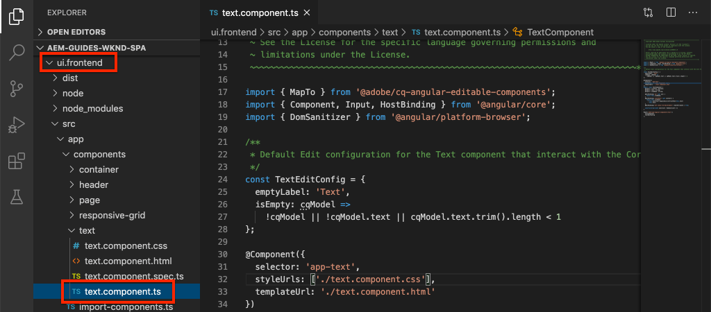
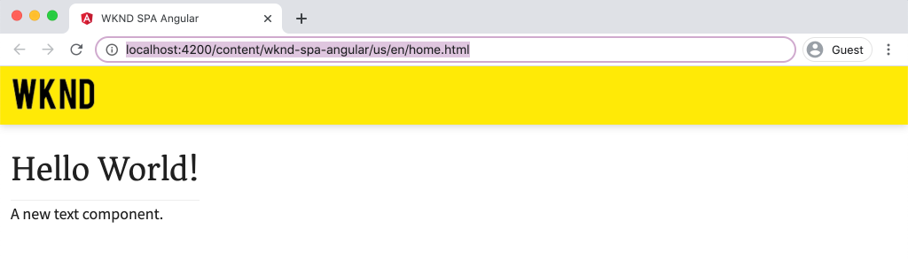

# SPA componenten toewijzen aan AEM componenten {#map-components}

Leer hoe u Angulars aan Adobe Experience Manager-componenten (AEM) toewijst met de AEM SPA Editor JS SDK. Met componenttoewijzing kunnen gebruikers dynamische updates uitvoeren naar SPA componenten in de AEM SPA Editor, net als bij traditionele AEM ontwerpen.

In dit hoofdstuk wordt dieper ingegaan op de AEM JSON-model-API en wordt uitgelegd hoe de JSON-inhoud die door een AEM wordt aangeboden, automatisch als props in een Angular-component kan worden geïnjecteerd.

## Doelstelling

1. Leer hoe u AEM componenten kunt toewijzen aan SPA Componenten.
2. Begrijp het verschil tussen **Container** componenten en **Content** componenten.
3. Maak een nieuwe Angular die aan een bestaande AEM wordt toegewezen.

## Wat u gaat maken

In dit hoofdstuk wordt geïnspecteerd hoe de opgegeven `Text` SPA component wordt toegewezen aan de AEM `Text`component. Er wordt een nieuwe `Image` SPA component gemaakt die in de SPA kan worden gebruikt en in AEM kan worden geschreven. Buiten de vakeigenschappen van **de Container van de Lay-out** en **de beleid van de Redacteur van het Malplaatje** zullen ook worden gebruikt om een mening tot stand te brengen die een weinig gevarieerder in verschijning is.


## Vereisten

Controleer de vereiste gereedschappen en instructies voor het instellen van een [lokale ontwikkelomgeving](overview.md#local-dev-environment).

### De code ophalen

1. Download het beginpunt voor deze zelfstudie via Git:

   ```shell
   $ git clone git@github.com:adobe/aem-guides-wknd-spa.git
   $ cd aem-guides-wknd-spa
   $ git checkout Angular/map-components-start
   ```

2. Implementeer de basis van de code op een lokale AEM met Maven:

   ```shell
   $ mvn clean install -PautoInstallSinglePackage
   ```

   Als u [AEM 6.x](overview.md#compatibility) gebruikt, voegt u het profiel `classic` toe:

   ```shell
   $ mvn clean install -PautoInstallSinglePackage -Pclassic
   ```

U kunt de gebeëindigde code op [GitHub](https://github.com/adobe/aem-guides-wknd-spa/tree/Angular/map-components-solution) altijd bekijken of de code plaatselijk controleren door aan de tak `Angular/map-components-solution` te schakelen.

## Toewijzingsmethode

Het basisconcept is om een SPA Component aan een AEM Component in kaart te brengen. AEM componenten, voer server-kant in, voer inhoud als deel van JSON model API uit. De JSON-inhoud wordt door de SPA verbruikt en wordt in de browser op de client uitgevoerd. Er wordt een 1:1-toewijzing gemaakt tussen SPA componenten en een AEM component.


*Overzicht op hoog niveau van het toewijzen van een AEM component aan een component van de Angular*

## De tekstcomponent Inspect

[AEM Projectarchetype](https://github.com/adobe/aem-project-archetype) verstrekt een `Text` component die aan AEM [component van de Tekst ](https://experienceleague.adobe.com/docs/experience-manager-core-components/using/components/text.html) in kaart wordt gebracht. Dit is een voorbeeld van een **content** component, in die zin dat *content* wordt gerenderd vanuit AEM.

Laten we eens kijken hoe de component werkt.

### Inspect het JSON-model

1. Voordat u in de SPA code springt, is het belangrijk dat u het JSON-model begrijpt dat AEM biedt. Navigeer naar [Core Component Library](https://www.aemcomponents.dev/content/core-components-examples/library/page-authoring/text.html) en bekijk de pagina voor de component Text. De Core Component Library bevat voorbeelden van alle AEM Core Components.
2. Selecteer het tabblad **JSON** voor een van de voorbeelden:

   

   Er moeten drie eigenschappen worden weergegeven: `text`, `richText` en `:type`.

   `:type` is een gereserveerde eigenschap die de  `sling:resourceType` (of het pad) van de AEM Component opsomt. De waarde van `:type` is wat wordt gebruikt om de AEM component aan de SPA in kaart te brengen.

   `text` en  `richText` zijn extra eigenschappen die aan de SPA component zullen worden blootgesteld.

### De component Text Inspect

1. Open een nieuwe terminal en navigeer naar de map `ui.frontend` in het project. Voer `npm install` en `npm start` uit om de **webpack-ontwikkelserver** te starten:

   ```shell
   $ cd ui.frontend
   $ npm run start:mock
   ```

   De `ui.frontend` module is momenteel opstelling om [modelJSON model](./integrate-spa.md#mock-json) te gebruiken.

2. U zou een nieuw browser venster moeten zien open aan [http://localhost:4200/content/wknd-spa-angular/us/en/home.html](http://localhost:4200/content/wknd-spa-angular/us/en/home.html)

   

3. In winde van uw keus open omhoog het AEM Project voor de SPA WKND. Breid `ui.frontend` module uit en open het dossier **text.component.ts** onder `ui.frontend/src/app/components/text/text.component.ts`:

   

4. Het eerste te inspecteren gebied is `class TextComponent` bij ~line 35:

   ```js
   export class TextComponent {
       @Input() richText: boolean;
       @Input() text: string;
       @Input() itemName: string;
   
       @HostBinding('innerHtml') get content() {
           return this.richText
           ? this.sanitizer.bypassSecurityTrustHtml(this.text)
           : this.text;
       }
       @HostBinding('attr.data-rte-editelement') editAttribute = true;
   
       constructor(private sanitizer: DomSanitizer) {}
   }
   ```

   [@Input()-](https://angular.io/api/core/Input) decorator wordt gebruikt om velden te declareren die de waarden via het toegewezen JSON-object hebben ingesteld, die eerder zijn gecontroleerd.

   `@HostBinding('innerHtml') get content()` is een methode die de geschreven tekstinhoud van de waarde van  `this.text`. Als de inhoud tekst met opmaak is (bepaald door de ingebouwde beveiliging van de Angular `this.richText`), wordt deze genegeerd. Angular [DomSanitizer](https://angular.io/api/platform-browser/DomSanitizer) wordt gebruikt om de onbewerkte HTML &quot;te schrobben&quot;en kwetsbaarheid van Scripting over de hele site te verhinderen. De methode is gebonden aan het `innerHtml` bezit gebruikend [@HostBinding](https://angular.io/api/core/HostBinding) decorator.

5. Controleer `TextEditConfig` nu op ~line 24:

   ```js
   const TextEditConfig = {
       emptyLabel: 'Text',
       isEmpty: cqModel =>
           !cqModel || !cqModel.text || cqModel.text.trim().length < 1
   };
   ```

   De bovenstaande code bepaalt wanneer de tijdelijke aanduiding in de AEM auteursomgeving moet worden weergegeven. Als de `isEmpty` methode **true** terugkeert, zal placeholder worden teruggegeven.

6. Neem ten slotte een blik bij de `MapTo` vraag bij ~lijn 53:

   ```js
   MapTo('wknd-spa-angular/components/text')(TextComponent, TextEditConfig );
   ```

   **** MapTois wordt geleverd door de AEM SPA Editor JS SDK (`@adobe/cq-angular-editable-components`). Het pad `wknd-spa-angular/components/text` vertegenwoordigt `sling:resourceType` van de AEM component. Dit pad komt overeen met het `:type` dat wordt weergegeven door het JSON-model dat u eerder hebt waargenomen. **** MapToparses de JSON modelreactie en gaat de correcte waarden tot de  `@Input()` variabelen van de SPA over.

   U kunt de AEM `Text` componentendefinitie bij `ui.apps/src/main/content/jcr_root/apps/wknd-spa-angular/components/text` vinden.

7. Experimenteer door het bestand **en.model.json** te wijzigen op `ui.frontend/src/mocks/json/en.model.json`.

   Bij ~line 62 werkt u de eerste `Text`-waarde bij om een **`H1`**- en **`u`**-tag te gebruiken:

   ```json
       "text": {
           "text": "<h1><u>Hello World!</u></h1>",
           "richText": true,
           ":type": "wknd-spa-angular/components/text"
       }
   ```

   Ga terug naar de browser om de effecten te zien die worden aangeboden door de **webpack dev server**:

   

   Probeer schakelend het `richText` bezit tussen **true** / **false** om de renderlogica in actie te zien.

8. Inspect **text.component.html** om `ui.frontend/src/app/components/text/text.component.html`.

   Dit bestand is leeg omdat de volledige inhoud van de component wordt ingesteld door de eigenschap `innerHTML`.

9. Inspect **app.module.ts** om `ui.frontend/src/app/app.module.ts`.

   ```js
   @NgModule({
   imports: [
       BrowserModule,
       SpaAngularEditableComponentsModule,
       AppRoutingModule
   ],
   providers: [ModelManagerService, { provide: APP_BASE_HREF, useValue: '/' }],
   declarations: [AppComponent, TextComponent, PageComponent, HeaderComponent],
   entryComponents: [TextComponent, PageComponent],
   bootstrap: [AppComponent]
   })
   export class AppModule {}
   ```

   De **TextComponent** is niet expliciet opgenomen, maar wel dynamisch via **AEMResponsiveGridComponent** die wordt geleverd door de AEM SPA Editor JS SDK. Daarom moet deze worden vermeld in de **app.module.ts**&#39; [entryComponents](https://angular.io/guide/entry-components)-array.

## De afbeeldingscomponent maken

Maak vervolgens een `Image`-Angular-component die is toegewezen aan de AEM [Image-component](https://experienceleague.adobe.com/docs/experience-manager-core-components/using/components/image.html). De `Image` component is een ander voorbeeld van een **content** component.

### Inspect the JSON

Voordat u in de SPA code gaat springen, moet u het JSON-model controleren dat AEM biedt.

1. Navigeer naar de [Voorbeelden van afbeeldingen in de Core Component Library](https://www.aemcomponents.dev/content/core-components-examples/library/page-authoring/image.html).

   

   Eigenschappen van `src`, `alt` en `title` worden gebruikt om de SPA `Image` component te vullen.

   >[!NOTE]
   >
   > Er zijn andere eigenschappen van het Beeld blootgesteld (`lazyEnabled`, `widths`) die een ontwikkelaar toestaan om een adaptieve en lazy ladende component tot stand te brengen. De component die in deze zelfstudie is ingebouwd, is eenvoudig en **niet** gebruikt deze geavanceerde eigenschappen.

2. Ga terug naar uw IDE en open `en.model.json` om `ui.frontend/src/mocks/json/en.model.json`. Aangezien dit een netto-nieuwe component voor ons project is, moeten we de Image JSON &quot;modelleren&quot;.

   Voeg bij ~line 70 een JSON-item toe voor het `image`-model (vergeet niet de volgkomma `,` na de tweede `text_386303036`) en werk de `:itemsOrder`-array bij.

   ```json
   ...
   ":items": {
               ...
               "text_386303036": {
                   "text": "<p>A new text component.</p>\r\n",
                   "richText": true,
                   ":type": "wknd-spa-angular/components/text"
                   },
               "image": {
                   "alt": "Rock Climber in New Zealand",
                   "title": "Rock Climber in New Zealand",
                   "src": "/mocks/images/adobestock-140634652.jpeg",
                   ":type": "wknd-spa-angular/components/image"
               }
           },
           ":itemsOrder": [
               "text",
               "text_386303036",
               "image"
           ],
   ```

   Het project bevat een voorbeeldafbeelding op `/mock-content/adobestock-140634652.jpeg` die wordt gebruikt met de **webpack-ontwikkelserver**.

   U kunt de volledige [en.model.json hier](https://github.com/adobe/aem-guides-wknd-spa/blob/Angular/map-components-solution/ui.frontend/src/mocks/json/en.model.json) bekijken.

3. Voeg een stockfoto toe die door de component moet worden weergegeven.

   Maak een nieuwe map met de naam **images** onder `ui.frontend/src/mocks`. Download [adobestock-140634652.jpeg](assets/map-components/adobestock-140634652.jpeg) en plaats deze in de nieuwe map **images**. Voel u vrij om desgewenst uw eigen afbeelding te gebruiken.

### De component Image implementeren

1. Stop **webpack dev server** indien gestart.
2. Creeer een nieuwe component van het Beeld door de Angular CLI `ng generate component` bevel van binnen `ui.frontend` omslag in werking te stellen:

   ```shell
   $ ng generate component components/image
   ```

3. Open **image.component.ts** in de IDE op `ui.frontend/src/app/components/image/image.component.ts` en werk de update als volgt uit:

   ```js
   import {Component, Input, OnInit} from '@angular/core';
   import {MapTo} from '@adobe/cq-angular-editable-components';
   
   const ImageEditConfig = {
   emptyLabel: 'Image',
   isEmpty: cqModel =>
       !cqModel || !cqModel.src || cqModel.src.trim().length < 1
   };
   
   @Component({
   selector: 'app-image',
   templateUrl: './image.component.html',
   styleUrls: ['./image.component.scss']
   })
   export class ImageComponent implements OnInit {
   
   @Input() src: string;
   @Input() alt: string;
   @Input() title: string;
   
   constructor() { }
   
   get hasImage() {
       return this.src && this.src.trim().length > 0;
   }
   
   ngOnInit() { }
   }
   
   MapTo('wknd-spa-angular/components/image')(ImageComponent, ImageEditConfig);
   ```

   `ImageEditConfig` is de configuratie om te bepalen of om auteursplaceholder in AEM terug te geven, die op wordt gebaseerd als het  `src` bezit bevolkt is.

   `@Input()` van  `src`,  `alt`en  `title` zijn de eigenschappen die zijn toegewezen via de JSON API.

   `hasImage()` is een methode die bepaalt of de afbeelding moet worden gerenderd.

   `MapTo` Wijst de SPA component aan de AEM component toe die bij  `ui.apps/src/main/content/jcr_root/apps/wknd-spa-angular/components/image`. wordt gevestigd.

4. Open **image.component.html** en werk deze als volgt bij:

   ```html
   <ng-container *ngIf="hasImage">
       
   </ng-container>
   ```

   Dit zal het `` element teruggeven als `hasImage` **true** terugkeert.

5. Open **image.component.scss** en werk deze als volgt bij:

   ```scss
   :host-context {
       display: block;
   }
   
   .image {
       margin: 1rem 0;
       width: 100%;
       border: 0;
   }
   ```

   >[!NOTE]
   >
   > De `:host-context` regel is **kritiek** voor AEM redacteursplaceholder om correct te functioneren. Alle SPA componenten die bedoeld zijn om in de AEM paginaredacteur te worden ontworpen zullen deze regel bij een minimum vereisen.

6. Open `app.module.ts` en voeg `ImageComponent` aan `entryComponents` serie toe:

   ```js
   entryComponents: [TextComponent, PageComponent, ImageComponent],
   ```

   Net als de `TextComponent` wordt `ImageComponent` dynamisch geladen en moet deze worden opgenomen in de `entryComponents`-array.

7. Start de **webpack dev server** om de `ImageComponent`-rendering weer te geven.

   ```shell
   $ npm run start:mock
   ```

   

   *Afbeelding toegevoegd aan de SPA*

   >[!NOTE]
   >
   > **Bonusuitdaging**: Voer een nieuwe methode uit om de waarde van  `title` als bijschrift onder de afbeelding weer te geven.

## Beleid bijwerken in AEM

De `ImageComponent`-component is alleen zichtbaar in de **webpack-ontwikkelserver**. Implementeer vervolgens de bijgewerkte SPA om het sjabloonbeleid te AEM en bij te werken.

1. Stop **webpack dev server** en van **root** van het project, stel de veranderingen in AEM gebruikend uw Maven vaardigheden op:

   ```shell
   $ cd aem-guides-wknd-spa
   $ mvn clean install -PautoInstallSinglePackage
   ```

2. Navigeer in het scherm AEM Start naar **[!UICONTROL Tools]** > **[!UICONTROL Templates]** > **[WKND SPA Angular](http://localhost:4502/libs/wcm/core/content/sites/templates.html/conf/wknd-spa-angular)**.

   Selecteer en bewerk de **SPA Pagina**:

   

3. Selecteer de **Indelingscontainer** en klik op het pictogram **policy** om het beleid te bewerken:

   

4. Onder **Toegestane componenten** > **WKND SPA Angular - Inhoud** > controleer de **Image** component:

   

   Onder **Standaardcomponenten** > **Toewijzing toevoegen** en kies de **Afbeelding - WKND SPA Angular - Inhoud** component:

   

   Voer een **mime type** van `image/*` in.

   Klik **Done** om de beleidsupdates te bewaren.

5. Klik in **Layout Container** op het pictogram **policy** voor de **Text**-component:

   

   Maak een nieuw beleid met de naam **WKND SPA Text**. Onder **Insteekmodules** > **Opmaak** > schakelt u alle vakken in om extra opmaakopties in te schakelen:

   

   Onder **Insteekmodules** > **Alineastijlen** > schakel het selectievakje in op **Alineastijlen inschakelen**:

   

   Klik **Done** om de beleidsupdate op te slaan.

6. Navigeer naar **Homepage** [http://localhost:4502/editor.html/content/wknd-spa-angular/us/en/home.html](http://localhost:4502/editor.html/content/wknd-spa-angular/us/en/home.html).

   U zou ook de `Text` component moeten kunnen uitgeven en extra paragraafstijlen toevoegen op **volledig-scherm** wijze.

   

7. U moet ook een afbeelding kunnen slepen en neerzetten vanaf de **Finder van middelen**:

   

8. Voeg uw eigen afbeeldingen toe via [AEM Assets](http://localhost:4502/assets.html/content/dam) of installeer de voltooide codebasis voor de standaard [WKND-referentiesite](https://github.com/adobe/aem-guides-wknd/releases/latest). De [WKND-referentiesite](https://github.com/adobe/aem-guides-wknd/releases/latest) bevat veel afbeeldingen die opnieuw kunnen worden gebruikt op de WKND-SPA. Het pakket kan worden geïnstalleerd met [AEM Package Manager](http://localhost:4502/crx/packmgr/index.jsp).

   

## Inspect the Layout Container

Ondersteuning voor de **Layout Container** wordt automatisch geleverd door de AEM SPA Editor SDK. De **container layout**, zoals aangegeven door de naam, is een **container** component. Containercomponenten zijn componenten die JSON-structuren accepteren die *andere*-componenten vertegenwoordigen en deze dynamisch instantiëren.

Laten we de container voor lay-out verder inspecteren.

1. Open in IDE **responsive-grid.component.ts** op `ui.frontend/src/app/components/responsive-grid`:

   ```js
   import { AEMResponsiveGridComponent,MapTo } from '@adobe/cq-angular-editable-components';
   
   MapTo('wcm/foundation/components/responsivegrid')(AEMResponsiveGridComponent);
   ```

   De `AEMResponsiveGridComponent` wordt geïmplementeerd als onderdeel van de AEM SPA Editor SDK en is via `import-components` opgenomen in het project.

2. Navigeer in een browser naar [http://localhost:4502/content/wknd-spa-angular/us/en.model.json](http://localhost:4502/content/wknd-spa-angular/us/en.model.json)

   

   De **Layout Container**-component heeft een `sling:resourceType` van `wcm/foundation/components/responsivegrid` en wordt door de SPA Editor herkend met de eigenschap `:type`, net als de componenten `Text` en `Image`.

   Dezelfde mogelijkheden om de grootte van een component te wijzigen met [Lay-outmodus](https://experienceleague.adobe.com/docs/experience-manager-65/authoring/siteandpage/responsive-layout.html#defining-layouts-layout-mode) zijn beschikbaar in de SPA Editor.

3. Ga terug naar [http://localhost:4502/editor.html/content/wknd-spa-angular/us/en/home.html](http://localhost:4502/editor.html/content/wknd-spa-angular/us/en/home.html). Voeg extra **Afbeelding**-componenten toe en probeer deze opnieuw te vergroten of te verkleinen met de optie **Lay-out**:

   

4. Open het JSON-model [http://localhost:4502/content/wknd-spa-angular/us/en.model.json](http://localhost:4502/content/wknd-spa-angular/us/en.model.json) opnieuw en bekijk `columnClassNames` als onderdeel van de JSON:

   

   De klassenaam `aem-GridColumn--default--4` geeft aan dat de component 4 kolommen breed moet zijn op basis van een 12-kolomraster. Meer informatie over het [responsieve raster vindt u hier](https://adobe-marketing-cloud.github.io/aem-responsivegrid/).

5. Terugkeer aan winde en in `ui.apps` module is er een cliënt-zijbibliotheek die bij `ui.apps/src/main/content/jcr_root/apps/wknd-spa-angular/clientlibs/clientlib-grid` wordt bepaald. Open het bestand `less/grid.less`.

   Dit bestand bepaalt de onderbrekingspunten (`default`, `tablet` en `phone`) die worden gebruikt door de **Layout Container**. Dit dossier is bedoeld om per projectspecificaties worden aangepast. Momenteel worden de onderbrekingspunten ingesteld op `1200px` en `650px`.

6. U zou de ontvankelijke mogelijkheden en het bijgewerkte rijke tekstbeleid van de `Text` component moeten kunnen gebruiken om een mening als het volgende te ontwerpen:

   

## Gefeliciteerd! {#congratulations}

Gefeliciteerd, hebt u geleerd hoe u SPA componenten kunt toewijzen aan AEM Componenten en een nieuwe `Image` component hebt geïmplementeerd. U hebt ook de kans om de responsieve mogelijkheden van de **container Layout** te onderzoeken.

U kunt de gebeëindigde code op [GitHub](https://github.com/adobe/aem-guides-wknd-spa/tree/Angular/map-components-solution) altijd bekijken of de code plaatselijk controleren door aan de tak `Angular/map-components-solution` te schakelen.

### Volgende stappen {#next-steps}

[Navigatie en het Verpletteren](navigation-routing.md)  - Leer hoe de veelvoudige meningen in de SPA door afbeelding aan AEM Pagina&#39;s met SPA Redacteur SDK kunnen worden gesteund. De dynamische navigatie wordt uitgevoerd gebruikend de Router van de Angular en toegevoegd aan een bestaande component van de Kopbal.

## Bonus - configuraties aan broncontrole blijven {#bonus}

In veel gevallen, vooral aan het begin van een AEM project is het waardevol om configuraties, zoals malplaatjes en verwant inhoudsbeleid, aan broncontrole voort te zetten. Dit zorgt ervoor dat alle ontwikkelaars tegen de zelfde reeks inhoud en configuraties werken en extra consistentie tussen milieu&#39;s kunnen verzekeren. Wanneer een project een bepaald ontwikkelingsniveau heeft bereikt, kan het beheren van sjablonen worden overgedragen aan een speciale groep van energiegebruikers.

De volgende paar stappen zullen plaatsvinden gebruikend winde van de Code van Visual Studio en [VSCode AEM Sync](https://marketplace.visualstudio.com/items?itemName=yamato-ltd.vscode-aem-sync) maar zouden kunnen doen gebruikend om het even welk hulpmiddel en om het even welke winde die u aan **pull** of **import** inhoud van een lokale instantie van AEM hebt gevormd.

1. In winde van de Code van Visual Studio, zorg ervoor dat u **VSCode AEM Sync** via de uitbreiding van de Marketplace geïnstalleerd hebt:

   

2. Breid **ui.content** module in de explorator van het Project uit en navigeer aan `/conf/wknd-spa-angular/settings/wcm/templates`.

3. **Klik met** de rechtermuisknop op de  `templates` map en selecteer  **Importeren van AEM server**:

   

4. Herhaal de stappen voor het importeren van inhoud, maar selecteer de map **policies** op `/conf/wknd-spa-angular/settings/wcm/policies`.

5. Inspect het `filter.xml`-bestand op `ui.content/src/main/content/META-INF/vault/filter.xml`.

   ```xml
   <!--ui.content filter.xml-->
   <?xml version="1.0" encoding="UTF-8"?>
    <workspaceFilter version="1.0">
        <filter root="/conf/wknd-spa-angular" mode="merge"/>
        <filter root="/content/wknd-spa-angular" mode="merge"/>
        <filter root="/content/dam/wknd-spa-angular" mode="merge"/>
        <filter root="/content/experience-fragments/wknd-spa-angular" mode="merge"/>
    </workspaceFilter>
   ```

   Het `filter.xml`-bestand identificeert de paden van knooppunten die samen met het pakket worden geïnstalleerd. Let op `mode="merge"` op elk van de filters die aangeeft dat bestaande inhoud niet wordt gewijzigd, alleen nieuwe inhoud wordt toegevoegd. Aangezien de inhoudsauteurs deze wegen kunnen bijwerken, is het belangrijk dat een codeplaatsing inhoud **niet** beschrijft. Raadpleeg de [FileVault-documentatie](https://jackrabbit.apache.org/filevault/filter.html) voor meer informatie over het werken met filterelementen.

   Vergelijk `ui.content/src/main/content/META-INF/vault/filter.xml` en `ui.apps/src/main/content/META-INF/vault/filter.xml` om de verschillende knopen te begrijpen die door elke module worden beheerd.
