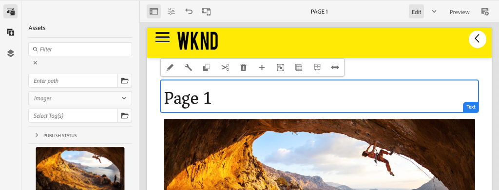
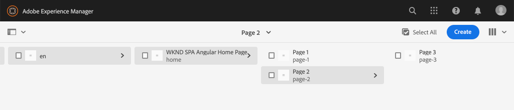

# Navigatie en routering toevoegen {#navigation-routing}

Leer hoe meerdere weergaven in de SPA worden ondersteund met AEM Pagina&#39;s en de SPA Editor SDK. Dynamische navigatie wordt uitgevoerd gebruikend de routes van de Angular en toegevoegd aan een bestaande component van de Kopbal.

## Doelstelling

1. Begrijp het SPA model verpletterend opties beschikbaar wanneer het gebruiken van de SPARedacteur.
2. Leer om [ Angular te gebruiken die ](https://angular.io/guide/router) verplettert om tussen verschillende meningen van de SPA te navigeren.
3. Voer een dynamische navigatie uit die door de AEM paginahiërarchie wordt aangedreven.

## Wat u gaat maken

In dit hoofdstuk wordt een navigatiemenu toegevoegd aan een bestaande `Header` -component. Het navigatiemenu wordt gedreven door de AEM paginahiërarchie en gebruikt het model JSON dat door de [ Component van de Kern van de Navigatie ](https://experienceleague.adobe.com/docs/experience-manager-core-components/using/components/navigation.html) wordt verstrekt.


## Vereisten

Herzie het vereiste tooling en de instructies voor vestiging a [ lokale ontwikkelomgeving ](overview.md#local-dev-environment).

### De code ophalen

1. Download het beginpunt voor deze zelfstudie via Git:

   ```shell
   $ git clone git@github.com:adobe/aem-guides-wknd-spa.git
   $ cd aem-guides-wknd-spa
   $ git checkout Angular/navigation-routing-start
   ```

2. Implementeer de basis van de code op een lokale AEM met Maven:

   ```shell
   $ mvn clean install -PautoInstallSinglePackage
   ```

   Als het gebruiken van [ AEM 6.x ](overview.md#compatibility) het `classic` profiel toevoegt:

   ```shell
   $ mvn clean install -PautoInstallSinglePackage -Pclassic
   ```

3. Installeer het gebeëindigde pakket voor de traditionele [ WKND verwijzingsplaats ](https://github.com/adobe/aem-guides-wknd/releases/latest). De beelden die door [ worden verstrekt WKND verwijzingsplaats ](https://github.com/adobe/aem-guides-wknd/releases/latest) worden opnieuw gebruikt op de SPA WKND. Het pakket kan worden geïnstalleerd gebruikend [ AEM de Manager van het Pakket ](http://localhost:4502/crx/packmgr/index.jsp).

   

U kunt de gebeëindigde code op [ GitHub ](https://github.com/adobe/aem-guides-wknd-spa/tree/Angular/navigation-routing-solution) altijd bekijken of de code uit controleren plaatselijk door aan de tak `Angular/navigation-routing-solution` te schakelen.

## Inspect HeaderComponent-updates {#inspect-header}

In vorige hoofdstukken is de component `HeaderComponent` toegevoegd als een zuivere Angular die via `app.component.html` is opgenomen. In dit hoofdstuk, wordt de `HeaderComponent` component verwijderd uit app en via de [ Redacteur van het Malplaatje ](https://experienceleague.adobe.com/docs/experience-manager-learn/sites/page-authoring/template-editor-feature-video-use.html) toegevoegd. Hierdoor kunnen gebruikers het navigatiemenu van de `HeaderComponent` vanuit AEM configureren.

>[!NOTE]
>
> Er zijn al verschillende CSS- en JavaScript-updates aangebracht in de codebasis om dit hoofdstuk te starten. Om zich op kernconcepten te concentreren, niet **worden alle** van de codeveranderingen besproken. U kunt de volledige veranderingen [ hier ](https://github.com/adobe/aem-guides-wknd-spa/compare/Angular/map-components-solution...Angular/navigation-routing-start) bekijken.

1. In winde van uw keus opent het SPA starterproject voor dit hoofdstuk.
2. Onder de module `ui.frontend` inspecteert u het bestand `header.component.ts` at: `ui.frontend/src/app/components/header/header.component.ts` .

   Er zijn verschillende updates uitgevoerd, waaronder de toevoeging van een `HeaderEditConfig` - en een `MapTo` -element om de component in staat te stellen aan een AEM component te worden toegewezen `wknd-spa-angular/components/header` .

   ```js
   /* header.component.ts */
   ...
   const HeaderEditConfig = {
       ...
   };
   
   @Component({
   selector: 'app-header',
   templateUrl: './header.component.html',
   styleUrls: ['./header.component.scss']
   })
   export class HeaderComponent implements OnInit {
   @Input() items: object[];
       ...
   }
   ...
   MapTo('wknd-spa-angular/components/header')(withRouter(Header), HeaderEditConfig);
   ```

   Noteer de `@Input()` -annotatie voor `items` . `items` bevat een array van navigatieobjecten die vanuit AEM worden doorgegeven.

3. Controleer in de module `ui.apps` de componentdefinitie van de AEM `Header` component: `ui.apps/src/main/content/jcr_root/apps/wknd-spa-angular/components/header/.content.xml`

   ```xml
   <?xml version="1.0" encoding="UTF-8"?>
   <jcr:root xmlns:sling="http://sling.apache.org/jcr/sling/1.0" xmlns:cq="http://www.day.com/jcr/cq/1.0"
       xmlns:jcr="http://www.jcp.org/jcr/1.0"
       jcr:primaryType="cq:Component"
       jcr:title="Header"
       sling:resourceSuperType="wknd-spa-angular/components/navigation"
       componentGroup="WKND SPA Angular - Structure"/>
   ```

   De AEM `Header` component zal alle functionaliteit van de [ Component van de Kern van de Navigatie ](https://experienceleague.adobe.com/docs/experience-manager-core-components/using/components/navigation.html) via het `sling:resourceSuperType` bezit erven.

## Voeg de component HeaderComponent aan het SPA toe malplaatje {#add-header-template}

1. Open browser en login aan AEM, [ http://localhost:4502/ ](http://localhost:4502/). De begincodebasis zou reeds moeten worden opgesteld.
2. Navigeer aan **[!UICONTROL SPA Page Template]**: [ http://localhost:4502/editor.html/conf/wknd-spa-angular/settings/wcm/templates/spa-page-template/structure.html ](http://localhost:4502/editor.html/conf/wknd-spa-angular/settings/wcm/templates/spa-page-template/structure.html).
3. Selecteer de buitenste **[!UICONTROL Root Layout Container]** en klik op het pictogram **[!UICONTROL Policy]** ervan. Wees voorzichtig **niet** om **[!UICONTROL Layout Container]** niet-gesloten voor creatie te selecteren.

   

4. Kopieer het huidige beleid en maak een nieuw beleid met de naam **[!UICONTROL SPA Structure]** :

   

   Selecteer onder **[!UICONTROL Allowed Components]** > **[!UICONTROL General]** > de component **[!UICONTROL Layout Container]** .

   Onder **[!UICONTROL Allowed Components]** > **[!UICONTROL WKND SPA ANGULAR - STRUCTURE]** > selecteert u de component **[!UICONTROL Header]** :

   

   Selecteer onder **[!UICONTROL Allowed Components]** > **[!UICONTROL WKND SPA ANGULAR - Content]** de componenten **[!UICONTROL Image]** en **[!UICONTROL Text]** . Er moeten in totaal vier componenten zijn geselecteerd.

   Klik op **[!UICONTROL Done]** om de wijzigingen op te slaan.

5. **verfrist zich** de pagina. Voeg de component **[!UICONTROL Header]** toe boven de niet-vergrendelde **[!UICONTROL Layout Container]** :

    toe

6. Selecteer de **[!UICONTROL Header]** component en klik zijn **2} pictogram van het Beleid {om het beleid uit te geven.**

   

7. Creeer een nieuw beleid met a **[!UICONTROL Policy Title]** van **&quot;WKND SPA Kopbal&quot;**.

   Onder de **[!UICONTROL Properties]** :

   * Stel de waarde **[!UICONTROL Navigation Root]** in op `/content/wknd-spa-angular/us/en` .
   * Plaats **[!UICONTROL Exclude Root Levels]** aan **1**.
   * Schakel **[!UICONTROL Collect al child pages]** uit.
   * Plaats **[!UICONTROL Navigation Structure Depth]** aan **3**.

   

   Hierdoor worden de navigatieniveaus 2 diep onder `/content/wknd-spa-angular/us/en` verzameld.

8. Nadat u de wijzigingen hebt opgeslagen, ziet u de gevulde `Header` als onderdeel van de sjabloon:

   

## Onderliggende pagina&#39;s maken

Maak vervolgens aanvullende pagina&#39;s in AEM die als de verschillende weergaven in de SPA dienen. We zullen ook de hiërarchische structuur van het JSON-model dat door AEM wordt aangeboden, controleren.

1. Navigeer aan de **console van Plaatsen**: [ http://localhost:4502/sites.html/content/wknd-spa-angular/us/en/home ](http://localhost:4502/sites.html/content/wknd-spa-angular/us/en/home). Selecteer de **WebND SPA de Homepage van de Angular** en klik **[!UICONTROL Create]** > **[!UICONTROL Page]**:

   

2. Onder **[!UICONTROL Template]** selecteert u **[!UICONTROL SPA Page]** . Onder **[!UICONTROL Properties]** ga **&quot;Pagina 1&quot;** voor **[!UICONTROL Title]** in en **&quot;pagina-1&quot;** als naam.

    in

   Klik op **[!UICONTROL Create]** en klik in het dialoogvenster op **[!UICONTROL Open]** om de pagina te openen in de AEM SPA Editor.

3. Voeg een nieuwe component **[!UICONTROL Text]** toe aan de hoofdmap **[!UICONTROL Layout Container]** . Bewerk de component en ga de tekst in: **&quot;Pagina 1&quot;** gebruikend RTE en het **H1** element (u zult volledig-schermwijze moeten ingaan om de paragraafelementen te veranderen)

   

   Voel u vrij om extra inhoud toe te voegen, zoals een afbeelding.

4. Terugkeer aan de console van AEM Sites en herhaal de bovengenoemde stappen, die tot een tweede pagina leiden genoemd **&quot;Pagina 2&quot;** als sibling van **Pagina 1**. Voeg inhoud aan **Pagina 2** toe zodat het gemakkelijk wordt geïdentificeerd.
5. Tot slot creeer een derde pagina, **&quot;Pagina 3&quot;** maar als a **kind** van **Pagina 2**. Na voltooiing zou de plaatshiërarchie als het volgende moeten kijken:

   

6. In een nieuw lusje, open JSON model API die door AEM wordt verstrekt: [ http://localhost:4502/content/wknd-spa-angular/us/en.model.json ](http://localhost:4502/content/wknd-spa-angular/us/en.model.json). Deze JSON-inhoud wordt opgevraagd wanneer de SPA voor het eerst wordt geladen. De buitenste structuur ziet er als volgt uit:

   ```json
   {
   "language": "en",
   "title": "en",
   "templateName": "spa-app-template",
   "designPath": "/libs/settings/wcm/designs/default",
   "cssClassNames": "spa page basicpage",
   ":type": "wknd-spa-angular/components/spa",
   ":items": {},
   ":itemsOrder": [],
   ":hierarchyType": "page",
   ":path": "/content/wknd-spa-angular/us/en",
   ":children": {
       "/content/wknd-spa-angular/us/en/home": {},
       "/content/wknd-spa-angular/us/en/home/page-1": {},
       "/content/wknd-spa-angular/us/en/home/page-2": {},
       "/content/wknd-spa-angular/us/en/home/page-2/page-3": {}
       }
   }
   ```

   Onder `:children` ziet u een item voor elk van de gemaakte pagina&#39;s. De inhoud voor alle pagina&#39;s staat in dit eerste JSON-verzoek. Zodra, wordt het navigatie verpletteren uitgevoerd, worden de verdere meningen van de SPA geladen snel, aangezien de inhoud reeds beschikbare cliënt-kant is.

   Het is niet wijs om **ALLES** van de inhoud van een SPA in het aanvankelijke JSON- verzoek te laden, aangezien dit de aanvankelijke paginading zou vertragen. Vervolgens kunt u bekijken hoe de hiërarchische diepte van pagina&#39;s wordt verzameld.

7. Navigeer aan het **SPA van de Wortel** malplaatje bij: [ http://localhost:4502/editor.html/conf/wknd-spa-angular/settings/wcm/templates/spa-app-template/structure.html ](http://localhost:4502/editor.html/conf/wknd-spa-angular/settings/wcm/templates/spa-app-template/structure.html).

   Klik op **[!UICONTROL Page properties menu]** > **[!UICONTROL Page Policy]** :

   

8. Het **SPA 1} malplaatje van de Wortel {heeft een extra **[!UICONTROL Hierarchical Structure]**lusje om de verzamelde inhoud te controleren JSON.** **[!UICONTROL Structure Depth]** bepaalt hoe diep in de plaatshiërarchie om kindpagina&#39;s onder de **wortel** te verzamelen. U kunt het veld **[!UICONTROL Structure Patterns]** ook gebruiken om extra pagina&#39;s op basis van een reguliere expressie eruit te filteren.

   Werk **[!UICONTROL Structure Depth]** aan **&quot;2&quot;** bij:

   

   Klik op **[!UICONTROL Done]** om de wijzigingen in het beleid op te slaan.

9. Open het model JSON [ http://localhost:4502/content/wknd-spa-angular/us/en.model.json ](http://localhost:4502/content/wknd-spa-angular/us/en.model.json) opnieuw.

   ```json
   {
   "language": "en",
   "title": "en",
   "templateName": "spa-app-template",
   "designPath": "/libs/settings/wcm/designs/default",
   "cssClassNames": "spa page basicpage",
   ":type": "wknd-spa-angular/components/spa",
   ":items": {},
   ":itemsOrder": [],
   ":hierarchyType": "page",
   ":path": "/content/wknd-spa-angular/us/en",
   ":children": {
       "/content/wknd-spa-angular/us/en/home": {},
       "/content/wknd-spa-angular/us/en/home/page-1": {},
       "/content/wknd-spa-angular/us/en/home/page-2": {}
       }
   }
   ```

   Bericht dat **Pagina 3** weg is verwijderd: `/content/wknd-spa-angular/us/en/home/page-2/page-3` van het aanvankelijke model JSON.

   Later zullen we zien hoe de AEM SPA Editor SDK dynamisch aanvullende inhoud kan laden.

## Navigatie implementeren

Implementeer vervolgens het navigatiemenu met een nieuwe `NavigationComponent` . U kunt de code rechtstreeks in `header.component.html` toevoegen, maar u kunt grote componenten beter voorkomen. In plaats daarvan implementeert u een `NavigationComponent` -bestand dat later opnieuw kan worden gebruikt.

1. Herzie JSON die door de AEM `Header` component in [ wordt blootgesteld http://localhost:4502/content/wknd-spa-angular/us/en.model.json ](http://localhost:4502/content/wknd-spa-angular/us/en.model.json):

   ```json
   ...
   "header": {
       "items": [
       {
       "level": 0,
       "active": true,
       "path": "/content/wknd-spa-angular/us/en/home",
       "description": null,
       "url": "/content/wknd-spa-angular/us/en/home.html",
       "lastModified": 1589062597083,
       "title": "WKND SPA Angular Home Page",
       "children": [
               {
               "children": [],
               "level": 1,
               "active": false,
               "path": "/content/wknd-spa-angular/us/en/home/page-1",
               "description": null,
               "url": "/content/wknd-spa-angular/us/en/home/page-1.html",
               "lastModified": 1589429385100,
               "title": "Page 1"
               },
               {
               "level": 1,
               "active": true,
               "path": "/content/wknd-spa-angular/us/en/home/page-2",
               "description": null,
               "url": "/content/wknd-spa-angular/us/en/home/page-2.html",
               "lastModified": 1589429603507,
               "title": "Page 2",
               "children": [
                   {
                   "children": [],
                   "level": 2,
                   "active": false,
                   "path": "/content/wknd-spa-angular/us/en/home/page-2/page-3",
                   "description": null,
                   "url": "/content/wknd-spa-angular/us/en/home/page-2/page-3.html",
                   "lastModified": 1589430413831,
                   "title": "Page 3"
                   }
               ],
               }
           ]
           }
       ],
   ":type": "wknd-spa-angular/components/header"
   ```

   De hiërarchische aard van de AEM pagina&#39;s wordt gemodelleerd in JSON die kan worden gebruikt om een navigatiemenu te bevolken. Rappel dat de `Header` component alle functionaliteit van de [ Component van de Kern van de Navigatie ](https://www.aemcomponents.dev/content/core-components-examples/library/core-structure/navigation.html) erft en de inhoud die door JSON wordt blootgesteld wordt automatisch in kaart gebracht aan de Angular `@Input` annotation.

2. Open een nieuw terminalvenster en navigeer naar de map `ui.frontend` van het SPA project. Maak een nieuwe `NavigationComponent` met het CLI-gereedschap Angular:

   ```shell
   $ cd ui.frontend
   $ ng generate component components/navigation
   CREATE src/app/components/navigation/navigation.component.scss (0 bytes)
   CREATE src/app/components/navigation/navigation.component.html (25 bytes)
   CREATE src/app/components/navigation/navigation.component.spec.ts (656 bytes)
   CREATE src/app/components/navigation/navigation.component.ts (286 bytes)
   UPDATE src/app/app.module.ts (2032 bytes)
   ```

3. Maak vervolgens een klasse met de naam `NavigationLink` met de Angular-CLI in de nieuwe map `components/navigation` :

   ```shell
   $ cd src/app/components/navigation/
   $ ng generate class NavigationLink
   CREATE src/app/components/navigation/navigation-link.spec.ts (187 bytes)
   CREATE src/app/components/navigation/navigation-link.ts (32 bytes)
   ```

4. Ga terug naar de IDE van uw keuze en open het bestand op `navigation-link.ts` om `/src/app/components/navigation/navigation-link.ts` .

   

5. Vul `navigation-link.ts` met het volgende:

   ```js
   export class NavigationLink {
   
       title: string;
       path: string;
       url: string;
       level: number;
       children: NavigationLink[];
       active: boolean;
   
       constructor(data) {
           this.path = data.path;
           this.title = data.title;
           this.url = data.url;
           this.level = data.level;
           this.active = data.active;
           this.children = data.children.map( item => {
               return new NavigationLink(item);
           });
       }
   }
   ```

   Dit is een eenvoudige klasse die een afzonderlijke navigatiekoppeling vertegenwoordigt. In de klasseconstructor verwachten we dat `data` het JSON-object is dat vanuit AEM wordt doorgegeven. Deze klasse wordt gebruikt binnen zowel `NavigationComponent` als `HeaderComponent` om de navigatiestructuur gemakkelijk te vullen.

   Er wordt geen gegevenstransformatie uitgevoerd. Deze klasse wordt vooral gemaakt om het JSON-model sterk te typen. `this.children` wordt getypt als `NavigationLink[]` en de constructor maakt recursief nieuwe `NavigationLink` -objecten voor elk item in de `children` -array. Het JSON-model voor de `Header` is hiërarchisch.

6. Open het bestand `navigation-link.spec.ts` . Dit is het testbestand voor de klasse `NavigationLink` . Werk het bij met het volgende:

   ```js
   import { NavigationLink } from './navigation-link';
   
   describe('NavigationLink', () => {
       it('should create an instance', () => {
           const data = {
               children: [],
               level: 1,
               active: false,
               path: '/content/wknd-spa-angular/us/en/home/page-1',
               description: null,
               url: '/content/wknd-spa-angular/us/en/home/page-1.html',
               lastModified: 1589429385100,
               title: 'Page 1'
           };
           expect(new NavigationLink(data)).toBeTruthy();
       });
   });
   ```

   `const data` volgt hetzelfde JSON-model dat eerder is geïnspecteerd voor één koppeling. Dit is verre van een robuuste eenheidstest, nochtans zou het moeten volstaan om de aannemer van `NavigationLink` te testen.

7. Open het bestand `navigation.component.ts` . Werk het bij met het volgende:

   ```js
   import { Component, OnInit, Input } from '@angular/core';
   import { NavigationLink } from './navigation-link';
   
   @Component({
   selector: 'app-navigation',
   templateUrl: './navigation.component.html',
   styleUrls: ['./navigation.component.scss']
   })
   export class NavigationComponent implements OnInit {
   
       @Input() items: object[];
   
       constructor() { }
   
       get navigationLinks(): NavigationLink[] {
   
           if (this.items && this.items.length > 0) {
               return this.items.map(item => {
                   return new NavigationLink(item);
               });
           }
   
           return null;
       }
   
       ngOnInit() {}
   
   }
   ```

   `NavigationComponent` verwacht van AEM een `object[]` named `items` die het JSON-model is. Deze klasse maakt één methode `get navigationLinks()` beschikbaar die een array van `NavigationLink` -objecten retourneert.

8. Open het bestand `navigation.component.html` en werk het bij met het volgende:

   ```html
   <ul *ngIf="navigationLinks && navigationLinks.length > 0" class="navigation__group">
       <ng-container *ngTemplateOutlet="recursiveListTmpl; context:{ links: navigationLinks }"></ng-container>
   </ul>
   ```

   Hiermee wordt een eerste `<ul>` gegenereerd en wordt de methode `get navigationLinks()` van `navigation.component.ts` aangeroepen. Een `<ng-container>` wordt gebruikt om een aanroep te maken naar een sjabloon met de naam `recursiveListTmpl` en geeft deze `navigationLinks` door als een variabele met de naam `links` .

   Voeg de volgende `recursiveListTmpl` toe:

   ```html
   <ng-template #recursiveListTmpl let-links="links">
       <li *ngFor="let link of links" class="{{'navigation__item navigation__item--' + link.level}}">
           <a [routerLink]="link.url" class="navigation__item-link" [title]="link.title" [attr.aria-current]="link.active">
               {{link.title}}
           </a>
           <ul *ngIf="link.children && link.children.length > 0">
               <ng-container *ngTemplateOutlet="recursiveListTmpl; context:{ links: link.children }"></ng-container>
           </ul>
       </li>
   </ng-template>
   ```

   Hier wordt de rest van de rendering voor de navigatiekoppeling geïmplementeerd. De variabele `link` is van het type `NavigationLink` en alle methoden/eigenschappen die door die klasse worden gemaakt, zijn beschikbaar. [`[routerLink]` ](https://angular.io/api/router/RouterLink) wordt gebruikt in plaats van normaal `href` attribuut. Hierdoor kunnen we koppelingen maken naar specifieke routes in de app, zonder dat de volledige pagina wordt vernieuwd.

   Het recursieve gedeelte van de navigatie wordt ook geïmplementeerd door een andere `<ul>` te maken als de huidige `link` een niet-lege `children` array heeft.

9. Werk `navigation.component.spec.ts` bij om ondersteuning toe te voegen voor `RouterTestingModule` :

   ```diff
    ...
   + import { RouterTestingModule } from '@angular/router/testing';
    ...
    beforeEach(async(() => {
       TestBed.configureTestingModule({
   +   imports: [ RouterTestingModule ],
       declarations: [ NavigationComponent ]
       })
       .compileComponents();
    }));
    ...
   ```

   `RouterTestingModule` moet worden toegevoegd omdat de component `[routerLink]` gebruikt.

10. Werk `navigation.component.scss` bij om enkele basisstijlen toe te voegen aan de `NavigationComponent` :

   ```scss
   @import "~src/styles/variables";
   
   $link-color: $black;
   $link-hover-color: $white;
   $link-background: $black;
   
   :host-context {
       display: block;
       width: 100%;
   }
   
   .navigation__item {
       list-style: none;
   }
   
   .navigation__item-link {
       color: $link-color;
       font-size: $font-size-large;
       text-transform: uppercase;
       padding: $gutter-padding;
       display: flex;
       border-bottom: 1px solid $gray;
   
       &:hover {
           background: $link-background;
           color: $link-hover-color;
       }
   
   }
   ```

## De koptekstcomponent bijwerken

Nu `NavigationComponent` is geïmplementeerd, moet `HeaderComponent` worden bijgewerkt om ernaar te verwijzen.

1. Open een terminal en navigeer naar de map `ui.frontend` in het SPA project. Begin de **webpack dev server**:

   ```shell
   $ npm start
   ```

2. Open een browser lusje en navigeer aan [ http://localhost:4200/ ](http://localhost:4200/).

   De **webpack dev server** zou aan volmacht het model JSON van een lokale instantie van AEM (`ui.frontend/proxy.conf.json`) moeten worden gevormd. Op deze manier kunnen we rechtstreeks code toevoegen aan de inhoud die in AEM van eerder in de zelfstudie is gemaakt.

   

   Op dit moment is de menuschakelfunctionaliteit van `HeaderComponent` al geïmplementeerd. Voeg vervolgens de navigatiecomponent toe.

3. Ga terug naar de IDE van uw keuze en open het bestand `header.component.ts` op `ui.frontend/src/app/components/header/header.component.ts` .
4. Werk de methode `setHomePage()` bij om de hard-gecodeerde Koord te verwijderen en de dynamische die steunen te gebruiken door de AEM worden overgegaan component:

   ```js
   /* header.component.ts */
   import { NavigationLink } from '../navigation/navigation-link';
   ...
    setHomePage() {
       if (this.hasNavigation) {
           const rootNavigationLink: NavigationLink = new NavigationLink(this.items[0]);
           this.isHome = rootNavigationLink.path === this.route.snapshot.data.path;
           this.homePageUrl = rootNavigationLink.url;
       }
   }
   ...
   ```

   Er wordt een nieuwe instantie van `NavigationLink` gemaakt op basis van `items[0]` , de basis van het JSON-navigatiemodel dat vanuit AEM wordt doorgegeven. `this.route.snapshot.data.path` keert de weg van de huidige route van de Angular terug. Deze waarde wordt gebruikt om te bepalen als de huidige route de **Pagina van het Huis** is. `this.homePageUrl` wordt gebruikt om de ankerverbinding op het **embleem** te bevolken.

5. Open `header.component.html` en vervang de statische plaatsaanduiding voor de navigatie door een verwijzing naar het zojuist gemaakte object `NavigationComponent` :

   ```diff
       <div class="header-navigation">
           <div class="navigation">
   -            Navigation Placeholder
   +           <app-navigation [items]="items"></app-navigation>
           </div>
       </div>
   ```

   `[items]=items` geeft het kenmerk `@Input() items` from the `HeaderComponent` door aan de `NavigationComponent` locatie waar de navigatie wordt opgebouwd.

6. Open `header.component.spec.ts` en voeg een declaratie toe voor `NavigationComponent` :

   ```diff
       /* header.component.spect.ts */
   +   import { NavigationComponent } from '../navigation/navigation.component';
   
       describe('HeaderComponent', () => {
       let component: HeaderComponent;
       let fixture: ComponentFixture<HeaderComponent>;
   
       beforeEach(async(() => {
           TestBed.configureTestingModule({
           imports: [ RouterTestingModule ],
   +       declarations: [ HeaderComponent, NavigationComponent ]
           })
           .compileComponents();
       }));
   ```

   Aangezien `NavigationComponent` nu als deel van `HeaderComponent` wordt gebruikt moet het als deel van de testbed worden verklaard.

7. Sparen veranderingen in om het even welke open dossiers en terugkeer aan de **webpack dev server**: [ http://localhost:4200/ ](http://localhost:4200/)

   

   Open de navigatie door de menuknevel te klikken en u zou de bevolkte navigatiekoppelingen moeten zien. U zou aan verschillende meningen van de SPA moeten kunnen navigeren.

## Begrijp het SPA verpletteren

Nu de navigatie is uitgevoerd, inspecteer het verpletteren in AEM.

1. Open het bestand `app-routing.module.ts` at `ui.frontend/src/app` in de IDE.

   ```js
   /* app-routing.module.ts */
   import { AemPageDataResolver, AemPageRouteReuseStrategy } from '@adobe/cq-angular-editable-components';
   import { NgModule } from '@angular/core';
   import { RouteReuseStrategy, RouterModule, Routes, UrlMatchResult, UrlSegment } from '@angular/router';
   import { PageComponent } from './components/page/page.component';
   
   export function AemPageMatcher(url: UrlSegment[]): UrlMatchResult {
       if (url.length) {
           return {
               consumed: url,
               posParams: {
                   path: url[url.length - 1]
               }
           };
       }
   }
   
   const routes: Routes = [
       {
           matcher: AemPageMatcher,
           component: PageComponent,
           resolve: {
               path: AemPageDataResolver
           }
       }
   ];
   @NgModule({
       imports: [RouterModule.forRoot(routes)],
       exports: [RouterModule],
       providers: [
           AemPageDataResolver,
           {
           provide: RouteReuseStrategy,
           useClass: AemPageRouteReuseStrategy
           }
       ]
   })
   export class AppRoutingModule {}
   ```

   De array `routes: Routes = [];` definieert de routes of navigatiepaden naar componenttoewijzingen voor Angulars.

   `AemPageMatcher` is een router van de douaneAngular [ UrlMatcher ](https://angular.io/api/router/UrlMatcher), die om het even wat aanpast dat &quot;als&quot;een pagina in AEM kijkt die deel van deze toepassing van Angular uitmaakt.

   `PageComponent` is de Component van de Angular die een Pagina in AEM vertegenwoordigt, en gebruikt om de aangepaste routes terug te geven. `PageComponent` wordt later in de zelfstudie gereviseerd.

   `AemPageDataResolver`, die door de AEM SPA Redacteur JS SDK wordt verstrekt, is een douane [ Resolver van de Router van de Angular ](https://angular.io/api/router/Resolve) wordt gebruikt om route URL om te zetten, die de weg in AEM met inbegrip van de uitbreiding .html, aan de middelweg in AEM is, die de paginappad minus de uitbreiding is.

   De `AemPageDataResolver` transformeert bijvoorbeeld de URL van een route van `content/wknd-spa-angular/us/en/home.html` naar een pad van `/content/wknd-spa-angular/us/en/home` . Hiermee wordt de inhoud van de pagina opgelost op basis van het pad in de JSON-model-API.

   `AemPageRouteReuseStrategy`, die door de AEM SPA Redacteur JS SDK wordt verstrekt, is een douane [ RouteReuseStrategy ](https://angular.io/api/router/RouteReuseStrategy) die hergebruik van `PageComponent` over routes verhindert. Anders wordt de inhoud van pagina &quot;A&quot; mogelijk weergegeven wanneer u naar pagina &quot;B&quot; navigeert.

2. Open het bestand `page.component.ts` om `ui.frontend/src/app/components/page/` .

   ```js
   ...
   export class PageComponent {
       items;
       itemsOrder;
       path;
   
       constructor(
           private route: ActivatedRoute,
           private modelManagerService: ModelManagerService
       ) {
           this.modelManagerService
           .getData({ path: this.route.snapshot.data.path })
           .then(data => {
               this.path = data[Constants.PATH_PROP];
               this.items = data[Constants.ITEMS_PROP];
               this.itemsOrder = data[Constants.ITEMS_ORDER_PROP];
           });
       }
   }
   ```

   `PageComponent` wordt vereist om JSON te verwerken die van AEM wordt teruggewonnen en als component van de Angular wordt gebruikt om de routes terug te geven.

   `ActivatedRoute`, dat door de module van de Router van de Angular wordt verstrekt, bevat de staat erop wijst die welke inhoud JSON van AEM Pagina in deze de componenteninstantie van de Pagina van de Angular zou moeten worden geladen.

   `ModelManagerService` , haalt de JSON-gegevens op basis van de route op en wijst de gegevens toe aan klassevariabelen `path` , `items` `itemsOrder` . Deze zullen dan tot [ AEMPageComponent ](https://www.npmjs.com/package/@adobe/cq-angular-editable-components#aempagecomponent.md) worden overgegaan

3. Open het bestand `page.component.html` op `ui.frontend/src/app/components/page/`

   ```html
   <aem-page 
       class="structure-page" 
       [attr.data-cq-page-path]="path" 
       [cqPath]="path" 
       [cqItems]="items" 
       [cqItemsOrder]="itemsOrder">
   </aem-page>
   ```

   `aem-page` omvat [ AEMPageComponent ](https://www.npmjs.com/package/@adobe/cq-angular-editable-components#aempagecomponent.md). De variabelen `path` , `items` en `itemsOrder` worden doorgegeven aan `AEMPageComponent` . `AemPageComponent`, dat via de SPARedacteur JavaScript SDK wordt verstrekt zal dan over dit gegeven herhalen en dynamisch Angular componenten concretiseren die op de gegevens JSON worden gebaseerd zoals die in het [ leerprogramma van de Componenten van de Kaart ](./map-components.md) worden gezien.

   `PageComponent` is eigenlijk slechts een volmacht voor `AEMPageComponent` en het is `AEMPageComponent` die het grootste deel van het zware heffen doet om het model JSON aan de componenten van de Angular correct in kaart te brengen.

## Inspect de SPA routering in AEM

1. Open een terminal en stop **webpack dev server** als begonnen. Navigeer aan de wortel van het project, en stel het project in om het gebruiken van uw Geweven vaardigheden te AEM:

   ```shell
   $ cd aem-guides-wknd-spa
   $ mvn clean install -PautoInstallSinglePackage
   ```

   >[!CAUTION]
   >
   > Het project van de Angular heeft sommige zeer strikte toegelaten verbindingsregels. Als Maven bouwt ontbreekt, controleer de fout en zoek **fouten van de Kleur die in de vermelde dossiers worden gevonden.**. Los om het even welke die kwesties door linter worden gevonden en stel het Maven bevel opnieuw in werking.

2. Navigeer aan de SPA homepage in AEM: [ http://localhost:4502/content/wknd-spa-angular/us/en/home.html ](http://localhost:4502/content/wknd-spa-angular/us/en/home.html) en open de ontwikkelaarshulpmiddelen van uw browser. Onderstaande screenshots worden vastgelegd vanuit de Google Chrome-browser.

   Vernieuw de pagina en u zou een XHR- verzoek aan `/content/wknd-spa-angular/us/en.model.json` moeten zien, wat de SPAWortel is. U ziet dat er slechts drie onderliggende pagina&#39;s zijn opgenomen op basis van de configuratie van de hiërarchiediepte voor de SPA basissjabloon die eerder in de zelfstudie is gemaakt. Dit omvat niet **Pagina 3**.

   

3. Met de open ontwikkelaarshulpmiddelen, navigeer aan **Pagina 3**:

   

   Merk op dat een nieuw XHR-verzoek wordt gedaan aan: `/content/wknd-spa-angular/us/en/home/page-2/page-3.model.json`

   

   De AEM ModelManager begrijpt dat de **pagina 3** inhoud JSON niet beschikbaar is en automatisch het extra verzoek XHR teweegbrengt.

4. Ga verder met de navigatiekoppelingen in de SPA. Merk op dat er geen extra XHR-verzoeken worden gedaan en dat er geen volledige pagina-vernieuwingen plaatsvinden. Dit maakt de SPA snel voor de eindgebruiker en vermindert onnodige verzoeken terug naar AEM.

   

5. Experimenteer met diepe verbindingen door rechtstreeks te navigeren aan: [ http://localhost:4502/content/wknd-spa-angular/us/en/home/page-2.html ](http://localhost:4502/content/wknd-spa-angular/us/en/home/page-2.html). Let erop dat de knop Terug van de browser blijft werken.

## Gefeliciteerd! {#congratulations}

U hebt geleerd hoe meerdere weergaven in de SPA kunnen worden ondersteund door de SPA Editor SDK toe te wijzen aan AEM pagina&#39;s. Dynamische navigatie is geïmplementeerd via routering van Angulars en toegevoegd aan de component `Header` .

U kunt de gebeëindigde code op [ GitHub ](https://github.com/adobe/aem-guides-wknd-spa/tree/Angular/navigation-routing-solution) altijd bekijken of de code uit controleren plaatselijk door aan de tak `Angular/navigation-routing-solution` te schakelen.

### Volgende stappen {#next-steps}

[ creeer een Component van de Douane ](custom-component.md) - leer hoe te om een douanecomponent tot stand te brengen die met de Redacteur van de SPA van de AEM moet worden gebruikt. Leer hoe u dialoogvensters met auteurs en Sling Models ontwikkelt om het JSON-model uit te breiden en een aangepaste component te vullen.
