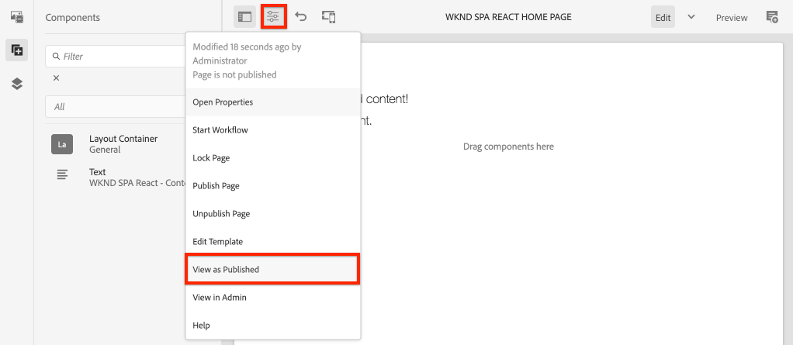

# Project maken {#spa-editor-project}

Leer hoe u een Adobe Experience Manager (AEM) Maven-project genereert als beginpunt voor een React-toepassing die is geïntegreerd met de AEM SPA Editor.

## Doelstelling

1. Genereer een SPA Editor ingeschakeld project met behulp van het AEM Project Archetype.
2. Implementeer het startproject naar een lokale instantie van AEM.

## Wat u gaat maken {#what-build}

In dit hoofdstuk, zal een nieuw AEM project worden geproduceerd, gebaseerd op [AEM Project Archetype](https://github.com/adobe/aem-project-archetype). Het AEM project zal met een zeer eenvoudig uitgangspunt voor React SPA worden opgestart.

**Wat is een Maven-project?** -  [Apache ](https://maven.apache.org/) Mavenis een hulpprogramma voor softwarebeheer voor het opzetten van projecten. *Alle implementaties van het* Managergebruik van de Ervaring van Adobe Maven projecten om douanecode bovenop AEM te bouwen, te beheren en op te stellen.

**Wat is een Maven archetype?** - Een  [Maven-](https://maven.apache.org/archetype/index.html) archetypis is een sjabloon of een patroon voor het genereren van nieuwe projecten. Het AEM archetype van het Project staat ons toe om een nieuw project met een douane te produceren namespace en een projectstructuur te omvatten die beste praktijken volgt, zeer versnellend ons project.

## Vereisten

Controleer de vereiste gereedschappen en instructies voor het instellen van een [lokale ontwikkelomgeving](overview.md#local-dev-environment). Zorg ervoor dat een nieuw exemplaar van Adobe Experience Manager, dat is gestart in de modus **auteur**, lokaal wordt uitgevoerd.

## Het project maken {#create}

>[!NOTE]
>
>Deze zelfstudie gebruikt versie **27** van het archetype. Het is altijd een beste praktijk om de **recentste** versie van archetype te gebruiken om een nieuw project te produceren.

1. Open een opdrachtregelterminal en voer de volgende Maven-opdracht in:

   ```shell
   mvn -B archetype:generate \
    -D archetypeGroupId=com.adobe.aem \
    -D archetypeArtifactId=aem-project-archetype \
    -D archetypeVersion=27 \
    -D appTitle="WKND SPA React" \
    -D appId="wknd-spa-react" \
    -D artifactId="aem-guides-wknd-spa.react" \
    -D groupId="com.adobe.aem.guides.wkndspa.react" \
    -D frontendModule="react" \
    -D aemVersion="cloud"
   ```

   >[!NOTE]
   >
   > Bij AEM 6.5.5+ vervangt u `aemVersion="cloud"` door `aemVersion="6.5.5"`. Gebruik `aemVersion="6.4.8"` als u zich richt op 6.4.8+.

   Let op de eigenschap `frontendModule=react`. Dit vertelt het Archetype van het Project van het AEM om het project met een aanzet [Reageer codebasis ](https://experienceleague.adobe.com/docs/experience-manager-core-components/using/developing/archetype/uifrontend-react.html) te laarzen om met de AEM SPA Redacteur worden gebruikt. Eigenschappen zoals `appTitle`, `appId`, `artifactId`, en `groupId` worden gebruikt om het project en het doel te identificeren.

   Een volledige lijst van beschikbare eigenschappen voor het vormen van een project [kan hier ](https://github.com/adobe/aem-project-archetype#available-properties) worden gevonden.

1. De volgende map en bestandsstructuur worden gegenereerd door het Maven archetype op uw lokale bestandssysteem:

   ```plain
   |--- aem-guides-wknd-spa.react/
       |--- all/
       |--- analyse/
       |--- core/
       |--- ui.apps/
       |--- ui.apps.structure/
       |--- ui.config/
       |--- ui.content/
       |--- ui.frontend/
       |--- ui.tests /
       |--- it.tests/
       |--- dispatcher/
       |--- analyse/
       |--- pom.xml
       |--- README.md
       |--- .gitignore
   ```

   Elke map vertegenwoordigt een afzonderlijke module Maven. In deze zelfstudie werken we vooral met de `ui.frontend`-module, de React-app. Meer details over individuele modules kunnen in [AEM documentatie van het Archetype van het Project worden gevonden](https://experienceleague.adobe.com/docs/experience-manager-core-components/using/developing/archetype/overview.html).

## Het project implementeren en bouwen

Daarna, compileert, bouwt, en stelt de projectcode aan een lokale instantie van AEM op gebruikend Maven.

1. Zorg ervoor dat een instantie van AEM lokaal wordt uitgevoerd op poort **4502**.
1. Van de bevellijn navigeer in de `aem-guides-wknd-spa.react` projectfolder.

   ```shell
   $ cd aem-guides-wknd-spa.react
   ```

1. Stel het volgende bevel in werking om het volledige project te bouwen en op te stellen aan AEM:

   ```shell
   $ mvn clean install -PautoInstallSinglePackage
   ```

   De build zal ongeveer een minuut in beslag nemen en zal eindigen met het volgende bericht:

   ```shell
   ...
   [INFO] ------------------------------------------------------------------------
   [INFO] Reactor Summary for aem-guides-wknd-spa.react 1.0.0-SNAPSHOT:
   [INFO]
   [INFO] aem-guides-wknd-spa.react .......................... SUCCESS [  0.257 s]
   [INFO] WKND SPA React - Core .............................. SUCCESS [ 12.553 s]
   [INFO] WKND SPA React - UI Frontend ....................... SUCCESS [01:46 min]
   [INFO] WKND SPA React - Repository Structure Package ...... SUCCESS [  1.082 s]
   [INFO] WKND SPA React - UI apps ........................... SUCCESS [  8.237 s]
   [INFO] WKND SPA React - UI content ........................ SUCCESS [  5.633 s]
   [INFO] WKND SPA React - UI config ......................... SUCCESS [  0.234 s]
   [INFO] WKND SPA React - All ............................... SUCCESS [  0.643 s]
   [INFO] WKND SPA React - Integration Tests ................. SUCCESS [ 12.377 s]
   [INFO] WKND SPA React - Dispatcher ........................ SUCCESS [  0.066 s]
   [INFO] WKND SPA React - UI Tests .......................... SUCCESS [  0.074 s]
   [INFO] WKND SPA React - Project Analyser .................. SUCCESS [ 31.287 s]
   [INFO] ------------------------------------------------------------------------
   [INFO] BUILD SUCCESS
   [INFO] ------------------------------------------------------------------------
   ```

   Het profiel Maven `autoInstallSinglePackage` compileert de individuele modules van het project en stelt één enkel pakket aan de AEM instantie op. Dit pakket wordt standaard geïmplementeerd op een AEM instantie die lokaal op poort **4502** wordt uitgevoerd en met de referenties van `admin:admin`.

1. Navigeer naar **Package Manager** op uw lokale AEM-instantie: [http://localhost:4502/crx/packmgr/index.jsp](http://localhost:4502/crx/packmgr/index.jsp).

1. U zou veelvoudige pakketten moeten zien vooraf bepaald met `aem-guides-wknd-spa.react`.

   

   *AEM Package Manager*

   Alle aangepaste code die nodig is voor het project wordt in deze pakketten gebundeld en in de AEM-omgeving geïnstalleerd.

## Inhoud auteur

Open vervolgens de SPA die is gegenereerd door het archetype en werk een deel van de inhoud bij.

1. Navigeer naar de **Sites**-console: [http://localhost:4502/sites.html/content](http://localhost:4502/sites.html/content).

   De WKND-SPA bevat een basissitestructuur met een land, taal en homepage. Deze hiërarchie is gebaseerd op de standaardwaarden van archetype voor `language_country` en `isSingleCountryWebsite`. Deze waarden kunnen worden beschreven door [beschikbare eigenschappen](https://github.com/adobe/aem-project-archetype#available-properties) bij te werken wanneer het produceren van een project.

2. Open de pagina **us** > **en** > **WKND SPA React Home Page** door de pagina te selecteren en op de knop **Edit** in de menubalk te klikken:

   

3. Er is al een **component Text** toegevoegd aan de pagina. U kunt deze component op dezelfde manier bewerken als elke andere component in AEM.

   

4. Voeg een extra **component Text** aan de pagina toe.

   U ziet dat de ontwerpervaring vergelijkbaar is met die van een traditionele AEM Sites-pagina. Momenteel is een beperkt aantal componenten beschikbaar die kunnen worden gebruikt. Tijdens de zelfstudie wordt meer toegevoegd.

## Inspect de toepassing Eén pagina

Controleer vervolgens of dit een toepassing voor één pagina is met gebruik van de ontwikkelaars van uw browser.

1. Klik in de **Pagina-editor** op de knop **Pagina-informatie** > **Weergeven als gepubliceerd**:

   

   Hiermee wordt een nieuw tabblad geopend met de queryparameter `?wcmmode=disabled` waarmee de AEM-editor feitelijk wordt uitgeschakeld: [http://localhost:4502/content/wknd-spa-react/us/en/home.html?wcmmode=disabled](http://localhost:4502/content/wknd-spa-react/us/en/home.html?wcmmode=disabled)

2. Bekijk de bron van de pagina. U ziet dat de tekstinhoud **[!DNL Hello World]** of een van de andere inhoud niet is gevonden. In plaats daarvan ziet u HTML als volgt:

   ```html
   ...
   <body>
       <noscript>You need to enable JavaScript to run this app.</noscript>
       <div id="spa-root"></div>
       <script type="text/javascript" src="/etc.clientlibs/wknd-spa-react/clientlibs/clientlib-react.lc-xxxx-lc.min.js"></script>
   </body>
   ...
   ```

   `clientlib-react.min.js` Dit is de SPA React die op de pagina wordt geladen en die verantwoordelijk is voor het renderen van de inhoud.

   *Waar komt de inhoud echter vandaan?*

3. Terug naar de tab: [http://localhost:4502/content/wknd-spa-react/us/en/home.html?wcmmode=disabled](http://localhost:4502/content/wknd-spa-react/us/en/home.html?wcmmode=disabled)
4. Open de de ontwikkelaarshulpmiddelen van browser en inspecteer het netwerkverkeer van de pagina tijdens verfrissen zich. Bekijk de **XHR** verzoeken:

   

   Er zou een verzoek aan [http://localhost:4502/content/wknd-spa-react/us/en.model.json](http://localhost:4502/content/wknd-spa-react/us/en.model.json) moeten zijn. Dit bevat alle inhoud, geformatteerd in JSON, die de SPA zal drijven.

5. Open [http://localhost:4502/content/wknd-spa-react/us/en.model.json](http://localhost:4502/content/wknd-spa-react/us/en.model.json) op een nieuw tabblad

   Het verzoek `en.model.json` vertegenwoordigt het inhoudsmodel dat de toepassing zal drijven. Inspect de JSON-uitvoer en u moet het fragment kunnen vinden dat de **[!UICONTROL Text]**-component(en) vertegenwoordigt.

   ```json
   ...
   ":items": {
       "text": {
           "text": "<p>Hello World! Updated content!</p>\r\n",
           "richText": true,
           ":type": "wknd-spa-react/components/text"
       },
       "text_98796435": {
           "text": "<p>A new text component.</p>\r\n",
           "richText": true,
           ":type": "wknd-spa-react/components/text"
       },
   }
   ...
   ```

   In het volgende hoofdstuk zullen wij inspecteren hoe deze inhoud JSON van AEM Componenten aan SPA Componenten wordt in kaart gebracht om de basis van de AEM SPA Ervaring van de Redacteur te vormen.

   >[!NOTE]
   >
   > Het kan handig zijn een browserextensie te installeren om de JSON-uitvoer automatisch op te maken.

## Gefeliciteerd! {#congratulations}

Gefeliciteerd, u hebt zojuist uw eerste AEM SPA Editor Project gemaakt!

Het SPA is heel eenvoudig. In de volgende hoofdstukken wordt meer functionaliteit toegevoegd.

### Volgende stappen {#next-steps}

[Integreer een SPA](integrate-spa.md)  - Leer hoe de SPA broncode met het AEM Project wordt geïntegreerd en begrijp hulpmiddelen beschikbaar om de SPA snel te ontwikkelen.
