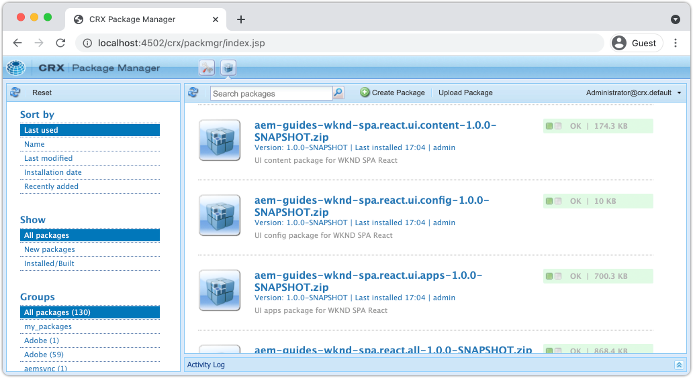

# Project maken {#spa-editor-project}

Leer hoe u een Adobe Experience Manager (AEM) Maven-project genereert als beginpunt voor een React-toepassing die is geïntegreerd met de AEM SPA Editor.

## Doelstelling

1. Genereer een SPA Editor ingeschakeld project met behulp van het AEM Project Archetype.
2. Implementeer het startproject naar een lokale instantie van AEM.

## Wat u gaat maken {#what-build}

In dit hoofdstuk, wordt een nieuw AEM project geproduceerd, dat op [ wordt gebaseerd AEM het Archetype van het Project ](https://github.com/adobe/aem-project-archetype). Het AEM project wordt opgestart met een heel eenvoudig startpunt voor de SPA React.

**wat is een Maven project?** - [ Apache Maven ](https://maven.apache.org/) is een hulpmiddel van het softwarebeheer om projecten te bouwen. *Alle Adobe Experience Manager* implementaties gebruiken GeMaven projecten om douanecode bovenop AEM te bouwen, te beheren en op te stellen.

**wat is een Maven archetype?** - A [ Maven archetype ](https://maven.apache.org/archetype/index.html) is een malplaatje of een patroon voor het produceren van nieuwe projecten. Het AEM archetype van het Project staat ons toe om een nieuw project met een douane te produceren namespace en een projectstructuur te omvatten die beste praktijken volgt, zeer versnellend ons project.

## Vereisten

Herzie het vereiste tooling en de instructies voor vestiging a [ lokale ontwikkelomgeving ](overview.md#local-dev-environment). Zorg ervoor dat een vers geval van Adobe Experience Manager, die op **auteur** wijze is begonnen, plaatselijk loopt.

## Het project maken {#create}

>[!NOTE]
>
>Dit leerprogramma gebruikt versie **35** van archetype.

1. Open een opdrachtregelterminal en voer de volgende Maven-opdracht in:

   ```shell
   mvn -B org.apache.maven.plugins:maven-archetype-plugin:3.2.1:generate \
    -D archetypeGroupId=com.adobe.aem \
    -D archetypeArtifactId=aem-project-archetype \
    -D archetypeVersion=35 \
    -D appTitle="WKND SPA React" \
    -D appId="wknd-spa-react" \
    -D artifactId="aem-guides-wknd-spa.react" \
    -D groupId="com.adobe.aem.guides.wkndspa.react" \
    -D frontendModule="react" \
    -D aemVersion="cloud"
   ```

   >[!NOTE]
   >
   > Als u AEM 6.5.5+ als doel instelt, vervangt u `aemVersion="cloud"` door `aemVersion="6.5.5"` . Gebruik `aemVersion="6.4.8"` als u zich richt op 6.4.8+.

   Let op de eigenschap `frontendModule=react` . Dit vertelt het Archetype van het Project van de AEM om het project met een starter [ Reageer codebasis ](https://experienceleague.adobe.com/docs/experience-manager-core-components/using/developing/archetype/uifrontend-react.html) te laarzen die met de AEM SPA Redacteur moet worden gebruikt. Eigenschappen zoals `appTitle` , `appId` , `artifactId` en `groupId` worden gebruikt om het project en het doel te identificeren.

   Een volledige lijst van beschikbare eigenschappen voor het vormen van een project [ kan hier ](https://github.com/adobe/aem-project-archetype#available-properties) worden gevonden.

1. De volgende map en bestandsstructuur worden gegenereerd door het Maven archetype op uw lokale bestandssysteem:

   ```plain
   |--- aem-guides-wknd-spa.react/
       |--- LICENSE
       |--- README.md
       |--- all/
       |--- archetype.properties
       |--- core/
       |--- dispatcher/
       |--- it.tests/
       |--- pom.xml
       |--- ui.apps/
       |--- ui.apps.structure/
       |--- ui.config/
       |--- ui.content/
       |--- ui.frontend/
       |--- ui.tests /
       |--- .gitignore
   ```

   Elke map vertegenwoordigt een afzonderlijke module Maven. In deze zelfstudie werken we vooral met de module `ui.frontend` , de React-app. Meer details over individuele modules kunnen in de [ AEM documentatie van het Archetype van het Project ](https://experienceleague.adobe.com/docs/experience-manager-core-components/using/developing/archetype/overview.html) worden gevonden.

## Het project implementeren en bouwen

Daarna, compileert, bouwt, en stelt de projectcode aan een lokale instantie van AEM op gebruikend Maven.

1. Verzeker een geval van AEM plaatselijk op haven **4502** loopt.
1. Navigeer vanaf de opdrachtregel naar de projectmap `aem-guides-wknd-spa.react` .

   ```shell
   $ cd aem-guides-wknd-spa.react
   ```

1. Stel het volgende bevel in werking om het volledige project te bouwen en op te stellen aan AEM:

   ```shell
   $ mvn clean install -PautoInstallSinglePackage
   ```

   De build zal ongeveer een minuut in beslag nemen en zal eindigen met het volgende bericht:

   ```shell
   ...
   [INFO] ------------------------------------------------------------------------
   [INFO] Reactor Summary for aem-guides-wknd-spa.react 1.0.0-SNAPSHOT:
   [INFO]
   [INFO] aem-guides-wknd-spa.react .......................... SUCCESS [  0.257 s]
   [INFO] WKND SPA React - Core .............................. SUCCESS [ 12.553 s]
   [INFO] WKND SPA React - UI Frontend ....................... SUCCESS [01:46 min]
   [INFO] WKND SPA React - Repository Structure Package ...... SUCCESS [  1.082 s]
   [INFO] WKND SPA React - UI apps ........................... SUCCESS [  8.237 s]
   [INFO] WKND SPA React - UI content ........................ SUCCESS [  5.633 s]
   [INFO] WKND SPA React - UI config ......................... SUCCESS [  0.234 s]
   [INFO] WKND SPA React - All ............................... SUCCESS [  0.643 s]
   [INFO] WKND SPA React - Integration Tests ................. SUCCESS [ 12.377 s]
   [INFO] WKND SPA React - Dispatcher ........................ SUCCESS [  0.066 s]
   [INFO] WKND SPA React - UI Tests .......................... SUCCESS [  0.074 s]
   [INFO] WKND SPA React - Project Analyser .................. SUCCESS [ 31.287 s]
   [INFO] ------------------------------------------------------------------------
   [INFO] BUILD SUCCESS
   [INFO] ------------------------------------------------------------------------
   ```

   Het profiel Geweven `autoInstallSinglePackage` compileert de individuele modules van het project en stelt één enkel pakket aan de AEM instantie op. Door gebrek wordt dit pakket opgesteld aan een AEM instantie die plaatselijk op haven **4502** en met de geloofsbrieven van `admin:admin` loopt.

1. Navigeer aan **Manager van het Pakket** op uw lokale AEM instantie: [ http://localhost:4502/crx/packmgr/index.jsp ](http://localhost:4502/crx/packmgr/index.jsp).

1. Er moeten meerdere pakketten zijn voorgefixeerd met `aem-guides-wknd-spa.react` .

   

   *AEM de Manager van het Pakket*

   Alle aangepaste code die nodig is voor het project, wordt in deze pakketten gebundeld en in de AEM-omgeving geïnstalleerd.

## Inhoud auteur

Open vervolgens de SPA die is gegenereerd door het archetype en werk een deel van de inhoud bij.

1. Navigeer aan de **console van Plaatsen**: [ http://localhost:4502/sites.html/content ](http://localhost:4502/sites.html/content).

   De WKND-SPA bevat een basissitestructuur met een land, taal en homepage. Deze hiërarchie is gebaseerd op de standaardwaarden van het archetype voor `language_country` en `isSingleCountryWebsite` . Deze waarden kunnen worden beschreven door de [ beschikbare eigenschappen ](https://github.com/adobe/aem-project-archetype#available-properties) bij te werken wanneer het produceren van een project.

2. Open de **gebruikers** > **en** > **WKND SPA Reageer de pagina van het Huis** door de pagina te selecteren en **te klikken geef** knoop in de menubar uit:

   

3. De component van A **Tekst** is reeds toegevoegd aan de pagina. U kunt deze component op dezelfde manier bewerken als elke andere component in AEM.

   

4. Voeg een extra **component van de Tekst** aan de pagina toe.

   U ziet dat de ontwerpervaring vergelijkbaar is met die van een traditionele AEM Sites-pagina. Momenteel is een beperkt aantal componenten beschikbaar die kunnen worden gebruikt. Tijdens de zelfstudie wordt meer toegevoegd.

## Inspect de toepassing Eén pagina

Controleer vervolgens of dit een toepassing voor één pagina is met gebruik van de ontwikkelaars van uw browser.

1. In de **Redacteur van de Pagina**, klik de **knoop van de Informatie van de Pagina** > **Mening zoals Gepubliceerd**:

   

   Dit zal een nieuw lusje met de vraagparameter `?wcmmode=disabled` openen die effectief de AEM redacteur uitzet: [ http://localhost:4502/content/wknd-spa-react/us/en/home.html?wcmmode=disabled ](http://localhost:4502/content/wknd-spa-react/us/en/home.html?wcmmode=disabled)

2. Bekijk de bron van de pagina. U ziet dat de tekstinhoud **[!DNL Hello World]** of een van de andere inhoud niet is gevonden. In plaats daarvan ziet u HTML als volgt:

   ```html
   ...
   <body>
       <noscript>You need to enable JavaScript to run this app.</noscript>
       <div id="spa-root"></div>
       <script type="text/javascript" src="/etc.clientlibs/wknd-spa-react/clientlibs/clientlib-react.lc-xxxx-lc.min.js"></script>
   </body>
   ...
   ```

   `clientlib-react.min.js` is de SPA React die op de pagina wordt geladen en die verantwoordelijk is voor het renderen van de inhoud.

   Nochtans, *waar komt de inhoud uit?*

3. Terugkeer aan het lusje: [ http://localhost:4502/content/wknd-spa-react/us/en/home.html?wcmmode=disabled](http://localhost:4502/content/wknd-spa-react/us/en/home.html?wcmmode=disabled)
4. Open de de ontwikkelaarshulpmiddelen van browser en inspecteer het netwerkverkeer van de pagina tijdens verfrissen zich. Bekijk de **XHR** verzoeken:

   

   Er zou een verzoek aan [ http://localhost:4502/content/wknd-spa-react/us/en.model.json ](http://localhost:4502/content/wknd-spa-react/us/en.model.json) moeten zijn. Dit bevat alle inhoud, geformatteerd in JSON, die de SPA zal drijven.

5. In een nieuw lusje open [ http://localhost:4502/content/wknd-spa-react/us/en.model.json](http://localhost:4502/content/wknd-spa-react/us/en.model.json)

   De aanvraag `en.model.json` vertegenwoordigt het inhoudsmodel waarop de toepassing wordt gebaseerd. Inspect de JSON-uitvoer en u moet het fragment kunnen vinden dat de **[!UICONTROL Text]** -component(en) vertegenwoordigt.

   ```json
   ...
   ":items": {
       "text": {
           "text": "<p>Hello World! Updated content!</p>\r\n",
           "richText": true,
           ":type": "wknd-spa-react/components/text"
       },
       "text_98796435": {
           "text": "<p>A new text component.</p>\r\n",
           "richText": true,
           ":type": "wknd-spa-react/components/text"
       },
   }
   ...
   ```

   In het volgende hoofdstuk zullen we controleren hoe deze JSON-inhoud wordt toegewezen van AEM Componenten aan SPA Componenten om de basis te vormen van de AEM SPA Editor-ervaring.

   >[!NOTE]
   >
   > Het kan handig zijn een browserextensie te installeren om de JSON-uitvoer automatisch op te maken.

## Gefeliciteerd! {#congratulations}

Gefeliciteerd, u hebt zojuist uw eerste AEM SPA Editor Project gemaakt!

Het SPA is heel eenvoudig. In de volgende hoofdstukken wordt meer functionaliteit toegevoegd.

### Volgende stappen {#next-steps}

[ integreer a SPA ](integrate-spa.md) - leer hoe de SPA broncode met het AEM Project wordt geïntegreerd en de middelen begrijpt beschikbaar om de SPA snel te ontwikkelen.
