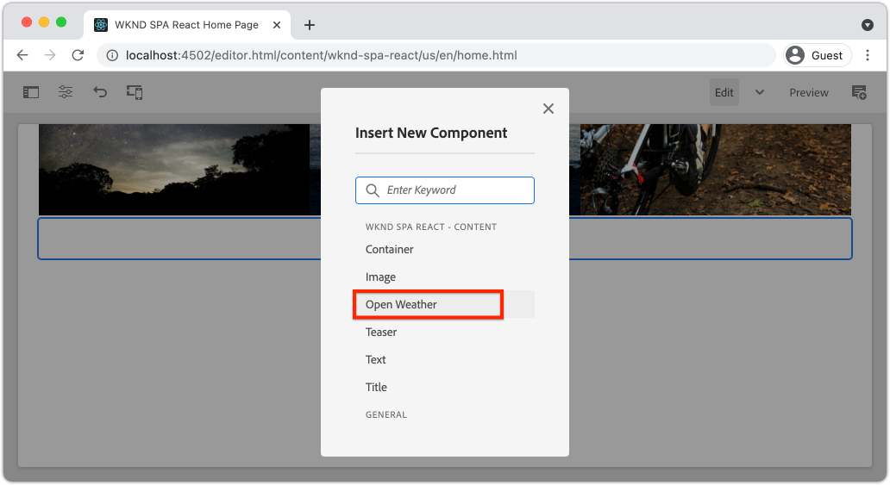

# Een aangepaste Weather-component {#custom-component} maken

Leer hoe u een aangepaste weercomponent maakt die u kunt gebruiken met de AEM SPA Editor. Leer hoe u dialoogvensters met auteurs en Sling Models ontwikkelt om het JSON-model uit te breiden en een aangepaste component te vullen. De [Open Weather API](https://openweathermap.org) en [React Open Weather component](https://www.npmjs.com/package/react-open-weather) worden gebruikt.

## Doelstelling

1. Begrijp de rol van Sling Models in het manipuleren van JSON model API die door AEM wordt verstrekt.
2. Begrijp hoe te om nieuwe AEM componentendialogen tot stand te brengen.
3. Leer om een **custom** AEM Component tot stand te brengen die met het SPA redacteurskader compatibel zal zijn.

## Wat u gaat maken

Er wordt een eenvoudige weercomponent gemaakt. Deze component kan door inhoudsauteurs aan de SPA worden toegevoegd. Met behulp van een AEM kunnen auteurs de locatie instellen voor het weer dat wordt weergegeven.  De implementatie van deze component illustreert de stappen die nodig zijn om een netto-nieuwe AEM te maken die compatibel is met het kader van de AEM SPA Editor.


## Vereisten

Controleer de vereiste gereedschappen en instructies voor het instellen van een [lokale ontwikkelomgeving](overview.md#local-dev-environment). Dit hoofdstuk is een voortzetting van het [Navigatie en het Verpletteren](navigation-routing.md) hoofdstuk, nochtans om langs alles te volgen u nodig is een SPA-toegelaten AEM project dat aan een lokale AEM instantie wordt opgesteld.

### API-sleutel voor weezelaar openen

Een API sleutel van [Open Weather](https://openweathermap.org/) is nodig om samen met het leerprogramma te volgen. [Aanmelden is ](https://home.openweathermap.org/users/sign_up) gratis voor een beperkte hoeveelheid API-aanroepen.

## De AEM component definiëren

Een AEM component wordt gedefinieerd als een knooppunt en eigenschappen. In het project worden deze knopen en eigenschappen vertegenwoordigd als dossiers van XML in `ui.apps` module. Maak vervolgens de AEM component in de module `ui.apps`.

>[!NOTE]
>
> Een snelle verfrisser op de [grondbeginselen van AEM componenten kan nuttig zijn](https://experienceleague.adobe.com/docs/experience-manager-learn/getting-started-wknd-tutorial-develop/project-archetype/component-basics.html).

1. Open de map `ui.apps` in IDE van uw keuze.
2. Navigeer naar `ui.apps/src/main/content/jcr_root/apps/wknd-spa-react/components` en maak een nieuwe map met de naam `open-weather`.
3. Maak een nieuw bestand met de naam `.content.xml` onder de map `open-weather`. Vul `open-weather/.content.xml` met het volgende:

   ```xml
   <?xml version="1.0" encoding="UTF-8"?>
   <jcr:root xmlns:sling="http://sling.apache.org/jcr/sling/1.0" xmlns:cq="http://www.day.com/jcr/cq/1.0" xmlns:jcr="http://www.jcp.org/jcr/1.0"
       jcr:primaryType="cq:Component"
       jcr:title="Open Weather"
       componentGroup="WKND SPA React - Content"/>
   ```

   

   `jcr:primaryType="cq:Component"` - identificeert dat dit knooppunt een AEM component zal zijn.

   `jcr:title` is de waarde die aan de Auteurs van de Inhoud zal worden getoond en het  `componentGroup` bepaalt de groepering van componenten in auteursUI.

4. Onder de `custom-component` omslag, creeer een andere omslag genoemd `_cq_dialog`.
5. Onder de map `_cq_dialog` maakt u een nieuw bestand met de naam `.content.xml` en vult u dit met het volgende:

   ```xml
   <?xml version="1.0" encoding="UTF-8"?>
   <jcr:root xmlns:sling="http://sling.apache.org/jcr/sling/1.0" xmlns:granite="http://www.adobe.com/jcr/granite/1.0" xmlns:cq="http://www.day.com/jcr/cq/1.0" xmlns:jcr="http://www.jcp.org/jcr/1.0" xmlns:nt="http://www.jcp.org/jcr/nt/1.0"
       jcr:primaryType="nt:unstructured"
       jcr:title="Open Weather"
       sling:resourceType="cq/gui/components/authoring/dialog">
       <content
           jcr:primaryType="nt:unstructured"
           sling:resourceType="granite/ui/components/coral/foundation/container">
           <items jcr:primaryType="nt:unstructured">
               <tabs
                   jcr:primaryType="nt:unstructured"
                   sling:resourceType="granite/ui/components/coral/foundation/tabs"
                   maximized="{Boolean}true">
                   <items jcr:primaryType="nt:unstructured">
                       <properties
                           jcr:primaryType="nt:unstructured"
                           jcr:title="Properties"
                           sling:resourceType="granite/ui/components/coral/foundation/container"
                           margin="{Boolean}true">
                           <items jcr:primaryType="nt:unstructured">
                               <columns
                                   jcr:primaryType="nt:unstructured"
                                   sling:resourceType="granite/ui/components/coral/foundation/fixedcolumns"
                                   margin="{Boolean}true">
                                   <items jcr:primaryType="nt:unstructured">
                                       <column
                                           jcr:primaryType="nt:unstructured"
                                           sling:resourceType="granite/ui/components/coral/foundation/container">
                                           <items jcr:primaryType="nt:unstructured">
                                               <label
                                                   jcr:primaryType="nt:unstructured"
                                                   sling:resourceType="granite/ui/components/coral/foundation/form/textfield"
                                                   fieldDescription="The label to display for the component"
                                                   fieldLabel="Label"
                                                   name="./label"/>
                                               <lat
                                                   jcr:primaryType="nt:unstructured"
                                                   sling:resourceType="granite/ui/components/coral/foundation/form/numberfield"
                                                   fieldDescription="The latitude of the location."
                                                   fieldLabel="Latitude"
                                                   step="any"
                                                   name="./lat" />
                                               <lon
                                                   jcr:primaryType="nt:unstructured"
                                                   sling:resourceType="granite/ui/components/coral/foundation/form/numberfield"
                                                   fieldDescription="The longitude of the location."
                                                   fieldLabel="Longitude"
                                                   step="any"
                                                   name="./lon"/>
                                           </items>
                                       </column>
                                   </items>
                               </columns>
                           </items>
                       </properties>
                   </items>
               </tabs>
           </items>
       </content>
   </jcr:root>
   ```

   

   Het bovenstaande XML-bestand genereert een eenvoudige dialoog voor `Weather Component`. Het kritieke deel van het bestand is de binnenknooppunten `<label>`, `<lat>` en `<lon>`. Dit dialoogvenster bevat twee `numberfield`s en een `textfield` waarmee een gebruiker het weer kan configureren dat wordt weergegeven.

   Er wordt een Sling-model gemaakt naast de waarde van de eigenschappen `label`,`lat` en `long` via het JSON-model.

   >[!NOTE]
   >
   > U kunt veel meer [voorbeelden van dialogen bekijken door de definities van de Component van de Kern te bekijken](https://github.com/adobe/aem-core-wcm-components/tree/master/content/src/content/jcr_root/apps/core/wcm/components). U kunt ook extra formuliervelden weergeven, zoals `select`, `textarea`, `pathfield`, beschikbaar onder `/libs/granite/ui/components/coral/foundation/form` in [CRXDE-Lite](http://localhost:4502/crx/de/index.jsp#/libs/granite/ui/components/coral/foundation/form).

   Met een traditionele AEM component, wordt een [HTL](https://docs.adobe.com/content/help/en/experience-manager-htl/using/overview.html) manuscript typisch vereist. Aangezien de SPA de component zal teruggeven, is geen manuscript van HTML nodig.

## Het verkoopmodel maken

Sling-modellen zijn annotaties die worden aangedreven door Java &quot;POJO&#39;s&quot; (Plain Old Java Objects) en die het gemakkelijker maken gegevens van de JCR aan Java-variabelen toe te wijzen. [Sling ](https://experienceleague.adobe.com/docs/experience-manager-learn/getting-started-wknd-tutorial-develop/project-archetype/component-basics.html?lang=en#sling-models) ModelType om complexe server-kant bedrijfslogica voor AEM Componenten in te kapselen.

In de context van de Redacteur van de SPA, stelt het Verdelen Modellen de inhoud van een component door het model JSON door een eigenschap bloot gebruikend [Sling ModelExporter](https://experienceleague.adobe.com/docs/experience-manager-learn/foundation/development/develop-sling-model-exporter.html).

1. Open in IDE van uw keuze de `core` module op `aem-guides-wknd-spa.react/core`.
1. Maak een bestand met de naam `OpenWeatherModel.java` op `core/src/main/java/com/adobe/aem/guides/wkndspa/react/core/models`.
1. Vul `OpenWeatherModel.java` met het volgende:

   ```java
   package com.adobe.aem.guides.wkndspa.react.core.models;
   
   import com.adobe.cq.export.json.ComponentExporter;
   
   // Sling Models intended to be used with SPA Editor must extend ComponentExporter interface
   public interface OpenWeatherModel extends ComponentExporter {
   
       public String getLabel();
   
       public double getLat();
   
       public double getLon();
   
   }
   ```

   Dit is de Java-interface voor onze component. Als ons verkoopmodel compatibel moet zijn met het SPA Editor-framework, moet het de klasse `ComponentExporter` uitbreiden.

1. Maak een map met de naam `impl` onder `core/src/main/java/com/adobe/aem/guides/wkndspa/react/core/models`.
1. Maak een bestand met de naam `OpenWeatherModelImpl.java` onder `impl` en voeg het volgende toe:

   ```java
   package com.adobe.aem.guides.wkndspa.react.core.models.impl;
   
   import org.apache.sling.models.annotations.*;
   import org.apache.sling.models.annotations.injectorspecific.ValueMapValue;
   import com.adobe.cq.export.json.ComponentExporter;
   import com.adobe.cq.export.json.ExporterConstants;
   import org.apache.commons.lang3.StringUtils;
   import org.apache.sling.api.SlingHttpServletRequest;
   import com.adobe.aem.guides.wkndspa.react.core.models.OpenWeatherModel;
   
   // Sling Model annotation
   @Model(
       adaptables = SlingHttpServletRequest.class, 
       adapters = { OpenWeatherModel.class, ComponentExporter.class }, 
       resourceType = OpenWeatherModelImpl.RESOURCE_TYPE, 
       defaultInjectionStrategy = DefaultInjectionStrategy.OPTIONAL
       )
   @Exporter( //Exporter annotation that serializes the modoel as JSON
       name = ExporterConstants.SLING_MODEL_EXPORTER_NAME, 
       extensions = ExporterConstants.SLING_MODEL_EXTENSION
       )
   public class OpenWeatherModelImpl implements OpenWeatherModel {
   
       @ValueMapValue
       private String label; //maps variable to jcr property named "label" persisted by Dialog
   
       @ValueMapValue
       private double lat; //maps variable to jcr property named "lat"
   
       @ValueMapValue
       private double lon; //maps variable to jcr property named "lon"
   
       // points to AEM component definition in ui.apps
       static final String RESOURCE_TYPE = "wknd-spa-react/components/open-weather";
   
       // public getter method to expose value of private variable `label`
       // adds additional logic to default the label to "(Default)" if not set.
       @Override
       public String getLabel() {
           return StringUtils.isNotBlank(label) ? label : "(Default)";
       }
   
       // public getter method to expose value of private variable `lat`
       @Override
       public double getLat() {
           return lat;
       }
   
       // public getter method to expose value of private variable `lon`
       @Override
       public double getLon() {
           return lon;
       }
   
       // method required by `ComponentExporter` interface
       // exposes a JSON property named `:type` with a value of `wknd-spa-react/components/open-weather`
       // required to map the JSON export to the SPA component props via the `MapTo`
       @Override
       public String getExportedType() {
           return OpenWeatherModelImpl.RESOURCE_TYPE;
       }
   } 
   ```

   De statische variabele `RESOURCE_TYPE` moet naar het pad in `ui.apps` van de component verwijzen. `getExportedType()` wordt gebruikt om de eigenschappen JSON aan de SPA component via `MapTo` in kaart te brengen. `@ValueMapValue` is een aantekening die de jcr-eigenschap leest die door het dialoogvenster is opgeslagen.

## De SPA bijwerken

Werk vervolgens de React-code bij om de [Open Weather-component Reageren](https://www.npmjs.com/package/react-open-weather) op te nemen en zorg dat deze wordt toegewezen aan de AEM component die in de vorige stappen is gemaakt.

1. Installeer de component React Open Weather als **npm** afhankelijkheid:

   ```shell
   $ cd aem-guides-wknd-spa.react/ui.frontend
   $ npm i react-open-weather
   ```

1. Maak een nieuwe map met de naam `OpenWeather` op `ui.frontend/src/components/OpenWeather`.
1. Voeg een bestand met de naam `OpenWeather.js` toe en vul het met het volgende:

   ```js
   import React from 'react';
   import {MapTo} from '@adobe/aem-react-editable-components';
   import ReactWeather, { useOpenWeather } from 'react-open-weather';
   
   // Open weather API Key
   // For simplicity it is hard coded in the file, ideally this is extracted in to an environment variable
   const API_KEY = 'YOUR_API_KEY';
   
   // Logic to render placeholder or component
   const OpenWeatherEditConfig = {
   
       emptyLabel: 'Weather',
       isEmpty: function(props) {
           return !props || !props.lat || !props.lon || !props.label;
       }
   };
   
   // Wrapper function that includes react-open-weather component
   function ReactWeatherWrapper(props) {
       const { data, isLoading, errorMessage } = useOpenWeather({
           key: API_KEY,
           lat: props.lat, // passed in from AEM JSON
           lon: props.lon, // passed in from AEM JSON
           lang: 'en',
           unit: 'imperial', // values are (metric, standard, imperial)
       });
   
       return (
           <div className="cmp-open-weather">
               <ReactWeather
                   isLoading={isLoading}
                   errorMessage={errorMessage}
                   data={data}
                   lang="en"
                   locationLabel={props.label} // passed in from AEM JSON
                   unitsLabels={{ temperature: 'F', windSpeed: 'mph' }}
                   showForecast={false}
                 />
           </div>
       );
   }
   
   export default function OpenWeather(props) {
   
           // render nothing if component not configured
           if(OpenWeatherEditConfig.isEmpty(props)) {
               return null;
           }
   
           // render ReactWeather component if component configured
           // pass props to ReactWeatherWrapper. These props include the mapped properties from AEM JSON
           return ReactWeatherWrapper(props);
   
   }
   
   // Map OpenWeather to AEM component
   MapTo('wknd-spa-react/components/open-weather')(OpenWeather, OpenWeatherEditConfig);
   ```

1. `import-components.js` om `ui.frontend/src/components/import-components.js` bijwerken om de `OpenWeather` component op te nemen:

   ```diff
     // import-component.js
     import './Container/Container';
     import './ExperienceFragment/ExperienceFragment';
   + import './OpenWeather/OpenWeather';
   ```

1. Stel alle updates aan een lokaal AEM milieu van de wortel van de projectfolder op, gebruikend uw Maven vaardigheden:

   ```shell
   $ cd aem-guides-wknd-spa.react
   $ mvn clean install -PautoInstallSinglePackage
   ```

## Sjabloonbeleid bijwerken

Navigeer vervolgens naar AEM om de updates te controleren en toe te staan dat de `OpenWeather`-component aan de SPA wordt toegevoegd.

1. Verifieer de registratie van het nieuwe Verschuivingsmodel door aan [http://localhost:4502/system/console/status-slingmodels](http://localhost:4502/system/console/status-slingmodels) te navigeren.

   ```plain
   com.adobe.aem.guides.wkndspa.react.core.models.impl.OpenWeatherModelImpl - wknd-spa-react/components/open-weather
   
   com.adobe.aem.guides.wkndspa.react.core.models.impl.OpenWeatherModelImpl exports 'wknd-spa-react/components/open-weather' with selector 'model' and extension '[Ljava.lang.String;@2fd80fc5' with exporter 'jackson'
   ```

   De bovenstaande twee regels geven aan dat `OpenWeatherModelImpl` is gekoppeld aan de `wknd-spa-react/components/open-weather`-component en dat deze is geregistreerd via de verkoopmodel-exportfunctie.

1. Navigeer naar de SPA paginasjabloon op [http://localhost:4502/editor.html/conf/wknd-spa-react/settings/wcm/templates/spa-page-template/structure.html](http://localhost:4502/editor.html/conf/wknd-spa-react/settings/wcm/templates/spa-page-template/structure.html).
1. Werk het beleid van de Container van de Lay-out bij om nieuwe `Open Weather` als toegestane component toe te voegen:

   

   Sla de wijzigingen in het beleid op en bekijk `Open Weather` als een toegestane component:

   

## Auteur van de Open component Weather

Vervolgens ontwerpt u de `Open Weather`-component met de AEM SPA Editor.

1. Navigeer naar [http://localhost:4502/editor.html/content/wknd-spa-react/us/en/home.html](http://localhost:4502/editor.html/content/wknd-spa-react/us/en/home.html).
1. In de modus `Edit` voegt u `Open Weather` toe aan `Layout Container`:

   

1. Open het dialoogvenster van de component en voer een **Label**, **Latitude** en **Lengtegraad** in. Bijvoorbeeld **San Diego**, **32.7157**, en **-117.1611**. De getallen op het westelijke halfrond en het zuidelijke halfrond worden weergegeven als negatieve getallen met de Open Weather API

   

   Dit is het dialoogvenster dat is gemaakt op basis van het XML-bestand dat eerder in het hoofdstuk is opgenomen.

1. Sla de wijzigingen op. Merk op dat het weer voor **San Diego** nu wordt getoond:

   

1. Bekijk het JSON-model door naar [http://localhost:4502/content/wknd-spa-react/us/en.model.json](http://localhost:4502/content/wknd-spa-react/us/en.model.json) te navigeren. Zoeken naar `wknd-spa-react/components/open-weather`:

   ```json
   "open_weather": {
       "label": "San Diego",
       "lat": 32.7157,
       "lon": -117.1611,
       ":type": "wknd-spa-react/components/open-weather"
   }
   ```

   De JSON-waarden worden uitgevoerd door het Sling-model. Deze JSON-waarden worden als props doorgegeven aan de component React.

## Gefeliciteerd! {#congratulations}

U hebt geleerd hoe u een aangepaste AEM kunt maken die u met de SPA Editor wilt gebruiken. U hebt ook geleerd hoe dialoogvensters, JCR-eigenschappen en Sling Models communiceren met de uitvoer van het JSON-model.

### Volgende stappen {#next-steps}

[Breid een Component](extend-component.md)  van de Kern uit - Leer hoe te om een bestaande AEM Component van de Kern uit te breiden die met de AEM SPA Redacteur moet worden gebruikt. Het begrip hoe te om eigenschappen en inhoud aan een bestaande component toe te voegen is een krachtige techniek om de mogelijkheden van een implementatie van AEM SPARedacteur uit te breiden.
