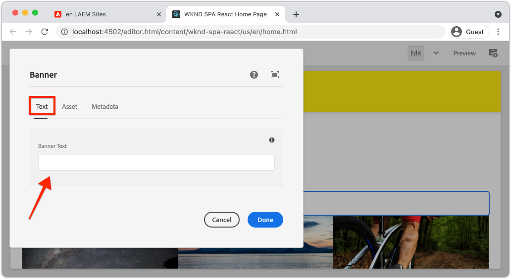
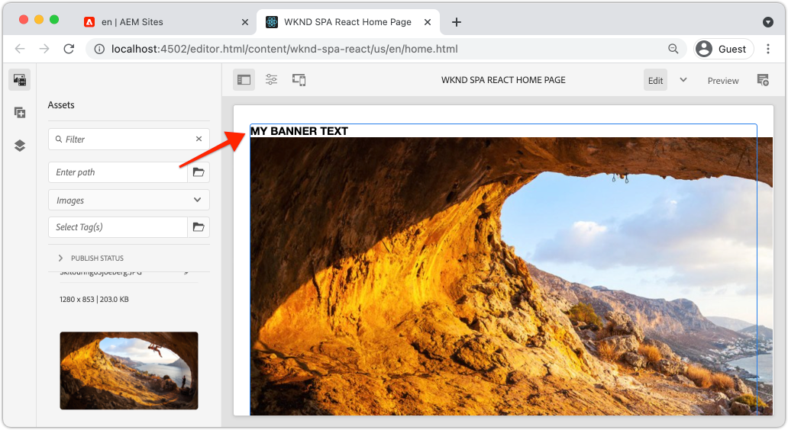

# Een kerncomponent uitbreiden {#extend-component}

Leer hoe te om een bestaande Component van de Kern uit te breiden die met de Redacteur van de SPA van de AEM moet worden gebruikt. Begrijpen hoe een bestaande component wordt uitgebreid is een krachtige techniek om de mogelijkheden van een AEM SPA de implementatie van de Redacteur aan te passen en uit te breiden.

## Doelstelling

1. Breid een bestaande Component van de Kern met extra eigenschappen en inhoud uit.
2. Begrijp de basis van Componentovererving met het gebruik van `sling:resourceSuperType`.
3. Leer hoe u de [Delegatiepatroon](https://github.com/adobe/aem-core-wcm-components/wiki/Delegation-Pattern-for-Sling-Models) voor verkoopmodellen om bestaande logica en functionaliteit opnieuw te gebruiken.

## Wat u gaat maken

Dit hoofdstuk illustreert de extra code nodig om een extra bezit aan een norm toe te voegen `Image` om te voldoen aan de vereisten voor een nieuwe `Banner` component. De `Banner` component bevat dezelfde eigenschappen als de standaard `Image` component maar bevat een extra eigenschap voor gebruikers om het **Bannertekst**.


## Vereisten

Controleer de vereiste gereedschappen en instructies voor het instellen van een [plaatselijke ontwikkelomgeving](overview.md#local-dev-environment). Op dit punt wordt aangenomen dat gebruikers van de zelfstudie een goed inzicht hebben in de functie AEM SPA Editor.

## Overerving met Sling Resource Super Type {#sling-resource-super-type}

Een bestaande componentset uitbreiden met een eigenschap met de naam `sling:resourceSuperType` op de definitie van uw component.  `sling:resourceSuperType`is een [eigenschap](https://sling.apache.org/documentation/the-sling-engine/resources.html#resource-properties) die kunnen worden ingesteld in de definitie van een AEM die naar een andere component wijst. Dit plaatst uitdrukkelijk de component om alle functionaliteit van de component te erven die als wordt geïdentificeerd `sling:resourceSuperType`.

Als we de `Image` component bij `wknd-spa-react/components/image` de code in het dialoogvenster `ui.apps` -module.

1. Een nieuwe map maken onder de `ui.apps` module voor `banner` om `ui.apps/src/main/content/jcr_root/apps/wknd-spa-react/components/banner`.
1. Beneath `banner` een componentdefinitie maken (`.content.xml`) als volgt:

   ```xml
   <?xml version="1.0" encoding="UTF-8"?>
   <jcr:root xmlns:sling="http://sling.apache.org/jcr/sling/1.0" xmlns:cq="http://www.day.com/jcr/cq/1.0" xmlns:jcr="http://www.jcp.org/jcr/1.0"
       jcr:primaryType="cq:Component"
       jcr:title="Banner"
       sling:resourceSuperType="wknd-spa-react/components/image"
       componentGroup="WKND SPA React - Content"/>
   ```

   Deze sets `wknd-spa-react/components/banner` om alle functionaliteit over te nemen van `wknd-spa-react/components/image`.

## cq:editConfig {#cq-edit-config}

De `_cq_editConfig.xml` dicteert het slepen en neerzetten gedrag in AEM auteursinterface. Wanneer het uitbreiden van de component van het Beeld is het belangrijk dat het middeltype de component zelf aanpast.

1. In de `ui.apps` een ander bestand maken onder `banner` benoemd `_cq_editConfig.xml`.
1. Vullen `_cq_editConfig.xml` met de volgende XML:

   ```xml
   <?xml version="1.0" encoding="UTF-8"?>
   <jcr:root xmlns:sling="http://sling.apache.org/jcr/sling/1.0" xmlns:cq="http://www.day.com/jcr/cq/1.0" xmlns:jcr="http://www.jcp.org/jcr/1.0" xmlns:nt="http://www.jcp.org/jcr/nt/1.0"
       jcr:primaryType="cq:EditConfig">
       <cq:dropTargets jcr:primaryType="nt:unstructured">
           <image
               jcr:primaryType="cq:DropTargetConfig"
               accept="[image/gif,image/jpeg,image/png,image/webp,image/tiff,image/svg\\+xml]"
               groups="[media]"
               propertyName="./fileReference">
               <parameters
                   jcr:primaryType="nt:unstructured"
                   sling:resourceType="wknd-spa-react/components/banner"
                   imageCrop=""
                   imageMap=""
                   imageRotate=""/>
           </image>
       </cq:dropTargets>
       <cq:inplaceEditing
           jcr:primaryType="cq:InplaceEditingConfig"
           active="{Boolean}true"
           editorType="image">
           <inplaceEditingConfig jcr:primaryType="nt:unstructured">
               <plugins jcr:primaryType="nt:unstructured">
                   <crop
                       jcr:primaryType="nt:unstructured"
                       supportedMimeTypes="[image/jpeg,image/png,image/webp,image/tiff]"
                       features="*">
                       <aspectRatios jcr:primaryType="nt:unstructured">
                           <wideLandscape
                               jcr:primaryType="nt:unstructured"
                               name="Wide Landscape"
                               ratio="0.6180"/>
                           <landscape
                               jcr:primaryType="nt:unstructured"
                               name="Landscape"
                               ratio="0.8284"/>
                           <square
                               jcr:primaryType="nt:unstructured"
                               name="Square"
                               ratio="1"/>
                           <portrait
                               jcr:primaryType="nt:unstructured"
                               name="Portrait"
                               ratio="1.6180"/>
                       </aspectRatios>
                   </crop>
                   <flip
                       jcr:primaryType="nt:unstructured"
                       supportedMimeTypes="[image/jpeg,image/png,image/webp,image/tiff]"
                       features="-"/>
                   <map
                       jcr:primaryType="nt:unstructured"
                       supportedMimeTypes="[image/jpeg,image/png,image/webp,image/tiff,image/svg+xml]"
                       features="*"/>
                   <rotate
                       jcr:primaryType="nt:unstructured"
                       supportedMimeTypes="[image/jpeg,image/png,image/webp,image/tiff]"
                       features="*"/>
                   <zoom
                       jcr:primaryType="nt:unstructured"
                       supportedMimeTypes="[image/jpeg,image/png,image/webp,image/tiff]"
                       features="*"/>
               </plugins>
               <ui jcr:primaryType="nt:unstructured">
                   <inline
                       jcr:primaryType="nt:unstructured"
                       toolbar="[crop#launch,rotate#right,history#undo,history#redo,fullscreen#fullscreen,control#close,control#finish]">
                       <replacementToolbars
                           jcr:primaryType="nt:unstructured"
                           crop="[crop#identifier,crop#unlaunch,crop#confirm]"/>
                   </inline>
                   <fullscreen jcr:primaryType="nt:unstructured">
                       <toolbar
                           jcr:primaryType="nt:unstructured"
                           left="[crop#launchwithratio,rotate#right,flip#horizontal,flip#vertical,zoom#reset100,zoom#popupslider]"
                           right="[history#undo,history#redo,fullscreen#fullscreenexit]"/>
                       <replacementToolbars jcr:primaryType="nt:unstructured">
                           <crop
                               jcr:primaryType="nt:unstructured"
                               left="[crop#identifier]"
                               right="[crop#unlaunch,crop#confirm]"/>
                           <map
                               jcr:primaryType="nt:unstructured"
                               left="[map#rectangle,map#circle,map#polygon]"
                               right="[map#unlaunch,map#confirm]"/>
                       </replacementToolbars>
                   </fullscreen>
               </ui>
           </inplaceEditingConfig>
       </cq:inplaceEditing>
   </jcr:root>
   ```

1. Het unieke aspect van het bestand is het `<parameters>` node die het resourceType instelt op `wknd-spa-react/components/banner`.

   ```xml
   <parameters
       jcr:primaryType="nt:unstructured"
       sling:resourceType="wknd-spa-react/components/banner"
       imageCrop=""
       imageMap=""
       imageRotate=""/>
   ```

   De meeste componenten vereisen geen `_cq_editConfig`. Afbeeldingscomponenten en afstammingen vormen hierop een uitzondering.

## Het dialoogvenster uitbreiden {#extend-dialog}

Ons `Banner` vereist een extra tekstveld in het dialoogvenster om het `bannerText`. Aangezien wij het Verkopen overerving gebruiken, kunnen wij eigenschappen van gebruiken [Samenvoeging van verkoopbronnen](https://experienceleague.adobe.com/docs/experience-manager-65/developing/platform/sling-resource-merger.html) delen van het dialoogvenster overschrijven of uitbreiden. In dit voorbeeld is een nieuw tabblad toegevoegd aan het dialoogvenster om aanvullende gegevens van een auteur vast te leggen om de kaartcomponent te vullen.

1. In de `ui.apps` onder de `banner` map, een map maken met de naam `_cq_dialog`.
1. Beneath `_cq_dialog` een Dialog-definitiebestand maken `.content.xml`. Vul de selectie met de volgende code:

   ```xml
   <?xml version="1.0" encoding="UTF-8"?>
   <jcr:root xmlns:sling="http://sling.apache.org/jcr/sling/1.0" xmlns:granite="http://www.adobe.com/jcr/granite/1.0" xmlns:cq="http://www.day.com/jcr/cq/1.0" xmlns:jcr="http://www.jcp.org/jcr/1.0" xmlns:nt="http://www.jcp.org/jcr/nt/1.0"
       jcr:primaryType="nt:unstructured"
       jcr:title="Banner"
       sling:resourceType="cq/gui/components/authoring/dialog">
       <content jcr:primaryType="nt:unstructured">
           <items jcr:primaryType="nt:unstructured">
               <tabs jcr:primaryType="nt:unstructured">
                   <items jcr:primaryType="nt:unstructured">
                       <text
                           jcr:primaryType="nt:unstructured"
                           jcr:title="Text"
                           sling:orderBefore="asset"
                           sling:resourceType="granite/ui/components/coral/foundation/container"
                           margin="{Boolean}true">
                           <items jcr:primaryType="nt:unstructured">
                               <columns
                                   jcr:primaryType="nt:unstructured"
                                   sling:resourceType="granite/ui/components/coral/foundation/fixedcolumns"
                                   margin="{Boolean}true">
                                   <items jcr:primaryType="nt:unstructured">
                                       <column
                                           jcr:primaryType="nt:unstructured"
                                           sling:resourceType="granite/ui/components/coral/foundation/container">
                                           <items jcr:primaryType="nt:unstructured">
                                               <textGroup
                                                   granite:hide="${cqDesign.titleHidden}"
                                                   jcr:primaryType="nt:unstructured"
                                                   sling:resourceType="granite/ui/components/coral/foundation/well">
                                                   <items jcr:primaryType="nt:unstructured">
                                                       <bannerText
                                                           jcr:primaryType="nt:unstructured"
                                                           sling:resourceType="granite/ui/components/coral/foundation/form/textfield"
                                                           fieldDescription="Text to display on top of the banner."
                                                           fieldLabel="Banner Text"
                                                           name="./bannerText"/>
                                                   </items>
                                               </textGroup>
                                           </items>
                                       </column>
                                   </items>
                               </columns>
                           </items>
                       </text>
                   </items>
               </tabs>
           </items>
       </content>
   </jcr:root>
   ```

   De bovenstaande XML-definitie maakt een nieuw tabblad met de naam **Tekst** en bestellen *voor* de bestaande **Element** tab. Het bevat één veld **Bannertekst**.

1. Het dialoogvenster ziet er als volgt uit:

   

   We hoefden niet de tabbladen te definiëren voor **Element** of **Metagegevens**. Deze worden via de `sling:resourceSuperType` eigenschap.

   Voordat we een voorvertoning van het dialoogvenster kunnen bekijken, moeten we de SPA component en de `MapTo` functie.

## SPA implementeren {#implement-spa-component}

Als u de component Banner wilt gebruiken met de SPA Editor, moet u een nieuwe SPA maken die u wilt toewijzen aan `wknd-spa-react/components/banner`. Dit gebeurt in het dialoogvenster `ui.frontend` -module.

1. In de `ui.frontend` een nieuwe map maken voor `Banner` om `ui.frontend/src/components/Banner`.
1. Een nieuw bestand maken met de naam `Banner.js` onder de `Banner` map. Vul de selectie met de volgende code:

   ```js
   import React, {Component} from 'react';
   import {MapTo} from '@adobe/aem-react-editable-components';
   
   export const BannerEditConfig = {
       emptyLabel: 'Banner',
   
       isEmpty: function(props) {
           return !props || !props.src || props.src.trim().length < 1;
       }
   };
   
   export default class Banner extends Component {
   
       get content() {
           return ;
       }
   
       // display our custom bannerText property!
       get bannerText() {
           if(this.props.bannerText) {
               return <h4>{this.props.bannerText}</h4>;
           }
   
           return null;
       }
   
       render() {
           if (BannerEditConfig.isEmpty(this.props)) {
               return null;
           }
   
           return (
               <div className="Banner">
                   {this.bannerText}
                   <div className="BannerImage">{this.content}</div>
               </div>
           );
       }
   }
   
   MapTo('wknd-spa-react/components/banner')(Banner, BannerEditConfig);
   ```

   Deze SPA wordt toegewezen aan de AEM component `wknd-spa-react/components/banner` eerder gemaakt.

1. Bijwerken `import-components.js` om `ui.frontend/src/components/import-components.js` om de nieuwe `Banner` SPA component:

   ```diff
     import './ExperienceFragment/ExperienceFragment';
     import './OpenWeather/OpenWeather';
   + import './Banner/Banner';
   ```

1. Op dit punt kan het project worden opgesteld aan AEM en de dialoog kan worden getest. Implementeer het project met behulp van uw Maven-vaardigheden:

   ```shell
   $ cd aem-guides-wknd-spa.react
   $ mvn clean install -PautoInstallSinglePackage
   ```

1. Werk het beleid van het Malplaatje van de SPA bij om toe te voegen `Banner` component als een **toegestane component**.

1. Ga naar een SPA pagina en voeg de `Banner` op een van de SPA pagina&#39;s:

   

   >[!NOTE]
   >
   > In het dialoogvenster kunt u een waarde opslaan voor **Bannertekst** maar deze waarde wordt niet in de SPA weergegeven. Om toe te laten, moeten wij het het Verkopen Model voor de component uitbreiden.

## Java-interface toevoegen {#java-interface}

Als u uiteindelijk de waarden uit het dialoogvenster Component toegankelijk wilt maken voor de component React, moet het Sling-model dat de JSON-code voor de component vult, worden bijgewerkt `Banner` component. Dit gebeurt in het dialoogvenster `core` die alle code van Java voor ons SPA project bevat.

Eerst maken we een nieuwe Java-interface voor `Banner` die de `Image` Java-interface.

1. In de `core` module maakt een nieuw bestand met de naam `BannerModel.java` om `core/src/main/java/com/adobe/aem/guides/wkndspa/react/core/models`.
1. Vullen `BannerModel.java` met het volgende:

   ```java
   package com.adobe.aem.guides.wkndspa.react.core.models;
   
   import com.adobe.cq.wcm.core.components.models.Image;
   import org.osgi.annotation.versioning.ProviderType;
   
   @ProviderType
   public interface BannerModel extends Image {
   
       public String getBannerText();
   
   }
   ```

   Hierdoor worden alle methoden overgenomen van de Core Component `Image` interface en voeg één nieuwe methode toe `getBannerText()`.

## Sling-model implementeren {#sling-model}

Implementeer vervolgens het Sling-model voor de `BannerModel` interface.

1. In de `core` module maakt een nieuw bestand met de naam `BannerModelImpl.java` om `core/src/main/java/com/adobe/aem/guides/wkndspa/react/core/models/impl`.

1. Vullen `BannerModelImpl.java` met het volgende:

   ```java
   package com.adobe.aem.guides.wkndspa.react.core.models.impl;
   
   import com.adobe.aem.guides.wkndspa.react.core.models.BannerModel;
   import com.adobe.cq.export.json.ComponentExporter;
   import com.adobe.cq.export.json.ExporterConstants;
   import com.adobe.cq.wcm.core.components.models.Image;
   import org.apache.sling.models.annotations.*;
   import org.apache.sling.api.SlingHttpServletRequest;
   import org.apache.sling.models.annotations.Model;
   import org.apache.sling.models.annotations.injectorspecific.Self;
   import org.apache.sling.models.annotations.injectorspecific.ValueMapValue;
   import org.apache.sling.models.annotations.via.ResourceSuperType;
   
   @Model(
       adaptables = SlingHttpServletRequest.class, 
       adapters = { BannerModel.class,ComponentExporter.class}, 
       resourceType = BannerModelImpl.RESOURCE_TYPE, 
       defaultInjectionStrategy = DefaultInjectionStrategy.OPTIONAL
   )
   @Exporter(name = ExporterConstants.SLING_MODEL_EXPORTER_NAME, extensions = ExporterConstants.SLING_MODEL_EXTENSION)
   public class BannerModelImpl implements BannerModel {
   
       // points to the the component resource path in ui.apps
       static final String RESOURCE_TYPE = "wknd-spa-react/components/banner";
   
       @Self
       private SlingHttpServletRequest request;
   
       // With sling inheritance (sling:resourceSuperType) we can adapt the current resource to the Image class
       // this allows us to re-use all of the functionality of the Image class, without having to implement it ourself
       // see https://github.com/adobe/aem-core-wcm-components/wiki/Delegation-Pattern-for-Sling-Models
       @Self
       @Via(type = ResourceSuperType.class)
       private Image image;
   
       // map the property saved by the dialog to a variable named `bannerText`
       @ValueMapValue
       private String bannerText;
   
       // public getter to expose the value of `bannerText` via the Sling Model and JSON output
       @Override
       public String getBannerText() {
           return bannerText;
       }
   
       // Re-use the Image class for all other methods:
   
       @Override
       public String getSrc() {
           return null != image ? image.getSrc() : null;
       }
   
       @Override
       public String getAlt() {
           return null != image ? image.getAlt() : null;
       }
   
       @Override
       public String getTitle() {
           return null != image ? image.getTitle() : null;
       }
   
       // method required by `ComponentExporter` interface
       // exposes a JSON property named `:type` with a value of `wknd-spa-react/components/banner`
       // required to map the JSON export to the SPA component props via the `MapTo`
       @Override
       public String getExportedType() {
           return BannerModelImpl.RESOURCE_TYPE;
       }
   }
   ```

   Let op het gebruik van de `@Model` en `@Exporter` annotaties die ervoor zorgen dat het verkoopmodel met serienummering kan worden gecodeerd als JSON via de verkoopmodel-exportfunctie.

   `BannerModelImpl.java` gebruikt de [Delegatiepatroon voor verkoopmodellen](https://github.com/adobe/aem-core-wcm-components/wiki/Delegation-Pattern-for-Sling-Models) om te voorkomen dat alle logica van de kerncomponent Image wordt herschreven.

1. Controleer de volgende regels:

   ```java
   @Self
   @Via(type = ResourceSuperType.class)
   private Image image;
   ```

   Met de bovenstaande aantekening wordt een afbeeldingsobject met de naam `image` op basis van de `sling:resourceSuperType` erfenis van de `Banner` component.

   ```java
   @Override
   public String getSrc() {
       return null != image ? image.getSrc() : null;
   }
   ```

   Het is dan mogelijk om de `image` object voor het implementeren van methoden die door de `Image` interface, zonder zelf de logica te moeten schrijven. Deze techniek wordt gebruikt voor `getSrc()`, `getAlt()` en `getTitle()`.

1. Open een terminalvenster en stel alleen de updates in voor de `core` met de Maven `autoInstallBundle` van de `core` directory.

   ```shell
   $ cd core/
   $ mvn clean install -PautoInstallBundle
   ```

## Alles samenvoegen {#put-together}

1. Ga terug naar AEM en open de SPA pagina met de `Banner` component.
1. Werk de `Banner` op te nemen component **Bannertekst**:

   

1. De component vullen met een afbeelding:

   

   Sla de dialoogupdates op.

1. U moet nu de gerenderde waarde zien van **Bannertekst**:



1. Bekijk de JSON-modelreactie op: [http://localhost:4502/content/wknd-spa-react/us/en.model.json](http://localhost:4502/content/wknd-spa-react/us/en.model.json) en zoek naar `wknd-spa-react/components/card`:

   ```json
   "banner": {
       "bannerText": "My Banner Text",
       "src": "/content/wknd-spa-react/us/en/home/_jcr_content/root/responsivegrid/banner.coreimg.jpeg/1622167884688/sport-climbing.jpeg",
       "alt": "alt banner rock climber",
       ":type": "wknd-spa-react/components/banner"
    },
   ```

   U ziet dat het JSON-model is bijgewerkt met extra sleutel-/waardeparen nadat het Sling-model is geïmplementeerd in `BannerModelImpl.java`.

## Gefeliciteerd! {#congratulations}

Gefeliciteerd, hebt u geleerd hoe u een AEM component kunt uitbreiden met de code en hoe de Sling-modellen en -dialoogvensters werken met het JSON-model.
