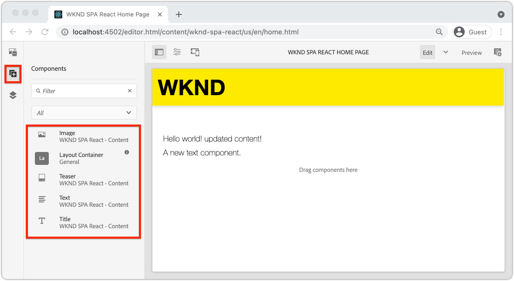
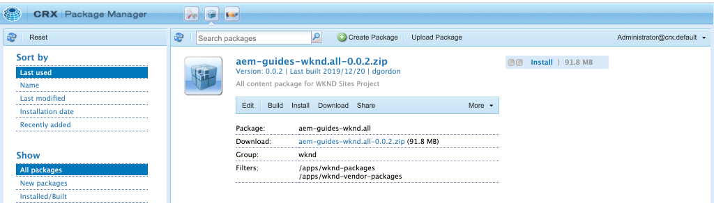

# SPA componenten toewijzen aan AEM componenten {#map-components}

Leer hoe u React-componenten toewijst aan Adobe Experience Manager (AEM)-componenten met de AEM SPA Editor JS SDK. Met componenttoewijzing kunnen gebruikers dynamische updates uitvoeren naar SPA componenten in de AEM SPA Editor, net als bij traditionele AEM ontwerpen.

In dit hoofdstuk wordt dieper ingegaan op de AEM JSON-model-API en wordt uitgelegd hoe de JSON-inhoud die door een AEM wordt aangeboden, automatisch kan worden geïnjecteerd in een React-component als props.

## Doelstelling

1. Leer hoe u AEM componenten kunt toewijzen aan SPA Componenten.
1. Inspect hoe een component React dynamische eigenschappen gebruikt die van AEM worden overgegaan.
1. Meer informatie over het gebruik van de doos [Reageren AEM kerncomponenten](https://github.com/adobe/aem-react-core-wcm-components-examples).

## Wat u gaat maken

In dit hoofdstuk wordt geïnspecteerd hoe de `Text` SPA component wordt toegewezen aan de AEM `Text`component. Reageer de Componenten van de Kern zoals `Image` SPA component zal in de SPA worden gebruikt en in AEM worden ontworpen. De functies van het selectievakje **Layout Container** en **Sjablooneditor** het beleid zal ook worden gebruikt om een mening tot stand te brengen die wat gevarieerder van verschijning is.


## Vereisten

Controleer de vereiste gereedschappen en instructies voor het instellen van een [plaatselijke ontwikkelomgeving](overview.md#local-dev-environment). Dit hoofdstuk is een voortzetting van het [De SPA integreren](integrate-spa.md) hoofdstuk, nochtans om langs alles te volgen u wenst is een SPA-toegelaten AEM project.

## Toewijzingsmethode

Het basisconcept is om een SPA Component aan een AEM Component in kaart te brengen. AEM componenten, voer server-kant in, voer inhoud als deel van JSON model API uit. De JSON-inhoud wordt door de SPA verbruikt en wordt in de browser op de client uitgevoerd. Er wordt een 1:1-toewijzing gemaakt tussen SPA componenten en een AEM component.


*Overzicht op hoog niveau van het toewijzen van een AEM component aan een React Component*

## De tekstcomponent Inspect

De [Projectarchetype AEM](https://github.com/adobe/aem-project-archetype) verstrekt `Text` component die is toegewezen aan de AEM [Tekstcomponent](https://experienceleague.adobe.com/docs/experience-manager-core-components/using/components/text.html). Dit is een voorbeeld van een **content** component, in die zin dat deze wordt gerenderd *content* van AEM.

Laten we eens kijken hoe de component werkt.

### Inspect het JSON-model

1. Voordat u in de SPA code springt, is het belangrijk dat u het JSON-model begrijpt dat AEM biedt. Ga naar de [Core Component Library](https://www.aemcomponents.dev/content/core-components-examples/library/core-content/text.html) en bekijk de pagina voor de component Text. De Core Component Library bevat voorbeelden van alle AEM Core Components.
1. Selecteer **JSON** tabblad voor een van de voorbeelden:

   

   Er moeten drie eigenschappen worden weergegeven: `text`, `richText`, en `:type`.

   `:type` is een gereserveerde eigenschap die de `sling:resourceType` (of pad) van de AEM Component. De waarde van `:type` is wat wordt gebruikt om de AEM component aan de SPA component in kaart te brengen.

   `text` en `richText` Dit zijn aanvullende eigenschappen die aan de SPA component worden blootgesteld.

1. De JSON-uitvoer weergeven op [http://localhost:4502/content/wknd-spa-react/us/en.model.json](http://localhost:4502/content/wknd-spa-react/us/en.model.json). U zou een ingang moeten kunnen vinden gelijkend op:

   ```json
   "text": {
       "id": "text-a647cec03a",
       "text": "<p>Hello World! Updated content!</p>\r\n",
       "richText": true,
       ":type": "wknd-spa-react/components/text",
       "dataLayer": {}
      }
   ```

### De SPA Tekst Inspect

1. In winde van uw keus open omhoog het AEM Project voor de SPA. Breid uit `ui.frontend` en het bestand openen `Text.js` krachtens `ui.frontend/src/components/Text/Text.js`.

1. Het eerste gebied dat we zullen inspecteren is het `class Text` op ~regel 40:

   ```js
   class Text extends Component {
   
       get richTextContent() {
           return (<div
                   id={extractModelId(this.props.cqPath)}
                   data-rte-editelement
                   dangerouslySetInnerHTML={{__html: DOMPurify.sanitize(this.props.text)}} />
                   );
       }
   
       get textContent() {
           return <div>{this.props.text}</div>;
       }
   
       render() {
           return this.props.richText ? this.richTextContent : this.textContent;
       }
   }
   ```

   `Text` is een standaard React component. De component gebruikt `this.props.richText` om te bepalen of de inhoud die moet worden gerenderd rijke tekst of gewone tekst zal zijn. De werkelijk gebruikte &quot;inhoud&quot; komt van `this.props.text`.

   Om een potentiële aanval van XSS te vermijden, wordt de rijke tekst ontsnapt via `DOMPurify` voordat u [gevaarlijkSetInnerHTML](https://reactjs.org/docs/dom-elements.html#dangerouslysetinnerhtml) om de inhoud te renderen. Herstel de `richText` en `text` eigenschappen van het JSON-model eerder in de oefening.

1. Kijk dan eens naar de `TextEditConfig` op ~regel 29:

   ```js
   const TextEditConfig = {
   emptyLabel: 'Text',
   
       isEmpty: function(props) {
           return !props || !props.text || props.text.trim().length < 1;
       }
   };
   ```

   De bovenstaande code bepaalt wanneer de tijdelijke aanduiding in de AEM auteursomgeving moet worden weergegeven. Als de `isEmpty` methode retourneert **true** wordt de tijdelijke aanduiding weergegeven.

1. Kijk ten slotte naar de `MapTo` bellen bij ~line 62:

   ```js
   export default MapTo('wknd-spa-react/components/text')(Text, TextEditConfig);
   ```

   `MapTo` wordt geleverd door de AEM SPA Editor JS SDK (`@adobe/aem-react-editable-components`). Het pad `wknd-spa-react/components/text` vertegenwoordigt `sling:resourceType` van de AEM component. Dit pad komt overeen met het `:type` door het JSON-model dat eerder werd waargenomen. `MapTo` zorgt ervoor dat de JSON-modelrespons wordt geparseerd en dat de juiste waarden worden doorgegeven als `props` naar de SPA component.

   U kunt de AEM vinden `Text` componentdefinitie bij `ui.apps/src/main/content/jcr_root/apps/wknd-spa-react/components/text`.

## Reageren kerncomponenten gebruiken

[AEM WCM-componenten - React Core-implementatie](https://github.com/adobe/aem-react-core-wcm-components-base) en [AEM WCM-componenten - Spa-editor - React Core-implementatie](https://github.com/adobe/aem-react-core-wcm-components-spa). Dit is een reeks herbruikbare UI-componenten die uit de doos AEM componenten worden toegewezen. De meeste projecten kunnen deze componenten als uitgangspunt voor hun eigen implementatie hergebruiken.

1. Open het bestand in de projectcode `import-components.js` om `ui.frontend/src/components`.
Dit bestand importeert alle SPA componenten die zijn toegewezen aan AEM componenten. Gezien de dynamische aard van de implementatie van de SPARedacteur, moeten wij om het even welke SPA componenten uitdrukkelijk van verwijzingen voorzien die aan AEM auteur-able componenten gebonden zijn. Hierdoor kan een AEM auteur ervoor kiezen om een component te gebruiken waar hij of zij dat in de toepassing wil.
1. De volgende instructies voor importeren bevatten SPA componenten die in het project zijn geschreven:

   ```js
   import './Page/Page';
   import './Text/Text';
   import './Container/Container';
   import './ExperienceFragment/ExperienceFragment';
   ```

1. Er zijn verschillende andere `imports` van `@adobe/aem-core-components-react-spa` en `@adobe/aem-core-components-react-base`. Deze importeren de React Core-componenten en stellen deze beschikbaar in het huidige project. Deze worden dan in kaart gebracht aan project specifieke AEM componenten gebruikend `MapTo`, net als bij de `Text` eerder.

### AEM bijwerken

Het beleid is een eigenschap van AEM malplaatjes geeft ontwikkelaars en macht-gebruikers korrelige controle waarover de componenten beschikbaar zijn om te worden gebruikt. De componenten React Core zijn inbegrepen in de SPA Code maar moeten via een beleid worden toegelaten alvorens zij in de toepassing kunnen worden gebruikt.

1. Navigeer van het scherm AEM Start naar **Gereedschappen** > **Sjablonen** > **[WKND SPA React](http://localhost:4502/libs/wcm/core/content/sites/templates.html/conf/wknd-spa-react)**.

1. Selecteer en open **SPA pagina** sjabloon voor bewerken.

1. Selecteer **Layout Container** en klik op **beleid** pictogram om het beleid te bewerken:

   

1. Onder **Toegestane componenten** > **WKND SPA React - Inhoud** > controleren **Afbeelding**, **Teaser**, en **Titel**.

   

   Onder **Standaardcomponenten** > **Toewijzing toevoegen** en kiest u **Afbeelding - WKND SPA Reageren - Inhoud** component:

   

   Voer een **mime-type** van `image/*`.

   Klikken **Gereed** om de beleidsupdates op te slaan.

1. In de **Layout Container** klik op **beleid** pictogram voor de **Tekst** component.

   Een nieuw beleid maken met de naam **WKND-SPA**. Onder **Plug-ins** > **Opmaak** > schakel alle vakken in om extra opmaakopties in te schakelen:

   

   Onder **Plug-ins** > **Alineastijlen** > schakel het selectievakje in op **Alineastijlen inschakelen**:

   

   Klikken **Gereed** om de beleidsupdate op te slaan.

### Inhoud auteur

1. Ga naar de **Homepage** [http://localhost:4502/editor.html/content/wknd-spa-react/us/en/home.html](http://localhost:4502/editor.html/content/wknd-spa-react/us/en/home.html).

1. U moet nu de aanvullende componenten kunnen gebruiken **Afbeelding**, **Teaser**, en **Titel** op de pagina.

   

1. U moet ook de opdracht `Text` en voeg extra alineastijlen toe in **volledig scherm** in.

   

1. U moet ook een afbeelding kunnen slepen en neerzetten vanuit de **Asset Finder**:

   

1. Ervaring met de **Titel** en **Teaser** componenten.

1. Voeg uw eigen afbeeldingen toe via [AEM Assets](http://localhost:4502/assets.html/content/dam) of installeer de voltooide codebasis voor de norm [WKND-referentiesite](https://github.com/adobe/aem-guides-wknd/releases/latest). De [WKND-referentiesite](https://github.com/adobe/aem-guides-wknd/releases/latest) bevat veel afbeeldingen die opnieuw kunnen worden gebruikt op de WKND-SPA. Het pakket kan worden geïnstalleerd met [AEM Package Manager](http://localhost:4502/crx/packmgr/index.jsp).

   

## Inspect the Layout Container

Steun voor de **Layout Container** wordt automatisch verstrekt door de AEM SPA Editor SDK. De **Layout Container**, zoals aangegeven door de naam, **container** component. Containercomponenten zijn componenten die JSON-structuren accepteren die *overige* componenten te maken en ze dynamisch te instantiëren.

Laten we de container voor lay-out verder inspecteren.

1. Blader in een browser naar [http://localhost:4502/content/wknd-spa-react/us/en.model.json](http://localhost:4502/content/wknd-spa-react/us/en.model.json)

   

   De **Layout Container** component heeft een `sling:resourceType` van `wcm/foundation/components/responsivegrid` en wordt door de SPA Editor herkend met de `:type` eigenschap, net als de `Text` en `Image` componenten.

   Dezelfde mogelijkheden om de grootte van een component te wijzigen met [Lay-outmodus](https://experienceleague.adobe.com/docs/experience-manager-65/authoring/siteandpage/responsive-layout.html#defining-layouts-layout-mode) zijn beschikbaar in de SPA Editor.

2. Terug naar [http://localhost:4502/editor.html/content/wknd-spa-react/us/en/home.html](http://localhost:4502/editor.html/content/wknd-spa-react/us/en/home.html). Extra toevoegen **Afbeelding** en probeer deze opnieuw in te stellen met de **Layout** optie:

   

3. Het JSON-model opnieuw openen [http://localhost:4502/content/wknd-spa-react/us/en.model.json](http://localhost:4502/content/wknd-spa-react/us/en.model.json) en de `columnClassNames` als onderdeel van de JSON:

   

   De klassenaam `aem-GridColumn--default--4` Hiermee wordt aangegeven dat de component 4 kolommen breed moet zijn op basis van een raster van 12 kolommen. Meer informatie over de [responsief raster is hier te vinden](https://adobe-marketing-cloud.github.io/aem-responsivegrid/).

4. Terugkeren naar de IDE en in de `ui.apps` er een client-side bibliotheek is gedefinieerd op `ui.apps/src/main/content/jcr_root/apps/wknd-spa-react/clientlibs/clientlib-grid`. Het bestand openen `less/grid.less`.

   Dit bestand bepaalt de onderbrekingspunten (`default`, `tablet`, en `phone`) gebruikt door de **Layout Container**. Dit dossier is bedoeld om per projectspecificaties worden aangepast. Momenteel zijn de onderbrekingspunten ingesteld op `1200px` en `768px`.

5. U zou de ontvankelijke mogelijkheden en het bijgewerkte rijke tekstbeleid van moeten kunnen gebruiken `Text` aan auteur een mening als het volgende:

   

## Gefeliciteerd! {#congratulations}

Gefeliciteerd, leerde u hoe te om SPA componenten aan AEM Componenten in kaart te brengen en u gebruikte de Componenten van de Kern React. U hebt ook de kans om de responsieve mogelijkheden van de **Layout Container**.

### Volgende stappen {#next-steps}

[Navigatie en routering](navigation-routing.md) - Leer hoe meerdere weergaven in de SPA kunnen worden ondersteund door aan AEM Pagina&#39;s toe te wijzen met de SPA Editor SDK. De dynamische navigatie wordt uitgevoerd gebruikend React Router en React de Componenten van de Kern.

## (Bonus) zet configuraties aan broncontrole aan {#bonus-configs}

In veel gevallen, vooral aan het begin van een AEM project is het waardevol om configuraties, zoals malplaatjes en verwant inhoudsbeleid, aan broncontrole voort te zetten. Dit zorgt ervoor dat alle ontwikkelaars tegen de zelfde reeks inhoud en configuraties werken en extra consistentie tussen milieu&#39;s kunnen verzekeren. Wanneer een project een bepaald ontwikkelingsniveau heeft bereikt, kan het beheren van sjablonen worden overgedragen aan een speciale groep van energiegebruikers.

De volgende paar stappen zullen plaatsvinden gebruikend winde van de Code van Visual Studio en [VSCode AEM Sync](https://marketplace.visualstudio.com/items?itemName=yamato-ltd.vscode-aem-sync) maar kon doen gebruikend om het even welk hulpmiddel en om het even welke winde die u hebt gevormd om **trekken** of **import** inhoud van een lokale instantie van AEM.

1. In winde van de Code van Visual Studio, zorg ervoor dat u hebt **VSCode AEM Sync** geïnstalleerd via de Marketplace-extensie:

   

2. Breid uit **ui.content** in de ontdekkingsreiziger van het Project en navigeer aan `/conf/wknd-spa-react/settings/wcm/templates`.

3. **Rechts + klikken** de `templates` map en selecteer **Importeren vanaf AEM server**:

   

4. Herhaal de stappen om inhoud te importeren, maar selecteer de **beleid** map op `/conf/wknd-spa-react/settings/wcm/templates/policies`.

5. Inspect the `filter.xml` bestand bevindt zich op `ui.content/src/main/content/META-INF/vault/filter.xml`.

   ```xml
   <!--ui.content filter.xml-->
   <?xml version="1.0" encoding="UTF-8"?>
    <workspaceFilter version="1.0">
        <filter root="/conf/wknd-spa-react" mode="merge"/>
        <filter root="/content/wknd-spa-react" mode="merge"/>
        <filter root="/content/dam/wknd-spa-react" mode="merge"/>
        <filter root="/content/experience-fragments/wknd-spa-react" mode="merge"/>
    </workspaceFilter>
   ```

   De `filter.xml` is verantwoordelijk voor het identificeren van de paden van knooppunten die samen met het pakket worden geïnstalleerd. Let op: `mode="merge"` op elk van de filters wordt aangegeven dat bestaande inhoud niet wordt gewijzigd, alleen nieuwe inhoud toegevoegd. Aangezien de inhoudsauteurs deze wegen kunnen bijwerken, is het belangrijk dat een codeplaatsing doet **niet** overschrijven, inhoud. Zie de [FileVault-documentatie](https://jackrabbit.apache.org/filevault/filter.html) voor meer informatie over het werken met filterelementen.

   Vergelijken `ui.content/src/main/content/META-INF/vault/filter.xml` en `ui.apps/src/main/content/META-INF/vault/filter.xml` om de verschillende knopen te begrijpen die door elke module worden beheerd.

## (Bonus) Aangepaste afbeeldingscomponent maken {#bonus-image}

Er is al een SPA Image-component geleverd door de React Core-componenten. Als u echter extra oefening wilt, maakt u uw eigen React-implementatie die aan de AEM is toegewezen [Afbeeldingscomponent](https://experienceleague.adobe.com/docs/experience-manager-core-components/using/components/image.html). De `Image` is een ander voorbeeld van een component **content** component.

### Inspect the JSON

Voordat u in de SPA code gaat springen, moet u het JSON-model controleren dat AEM biedt.

1. Ga naar de [Voorbeelden van afbeeldingen in de Core Component-bibliotheek](https://www.aemcomponents.dev/content/core-components-examples/library/core-content/image.html).

   

   Eigenschappen van `src`, `alt`, en `title` wordt gebruikt om de SPA te vullen `Image` component.

   >[!NOTE]
   >
   > Er zijn andere afbeeldingseigenschappen blootgesteld (`lazyEnabled`, `widths`) waarmee een ontwikkelaar een adaptieve en uitgestelde component kan maken. De component die in deze zelfstudie is ingebouwd, is eenvoudig en **niet** gebruik deze geavanceerde eigenschappen.

### De component Image implementeren

1. Maak vervolgens een nieuwe map met de naam `Image` krachtens `ui.frontend/src/components`.
1. Onder de `Image` map maken een nieuw bestand met de naam `Image.js`.

   

1. Voeg het volgende toe `import` instructies voor `Image.js`:

   ```js
   import React, {Component} from 'react';
   import {MapTo} from '@adobe/aem-react-editable-components';
   ```

1. Voeg vervolgens de `ImageEditConfig` bepalen wanneer de tijdelijke aanduiding in AEM moet worden weergegeven:

   ```js
   export const ImageEditConfig = {
   
       emptyLabel: 'Image',
   
       isEmpty: function(props) {
           return !props || !props.src || props.src.trim().length < 1;
       }
   };
   ```

   De tijdelijke aanduiding geeft aan of de `src` eigenschap is niet ingesteld.

1. De volgende implementatie van `Image` klasse:

   ```js
    export default class Image extends Component {
   
       get content() {
           return ;
       }
   
       render() {
           if(ImageEditConfig.isEmpty(this.props)) {
               return null;
           }
   
           return (
                   <div className="Image">
                       {this.content}
                   </div>
           );
       }
   }
   ```

   De bovenstaande code geeft een `` op basis van de aanbevelingen `src`, `alt`, en `title` doorgegeven door het JSON-model.

1. Voeg de `MapTo` code om de component React aan de AEM toe te wijzen component:

   ```js
   MapTo('wknd-spa-react/components/image')(Image, ImageEditConfig);
   ```

   Noteer de tekenreeks `wknd-spa-react/components/image` komt overeen met de locatie van de AEM component in `ui.apps` om: `ui.apps/src/main/content/jcr_root/apps/wknd-spa-react/components/image`.

1. Een nieuw bestand maken met de naam `Image.css` in dezelfde map en voeg het volgende toe:

   ```scss
   .Image-src {
       margin: 1rem 0;
       width: 100%;
       border: 0;
   }
   ```

1. In `Image.js` Voeg een verwijzing naar het bestand toe boven onder het tabblad `import` instructies:

   ```js
   import React, {Component} from 'react';
   import {MapTo} from '@adobe/aem-react-editable-components';
   
   require('./Image.css');
   ```

1. Het bestand openen `ui.frontend/src/components/import-components.js` en een verwijzing naar de nieuwe `Image` component:

   ```js
   import './Page/Page';
   import './Text/Text';
   import './Container/Container';
   import './ExperienceFragment/ExperienceFragment';
   import './Image/Image'; //add reference to Image component
   ```

1. In `import-components.js` Bekijk de React Core Component Image:

   ```js
   //MapTo('wknd-spa-react/components/image')(ImageV2, {isEmpty: ImageV2IsEmptyFn});
   ```

   Op deze manier zorgt u ervoor dat de aangepaste component Image wordt gebruikt.

1. Van de wortel van het project stel de SPA code aan AEM gebruikend Maven op:

   ```shell
   $ cd aem-guides-wknd-spa.react
   $ mvn clean install -PautoInstallSinglePackage
   ```

1. Inspect de SPA in AEM. Alle onderdelen van de afbeelding op de pagina blijven werken. Inspect de gerenderde uitvoer en u moet de markering voor onze aangepaste afbeeldingscomponent zien in plaats van de React Core-component.

   *Aangepaste markering voor afbeeldingscomponent*

   ```html
   <div class="Image">
       
   </div>
   ```

   *Opmaak van Core Component Image Reageren*

   ```html
   <div class="cmp-image cq-dd-image">
       
   </div>
   ```

   Dit is een goede inleiding om uw eigen componenten uit te breiden en uit te voeren.
