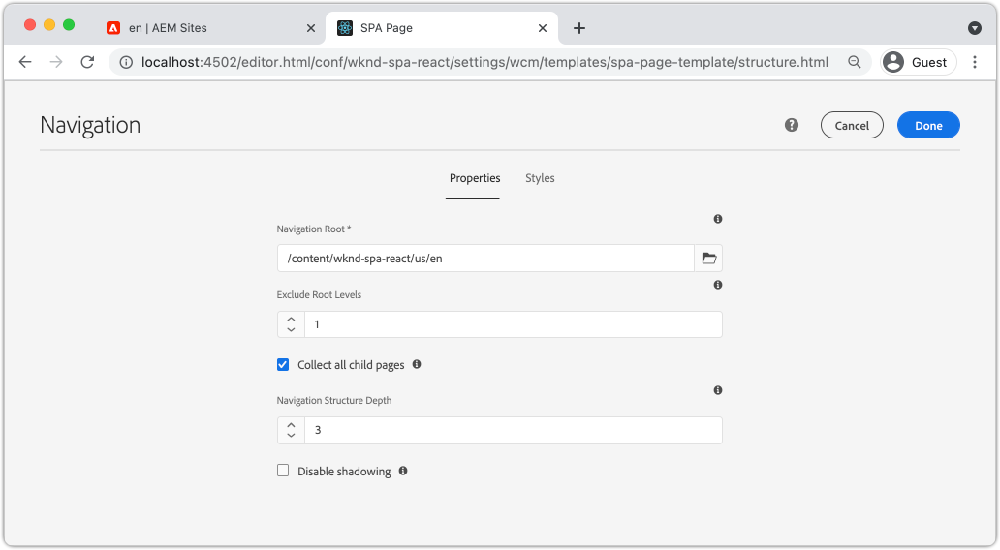

# Navigatie en routering toevoegen {#navigation-routing}

Leer hoe de veelvoudige meningen in het KUUROORD door aan de Pagina&#39;s van AEM met de Redacteur SDK van het KUUROORD kunnen worden gesteund. De dynamische navigatie wordt uitgevoerd gebruikend React Router en React de Componenten van de Kern.

## Doelstelling

1. Begrijp het model dat van het KUUROORD opties verplettert beschikbaar wanneer het gebruiken van de Redacteur van het KUUROORD.
1. Leer om [ Reageer Router ](https://reacttraining.com/react-router) te gebruiken om tussen verschillende meningen van het KUUROORD te navigeren.
1. Gebruik AEM React Core Components om een dynamische navigatie te implementeren die wordt aangestuurd door de AEM-paginahiërarchie.

## Wat u gaat maken

Dit hoofdstuk zal navigatie aan een KUUROORD in AEM toevoegen. Het navigatiemenu wordt gedreven door de de paginahiërarchie van AEM en zal gebruik maken van het model JSON dat door de [ Component van de Kern van de Navigatie ](https://experienceleague.adobe.com/docs/experience-manager-core-components/using/wcm-components/navigation.html) wordt verstrekt.


## Vereisten

Herzie het vereiste tooling en de instructies voor vestiging a [ lokale ontwikkelomgeving ](overview.md#local-dev-environment). Dit hoofdstuk is een voortzetting van het [ hoofdstuk van de Componenten van de Kaart ](map-components.md), nochtans om langs allen te volgen u een SPA-Toegelaten project van AEM wordt opgesteld aan een lokale instantie van AEM.

## De navigatie toevoegen aan de sjabloon {#add-navigation-template}

1. Open browser en login aan AEM, [ http://localhost:4502/ ](http://localhost:4502/). De begincodebasis zou reeds moeten worden opgesteld.
1. Navigeer aan het **Malplaatje van de Pagina van het KUUROORD**: [ http://localhost:4502/editor.html/conf/wknd-spa-react/settings/wcm/templates/spa-page-template/structure.html ](http://localhost:4502/editor.html/conf/wknd-spa-react/settings/wcm/templates/spa-page-template/structure.html).
1. Selecteer de buitenste **Container van de Lay-out van de Wortel** en klik zijn **3} pictogram van het Beleid {.** Wees voorzichtig **niet** om de **Container van de Lay-out** niet-gesloten voor creatie te selecteren.

   

1. Creeer een nieuw beleid genoemd **Structuur van het KUUROORD**:

   

   Onder **Toegestane Componenten** > **Algemene** > selecteer de **component van de Container van de Lay-out**.

   Onder **Toegestane Componenten** > **WKND REACT van het KUUROORD - STRUCTUUR** > selecteer de **5} component van de Navigatie {:**

   

   Onder **Toegestane Componenten** > **WKND REACT van het KUUROORD - Inhoud** > selecteer het **Beeld** en **de componenten van de Tekst**. Er moeten in totaal vier componenten zijn geselecteerd.

   Klik **Gedaan** om de veranderingen te bewaren.

1. Vernieuw de pagina, en voeg de **component van de Navigatie** boven de niet-gesloten **Container van de Lay-out** toe:

    toe

1. Selecteer de **component van de Navigatie** en klik zijn **pictogram van het Beleid** om het beleid uit te geven.
1. Creeer een nieuw beleid met a **Titel van het Beleid** van **de Navigatie van het KUUROORD**.

   Onder de **Eigenschappen**:

   * Plaats de **Wortel van de Navigatie** aan `/content/wknd-spa-react/us/en`.
   * Plaats de **Exclude Niveaus van de Wortel** aan **1**.
   * Uncheck **verzamel alle kindpagina&#39;s**.
   * Plaats de **Diepte van de Structuur van de Navigatie** aan **3**.

   

   Hierdoor worden de navigatieniveaus 2 diep onder `/content/wknd-spa-react/us/en` verzameld.

1. Nadat u de wijzigingen hebt opgeslagen, ziet u de gevulde `Navigation` als onderdeel van de sjabloon:

   

## Onderliggende pagina&#39;s maken

Daarna, creeer extra pagina&#39;s in AEM die als verschillende meningen in het KUUROORD zullen dienen. We zullen ook de hiërarchische structuur van het JSON-model van AEM controleren.

1. Navigeer aan de **console van Plaatsen**: [ http://localhost:4502/sites.html/content/wknd-spa-react/us/en/home ](http://localhost:4502/sites.html/content/wknd-spa-react/us/en/home). Selecteer de **WebND SPA React Homepage** en klik **creeer** > **Pagina**:

   

1. Onder **Malplaatje** uitgezocht **Pagina van het KUUROORD**. Onder **Eigenschappen** ga **Pagina 1** voor **Titel** en **pagina-1** in als naam.

    in

   Klik **creëren** en in de dialoog pop-up, klik **Open** om de pagina in de Redacteur van AEM SPA te openen.

1. Voeg een nieuwe **component van de Tekst** {aan de belangrijkste **Container van de Lay-out** toe. Bewerk de component en ga de tekst in: **Pagina 1** gebruikend RTE en het **H2** element.

   

   Voel u vrij om extra inhoud toe te voegen, zoals een afbeelding.

1. Terugkeer aan de console van AEM Sites en herhaal de bovengenoemde stappen, die tot een tweede pagina leiden genoemd **Pagina 2** als sibling van **Pagina 1**.
1. Tot slot creeer een derde pagina, **Pagina 3** maar als a **kind** van **Pagina 2**. Na voltooiing zou de plaatshiërarchie als het volgende moeten kijken:

   

1. De component van de Navigatie kan nu worden gebruikt om aan verschillende gebieden van SPA te navigeren.

   

1. Open de pagina buiten de Redacteur van AEM: [ http://localhost:4502/content/wknd-spa-react/us/en/home.html ](http://localhost:4502/content/wknd-spa-react/us/en/home.html). Gebruik de **component van de Navigatie** om aan verschillende meningen van app te navigeren.

1. Gebruik de ontwikkelaarshulpmiddelen van uw browser om de netwerkverzoeken te inspecteren, aangezien u navigeert. Onderstaande screenshots worden vastgelegd vanuit de Google Chrome-browser.

    waar

   Let op: na het laden van de eerste pagina wordt de volledige pagina niet volledig vernieuwd en wordt het netwerkverkeer tot een minimum beperkt wanneer wordt teruggekeerd naar eerder bezochte pagina&#39;s.

## JSON-model hiërarchiepagina {#hierarchy-page-json-model}

Daarna, inspecteer het Model JSON dat de multi-meningservaring van SPA drijft.

1. In een nieuw lusje, open JSON model API die door AEM wordt verstrekt: [ http://localhost:4502/content/wknd-spa-react/us/en.model.json ](http://localhost:4502/content/wknd-spa-react/us/en.model.json). Het kan nuttig zijn om een browser uitbreiding aan [ formaat te gebruiken JSON ](https://chrome.google.com/webstore/detail/json-formatter/bcjindcccaagfpapjjmafapmmgkkhgoa).

   Deze inhoud JSON wordt gevraagd wanneer het KUUROORD eerst wordt geladen. De buitenste structuur ziet er als volgt uit:

   ```json
   {
   "language": "en",
   "title": "en",
   "templateName": "spa-app-template",
   "designPath": "/libs/settings/wcm/designs/default",
   "cssClassNames": "spa page basicpage",
   ":type": "wknd-spa-react/components/spa",
   ":items": {},
   ":itemsOrder": [],
   ":hierarchyType": "page",
   ":path": "/content/wknd-spa-react/us/en",
   ":children": {
      "/content/wknd-spa-react/us/en/home": {},
      "/content/wknd-spa-react/us/en/home/page-1": {},
      "/content/wknd-spa-react/us/en/home/page-2": {},
      "/content/wknd-spa-react/us/en/home/page-2/page-3": {}
      }
   }
   ```

   Onder `:children` ziet u een item voor elk van de gemaakte pagina&#39;s. De inhoud voor alle pagina&#39;s staat in dit eerste JSON-verzoek. Met navigatie die verplettert, worden de verdere meningen van SPA snel geladen, aangezien de inhoud reeds beschikbare cliënt-kant is.

   Het is niet wijs om **ALLES** van de inhoud van een KUUROORD in het aanvankelijke JSON- verzoek te laden, aangezien dit de aanvankelijke paginading zou vertragen. Vervolgens kunt u bekijken hoe de hiërarchiediepte van pagina&#39;s wordt verzameld.

1. Navigeer aan het **Basis van het KUUROORD** malplaatje bij: [ http://localhost:4502/editor.html/conf/wknd-spa-react/settings/wcm/templates/spa-app-template/structure.html ](http://localhost:4502/editor.html/conf/wknd-spa-react/settings/wcm/templates/spa-app-template/structure.html).

   Klik het **menu van de eigenschappen van de Pagina** > **Beleid van de Pagina**:

   

1. Het **malplaatje van de Wortel van het KUUROORD** {heeft een extra **Hiërarchische 3} lusje van de Structuur om de verzamelde inhoud te controleren JSON.** De **Diepte van de Structuur** bepaalt hoe diep in de plaatshiërarchie om kindpagina&#39;s onder de **wortel** te verzamelen. U kunt het **gebied van de Patronen van de Structuur** ook gebruiken om extra pagina&#39;s uit te filtreren die op een regelmatige uitdrukking worden gebaseerd.

   Werk de **Diepte van de Structuur** aan **** bij:

   

   Klik **Gedaan** om de veranderingen in het beleid te bewaren.

1. Open het model JSON [ http://localhost:4502/content/wknd-spa-react/us/en.model.json ](http://localhost:4502/content/wknd-spa-react/us/en.model.json) opnieuw.

   ```json
   {
   "language": "en",
   "title": "en",
   "templateName": "spa-app-template",
   "designPath": "/libs/settings/wcm/designs/default",
   "cssClassNames": "spa page basicpage",
   ":type": "wknd-spa-react/components/spa",
   ":items": {},
   ":itemsOrder": [],
   ":hierarchyType": "page",
   ":path": "/content/wknd-spa-react/us/en",
   ":children": {
      "/content/wknd-spa-react/us/en/home": {},
      "/content/wknd-spa-react/us/en/home/page-1": {},
      "/content/wknd-spa-react/us/en/home/page-2": {}
      }
   }
   ```

   Bericht dat **Pagina 3** weg is verwijderd: `/content/wknd-spa-react/us/en/home/page-2/page-3` van het aanvankelijke model JSON. Dit is omdat **Pagina 3** op een niveau 3 in de hiërarchie is en wij het beleid hebben bijgewerkt om inhoud bij een maximumdiepte van niveau 2 slechts te omvatten.

1. Heropen de homepage van het KUUROORD: [ http://localhost:4502/content/wknd-spa-react/us/en/home.html ](http://localhost:4502/content/wknd-spa-react/us/en/home.html) en open de ontwikkelaarshulpmiddelen van uw browser.

   Vernieuw de pagina en u zou het XHR- verzoek aan `/content/wknd-spa-react/us/en.model.json` moeten zien, dat de Wortel van het KUUROORD is. Bericht dat slechts drie kindpagina&#39;s op de configuratie van de hiërarchiediepte aan het malplaatje van de Wortel van het KUUROORD worden gebaseerd vroeger in het leerprogramma worden gemaakt. Dit omvat niet **Pagina 3**.

   

1. Met de ontwikkelaarshulpmiddelen open, gebruik de `Navigation` component om direct aan **Pagina 3** te navigeren:

   Merk op dat een nieuw XHR-verzoek wordt gedaan aan: `/content/wknd-spa-react/us/en/home/page-2/page-3.model.json`

   

   De ModelManager van AEM begrijpt dat de **pagina 3** inhoud JSON niet beschikbaar is en automatisch het extra verzoek XHR teweegbrengt.

1. Experimenteer met diepe verbindingen door rechtstreeks te navigeren aan: [ http://localhost:4502/content/wknd-spa-react/us/en/home/page-2.html ](http://localhost:4502/content/wknd-spa-react/us/en/home/page-2.html). Let ook op dat de knop Terug van de browser nog steeds werkt.

## React Routing controleren  {#react-routing}

De navigatie en het verpletteren wordt uitgevoerd met [ Reageer Router ](https://reactrouter.com/en/main). Reageer Router is een inzameling van navigatiecomponenten voor React toepassingen. [ AEM React de Componenten van de Kern ](https://github.com/adobe/aem-react-core-wcm-components-base) gebruikt eigenschappen van React Router om de **3} component uit te voeren van de Navigatie {die in de vorige stappen wordt gebruikt.**

Daarna, inspecteer hoe React de Router met het KUUROORD wordt geïntegreerd en experimenteert gebruikend React de component van de Verbinding van de Router [ ](https://reactrouter.com/en/main/components/link).

1. Open het bestand `index.js` at `ui.frontend/src/index.js` in de IDE.

   ```js
   /* index.js */
   import { Router } from 'react-router-dom';
   ...
   ...
    ModelManager.initialize().then(pageModel => {
       const history = createBrowserHistory();
       render(
       <Router history={history}>
           <App
           history={history}
           cqChildren={pageModel[Constants.CHILDREN_PROP]}
           cqItems={pageModel[Constants.ITEMS_PROP]}
           cqItemsOrder={pageModel[Constants.ITEMS_ORDER_PROP]}
           cqPath={pageModel[Constants.PATH_PROP]}
           locationPathname={window.location.pathname}
           />
       </Router>,
       document.getElementById('spa-root')
       );
   });
   ```

   Bericht dat `App` in de `Router` component van [ Reageer Router ](https://reacttraining.com/react-router) verpakt is. `ModelManager`, verstrekt door de redacteur JS SDK van AEM SPA, voegt de dynamische routes aan de Pagina&#39;s van AEM toe die op JSON model API worden gebaseerd.

1. Open het bestand `Page.js` op `ui.frontend/src/components/Page/Page.js`

   ```js
   class AppPage extends Page {
     get containerProps() {
       let attrs = super.containerProps;
       attrs.className =
         (attrs.className || '') + ' page ' + (this.props.cssClassNames || '');
       return attrs;
     }
   }
   
   export default MapTo('wknd-spa-react/components/page')(
     withComponentMappingContext(withRoute(AppPage))
   );
   ```

   De `Page` component van SPA gebruikt de `MapTo` functie om **Pagina&#39;s** in AEM aan een overeenkomstige component van het KUUROORD in kaart te brengen. Het hulpprogramma `withRoute` helpt u de SPA dynamisch naar de juiste AEM-onderliggende pagina te routeren op basis van de eigenschap `cqPath` .

1. Open de component `Header.js` op `ui.frontend/src/components/Header/Header.js` .
1. Werk `Header` bij om de `<h1>` markering in a [ Verbinding ](https://reactrouter.com/en/main/components/link) aan de homepage te verpakken:

   ```diff
     //Header.js
     import React, {Component} from 'react';
   + import {Link} from 'react-router-dom';
     require('./Header.css');
   
   export default class Header extends Component {
   
       render() {
           return (
               <header className="Header">
               <div className="Header-container">
   +              <Link to="/content/wknd-spa-react/us/en/home.html">
                       <h1>WKND</h1>
   +              </Link>
               </div>
               </header>
           );
       }
   ```

   In plaats van een standaard `<a>` ankertag te gebruiken, gebruiken we `<Link>` dat wordt geleverd door React Router. Zolang `to=` aan een geldige route richt, zal het KUUROORD aan die route schakelen en **** voert geen volledige pagina uit vernieuwt. Hier kunt u de koppeling naar de startpagina eenvoudig coderen om het gebruik van `Link` te illustreren.

1. Werk de test bij `App.test.js` om `ui.frontend/src/App.test.js` .

   ```diff
   + import { BrowserRouter as Router } from 'react-router-dom';
     import App from './App';
   
     it('renders without crashing', () => {
       const div = document.createElement('div');
   -   ReactDOM.render(<App />, div);
   +   ReactDOM.render(<Router><App /></Router>, div);
     });
   ```

   Aangezien wij eigenschappen van React Router binnen een statische component gebruiken die in `App.js` van verwijzingen wordt voorzien, moeten wij de eenheidstest aan rekening voor het bijwerken.

1. Open een terminal, navigeer naar de hoofdmap van het project en implementeer het project in AEM met behulp van uw Maven-vaardigheden:

   ```shell
   $ cd aem-guides-wknd-spa.react
   $ mvn clean install -PautoInstallSinglePackage
   ```

1. Navigeer aan één van de pagina&#39;s in het KUUROORD in AEM: [ http://localhost:4502/content/wknd-spa-react/us/en/home/page-1.html ](http://localhost:4502/content/wknd-spa-react/us/en/home/page-1.html)

   Gebruik de koppeling in `Header` in plaats van de component `Navigation` te gebruiken om te navigeren.

   

   Merk op dat een volledige pagina **niet** getriggerd is en dat het verpletteren van het KUUROORD werkt.

1. Experimenteer desgewenst met het `Header.js` -bestand met een standaard `<a>` -ankertag:

   ```js
   <a href="/content/wknd-spa-react/us/en/home.html">
       <h1>WKND</h1>
   </a>
   ```

   Dit kan helpen het verschil tussen het verpletteren van het KUUROORD en regelmatige Web-pagina verbindingen illustreren.

## Gefeliciteerd! {#congratulations}

Gefeliciteerd, leerde u hoe de veelvoudige meningen in het KUUROORD door afbeelding aan de Pagina&#39;s van AEM met de Redacteur SDK van het KUUROORD kunnen worden gesteund. De dynamische navigatie is uitgevoerd gebruikend React Router en toegevoegd aan de `Header` component.
