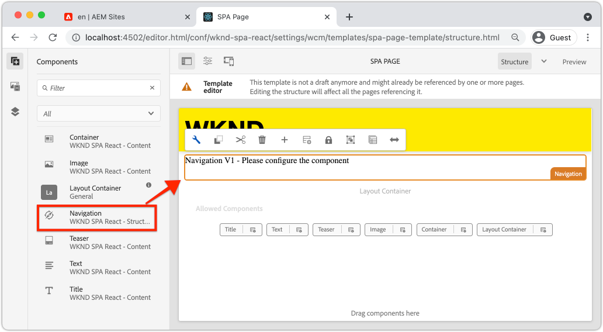

# Navigatie en routering toevoegen {#navigation-routing}

Leer hoe meerdere weergaven in de SPA kunnen worden ondersteund door aan AEM Pagina&#39;s toe te wijzen met de SPA Editor SDK. De dynamische navigatie wordt uitgevoerd gebruikend React Router en React de Componenten van de Kern.

## Doelstelling

1. Begrijp het SPA model verpletterend opties beschikbaar wanneer het gebruiken van de SPARedacteur.
1. Leren gebruiken [Reageer Router](https://reacttraining.com/react-router) om te navigeren tussen verschillende weergaven van de SPA.
1. Gebruik AEM React Core Components om een dynamische navigatie te implementeren die door de AEM paginahiërarchie wordt aangedreven.

## Wat u gaat maken

In dit hoofdstuk wordt navigatie toegevoegd aan een SPA in AEM. Het navigatiemenu wordt aangestuurd door de AEM paginahiërarchie en maakt gebruik van het JSON-model dat wordt geleverd door de [Navigation Core-component](https://experienceleague.adobe.com/docs/experience-manager-core-components/using/wcm-components/navigation.html).


## Vereisten

Controleer de vereiste gereedschappen en instructies voor het instellen van een [plaatselijke ontwikkelomgeving](overview.md#local-dev-environment). Dit hoofdstuk is een voortzetting van het [Componenten toewijzen](map-components.md) hoofdstuk, nochtans om langs alles te volgen u wenst is een SPA-toegelaten AEM project dat aan een lokale AEM instantie wordt opgesteld.

## De navigatie toevoegen aan de sjabloon {#add-navigation-template}

1. Open een browser en meld u aan bij AEM. [http://localhost:4502/](http://localhost:4502/). De begincodebasis zou reeds moeten worden opgesteld.
1. Ga naar de **Paginasjabloon SPA**: [http://localhost:4502/editor.html/conf/wknd-spa-react/settings/wcm/templates/spa-page-template/structure.html](http://localhost:4502/editor.html/conf/wknd-spa-react/settings/wcm/templates/spa-page-template/structure.html).
1. De meest buitenste selecteren **Basislay-outcontainer** en klik op **Beleid** pictogram. Wees voorzichtig **niet** om de **Layout Container** niet-vergrendeld voor ontwerpen.

   

1. Een nieuw beleid maken met de naam **SPA**:

   

   Onder **Toegestane componenten** > **Algemeen** > selecteer de **Layout Container** component.

   Onder **Toegestane componenten** > **WKND SPA REACT - STRUCTUUR** > selecteer de **Navigatie** component:

   

   Onder **Toegestane componenten** > **WKND SPA REACT - Inhoud** > selecteer de **Afbeelding** en **Tekst** componenten. Er moeten in totaal vier componenten zijn geselecteerd.

   Klikken **Gereed** om de wijzigingen op te slaan

1. De pagina vernieuwen en de **Navigatie** component boven het niet-vergrendelde **Layout Container**:

   

1. Selecteer de **Navigatie** component en klik op de component **Beleid** pictogram om het beleid te bewerken.
1. Een nieuw beleid maken met een **Beleidstitel** van **SPA**.

   Onder de **Eigenschappen**:

   * Stel de **Navigatieroot** tot `/content/wknd-spa-react/us/en`.
   * Stel de **Basisniveaus uitsluiten** tot **1**.
   * Uitschakelen **Alle onderliggende pagina&#39;s verzamelen**.
   * Stel de **Navigatiestructuurdiepte** tot **3**.

   

   Hierdoor worden de navigatieniveaus 2 diep onder elkaar verzameld `/content/wknd-spa-react/us/en`.

1. Nadat u de wijzigingen hebt opgeslagen, ziet u de gevulde `Navigation` als onderdeel van de template:

   

## Onderliggende pagina&#39;s maken

Maak vervolgens aanvullende pagina&#39;s in AEM die als de verschillende weergaven in de SPA dienen. We zullen ook de hiërarchische structuur van het JSON-model dat door AEM wordt aangeboden, controleren.

1. Ga naar de **Sites** console: [http://localhost:4502/sites.html/content/wknd-spa-react/us/en/home](http://localhost:4502/sites.html/content/wknd-spa-react/us/en/home). Selecteer de **WKND SPA React Home Page** en klik op **Maken** > **Pagina**:

   

1. Onder **Sjabloon** selecteren **SPA pagina**. Onder **Eigenschappen** enter **Pagina 1** voor de **Titel** en **pagina 1** als de naam.

   

   Klikken **Maken** en in het dialoogvenster klikt u op **Openen** om de pagina te openen in de AEM SPA Editor.

1. Een nieuwe toevoegen **Tekst** aan de hoofdcomponent **Layout Container**. Bewerk de component en voer de tekst in: **Pagina 1** het gebruik van de RTE en de **H2** element.

   

   Voel u vrij om extra inhoud toe te voegen, zoals een afbeelding.

1. Ga terug naar de AEM Sites-console en herhaal de bovenstaande stappen en maak een tweede pagina met de naam **Pagina 2** als een **Pagina 1**.
1. Ten slotte maakt u een derde pagina. **Pagina 3** maar als **kind** van **Pagina 2**. Na voltooiing zou de plaatshiërarchie als het volgende moeten kijken:

   

1. De navigatiecomponent kan nu worden gebruikt om naar verschillende gebieden van de SPA te navigeren.

   

1. Open de pagina buiten de AEM Editor: [http://localhost:4502/content/wknd-spa-react/us/en/home.html](http://localhost:4502/content/wknd-spa-react/us/en/home.html). Gebruik de **Navigatie** om naar verschillende weergaven van de app te navigeren.

1. Gebruik de ontwikkelaarshulpmiddelen van uw browser om de netwerkverzoeken te inspecteren, aangezien u navigeert. Onderstaande screenshots worden vastgelegd vanuit de Google Chrome-browser.

   

   Let op: na het laden van de eerste pagina wordt de volledige pagina niet volledig vernieuwd en wordt het netwerkverkeer tot een minimum beperkt wanneer wordt teruggekeerd naar eerder bezochte pagina&#39;s.

## JSON-model hiërarchiepagina {#hierarchy-page-json-model}

Controleer vervolgens het JSON-model dat de multi-view ervaring van de SPA aanstuurt.

1. Open op een nieuw tabblad de API van het JSON-model die wordt geleverd door AEM: [http://localhost:4502/content/wknd-spa-react/us/en.model.json](http://localhost:4502/content/wknd-spa-react/us/en.model.json). Het kan handig zijn om een browserextensie te gebruiken voor [de JSON-indeling](https://chrome.google.com/webstore/detail/json-formatter/bcjindcccaagfpapjjmafapmmgkkhgoa).

   Deze JSON-inhoud wordt opgevraagd wanneer de SPA voor het eerst wordt geladen. De buitenste structuur ziet er als volgt uit:

   ```json
   {
   "language": "en",
   "title": "en",
   "templateName": "spa-app-template",
   "designPath": "/libs/settings/wcm/designs/default",
   "cssClassNames": "spa page basicpage",
   ":type": "wknd-spa-react/components/spa",
   ":items": {},
   ":itemsOrder": [],
   ":hierarchyType": "page",
   ":path": "/content/wknd-spa-react/us/en",
   ":children": {
      "/content/wknd-spa-react/us/en/home": {},
      "/content/wknd-spa-react/us/en/home/page-1": {},
      "/content/wknd-spa-react/us/en/home/page-2": {},
      "/content/wknd-spa-react/us/en/home/page-2/page-3": {}
      }
   }
   ```

   Onder `:children` u zou een ingang voor elk van de gecreeerde pagina&#39;s moeten zien. De inhoud voor alle pagina&#39;s staat in dit eerste JSON-verzoek. Met navigatie die, worden de verdere meningen van de SPA geladen snel, aangezien de inhoud reeds beschikbare cliënt-kant is.

   Het is niet verstandig om te laden **ALLES** van de inhoud van een SPA in het eerste JSON-verzoek, aangezien dit het laden van de eerste pagina zou vertragen. Vervolgens kunt u bekijken hoe de hiërarchiediepte van pagina&#39;s wordt verzameld.

1. Ga naar de **SPA** sjabloon op: [http://localhost:4502/editor.html/conf/wknd-spa-react/settings/wcm/templates/spa-app-template/structure.html](http://localhost:4502/editor.html/conf/wknd-spa-react/settings/wcm/templates/spa-app-template/structure.html).

   Klik op de knop **Menu Pagina-eigenschappen** > **Paginabeleid**:

   

1. De **SPA** sjabloon heeft een extra **Hiërarchische structuur** om de verzamelde JSON-inhoud te beheren. De **Structuurdiepte** bepaalt hoe diep in de sitehiërarchie onderliggende pagina&#39;s onder de **basis**. U kunt ook de opdracht **Structuurpatronen** veld om extra pagina&#39;s te filteren op basis van een reguliere expressie.

   Werk de **Structuurdiepte** tot **2**:

   

   Klikken **Gereed** de wijzigingen in het beleid opslaan.

1. Het JSON-model opnieuw openen [http://localhost:4502/content/wknd-spa-react/us/en.model.json](http://localhost:4502/content/wknd-spa-react/us/en.model.json).

   ```json
   {
   "language": "en",
   "title": "en",
   "templateName": "spa-app-template",
   "designPath": "/libs/settings/wcm/designs/default",
   "cssClassNames": "spa page basicpage",
   ":type": "wknd-spa-react/components/spa",
   ":items": {},
   ":itemsOrder": [],
   ":hierarchyType": "page",
   ":path": "/content/wknd-spa-react/us/en",
   ":children": {
      "/content/wknd-spa-react/us/en/home": {},
      "/content/wknd-spa-react/us/en/home/page-1": {},
      "/content/wknd-spa-react/us/en/home/page-2": {}
      }
   }
   ```

   Let erop dat de **Pagina 3** pad is verwijderd: `/content/wknd-spa-react/us/en/home/page-2/page-3` uit het oorspronkelijke JSON-model. Dit komt omdat **Pagina 3** bevindt zich op niveau 3 in de hiërarchie en we hebben het beleid bijgewerkt om alleen inhoud op een maximale diepte van niveau 2 op te nemen.

1. Open de SPA homepage opnieuw: [http://localhost:4502/content/wknd-spa-react/us/en/home.html](http://localhost:4502/content/wknd-spa-react/us/en/home.html) en open de ontwikkelaarsgereedschappen van uw browser.

   De pagina vernieuwen en de XHR-aanvraag wordt weergegeven voor `/content/wknd-spa-react/us/en.model.json`, dat is de SPA. U ziet dat er slechts drie onderliggende pagina&#39;s zijn opgenomen op basis van de configuratie van de hiërarchiediepte voor de SPA basissjabloon die eerder in de zelfstudie is gemaakt. Dit omvat niet **Pagina 3**.

   

1. Gebruik, terwijl de ontwikkelaarsgereedschappen zijn geopend, de `Navigation` om rechtstreeks naar te navigeren **Pagina 3**:

   Merk op dat een nieuw XHR-verzoek wordt ingediend aan: `/content/wknd-spa-react/us/en/home/page-2/page-3.model.json`

   

   De AEM Model Manager begrijpt dat de **Pagina 3** JSON-inhoud is niet beschikbaar en activeert automatisch het aanvullende XHR-verzoek.

1. Experimenteer met diepe koppelingen door rechtstreeks naar: [http://localhost:4502/content/wknd-spa-react/us/en/home/page-2.html](http://localhost:4502/content/wknd-spa-react/us/en/home/page-2.html). Let ook op dat de knop Terug van de browser nog steeds werkt.

## Inspect React-routering  {#react-routing}

De navigatie en het verpletteren worden uitgevoerd met [Reageer Router](https://reactrouter.com/en/main). Reageer Router is een inzameling van navigatiecomponenten voor React toepassingen. [Core-componenten AEM Reageren](https://github.com/adobe/aem-react-core-wcm-components-base) de eigenschappen van React Router om uit te voeren **Navigatie** wordt gebruikt in de vorige stappen.

Daarna, inspecteer hoe de Router van het Reageren met de SPA en experiment gebruikend React Router wordt geïntegreerd [Koppeling](https://reactrouter.com/en/main/components/link) component.

1. In winde open het dossier `index.js` om `ui.frontend/src/index.js`.

   ```js
   /* index.js */
   import { Router } from 'react-router-dom';
   ...
   ...
    ModelManager.initialize().then(pageModel => {
       const history = createBrowserHistory();
       render(
       <Router history={history}>
           <App
           history={history}
           cqChildren={pageModel[Constants.CHILDREN_PROP]}
           cqItems={pageModel[Constants.ITEMS_PROP]}
           cqItemsOrder={pageModel[Constants.ITEMS_ORDER_PROP]}
           cqPath={pageModel[Constants.PATH_PROP]}
           locationPathname={window.location.pathname}
           />
       </Router>,
       document.getElementById('spa-root')
       );
   });
   ```

   Let erop dat de `App` is verpakt in de `Router` component van [Reageer Router](https://reacttraining.com/react-router). De `ModelManager`, verstrekt door de AEM SPA Redacteur JS SDK, voegt de dynamische routes aan AEM Pagina&#39;s toe die op JSON model API worden gebaseerd.

1. Het bestand openen `Page.js` om `ui.frontend/src/components/Page/Page.js`

   ```js
   class AppPage extends Page {
     get containerProps() {
       let attrs = super.containerProps;
       attrs.className =
         (attrs.className || '') + ' page ' + (this.props.cssClassNames || '');
       return attrs;
     }
   }
   
   export default MapTo('wknd-spa-react/components/page')(
     withComponentMappingContext(withRoute(AppPage))
   );
   ```

   De `Page` SPA component gebruikt de `MapTo` functie voor toewijzen **Pagina&#39;s** in AEM op een corresponderende SPA. De `withRoute` nut helpt om de SPA aan de aangewezen AEM pagina van het Kind dynamisch te leiden die op `cqPath` eigenschap.

1. Open de `Header.js` component bij `ui.frontend/src/components/Header/Header.js`.
1. Werk de `Header` om de `<h1>` tag in een [Koppeling](https://reactrouter.com/en/main/components/link) op de homepage:

   ```diff
     //Header.js
     import React, {Component} from 'react';
   + import {Link} from 'react-router-dom';
     require('./Header.css');
   
   export default class Header extends Component {
   
       render() {
           return (
               <header className="Header">
               <div className="Header-container">
   +              <Link to="/content/wknd-spa-react/us/en/home.html">
                       <h1>WKND</h1>
   +              </Link>
               </div>
               </header>
           );
       }
   ```

   In plaats van een standaard te gebruiken `<a>` ankertag die we gebruiken `<Link>` verstrekt door React Router. Als de `to=` de punten aan een geldige route, zal de SPA op die route schakelen en **niet** een volledige pagina vernieuwen. Hier kunnen we de koppeling naar de homepage eenvoudig coderen om het gebruik van `Link`.

1. De test bijwerken bij `App.test.js` om `ui.frontend/src/App.test.js`.

   ```diff
   + import { BrowserRouter as Router } from 'react-router-dom';
     import App from './App';
   
     it('renders without crashing', () => {
       const div = document.createElement('div');
   -   ReactDOM.render(<App />, div);
   +   ReactDOM.render(<Router><App /></Router>, div);
     });
   ```

   Aangezien wij eigenschappen van React Router binnen een statische component gebruiken die binnen van verwijzingen wordt voorzien `App.js` we moeten de eenheidstest bijwerken om er rekening mee te houden .

1. Open een terminal, navigeer aan de wortel van het project, en stel het project in om het gebruiken van uw Geweven vaardigheden te AEM:

   ```shell
   $ cd aem-guides-wknd-spa.react
   $ mvn clean install -PautoInstallSinglePackage
   ```

1. Navigeer naar een van de pagina&#39;s in de SPA in AEM: [http://localhost:4502/content/wknd-spa-react/us/en/home/page-1.html](http://localhost:4502/content/wknd-spa-react/us/en/home/page-1.html)

   In plaats van de `Navigation` om te navigeren, gebruikt u de koppeling in het dialoogvenster `Header`.

   

   Merk op dat een volledige pagina wordt vernieuwd **niet** teweeggebracht en dat het SPA verpletteren werkt.

1. Experimenteer desgewenst met de `Header.js` bestand met een standaard `<a>` ankertag:

   ```js
   <a href="/content/wknd-spa-react/us/en/home.html">
       <h1>WKND</h1>
   </a>
   ```

   Dit kan helpen het verschil tussen SPA het verpletteren en regelmatige Web-pagina verbindingen illustreren.

## Gefeliciteerd! {#congratulations}

U hebt geleerd hoe meerdere weergaven in de SPA kunnen worden ondersteund door de SPA Editor SDK toe te wijzen aan AEM pagina&#39;s. De dynamische navigatie is uitgevoerd gebruikend React Router en toegevoegd aan `Header` component.
