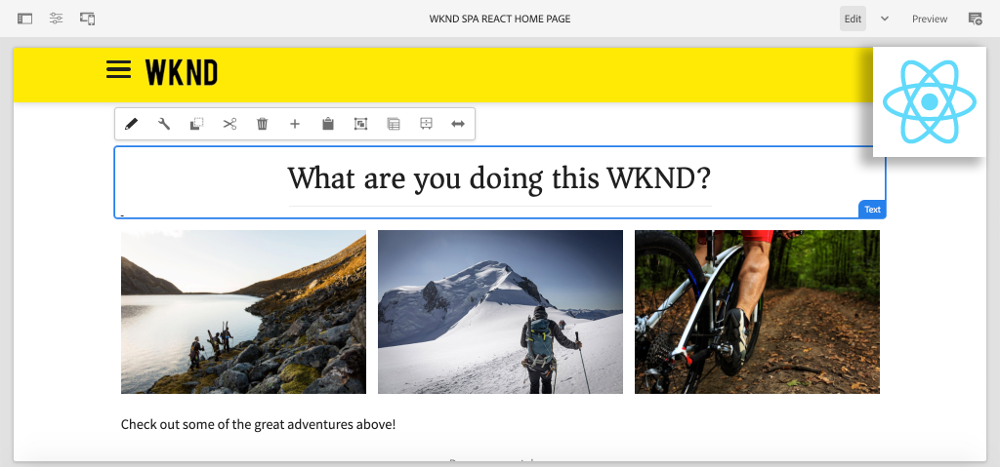

# Uw eerste React SPA in AEM maken {#overview}

{{spa-editor-deprecation}}

Onthaal aan een multi-part leerprogramma dat voor ontwikkelaars nieuw aan de **eigenschap van de Redacteur van het KUUROORD** in Adobe Experience Manager (AEM) wordt ontworpen. In deze zelfstudie wordt de implementatie besproken van een React-toepassing voor een fictief levensstijlmerk, de WKND. De React app wordt ontwikkeld en ontworpen om met de Redacteur van het KUUROORD van AEM worden opgesteld, die React componenten aan de componenten van AEM in kaart brengt. De voltooide SPA, die aan AEM wordt opgesteld, kan dynamisch worden ontworpen met traditionele in-line het uitgeven hulpmiddelen van AEM.

*WKND de Implementatie van het KUUROORD*

## Info

Het leerprogramma wordt ontworpen om met **AEM as a Cloud Service** te werken en is achterwaarts compatibel met **AEM 6.5.4+** en **AEM 6.4.8+**.

## Laatste code

Al leerprogramma code kan op [&#x200B; GitHub &#x200B;](https://github.com/adobe/aem-guides-wknd-spa) worden gevonden.

De [&#x200B; recentste codebasis &#x200B;](https://github.com/adobe/aem-guides-wknd-spa/releases) is beschikbaar als downloadbare Pakketten van AEM.

## Vereisten

Voordat u deze zelfstudie start, hebt u het volgende nodig:

* Basiskennis van HTML, CSS en JavaScript
* De basis vertrouwdheid met [&#x200B; Reageert &#x200B;](https://reactjs.org/tutorial/tutorial.html)

*terwijl niet vereist, is het nuttig om een basisbegrip van [&#x200B; het ontwikkelen van traditionele componenten van AEM Sites &#x200B;](https://experienceleague.adobe.com/docs/experience-manager-learn/getting-started-wknd-tutorial-develop/overview.html) te hebben.*

## Lokale ontwikkelomgeving {#local-dev-environment}

Er is een lokale ontwikkelomgeving nodig om deze zelfstudie te voltooien. De schermafbeeldingen en de video worden gevangen gebruikend AEM as a Cloud Service SDK die op een milieu van Mac OS met [&#x200B; Code van Visual Studio &#x200B;](https://code.visualstudio.com/) als winde loopt. Opdrachten en code moeten onafhankelijk zijn van het lokale besturingssysteem, tenzij anders aangegeven.

### Vereiste software

* [&#x200B; AEM as a Cloud Service SDK &#x200B;](https://experienceleague.adobe.com/docs/experience-manager-learn/cloud-service/local-development-environment-set-up/aem-runtime.html), [&#x200B; AEM 6.5.4+ &#x200B;](https://experienceleague.adobe.com/docs/experience-manager-release-information/aem-release-updates/aem-releases-updates.html?lang=en#aem-65) of [&#x200B; AEM 6.4.8+ &#x200B;](https://experienceleague.adobe.com/docs/experience-manager-release-information/aem-release-updates/aem-releases-updates.html?lang=en#aem-64)
* [Java](https://downloads.experiencecloud.adobe.com/content/software-distribution/en/general.html)
* [&#x200B; Apache Maven &#x200B;](https://maven.apache.org/) (3.3.9 of nieuwer)
* [&#x200B; Node.js &#x200B;](https://nodejs.org/en/) en [&#x200B; npm &#x200B;](https://www.npmjs.com/)

>[!NOTE]
>
> **Nieuw aan AEM as a Cloud Service?** Controle uit de [&#x200B; volgende gids aan vestiging een lokale ontwikkelomgeving gebruikend AEM as a Cloud Service SDK &#x200B;](https://experienceleague.adobe.com/docs/experience-manager-learn/cloud-service/local-development-environment-set-up/overview.html).
>
> **Nieuw aan AEM 6.5?** Controle uit de [&#x200B; volgende gids aan vestiging een lokale ontwikkelomgeving &#x200B;](https://experienceleague.adobe.com/docs/experience-manager-learn/foundation/development/set-up-a-local-aem-development-environment.html).

## Volgende stappen {#next-steps}

Waar wacht u op?! Begin het leerprogramma door aan [&#x200B; te navigeren creeer het hoofdstuk van het Project &#x200B;](create-project.md) en leer hoe te om een redacteur van het KUUROORD toegelaten project te produceren gebruikend het Archetype van het Project van AEM.
