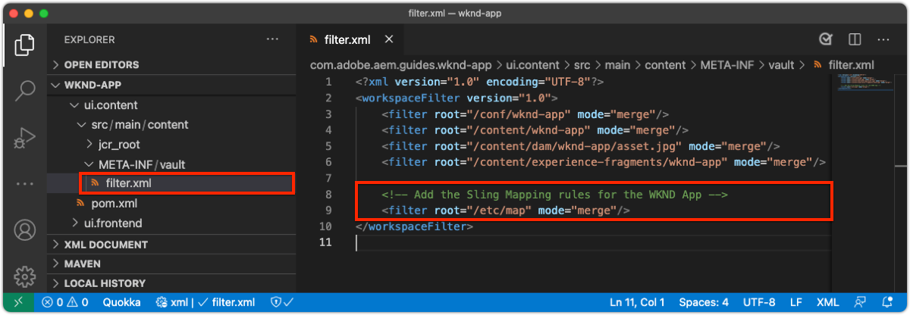

# AEM for SPA Editor configureren

{{spa-editor-deprecation}}

Terwijl de Codebase van het KUUROORD buiten AEM wordt beheerd, wordt een project van AEM vereist aan opstelling ondersteunende configuratie en inhoudsvereisten. Dit hoofdstuk doorloopt de verwezenlijking van een project van AEM dat noodzakelijke configuraties bevat:

* AEM WCM Core-componentproxy&#39;s
* AEM Remote SPA Page-proxy
* AEM Remote SPA Page Templates
* Baseline Remote SPA AEM-pagina&#39;s
* Subproject om KUUROORD aan de afbeeldingen van AEM te bepalen URL
* OSGi-configuratiemappen

## Download het basisproject van GitHub

Download het `aem-guides-wknd-graphql` -project van Github.com. Dit zal sommige basislijndossiers bevatten die in dit project worden gebruikt.

```
$ mkdir -p ~/Code
$ git clone https://github.com/adobe/aem-guides-wknd-graphql.git
$ cd remote-spa-tutorial
```

## Een AEM-project maken

Maak een AEM-project waarin configuraties en basislijninhoud worden beheerd. Dit project wordt gegenereerd in de map `remote-spa-tutorial` van het gekloonde `aem-guides-wknd-graphql` project.

_gebruik altijd de recentste versie van [ AEM Archetype ](https://github.com/adobe/aem-project-archetype)._

```
$ cd ~/Code/aem-guides-wknd-graphql/remote-spa-tutorial
$ mvn -B archetype:generate \
 -D archetypeGroupId=com.adobe.aem \
 -D archetypeArtifactId=aem-project-archetype \
 -D archetypeVersion=39 \
 -D aemVersion=cloud \
 -D appTitle="WKND App" \
 -D appId="wknd-app" \
 -D groupId="com.adobe.aem.guides.wkndapp" \
 -D frontendModule="react"
$ mv ~/Code/aem-guides-wknd-graphql/remote-spa-tutorial/wknd-app ~/Code/aem-guides-wknd-graphql/remote-spa-tutorial/com.adobe.aem.guides.wknd-app
```

_Het laatste bevel wijzigt eenvoudig de naam van de het projectomslag van AEM zodat is het duidelijk het project van AEM, en niet om met Verre SPA* worden verward

Terwijl `frontendModule="react"` wordt gespecificeerd, wordt het `ui.frontend` project niet gebruikt voor het Verre gebruik van het KUUROORD. Het SPA wordt ontwikkeld en extern beheerd aan AEM en gebruikt slechts AEM als inhoud API. De markering `frontendModule="react"` is vereist voor het project, inclusief de `spa-project` AEM Java™-afhankelijkheden en het instellen van de Remote SPA Page Templates.

Het Archetype van het Project van AEM produceert de volgende elementen die gebruikte om AEM voor integratie met het KUUROORD te vormen.

* **de volmachten van de Componenten van de Kern van AEM WCM** bij `ui.apps/src/.../apps/wknd-app/components`
* **de Verre volmacht van de Pagina van AEM SPA** bij `ui.apps/src/.../apps/wknd-app/components/remotepage`
* **de Malplaatjes van de Pagina van AEM** bij `ui.content/src/.../conf/wknd-app/settings/wcm/templates`
* **Subproject om inhoudsafbeeldingen** bij `ui.content/src/...` te bepalen
* **Verre de Verre pagina&#39;s van AEM van de Basislijn** bij `ui.content/src/.../content/wknd-app`
* **OSGi configuratiemappen** bij `ui.config/src/.../apps/wknd-app/osgiconfig`

Met het project van basisAEM wordt geproduceerd, verzekeren een paar aanpassingen de verenigbaarheid van de Redacteur van het KUUROORD met Verre SPAs.

## Ui.frontend-project verwijderen

Aangezien het KUUROORD een Verre KUUROORD is, veronderstel het buiten het project van AEM wordt ontwikkeld en geleid. U voorkomt conflicten door het `ui.frontend` -project uit de implementatie te verwijderen. Als het `ui.frontend` project niet wordt verwijderd, wordt twee SPAs, standaardSPA verstrekt in het `ui.frontend` project en het Verre KUUROORD, tezelfdertijd geladen in de Redacteur van AEM SPA.

1. Open het AEM-project (`~/Code/aem-guides-wknd-graphql/remote-spa-tutorial/com.adobe.aem.guides.wknd-app`) in uw IDE
1. De hoofdmap openen `pom.xml`
1. De opmerking `<module>ui.frontend</module` verwijderen uit de lijst `<modules>`

   ```
   <modules>
       <module>all</module>
       <module>core</module>
   
       <!-- <module>ui.frontend</module> -->
   
       <module>ui.apps</module>
       <module>ui.apps.structure</module>
       <module>ui.config</module>
       <module>ui.content</module>
       <module>it.tests</module>
       <module>dispatcher</module>
       <module>ui.tests</module>
       <module>analyse</module>
   </modules>
   ```

   Het bestand `pom.xml` moet er als volgt uitzien:

   

1. De `ui.apps/pom.xml` openen
1. Maak een opmerking over de `<dependency>` on `<artifactId>wknd-app.ui.frontend</artifactId>`

   ```
   <dependencies>
   
       <!-- Remote SPA project will provide all frontend resources
       <dependency>
           <groupId>com.adobe.aem.guides.wkndapp</groupId>
           <artifactId>wknd-app.ui.frontend</artifactId>
           <version>${project.version}</version>
           <type>zip</type>
       </dependency>
       --> 
   </dependencies>
   ```

   Het bestand `ui.apps/pom.xml` moet er als volgt uitzien:

   

Als het AEM-project vóór deze wijzigingen is gemaakt, verwijdert u handmatig de `ui.frontend` gegenereerde clientbibliotheek uit het `ui.apps` project at `ui.apps/src/main/content/jcr_root/apps/wknd-app/clientlibs/clientlib-react` .

## AEM-inhoudstoewijzing

Voor AEM om het Verre KUUROORD in de Redacteur van het KUUROORD te laden, moeten de afbeeldingen tussen de routes van het KUUROORD en de Pagina&#39;s van AEM worden gebruikt om te openen en auteursinhoud worden gevestigd.

Het belang van deze configuratie wordt later onderzocht.

De afbeelding kan worden gedaan met [ het Schuiven Toewijzing ](https://sling.apache.org/documentation/the-sling-engine/mappings-for-resource-resolution.html#root-level-mappings-1) die in `/etc/map` wordt bepaald.

1. Open het subproject `ui.content` in de IDE
1. Navigeren naar `src/main/content/jcr_root`
1. Een map maken `etc`
1. Maak in `etc` een map `map`
1. Maak in `map` een map `http`
1. Maak in `http` een bestand `.content.xml` met de inhoud:

   ```
   <?xml version="1.0" encoding="UTF-8"?>
   <jcr:root xmlns:sling="http://sling.apache.org/jcr/sling/1.0" xmlns:jcr="http://www.jcp.org/jcr/1.0"
       jcr:primaryType="sling:Mapping">
       <localhost_any/>
   </jcr:root>
   ```

1. Maak in `http` een map `localhost_any`
1. Maak in `localhost_any` een bestand `.content.xml` met de inhoud:

   ```
   <?xml version="1.0" encoding="UTF-8"?>
   <jcr:root xmlns:sling="http://sling.apache.org/jcr/sling/1.0" xmlns:jcr="http://www.jcp.org/jcr/1.0"
       jcr:primaryType="sling:Mapping"
       sling:match="localhost\\.\\d+">
       <wknd-app-routes-adventure/>
   </jcr:root>
   ```

1. Maak in `localhost_any` een map `wknd-app-routes-adventure`
1. Maak in `wknd-app-routes-adventure` een bestand `.content.xml` met de inhoud:

   ```
   <?xml version="1.0" encoding="UTF-8"?>
   
   <!--
   The 'wknd-app-routes-adventure' mapping, maps requests to the SPA's adventure route 
   to it's corresponding page in AEM at /content/wknd-app/us/en/home/adventure/xxx.
   
   Note the adventure AEM pages are created directly in AEM.
   -->
   
   <jcr:root xmlns:sling="http://sling.apache.org/jcr/sling/1.0" xmlns:jcr="http://www.jcp.org/jcr/1.0"
       jcr:primaryType="sling:Mapping"
       sling:match="adventure:.*/([^/]+)/?$"
       sling:internalRedirect="/content/wknd-app/us/en/home/adventure/$1"/>
   ```

1. Voeg de toewijzingsknooppunten toe aan `ui.content/src/main/content/META-INF/vault/filter.xml` aan de knooppunten die in het AEM-pakket zijn opgenomen.

   ```
   <?xml version="1.0" encoding="UTF-8"?>
   <workspaceFilter version="1.0">
       <filter root="/conf/wknd-app" mode="merge"/>
       <filter root="/content/wknd-app" mode="merge"/>
       <filter root="/content/dam/wknd-app/asset.jpg" mode="merge"/>
       <filter root="/content/experience-fragments/wknd-app" mode="merge"/>
   
       <!-- Add the Sling Mapping rules for the WKND App -->
       <filter root="/etc/map" mode="merge"/>
   </workspaceFilter>
   ```

De mapstructuur en `.context.xml` -bestanden moeten er als volgt uitzien:


Het bestand `filter.xml` moet er als volgt uitzien:



Nu, wanneer het project van AEM wordt opgesteld, zijn deze configuraties automatisch inbegrepen.

De effecten voor het toewijzen van objecten aan AEM die op `http` en `localhost` worden uitgevoerd, ondersteunen dus alleen lokale ontwikkeling. Bij implementatie naar AEM as a Cloud Service moeten vergelijkbare Sling Mappings-objecten worden toegevoegd aan dat doel `https` en het juiste AEM as a Cloud Service-domein of de juiste-domeinen. Voor meer informatie, zie de [ Verschuivende documentatie van de Afbeelding ](https://sling.apache.org/documentation/the-sling-engine/mappings-for-resource-resolution.html).

## Beveiligingsbeleid voor het delen van bronnen tussen verschillende bronnen

Configureer vervolgens AEM om de inhoud te beschermen, zodat alleen deze SPA toegang heeft tot de AEM-inhoud. Vorm [ het Delen van het Middel van de Cross-Origin in AEM ](https://experienceleague.adobe.com/docs/experience-manager-learn/foundation/security/develop-for-cross-origin-resource-sharing.html?lang=nl-NL).

1. Open het subproject `ui.config` Maven in uw IDE
1. Navigeren `src/main/content/jcr_root/apps/wknd-app/osgiconfig/config`
1. Een bestand met de naam `com.adobe.granite.cors.impl.CORSPolicyImpl~wknd-app_remote-spa.cfg.json` maken
1. Voeg het volgende toe aan het bestand:

   ```
   {
       "supportscredentials":true,
       "exposedheaders":[
           ""
       ],
       "supportedmethods":[
           "GET",
           "HEAD",
           "POST",
           "OPTIONS"
       ],
       "alloworigin":[
           "https://external-hosted-app", "localhost:3000"
       ],
       "maxage:Integer":1800,
       "alloworiginregexp":[
           ".*"
       ],
       "allowedpaths":[
           ".*"
       ],
       "supportedheaders":[
           "Origin",
           "Accept",
           "X-Requested-With",
           "Content-Type",
           "Access-Control-Request-Method",
           "Access-Control-Request-Headers",
           "authorization"
       ]
   }
   ```

Het bestand `com.adobe.granite.cors.impl.CORSPolicyImpl~wknd-app_remote-spa.cfg.json` moet er als volgt uitzien:


De belangrijkste configuratieelementen zijn:

* `alloworigin` geeft aan welke hosts inhoud uit AEM mogen ophalen.
   * `localhost:3000` wordt toegevoegd ter ondersteuning van de SPA die lokaal wordt uitgevoerd
   * `https://external-hosted-app` dienst als placeholder die met het domein moet worden vervangen dat Verre SPA wordt ontvangen.
* `allowedpaths` geeft op welke paden in AEM door deze CORS-configuratie worden gedekt. De standaardwaarde staat toegang tot al inhoud in AEM toe, nochtans kan dit tot slechts de specifieke wegen worden beperkt het KUUROORD, bijvoorbeeld: `/content/wknd-app` toegang hebben.

## AEM-pagina instellen als sjabloon voor externe SPA-pagina

Het Project Archetype van AEM produceert een project dat voor de integratie van AEM met een Verre SPA wordt voorbereid, maar vereist een kleine, maar belangrijke aanpassing aan auto-geproduceerde de paginastructuur van AEM. De auto-geproduceerde AEM pagina moet zijn type hebben dat in **Verre pagina van het KUUROORD** wordt veranderd, eerder dan a **pagina van het KUUROORD**.

1. Open het subproject `ui.content` in uw IDE
1. Openen naar `src/main/content/jcr_root/content/wknd-app/us/en/home/.content.xml`
1. Dit `.content.xml` -bestand bijwerken met:

   ```xml
   <?xml version="1.0" encoding="UTF-8"?>
   <jcr:root xmlns:sling="http://sling.apache.org/jcr/sling/1.0" xmlns:cq="http://www.day.com/jcr/cq/1.0" xmlns:jcr="http://www.jcp.org/jcr/1.0" xmlns:nt="http://www.jcp.org/jcr/nt/1.0"
           jcr:primaryType="cq:Page">
       <jcr:content
           cq:template="/conf/wknd-app/settings/wcm/templates/spa-remote-page"
           jcr:primaryType="cq:PageContent"
           jcr:title="WKND App Home Page"
           sling:resourceType="wknd-app/components/remotepage">
           <root
               jcr:primaryType="nt:unstructured"
               sling:resourceType="wcm/foundation/components/responsivegrid">
               <responsivegrid
                   jcr:primaryType="nt:unstructured"
                   sling:resourceType="wcm/foundation/components/responsivegrid">
                   <text
                       jcr:primaryType="nt:unstructured"
                       sling:resourceType="wknd-app/components/text"
                       text="&lt;p>Hello World!&lt;/p>"
                       textIsRich="true">
                       <cq:responsive jcr:primaryType="nt:unstructured"/>
                   </text>
               </responsivegrid>
           </root>
       </jcr:content>
   </jcr:root>
   ```

De belangrijkste wijzigingen zijn updates van het knooppunt `jcr:content` :

* `cq:template` t/m `/conf/wknd-app/settings/wcm/templates/spa-remote-page`
* `sling:resourceType` t/m `wknd-app/components/remotepage`

Het bestand `src/main/content/jcr_root/content/wknd-app/us/en/home/.content.xml` moet er als volgt uitzien:


Deze veranderingen staan deze pagina toe, die de wortel van het KUUROORD in AEM handelt, om het Verre KUUROORD in de Redacteur van het KUUROORD te laden.

>[!NOTE]
>
>Als dit project eerder aan AEM werd opgesteld, zorg ervoor om de pagina van AEM als **Plaatsen > App van WKND > gebruiken > en > WKND App Homepage** te schrappen, aangezien het `ui.content` project aan **&#x200B;**&#x200B;knopen samenvoegt, eerder dan **update** wordt geplaatst.

Deze pagina kon ook als Verre pagina van het KUUROORD in AEM zelf worden verwijderd en worden opnieuw gecreeerd, echter aangezien deze pagina in het `ui.content` project auto-gecreeerd is het best om het in de codebasis bij te werken.

## AEM-project implementeren voor AEM SDK

1. Controleer of de AEM Author-service wordt uitgevoerd op poort 4502
1. Navigeer vanaf de opdrachtregel naar de hoofdmap van het AEM Maven-project
1. Gebruik Maven om het project te implementeren voor uw lokale AEM SDK Author-service

   ```
   $ mvn clean install -PautoInstallSinglePackage
   ```

   

## De AEM-basispagina configureren

Met het AEM opgestelde Project, is er één laatste stap om de Redacteur van het KUUROORD voor te bereiden om onze Verre KUUROORD te laden. In AEM, merk de pagina van AEM die aan de wortel van het KUUROORD, `/content/wknd-app/us/en/home` beantwoordt, door het Archetype van het Project van AEM wordt geproduceerd.

1. Aanmelden bij AEM-auteur
1. Navigeer aan **Plaatsen > App WKND > gebruiken > en**
1. Selecteer de **WebND Pagina van het Huis van de App**, en tik **Eigenschappen**

   

1. Navigeer aan het **SPA** lusje
1. Vul de **Verre Configuratie van het KUUROORD** uit
   1. **URL van de Gastheer van het KUUROORD**: `http://localhost:3000`
      1. URL aan de wortel van het Verre KUUROORD

   

1. Tik **sparen &amp; Sluiten**

Herinner dat wij het type van deze pagina in dat van a **Verre pagina van het KUUROORD** veranderden, wat ons toestaat om het **KUUROORD** lusje in zijn **Eigenschappen van de Pagina** te zien.

Deze configuratie moet slechts op de pagina van AEM worden geplaatst die aan de wortel van SPA beantwoordt. Alle AEM-pagina&#39;s onder deze pagina nemen de waarde over.

## Gefeliciteerd

U hebt nu AEM-configuraties voorbereid en deze geïmplementeerd op uw lokale AEM-auteur! Nu weet u hoe:

* Verwijder het door Archetype van het Project van AEM gegenereerde SPA door opmerkingen te maken over de afhankelijkheden in `ui.frontend`
* Voeg het Verschuiven Toewijzingen aan AEM toe die de routes van het KUUROORD aan middelen in AEM in kaart brengen
* Stel AEM in voor het delen van bronnen van kruisoorsprong en het delen van beveiligingsbeleid waarmee de externe SPA inhoud van AEM kan verbruiken
* AEM-project implementeren voor uw lokale SDK Author-service van AEM
* Markeer een Pagina van AEM als Verre wortel van SPA gebruikend het de paginabezit van URL van de Gastheer van het KUUROORD

## Volgende stappen

Met gevormde AEM, kunnen wij op [ bootstrapping het Verre KUUROORD ](./spa-bootstrap.md) met steun voor editable gebieden gebruikend de Redacteur van het KUUROORD van AEM concentreren!
