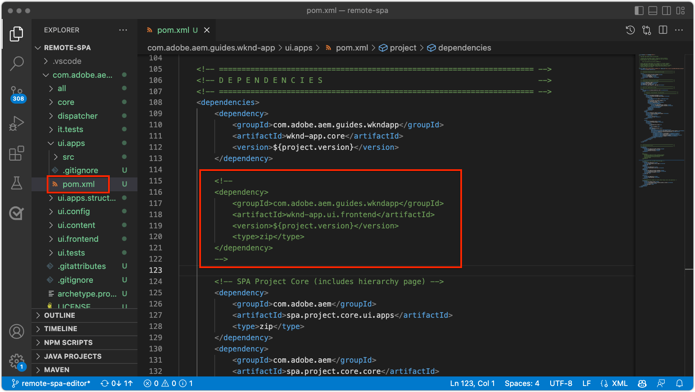

# AEM configureren voor SPA Editor

Terwijl de SPA codebase buiten AEM wordt beheerd, wordt een AEM project vereist aan opstelling ondersteunend configuratie en inhoudsvereisten. Dit hoofdstuk doorloopt de verwezenlijking van een AEM project dat noodzakelijke configuraties bevat:

+ Proxy&#39;s van WCM Core-componenten AEM
+ Proxy voor externe SPA AEM
+ Sjablonen voor externe SPA AEM
+ Basislijnpagina&#39;s voor externe SPA AEM
+ Subproject voor het definiëren van SPA naar AEM URL-toewijzingen
+ OSGi-configuratiemappen

## Download het basisproject van GitHub

Download het `aem-guides-wknd-graphql` -project van Github.com. Dit zal sommige basislijndossiers bevatten die in dit project worden gebruikt.

```
$ mkdir -p ~/Code
$ git clone https://github.com/adobe/aem-guides-wknd-graphql.git
$ cd remote-spa-tutorial
```

## Een AEM project maken

Creeer een AEM project waarin configuraties en basislijninhoud worden beheerd. Dit project wordt gegenereerd in de map `remote-spa-tutorial` van het gekloonde `aem-guides-wknd-graphql` project.

_gebruik altijd de recentste versie van [ AEM Archetype ](https://github.com/adobe/aem-project-archetype)._

```
$ cd ~/Code/aem-guides-wknd-graphql/remote-spa-tutorial
$ mvn -B archetype:generate \
 -D archetypeGroupId=com.adobe.aem \
 -D archetypeArtifactId=aem-project-archetype \
 -D archetypeVersion=39 \
 -D aemVersion=cloud \
 -D appTitle="WKND App" \
 -D appId="wknd-app" \
 -D groupId="com.adobe.aem.guides.wkndapp" \
 -D frontendModule="react"
$ mv ~/Code/aem-guides-wknd-graphql/remote-spa-tutorial/wknd-app ~/Code/aem-guides-wknd-graphql/remote-spa-tutorial/com.adobe.aem.guides.wknd-app
```

_het laatste bevel wijzigt eenvoudig de naam van de AEM projectomslag zodat is het duidelijk het AEM project, en niet om met Verre SPA__ te worden verward

Terwijl `frontendModule="react"` wordt gespecificeerd, wordt het `ui.frontend` project niet gebruikt voor het Verre SPA gebruik geval. De SPA wordt extern ontwikkeld en beheerd om te AEM en gebruikt alleen AEM als inhoud-API. De markering `frontendModule="react"` is vereist voor het project. Deze markering bevat de `spa-project` AEM Java™-afhankelijkheden en stelt de sjablonen voor de externe SPA pagina in.

Het AEM Archetype van het Project produceert de volgende elementen die gebruikte om AEM voor integratie met de SPA te vormen.

+ __AEM de volmachten van de Componenten van de Kern WCM__ bij `ui.apps/src/.../apps/wknd-app/components`
+ __AEM SPA de verre volmacht van de Pagina__ bij `ui.apps/src/.../apps/wknd-app/components/remotepage`
+ __AEM de Malplaatjes van de Pagina__ bij `ui.content/src/.../conf/wknd-app/settings/wcm/templates`
+ __Subproject om inhoudsafbeeldingen__ bij `ui.content/src/...` te bepalen
+ __Verre SPA van de Basislijn AEM pagina&#39;s__ bij `ui.content/src/.../content/wknd-app`
+ __OSGi configuratiemappen__ bij `ui.config/src/.../apps/wknd-app/osgiconfig`

Met het basis AEM project wordt geproduceerd, verzekeren een paar aanpassingen SPA de verenigbaarheid van de Redacteur met Verre SPA.

## Ui.frontend-project verwijderen

Aangezien de SPA een Verre SPA is, veronderstel het buiten het AEM project wordt ontwikkeld en geleid. U voorkomt conflicten door het `ui.frontend` -project uit de implementatie te verwijderen. Als het `ui.frontend` -project niet wordt verwijderd, worden twee SPA, de standaard SPA in het `ui.frontend` -project en de externe SPA, tegelijkertijd geladen in de AEM SPA Editor.

1. Open het AEM project (`~/Code/aem-guides-wknd-graphql/remote-spa-tutorial/com.adobe.aem.guides.wknd-app`) in uw winde
1. De hoofdmap openen `pom.xml`
1. De opmerking `<module>ui.frontend</module` verwijderen uit de lijst `<modules>`

   ```
   <modules>
       <module>all</module>
       <module>core</module>
   
       <!-- <module>ui.frontend</module> -->
   
       <module>ui.apps</module>
       <module>ui.apps.structure</module>
       <module>ui.config</module>
       <module>ui.content</module>
       <module>it.tests</module>
       <module>dispatcher</module>
       <module>ui.tests</module>
       <module>analyse</module>
   </modules>
   ```

   Het bestand `pom.xml` moet er als volgt uitzien:

   

1. De `ui.apps/pom.xml` openen
1. Maak een opmerking over de `<dependency>` on `<artifactId>wknd-app.ui.frontend</artifactId>`

   ```
   <dependencies>
   
       <!-- Remote SPA project will provide all frontend resources
       <dependency>
           <groupId>com.adobe.aem.guides.wkndapp</groupId>
           <artifactId>wknd-app.ui.frontend</artifactId>
           <version>${project.version}</version>
           <type>zip</type>
       </dependency>
       --> 
   </dependencies>
   ```

   Het bestand `ui.apps/pom.xml` moet er als volgt uitzien:

   

Als het AEM project vóór deze wijzigingen is gemaakt, verwijdert u handmatig de `ui.frontend` gegenereerde clientbibliotheek uit het `ui.apps` project at `ui.apps/src/main/content/jcr_root/apps/wknd-app/clientlibs/clientlib-react` .

## Inhoud toewijzen AEM

Voor AEM om de Verre SPA in de SPARedacteur te laden, moeten de afbeeldingen tussen de SPA routes en de AEM Pagina&#39;s worden gebruikt om te openen en auteursinhoud worden gevestigd.

Het belang van deze configuratie wordt later onderzocht.

De afbeelding kan worden gedaan met [ het Schuiven Toewijzing ](https://sling.apache.org/documentation/the-sling-engine/mappings-for-resource-resolution.html#root-level-mappings-1) die in `/etc/map` wordt bepaald.

1. Open het subproject `ui.content` in de IDE
1. Navigeren naar `src/main/content/jcr_root`
1. Een map maken `etc`
1. Maak in `etc` een map `map`
1. Maak in `map` een map `http`
1. Maak in `http` een bestand `.content.xml` met de inhoud:

   ```
   <?xml version="1.0" encoding="UTF-8"?>
   <jcr:root xmlns:sling="http://sling.apache.org/jcr/sling/1.0" xmlns:jcr="http://www.jcp.org/jcr/1.0"
       jcr:primaryType="sling:Mapping">
       <localhost_any/>
   </jcr:root>
   ```

1. Maak in `http` een map `localhost_any`
1. Maak in `localhost_any` een bestand `.content.xml` met de inhoud:

   ```
   <?xml version="1.0" encoding="UTF-8"?>
   <jcr:root xmlns:sling="http://sling.apache.org/jcr/sling/1.0" xmlns:jcr="http://www.jcp.org/jcr/1.0"
       jcr:primaryType="sling:Mapping"
       sling:match="localhost\\.\\d+">
       <wknd-app-routes-adventure/>
   </jcr:root>
   ```

1. Maak in `localhost_any` een map `wknd-app-routes-adventure`
1. Maak in `wknd-app-routes-adventure` een bestand `.content.xml` met de inhoud:

   ```
   <?xml version="1.0" encoding="UTF-8"?>
   
   <!--
   The 'wknd-app-routes-adventure' mapping, maps requests to the SPA's adventure route 
   to it's corresponding page in AEM at /content/wknd-app/us/en/home/adventure/xxx.
   
   Note the adventure AEM pages are created directly in AEM.
   -->
   
   <jcr:root xmlns:sling="http://sling.apache.org/jcr/sling/1.0" xmlns:jcr="http://www.jcp.org/jcr/1.0"
       jcr:primaryType="sling:Mapping"
       sling:match="adventure:.*/([^/]+)/?$"
       sling:internalRedirect="/content/wknd-app/us/en/home/adventure/$1"/>
   ```

1. Voeg de toewijzingsknooppunten toe aan `ui.content/src/main/content/META-INF/vault/filter.xml` aan de knooppunten die in het AEM-pakket zijn opgenomen.

   ```
   <?xml version="1.0" encoding="UTF-8"?>
   <workspaceFilter version="1.0">
       <filter root="/conf/wknd-app" mode="merge"/>
       <filter root="/content/wknd-app" mode="merge"/>
       <filter root="/content/dam/wknd-app/asset.jpg" mode="merge"/>
       <filter root="/content/experience-fragments/wknd-app" mode="merge"/>
   
       <!-- Add the Sling Mapping rules for the WKND App -->
       <filter root="/etc/map" mode="merge"/>
   </workspaceFilter>
   ```

De mapstructuur en `.context.xml` -bestanden moeten er als volgt uitzien:


Het bestand `filter.xml` moet er als volgt uitzien:


Nu, wanneer het AEM project wordt opgesteld, zijn deze configuraties automatisch inbegrepen.

De effecten voor het toewijzen van objecten aan AEM `http` en `localhost` worden uitgevoerd, zodat alleen lokale ontwikkeling wordt ondersteund. Bij implementatie naar AEM as a Cloud Service moeten vergelijkbare Sling Mappings-objecten worden toegevoegd aan dat doel `https` en het juiste AEM as a Cloud Service-domein of de juiste-domeinen. Voor meer informatie, zie de [ Verschuivende documentatie van de Afbeelding ](https://sling.apache.org/documentation/the-sling-engine/mappings-for-resource-resolution.html).

## Beveiligingsbeleid voor het delen van bronnen tussen verschillende bronnen

Configureer vervolgens AEM om de inhoud te beschermen, zodat alleen deze SPA toegang heeft tot de AEM inhoud. Vorm [ het Delen van het Middel van de Cross-Origin in in AEM ](https://experienceleague.adobe.com/docs/experience-manager-learn/foundation/security/develop-for-cross-origin-resource-sharing.html).

1. Open het subproject `ui.config` Maven in uw IDE
1. Navigeren `src/main/content/jcr_root/apps/wknd-app/osgiconfig/config`
1. Een bestand met de naam `com.adobe.granite.cors.impl.CORSPolicyImpl~wknd-app_remote-spa.cfg.json` maken
1. Voeg het volgende toe aan het bestand:

   ```
   {
       "supportscredentials":true,
       "exposedheaders":[
           ""
       ],
       "supportedmethods":[
           "GET",
           "HEAD",
           "POST",
           "OPTIONS"
       ],
       "alloworigin":[
           "https://external-hosted-app", "localhost:3000"
       ],
       "maxage:Integer":1800,
       "alloworiginregexp":[
           ".*"
       ],
       "allowedpaths":[
           ".*"
       ],
       "supportedheaders":[
           "Origin",
           "Accept",
           "X-Requested-With",
           "Content-Type",
           "Access-Control-Request-Method",
           "Access-Control-Request-Headers",
           "authorization"
       ]
   }
   ```

Het bestand `com.adobe.granite.cors.impl.CORSPolicyImpl~wknd-app_remote-spa.cfg.json` moet er als volgt uitzien:


De belangrijkste configuratieelementen zijn:

+ `alloworigin` geeft aan welke hosts inhoud mogen ophalen uit AEM.
   + `localhost:3000` wordt toegevoegd ter ondersteuning van SPA die lokaal worden uitgevoerd
   + `https://external-hosted-app` fungeert als plaatsaanduiding die moet worden vervangen door het domein waarop de externe SPA wordt gehost.
+ `allowedpaths` geeft op welke paden in AEM door deze CORS-configuratie worden gedekt. Standaard is toegang tot alle inhoud in AEM toegestaan, maar dit kan alleen worden toegepast op de specifieke paden waartoe de SPA toegang heeft, bijvoorbeeld: `/content/wknd-app` .

## AEM pagina instellen als sjabloon voor externe SPA

Het AEM Project Archetype produceert een project dat voor AEM integratie met een Verre SPA wordt voorbereid, maar vereist een kleine, maar belangrijke aanpassing aan auto-geproduceerde AEM paginastructuur. De auto-geproduceerde AEM pagina moet zijn type hebben veranderd in __Verre SPA pagina__, eerder dan a __SPA pagina__.

1. Open het subproject `ui.content` in uw IDE
1. Openen naar `src/main/content/jcr_root/content/wknd-app/us/en/home/.content.xml`
1. Dit `.content.xml` -bestand bijwerken met:

   ```
   <?xml version="1.0" encoding="UTF-8"?>
   <jcr:root xmlns:sling="http://sling.apache.org/jcr/sling/1.0" xmlns:cq="http://www.day.com/jcr/cq/1.0" xmlns:jcr="http://www.jcp.org/jcr/1.0" xmlns:nt="http://www.jcp.org/jcr/nt/1.0"
           jcr:primaryType="cq:Page">
       <jcr:content
           cq:template="/conf/wknd-app/settings/wcm/templates/spa-remote-page"
           jcr:primaryType="cq:PageContent"
           jcr:title="WKND App Home Page"
           sling:resourceType="wknd-app/components/remotepage">
           <root
               jcr:primaryType="nt:unstructured"
               sling:resourceType="wcm/foundation/components/responsivegrid">
               <responsivegrid
                   jcr:primaryType="nt:unstructured"
                   sling:resourceType="wcm/foundation/components/responsivegrid">
                   <text
                       jcr:primaryType="nt:unstructured"
                       sling:resourceType="wknd-app/components/text"
                       text="&lt;p>Hello World!&lt;/p>"
                       textIsRich="true">
                       <cq:responsive jcr:primaryType="nt:unstructured"/>
                   </text>
               </responsivegrid>
           </root>
       </jcr:content>
   </jcr:root>
   ```

De belangrijkste wijzigingen zijn updates van het knooppunt `jcr:content` :

+ `cq:template` t/m `/conf/wknd-app/settings/wcm/templates/spa-remote-page`
+ `sling:resourceType` t/m `wknd-app/components/remotepage`

Het bestand `src/main/content/jcr_root/content/wknd-app/us/en/home/.content.xml` moet er als volgt uitzien:


Deze wijzigingen maken het mogelijk dat deze pagina, die de SPA hoofdmap in AEM vormt, de externe SPA in SPA Editor laadt.

>[!NOTE]
>
>Als dit project eerder aan AEM werd opgesteld, zorg ervoor om de AEM pagina als __Plaatsen te schrappen > WKND App > gebruiken > en > WKND App Homepage__, aangezien het `ui.content` project aan ____ knopen samenvoegt, eerder dan __update__ wordt geplaatst.

Deze pagina kan ook worden verwijderd en opnieuw worden gemaakt als een externe SPA pagina in AEM zelf, maar aangezien deze pagina automatisch wordt gemaakt in het `ui.content` -project, is het beter om deze pagina in de codebasis bij te werken.

## Implementeer het AEM Project naar AEM SDK

1. Zorg ervoor dat AEM Auteur-service wordt uitgevoerd op poort 4502
1. Navigeer vanaf de opdrachtregel naar de hoofdmap van het AEM Maven-project
1. Gebruik Maven om het project op te stellen aan uw lokale AEM SDK Auteur-service

   ```
   $ mvn clean install -PautoInstallSinglePackage
   ```

   

## De AEM van de hoofdmap configureren

Met AEM opgesteld Project, is er één laatste stap om SPA Redacteur voor te bereiden om onze Verre SPA te laden. In AEM, merk de AEM pagina die aan de SPA wortel, `/content/wknd-app/us/en/home` beantwoordt, die door het Archetype van het Project van de AEM wordt geproduceerd.

1. Aanmelden bij AEM auteur
1. Navigeer aan __Plaatsen > App WKND > gebruiken > en__
1. Selecteer de __WebND Pagina van het Huis van de App__, en tik __Eigenschappen__

   

1. Navigeer aan het __SPA__ lusje
1. Vul de __Verre SPA Configuratie__ uit
   + __SPA gastheer URL__: `http://localhost:3000`
      + De URL naar de hoofdmap van de externe SPA

   

1. Tik __sparen &amp; Sluiten__

Herinner dat wij het type van deze pagina in dat van a __Verre SPA Pagina__ veranderden, die ons toestaat om het __SPA__ lusje in zijn __Eigenschappen van de Pagina__ te zien.

Deze configuratie moet alleen worden ingesteld op de AEM pagina die overeenkomt met de hoofdmap van de SPA. Alle AEM pagina&#39;s onder deze pagina nemen de waarde over.

## Gefeliciteerd

U hebt nu AEM configuraties voorbereid en hen opgesteld aan uw lokale AEM auteur! Nu weet u hoe:

+ Verwijder de SPA van de Archetype van het AEM Project door opmerkingen te maken over de afhankelijkheden in `ui.frontend`
+ Voeg het Verschuiven Toewijzingen toe aan AEM die de SPA routes aan middelen in AEM in kaart brengen
+ Opstelling AEM het Delen van het Middel van de Cross-Origin veiligheidsbeleid dat de Verre SPA toestaat om inhoud van AEM te verbruiken
+ Implementeer het AEM project op uw lokale AEM SDK-auteurservice
+ Een AEM Pagina markeren als de externe SPA met de eigenschap URL van SPA host

## Volgende stappen

Met AEM gevormd, kunnen wij zich op [ bootstrapping de Verre SPA ](./spa-bootstrap.md) met steun voor editable gebieden gebruikend AEM Redacteur concentreren SPA!
