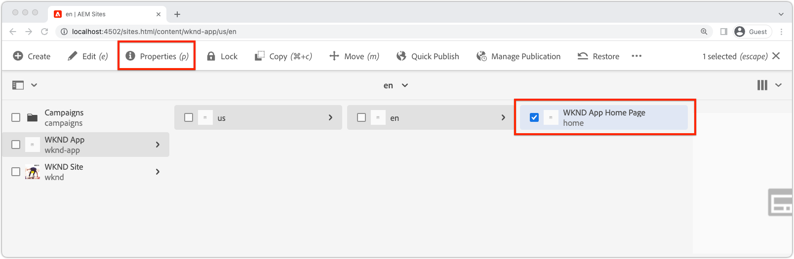

# Bootstrap de Verre SPA voor SPA Redacteur

Voordat de bewerkbare gebieden aan de externe SPA kunnen worden toegevoegd, moet deze worden opgepakt met de AEM SPA JavaScript SDK van de Editor en enkele andere configuraties.

## Npm-afhankelijkheden toevoegen aan AEM editor voor JS SDK

Voeg eerst AEM npm-afhankelijkheden toe aan het React-project.

```
$ cd ~/Code/wknd-app/aem-guides-wknd-graphql/react-app
$ npm install --save \
    @adobe/aem-spa-page-model-manager \
    @adobe/aem-spa-component-mapping \
    @adobe/aem-react-editable-components \
    @adobe/aem-core-components-react-base \
    @adobe/aem-core-components-react-spa
```

+ `@adobe/aem-spa-page-model-manager` biedt de API voor het ophalen van inhoud van AEM.
+ `@adobe/aem-spa-component-mapping` biedt de API die AEM inhoud toewijst aan SPA componenten.
+ ` @adobe/aem-react-editable-components` verstrekt API voor de bouw van douane SPA componenten en verstrekt gemeenschappelijk-gebruiksimplementaties zoals de component  `AEMPage` React.
+ `@adobe/aem-core-components-react-base` biedt een reeks gebruiksklare React-componenten die naadloos met de AEM WCM Core-componenten integreren en SPA Editor agnost zijn. Deze omvatten hoofdzakelijk inhoudscomponenten zoals:
   + Titel
   + Tekst
   + Broodkruimels
   + En zo verder.
+ `@adobe/aem-core-components-react-spa` biedt een reeks gebruiksklare React componenten die naadloos met de AEMComponenten van de Kern integreren WCM en maar SPA Redacteur vereisen. Deze bevatten hoofdzakelijk componenten die inhoudscomponenten van `@adobe/aem-core-components-react-base` bevatten, zoals:
   + Container
   + Carousel
   + enzovoort.

## SPA omgevingsvariabelen bekijken

Verschillende omgevingsvariabelen moeten worden blootgesteld aan de externe SPA zodat deze weet hoe ze met AEM moeten werken.

1. Open Verre SPA project bij `~/Code/wknd-app/aem-guides-wknd-graphql/react-app` in uw winde
1. Het bestand `.env.development` openen
1. Voeg het bestand toe, waarbij u speciale aandacht besteedt aan de toetsen:

   ```
   REACT_APP_HOST_URI=http://localhost:4502
   REACT_APP_AUTHORIZATION=admin:admin
   ```

   

   *Onthoud dat aangepaste omgevingsvariabelen in React vooraf moeten worden ingesteld  `REACT_APP_`.*

   + `REACT_APP_AEM_URI`: de regeling en de gastheer van de AEM dienst de Verre SPA verbindt met.
      + Deze waarde verandert op basis van het type AEM (lokaal, Ontwikkelen, Werkgebied of Productie) en AEM service (Auteur versus Publiceren).
   + `REACT_APP_AEM_AUTH`: de referenties die door de SPA worden gebruikt, worden geverifieerd om inhoud te AEM en op te halen.
      + Vereist voor gebruik met AEM-auteur
      + Mogelijk vereist voor gebruik met AEM-publicatie (als de inhoud is beveiligd)
      + Ontwikkelen tegen de AEM SDK ondersteunt lokale accounts via Basic Auth. Dit is de methode die in deze zelfstudie wordt gebruikt.
      + Wanneer het integreren met AEM als Cloud Service, gebruik [toegangstokens](https://experienceleague.adobe.com/docs/experience-manager-learn/getting-started-with-aem-headless/authentication/overview.html)

## De ModelManager-API integreren

Met de AEM SPA npm gebiedsdelen beschikbaar aan app, initialiseer AEM `ModelManager` in `index.js` in het project alvorens `ReactDOM.render(...)` wordt aangehaald.

De [ModelManager](https://www.npmjs.com/package/@adobe/aem-spa-page-model-manager) is verantwoordelijk voor het verbinden met AEM aan het terugwinnen van editable inhoud.

1. Open het Verre SPA project in uw winde
1. Het bestand `src/index.js` openen
1. Importeren `ModelManager` toevoegen en initialiseren vóór de `ReactDOM.render(..)`-aanroep

   ```
   ...
   import { ModelManager } from "@adobe/aem-spa-page-model-manager";
   
   // Initialize the ModelManager before invoking ReactDOM.render(...).
   ModelManager.initializeAsync();
   
   ReactDOM.render(...);
   ```

Het `src/index.js`-bestand moet er als volgt uitzien:


## Een interne SPA instellen

Wanneer het betrekken van editable inhoud van AEM in de SPA, is het best aan opstelling een [interne volmacht in SPA](https://create-react-app.dev/docs/proxying-api-requests-in-development/#configuring-the-proxy-manually), die wordt gevormd om de aangewezen verzoeken aan AEM te leiden. Dit wordt gedaan door [http-proxy-middleware](https://www.npmjs.com/package/http-proxy-middleware) npm module te gebruiken, die reeds door de basisWKND GraphQL App geïnstalleerd is.

1. Open het Verre SPA project in uw winde
1. Een bestand maken op `src/proxy/setupProxy.spa-editor.auth.basic.js`
1. Voeg de volgende code toe aan het bestand:

   ```
   const { createProxyMiddleware } = require('http-proxy-middleware');
   const {REACT_APP_HOST_URI, REACT_APP_AUTHORIZATION } = process.env;
   
   /*
       Set up a proxy with AEM for local development
       In a production environment this proxy should be set up at the webserver level or absolute URLs should be used.
   */
   module.exports = function(app) {
   
       /**
       * Filter to check if the request should be re-routed to AEM. The paths to be re-routed at:
       * - Starts with /content (AEM content)
       * - Starts with /graphql (AEM graphQL endpoint)
       * - Ends with .model.json (AEM Content Services)
       * 
       * @param {*} path the path being requested of the SPA
       * @param {*} req the request object
       * @returns true if the SPA request should be re-routed to AEM
       */
       const toAEM = function(path, req) {
           return path.startsWith('/content') || 
               path.startsWith('/graphq') ||
               path.endsWith('.model.json')
       }
   
       /**
       * Re-writes URLs being proxied to AEM such that they can resolve to real AEM resources
       * - The "root" case of `/.model.json` are rewritten to the SPA's home page in AEM
       * - .model.json requests for /adventure:xxx routes are rewritten to their corresponding adventure page under /content/wknd-app/us/en/home/adventure/ 
       * 
       * @param {*} path the path being requested of the SPA
       * @param {*} req the request object
       * @returns returns a re-written path, or nothing to use the @param path
       */
       const pathRewriteToAEM = function (path, req) { 
           if (path === '/.model.json') {
               return '/content/wknd-app/us/en/home.model.json';
           } else if (path.startsWith('/adventure:') && path.endsWith('.model.json')) {
               return '/content/wknd-app/us/en/home/adventure/' + path.split('/').pop();
           }    
       }
   
       /**
       * Register the proxy middleware using the toAEM filter and pathRewriteToAEM rewriter 
       */
       app.use(
           createProxyMiddleware(
               toAEM, // Only route the configured requests to AEM
               {
                   target: REACT_APP_HOST_URI,
                   changeOrigin: true,
                   // Pass in credentials when developing against an Author environment
                   auth: REACT_APP_AUTHORIZATION,
                   pathRewrite: pathRewriteToAEM // Rewrite SPA paths being sent to AEM
               }
           )
       );
   
       /**
       * Enable CORS on requests from the SPA to AEM
       * 
       * If this rule is not in place, CORS errors will occur when running the SPA on http://localhost:3000
       */
       app.use((req, res, next) => {
           res.header("Access-Control-Allow-Origin", REACT_APP_HOST_URI);
           next();
       });
   };
   ```

   Het `setupProxy.spa-editor.auth.basic.js`-bestand moet er als volgt uitzien:

   

   Deze proxyconfiguratie heeft twee belangrijke functies:

   1. Proxy-specifieke verzoeken aan de SPA, `http://localhost:3000` aan AEM `http://localhost:4502`
      + Het slechts volmachten verzoeken de waarvan wegen passen patronen aan die erop wijzen zij door AEM, zoals bepaald in `toAEM(path, req)` zouden moeten worden gediend.
      + Het herschrijft SPA wegen aan hun tegendeel AEM pagina&#39;s, zoals die in `pathRewriteToAEM(path, req)` worden bepaald
   1. Het voegt kopballen CORS aan alle verzoeken toe om toegang tot AEM inhoud toe te staan, zoals bepaald door `res.header("Access-Control-Allow-Origin", REACT_APP_HOST_URI);`
      + Als dit niet wordt toegevoegd, treden CORS-fouten op bij het laden van AEM inhoud in de SPA.

1. Het bestand `src/setupProxy.js` openen
1. Plaats de regel `const proxy = require('./proxy/setupProxy.auth.basic')` als opmerking
1. Voeg een lijn toe, richtend aan het nieuwe dossier van de volmachtsconfiguratie:

   ```
   // Proxy configuration for SPA Editor (and GraphQL) using Basic Auth
   const proxy = require('./proxy/setupProxy.spa-editor.auth.basic')
   ```

   Het `setupProxy.js`-bestand moet er als volgt uitzien:

   

Nota, om het even welke veranderingen in `src/setupProxy.js` of het heeft van verwijzingen voorzien dossiers vereisen een nieuw begin van de SPA.

## Statische SPA

Statische SPA bronnen zoals het WKND-logo en het laden van afbeeldingen moeten hun URL&#39;s van de bron laten bijwerken om te zorgen dat deze worden geladen vanaf de host voor de externe SPA. Als de SPA relatief links is en in SPA Editor wordt geladen voor ontwerpen, gebruiken deze URL&#39;s standaard AEM host in plaats van de SPA. Dit levert 404 verzoeken op, zoals in de onderstaande afbeelding wordt geïllustreerd.


Om deze kwestie op te lossen, maak een statische die bron door de Verre SPA wordt ontvangen absolute wegen gebruiken die de Verre SPA oorsprong omvatten.

1. Open het SPA project in uw winde
1. Open het bestand met SPA omgevingsvariabelen `src/.env.development` en voeg een variabele toe voor de SPA openbare URI:

   ```
   ...
   # The base URI the SPA is accessed from
   REACT_APP_PUBLIC_URI=http://localhost:3000
   ```

   _Wanneer het opstellen aan AEM als Cloud Service, moet u het zelfde voor de overeenkomstige  `.env` dossiers._

1. Het bestand `src/App.js` openen
1. Importeer de SPA public URI uit de SPA omgevingsvariabelen

   ```
   const {  REACT_APP_PUBLIC_URI } = process.env;
   
   function App() { ... }
   ```

1. Plaats het WKND-logo `` voor `REACT_APP_PUBLIC_URI` om de resolutie tegen de SPA in te stellen.

   ```
   
   ```

1. Doe het zelfde voor het laden van beeld in `src/components/Loading.js`

   ```
   const { REACT_APP_PUBLIC_URI } = process.env;
   
   class Loading extends Component {
   
       render() {
           return (<div className="loading">
               
           </div>);
       }
   }
   ```

1. .. en voor de __twee instanties__ van de backknop in `src/components/AdventureDetails.js`

   ```
   const { REACT_APP_PUBLIC_URI } = process.env;
   
   function AdventureDetail(props) {
       ...
       render() {
           
       }
   }
   ```

De `App.js`-, `Loading.js`- en `AdventureDetails.js`-bestanden moeten er als volgt uitzien:


## AEM responsief raster

Om de lay-outmodus van SPA Editor voor bewerkbare gebieden in de SPA te ondersteunen, moeten AEM CSS voor responsieve rasters in de SPA worden geïntegreerd. Maak u geen zorgen - dit rastersysteem zal alleen op de bewerkbare containers worden toegepast en u kunt uw keuzerondje in het raster gebruiken om de lay-out van de rest van uw SPA te bepalen.

Voeg de AEM Responsieve Raster SCSS-bestanden toe aan de SPA.

1. Open het SPA project in uw winde
1. De volgende twee bestanden downloaden en kopiëren naar `src/styles`
   + [_grid.scss](./assets/spa-bootstrap/_grid.scss)
      + De AEM Responsieve generator van het Net SCSS
   + [_grid-init.scss](./assets/spa-bootstrap/_grid-init.scss)
      + Roept `_grid.scss` aan gebruikend de SPA specifieke breekpunten (Desktop en mobiel) en kolommen (12).
1. `src/App.scss` openen en `./styles/grid-init.scss` importeren

   ```
   ...
   @import './styles/grid-init';
   ...
   ```

De `_grid.scss` en `_grid-init.scss` dossiers zouden als moeten kijken:


Nu bevat de SPA de CSS die nodig is om AEM lay-outmodus te ondersteunen voor componenten die aan een AEM-container zijn toegevoegd.

## De SPA starten

Nu de SPA is opgepakt voor integratie met AEM, laten we de SPA uitvoeren en zien hoe het eruit ziet!

1. Navigeer op de opdrachtregel naar de hoofdmap van het SPA-project
1. Start de SPA met de normale opdrachten (voer `npm install` uit als u dat nog niet hebt gedaan)

   ```
   $ cd ~/Code/wknd-app/aem-guides-wknd-graphql/react-app
   $ npm install 
   $ npm run start
   ```

1. Blader door de SPA op [http://localhost:3000](http://localhost:3000). Alles moet er goed uitzien!


## De SPA openen in AEM SPA Editor

Met de SPA die op [http://localhost:3000](http://localhost:3000) lopen, open het gebruikend AEM SPA Redacteur. Niets is editable in de SPA nog, bevestigt dit slechts de SPA in AEM.

1. Aanmelden bij AEM-auteur
1. Navigeer naar __Sites > WKND App > us > en__
1. Selecteer __WKND App Home Page__ en tik __Edit__, en de SPA zal verschijnen.

   

1. Schakel over naar __Voorvertoning__ met de modusschakelaar rechtsboven
1. Klik om de SPA

   

## Gefeliciteerd!

U hebt de Verre SPA opgepakt om compatibel SPA Redacteur AEM te zijn! Nu weet u hoe:

+ Voeg de gebiedsdelen van JS SDK npm van de Redacteur van de AEM aan het SPA project toe
+ De SPA omgevingsvariabelen configureren
+ De ModelManager-API integreren met de SPA
+ Opstelling een interne volmacht voor de SPA zodat leidt het de aangewezen inhoudverzoeken om te AEM
+ Problemen met statische SPA oplossen in de context van SPA Editor
+ CSS voor AEM responsieve raster toevoegen ter ondersteuning van lay-out in AEM bewerkbare containers

## Volgende stappen

Nu we een basislijn voor compatibiliteit met AEM SPA Editor hebben bereikt, kunnen we bewerkbare gebieden gaan introduceren. Eerst bekijken wij hoe te om een [vaste editable component ](./spa-fixed-component.md) in de SPA te plaatsen.
