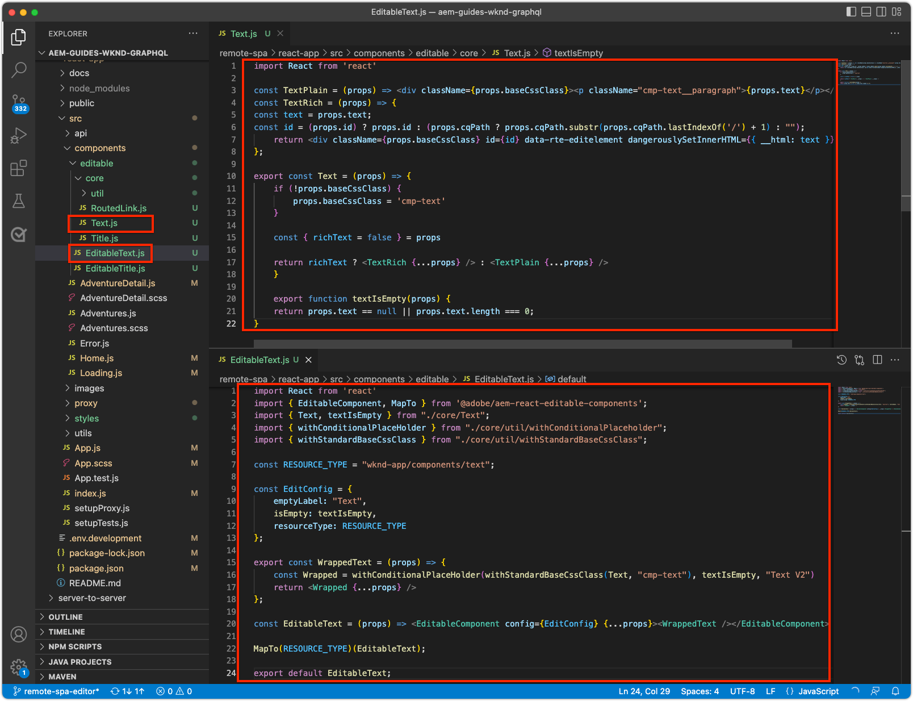

# Bewerkbare containercomponenten

[ Vaste componenten ](./spa-fixed-component.md) verstrekken wat flexibiliteit voor het ontwerpen SPA inhoud, nochtans is deze benadering stijf en vereist ontwikkelaars om de nauwkeurige samenstelling van de editable inhoud te bepalen. Om het creëren van uitzonderlijke ervaringen door auteurs te steunen, steunt SPA Redacteur het gebruik van containercomponenten in de SPA. Met containercomponenten kunnen auteurs toegestane componenten naar de container slepen en neerzetten, en ze ontwerpen, net als bij traditionele AEM Sites-ontwerpen!


In dit hoofdstuk, voegen wij een editable container aan de huismening toe die auteurs toestaat om rijke inhoudservaringen samen te stellen en te lay-out gebruikend de Bewerkbare componenten van het Reageren direct in de SPA.

## De WKND-app bijwerken

Een containercomponent toevoegen aan de weergave Home:

+ De component `ResponsiveGrid` van de component React Editable AEM importeren
+ Aangepaste bewerkbare reactiecomponenten (tekst en afbeelding) importeren en registreren voor gebruik in de component ResponsiveGrid

### De component ResponsiveGrid gebruiken

Een bewerkbaar gebied toevoegen aan de weergave Home:

1. Openen en bewerken `react-app/src/components/Home.js`
1. Importeer de `ResponsiveGrid` -component vanuit `@adobe/aem-react-editable-components` en voeg deze toe aan de `Home` -component.
1. De volgende kenmerken instellen voor de component `<ResponsiveGrid...>`
   + `pagePath = '/content/wknd-app/us/en/home'`
   + `itemPath = 'root/responsivegrid'`

   Hierdoor krijgt de component `ResponsiveGrid` de opdracht om de inhoud ervan op te halen uit de AEM bron:

   + `/content/wknd-app/us/en/home/jcr:content/root/responsivegrid`

   De `itemPath` verwijst naar het knooppunt `responsivegrid` dat is gedefinieerd in de AEM `Remote SPA Page` en wordt automatisch gemaakt op nieuwe AEM pagina&#39;s die zijn gemaakt op basis van de AEM `Remote SPA Page` .

   Werk `Home.js` bij om de component `<ResponsiveGrid...>` toe te voegen.

   ```javascript
   ...
   import { ResponsiveGrid } from '@adobe/aem-react-editable-components';
   ...
   
   function Home() {
       return (
           <div className="Home">
               <ResponsiveGrid
                   pagePath='/content/wknd-app/us/en/home' 
                   itemPath='root/responsivegrid'/>
   
               <EditableTitle
                   pagePath='/content/wknd-app/us/en/home' 
                   itemPath='title'/>
   
               <Adventures />
           </div>
       );
   }
   ```

Het bestand `Home.js` moet er als volgt uitzien:


## Bewerkbare componenten maken

Om het volledige effect van de flexibele auteurservaringscontainers in SPA Redacteur te krijgen. We hebben al een bewerkbare component Titel gemaakt, maar laten we er nog een paar maken waarmee auteurs bewerkbare componenten Tekst en Afbeelding kunnen gebruiken in de zojuist toegevoegde component ResponsiveGrid.

De nieuwe editable componenten van het Reageren van de Tekst en van het Beeld worden gecreeerd gebruikend het editable patroon van de componentendefinitie die in [ wordt uitgevoerd editable vaste componenten ](./spa-fixed-component.md).

### Bewerkbare tekstcomponent

1. Open het SPA project in uw winde
1. Een component React maken op `src/components/editable/core/Text.js`
1. De volgende code toevoegen aan `Text.js`

   ```javascript
   import React from 'react'
   
   const TextPlain = (props) => <div className={props.baseCssClass}><p className="cmp-text__paragraph">{props.text}</p></div>;
   const TextRich = (props) => {
   const text = props.text;
   const id = (props.id) ? props.id : (props.cqPath ? props.cqPath.substr(props.cqPath.lastIndexOf('/') + 1) : "");
       return <div className={props.baseCssClass} id={id} data-rte-editelement dangerouslySetInnerHTML={{ __html: text }} />
   };
   
   export const Text = (props) => {
       if (!props.baseCssClass) {
           props.baseCssClass = 'cmp-text'
       }
   
       const { richText = false } = props
   
       return richText ? <TextRich {...props} /> : <TextPlain {...props} />
       }
   
       export function textIsEmpty(props) {
       return props.text == null || props.text.length === 0;
   }
   ```

1. Een bewerkbare React-component maken op `src/components/editable/EditableText.js`
1. De volgende code toevoegen aan `EditableText.js`

   ```javascript
   import React from 'react'
   import { EditableComponent, MapTo } from '@adobe/aem-react-editable-components';
   import { Text, textIsEmpty } from "./core/Text";
   import { withConditionalPlaceHolder } from "./core/util/withConditionalPlaceholder";
   import { withStandardBaseCssClass } from "./core/util/withStandardBaseCssClass";
   
   const RESOURCE_TYPE = "wknd-app/components/text";
   
   const EditConfig = {
       emptyLabel: "Text",
       isEmpty: textIsEmpty,
       resourceType: RESOURCE_TYPE
   };
   
   export const WrappedText = (props) => {
       const Wrapped = withConditionalPlaceHolder(withStandardBaseCssClass(Text, "cmp-text"), textIsEmpty, "Text V2")
       return <Wrapped {...props} />
   };
   
   const EditableText = (props) => <EditableComponent config={EditConfig} {...props}><WrappedText /></EditableComponent>
   
   MapTo(RESOURCE_TYPE)(EditableText);
   
   export default EditableText;
   ```

De bewerkbare implementatie van de component Text moet er als volgt uitzien:



### Afbeeldingscomponent

1. Open het SPA project in uw winde
1. Een component React maken op `src/components/editable/core/Image.js`
1. De volgende code toevoegen aan `Image.js`

   ```javascript
   import React from 'react'
   import { RoutedLink } from "./RoutedLink";
   
   export const imageIsEmpty = (props) => (!props.src) || props.src.trim().length === 0
   
   const ImageInnerContents = (props) => {
   return (<>
       
       {
           !!(props.title) && <span className={props.baseCssClass + '__title'} itemProp="caption">{props.title}</span>
       }
       {
           props.displayPopupTitle && (!!props.title) && <meta itemProp="caption" content={props.title} />
       }
       </>);
   };
   
   const ImageContents = (props) => {
       if (props.link && props.link.trim().length > 0) {
           return (
           <RoutedLink className={props.baseCssClass + '__link'} isRouted={props.routed} to={props.link}>
               <ImageInnerContents {...props} />
           </RoutedLink>
           )
       }
       return <ImageInnerContents {...props} />
   };
   
   export const Image = (props) => {
       if (!props.baseCssClass) {
           props.baseCssClass = 'cmp-image'
       }
   
       const { isInEditor = false } = props;
       const cssClassName = (isInEditor) ? props.baseCssClass + ' cq-dd-image' : props.baseCssClass;
   
       return (
           <div className={cssClassName}>
               <ImageContents {...props} />
           </div>
       )
   };
   ```

1. Een bewerkbare React-component maken op `src/components/editable/EditableImage.js`
1. De volgende code toevoegen aan `EditableImage.js`

```javascript
import { EditableComponent, MapTo } from '@adobe/aem-react-editable-components';
import { Image, imageIsEmpty } from "./core/Image";
import React from 'react'

import { withConditionalPlaceHolder } from "./core/util/withConditionalPlaceholder";
import { withStandardBaseCssClass } from "./core/util/withStandardBaseCssClass";

const RESOURCE_TYPE = "wknd-app/components/image";

const EditConfig = {
    emptyLabel: "Image",
    isEmpty: imageIsEmpty,
    resourceType: RESOURCE_TYPE
};

const WrappedImage = (props) => {
    const Wrapped = withConditionalPlaceHolder(withStandardBaseCssClass(Image, "cmp-image"), imageIsEmpty, "Image V2");
    return <Wrapped {...props}/>
}

const EditableImage = (props) => <EditableComponent config={EditConfig} {...props}><WrappedImage /></EditableComponent>

MapTo(RESOURCE_TYPE)(EditableImage);

export default EditableImage;
```


1. Maak een SCSS-bestand `src/components/editable/EditableImage.scss` dat aangepaste stijlen voor de `EditableImage.scss` bevat. Deze stijlen zijn gericht op de CSS-klassen van de bewerkbare component React.
1. Voeg de volgende SCSS toe aan `EditableImage.scss`

   ```css
   .cmp-image__image {
       margin: 1rem 0;
       width: 100%;
       border: 0;
    }
   ```

1. Importeren `EditableImage.scss` in `EditableImage.js`

   ```javascript
   ...
   import './EditableImage.scss';
   ...
   ```

De bewerkbare implementatie van de component Image moet er als volgt uitzien:


### De bewerkbare componenten importeren

Naar de nieuwe `EditableText` - en `EditableImage` React-componenten wordt in de SPA verwezen en deze worden dynamisch geïnstantieerd op basis van de JSON die door AEM wordt geretourneerd. Om ervoor te zorgen dat deze componenten beschikbaar zijn voor de SPA, maakt u importinstructies voor deze componenten in `Home.js`

1. Open het SPA project in uw winde
1. Het bestand openen `src/Home.js`
1. Importeerinstructies toevoegen voor `AEMText` en `AEMImage`

   ```javascript
   ...
   // The following need to be imported, so that MapTo is run for the components
   import EditableText from './editable/EditableText';
   import EditableImage from './editable/EditableImage';
   ...
   ```

Het resultaat moet er als volgt uitzien:


Als deze invoer _niet_ wordt toegevoegd, wordt de `EditableText` en `EditableImage` code niet aangehaald door SPA, en zo, worden de componenten niet in kaart gebracht aan de verstrekte middeltypes.

## De container configureren in AEM

AEM containercomponenten gebruiken beleid om hun toegestane componenten te dicteren. Dit is een kritieke configuratie wanneer het gebruiken van SPA Redacteur, aangezien slechts AEM Componenten die SPA componententegenhangers in kaart hebben gebracht door de SPA renderbaar zijn. Zorg ervoor dat alleen de onderdelen waarvoor we SPA implementaties hebben geleverd, zijn toegestaan:

+ `EditableTitle` toegewezen aan `wknd-app/components/title`
+ `EditableText` toegewezen aan `wknd-app/components/text`
+ `EditableImage` toegewezen aan `wknd-app/components/image`

De reponsivegrid-container van de sjabloon Externe SPA pagina configureren:

1. Aanmelden bij AEM auteur
1. Navigeer aan __Hulpmiddelen > Algemeen > Malplaatjes > app WKND__
1. Bewerk __Rapport SPA Pagina__

   

1. Selecteer __Structuur__ op de wijzeschakelaar in het hoogste recht
1. Tik om de __Container van de Lay-out__ te selecteren
1. Tik het __pictogram van het Beleid__ in popup bar

   

1. Op het recht, onder __Toegestane Componenten__ lusje, breid __APP WKND uit - INHOUD__
1. Zorg ervoor dat alleen het volgende is geselecteerd:
   + Afbeelding
   + Tekst
   + Titel

   

1. Tik __Gereed__

## De container ontwerpen in AEM

Nadat de SPA is bijgewerkt om `<ResponsiveGrid...>` in te sluiten, de inhoud van drie bewerkbare React-componenten (`EditableTitle`, `EditableText` en `EditableImage`) inpakt en AEM wordt bijgewerkt met een overeenkomend sjabloonbeleid, kunnen we beginnen met het ontwerpen van inhoud in de containercomponent.

1. Aanmelden bij AEM auteur
1. Navigeer aan __Plaatsen > app WKND__
1. Tik __Huis__ en selecteer __uitgeven__ van de hoogste actiebar
   + De componentenvertoningen van de Tekst van de &quot;Wereld van Hello&quot;aangezien dit automatisch werd toegevoegd toen het produceren van het project van het archetype van het AEM Project
1. Selecteer __uitgeven__ van de wijze-selecteur in het hoogste recht van de Redacteur van de Pagina
1. Bepaal de plaats van de __Container van de Lay-out__ editable gebied onder de Titel
1. Open de __zijbar van de Redacteur van de Pagina__, en selecteer de __mening van Componenten__
1. Sleep de volgende componenten in de __Container van de Lay-out__
   + Afbeelding
   + Titel
1. Sleep de componenten om deze in de volgende volgorde te plaatsen:
   1. Titel
   1. Afbeelding
   1. Tekst
1. __Auteur__ de __3 component van de Titel {__
   1. Tik de component van de Titel, en tik het __moersleutelpictogram__ ____ de component van de Titel uitgeven
   1. Voeg de volgende tekst toe:
      + Titel: __Zomer komt, laten we het meesten van het maken!__
      + Type: __H1__
   1. Tik __Gereed__
1. __Auteur__ de __component van het Beeld__
   1. Sleep een afbeelding vanuit de zijbalk (na het schakelen naar de Assets-weergave) naar de afbeeldingscomponent
   1. Tik de component van het Beeld, en tik het __moersleutel__ pictogram om uit te geven
   1. Controle het __Beeld is decoratieve__ checkbox
   1. Tik __Gereed__
1. __Auteur__ de ____ component van de Tekst
   1. Bewerk de component van de Tekst door de component van de Tekst te tikken, en het tikken van het __moersleutelpictogram__
   1. Voeg de volgende tekst toe:
      + _Op dit ogenblik, kunt u 15% op alle avonturen van 1 week krijgen, en 20% korting op alle avonturen die 2 weken of langer zijn! Bij controle, voeg de campagnecode toe SUMMERISCOMING om uw kortingen te krijgen!_
   1. Tik __Gereed__

1. Uw componenten zijn nu ontworpen, maar worden verticaal gestapeld.

   

Gebruik AEM modus Lay-out om de grootte en lay-out van de componenten aan te passen.

1. Schakelaar aan __Wijze van de Lay-out__ gebruikend de wijze-selecteur in top-right
1. __vergroot__ de componenten van het Beeld en van de Tekst, dusdanig dat zij zij aan zij zijn
   + __de component van het 1} Beeld__ zou 8 kolommen breed __moeten zijn__
   + __de component van de Tekst__ __3 kolommen breed__ zou moeten zijn

   

1. __Voorproef__ uw veranderingen in AEM Redacteur van de Pagina
1. Vernieuw de WKND App die plaatselijk op [ http://localhost:3000 ](http://localhost:3000) loopt om de authored veranderingen te zien!

   


## Gefeliciteerd!

U hebt een containercomponent toegevoegd waarmee bewerkbare componenten door auteurs aan de WKND App kunnen worden toegevoegd! Nu weet u hoe:

+ De component AEM React Editable Component `ResponsiveGrid` in de SPA gebruiken
+ Bewerkbare React-componenten (tekst en afbeelding) maken en registreren voor gebruik in de SPA via de containercomponent
+ Vorm het Verre malplaatje van de Pagina van de SPA om de SPA-toegelaten componenten toe te staan
+ Bewerkbare componenten toevoegen aan de containercomponent
+ Auteur- en indelingscomponenten in SPA Editor

## Volgende stappen

De volgende stap gebruikt deze zelfde techniek om [ een editable component aan een route van de Details van het Avontuur ](./spa-dynamic-routes.md) in de SPA toe te voegen.
