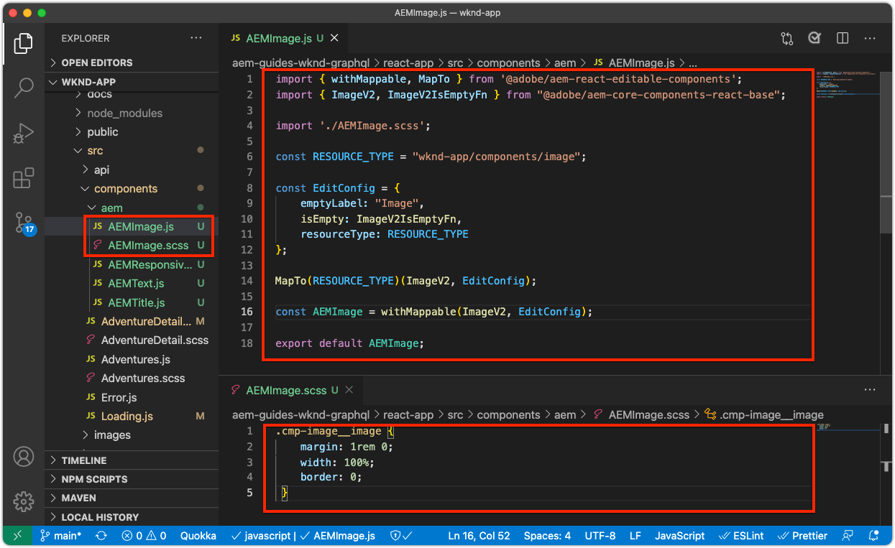

# Bewerkbare containercomponenten

[Vaste ](./spa-fixed-component.md) componenten bieden enige flexibiliteit voor het ontwerpen SPA inhoud, maar deze aanpak is star en vereist dat ontwikkelaars de exacte samenstelling van de bewerkbare inhoud definiëren. Om het creëren van uitzonderlijke ervaringen door auteurs te steunen, steunt SPA Redacteur het gebruik van containercomponenten in de SPA. Met containercomponenten kunnen auteurs toegestane componenten naar de container slepen en neerzetten, en ze ontwerpen, net als bij traditionele AEM Sites-ontwerpen!


In dit hoofdstuk, zullen wij een editable container aan de huismening toevoegen die auteurs toestaat om rijke inhoudservaring samen te stellen en te lay-out gebruikend AEM React de Componenten van de Kern in de SPA direct.

## De WKND-app bijwerken

Een containercomponent toevoegen aan de weergave Home:

+ De component ResponsiveGrid van de component React Editable AEM importeren
+ Importeren en registreren AEM React Core Components (Tekst en afbeelding) voor gebruik in de containercomponent

### Importeren in de container component ResponsiveGrid

Om een bewerkbaar gebied aan de mening van het Huis te plaatsen, moeten wij:

1. De component ResponsiveGrid importeren uit `@adobe/aem-react-editable-components`
1. Registreer het gebruikend `withMappable` zodat kunnen de ontwikkelaars het in de SPA plaatsen
1. Registreer u ook bij `MapTo`, zodat het opnieuw kan worden gebruikt in andere Container-componenten, zodat containers effectief kunnen worden genest.

Dit doet u als volgt:

1. Open het SPA project in uw winde
1. Een component React maken op `src/components/aem/AEMResponsiveGrid.js`
1. Voeg de volgende code toe aan `AEMResponsiveGrid.js`

   ```
   // Import the withMappable API provided bu the AEM SPA Editor JS SDK
   import { withMappable, MapTo } from '@adobe/aem-react-editable-components';
   
   // Import the base ResponsiveGrid component
   import { ResponsiveGrid } from "@adobe/aem-react-editable-components";
   
   // The sling:resourceType for which this Core Component is registered with in AEM
   const RESOURCE_TYPE = "wcm/foundation/components/responsivegrid";
   
   // Create an EditConfig to allow the AEM SPA Editor to properly render the component in the Editor's context
   const EditConfig = {
       emptyLabel: "Layout Container",  // The component placeholder in AEM SPA Editor
       isEmpty: function(props) { 
           return props.cqItemsOrder == null || props.cqItemsOrder.length === 0;
       },                              // The function to determine if this component has been authored
       resourceType: RESOURCE_TYPE     // The sling:resourceType this SPA component is mapped to
   };
   
   // MapTo allows the AEM SPA Editor JS SDK to dynamically render components added to SPA Editor Containers
   MapTo(RESOURCE_TYPE)(ResponsiveGrid, EditConfig);
   
   // withMappable allows the component to be hardcoded into the SPA; <AEMResponsiveGrid .../>
   const AEMResponsiveGrid = withMappable(ResponsiveGrid, EditConfig);
   
   export default AEMResponsiveGrid;
   ```

De code is gelijkaardig `AEMTitle.js` dat [de AEM component van de Titel van de Kern van het Bereik ](./spa-fixed-component.md) invoerde.


Het `AEMResponsiveGrid.js`-bestand moet er als volgt uitzien:


### De SPA AEMResponsiveGrid gebruiken

Nu AEM component ResponsiveGrid is geregistreerd in en beschikbaar voor gebruik binnen de SPA, kunnen we deze in de weergave Home plaatsen.

1. `react-app/src/App.js` openen en bewerken
1. Importeer de component `AEMResponsiveGrid` en plaats deze boven de component `<AEMTitle ...>`.
1. De volgende kenmerken instellen voor de `<AEMResponsiveGrid...>`-component
   + `pagePath = '/content/wknd-app/us/en/home'`
   + `itemPath = 'root/responsivegrid'`

   Dit instrueert deze `AEMResponsiveGrid` component om zijn inhoud van het AEM middel terug te winnen:

   + `/content/wknd-app/us/en/home/jcr:content/root/responsivegrid`

   De `itemPath` verwijst naar de `responsivegrid`-node die is gedefinieerd in de AEM `Remote SPA Page` en wordt automatisch gemaakt op nieuwe AEM pagina&#39;s die zijn gemaakt op basis van de `Remote SPA Page`-AEM sjabloon.

   `App.js` bijwerken om de `<AEMResponsiveGrid...>` component toe te voegen.

   ```
   ...
   import AEMResponsiveGrid from './components/aem/AEMResponsiveGrid';
   ...
   
   function Home() {
   return (
       <div className="Home">
           <AEMResponsiveGrid
               pagePath='/content/wknd-app/us/en/home' 
               itemPath='root/responsivegrid'/>
   
           <AEMTitle
               pagePath='/content/wknd-app/us/en/home' 
               itemPath='title'/>
           <Adventures />
       </div>
   );
   }
   ```

Het `Apps.js`-bestand moet er als volgt uitzien:


## Bewerkbare componenten maken

Om het volledige effect van de flexibele auteurservaringscontainers in SPA Redacteur te krijgen. We hebben al een bewerkbare component Titel gemaakt, maar laten we er nog een paar maken waarmee auteurs tekst en afbeelding kunnen gebruiken AEM WCM Core-componenten in de nieuw toegevoegde containercomponent.

### Tekstcomponent

1. Open het SPA project in uw winde
1. Een component React maken op `src/components/aem/AEMText.js`
1. Voeg de volgende code toe aan `AEMText.js`

   ```
   import { withMappable, MapTo } from '@adobe/aem-react-editable-components';
   import { TextV2, TextV2IsEmptyFn } from "@adobe/aem-core-components-react-base";
   
   const RESOURCE_TYPE = "wknd-app/components/text";
   
   const EditConfig = {    
       emptyLabel: "Text",
       isEmpty: TextV2IsEmptyFn,
       resourceType: RESOURCE_TYPE
   };
   
   MapTo(RESOURCE_TYPE)(TextV2, EditConfig);
   
   const AEMText = withMappable(TextV2, EditConfig);
   
   export default AEMText;
   ```

Het `AEMText.js`-bestand moet er als volgt uitzien:


### Afbeeldingscomponent

1. Open het SPA project in uw winde
1. Een component React maken op `src/components/aem/AEMImage.js`
1. Voeg de volgende code toe aan `AEMImage.js`

   ```
   import { withMappable, MapTo } from '@adobe/aem-react-editable-components';
   import { ImageV2, ImageV2IsEmptyFn } from "@adobe/aem-core-components-react-base";
   
   const RESOURCE_TYPE = "wknd-app/components/image";
   
   const EditConfig = {    
       emptyLabel: "Image",
       isEmpty: ImageV2IsEmptyFn,
       resourceType: RESOURCE_TYPE
   };
   
   MapTo(RESOURCE_TYPE)(ImageV2, EditConfig);
   
   const AEMImage = withMappable(ImageV2, EditConfig);
   
   export default AEMImage;
   ```

1. Maak een SCSS-bestand `src/components/aem/AEMImage.scss` dat aangepaste stijlen voor `AEMImage.scss` biedt. Deze stijlen zijn gericht op de CSS-klassen van de AEM React Core Component BEM-notation.
1. Voeg volgende SCSS aan `AEMImage.scss` toe

   ```
   .cmp-image__image {
       margin: 1rem 0;
       width: 100%;
       border: 0;
    }
   ```

1. `AEMImage.scss` importeren in `AEMImage.js`

   ```
   ...
   import './AEMImage.scss';
   ...
   ```

De `AEMImage.js` en `AEMImage.scss` zouden als moeten kijken:



### De bewerkbare componenten importeren

De nieuwe `AEMText` en `AEMImage` SPA componenten worden van verwijzingen voorzien in de SPA, en dynamisch geconcretiseerd gebaseerd op JSON die door AEM is teruggekeerd. Om ervoor te zorgen dat deze componenten beschikbaar zijn voor de SPA, maakt u importinstructies voor deze componenten in `App.js`

1. Open het SPA project in uw winde
1. Het bestand `src/App.js` openen
1. Importeerinstructies toevoegen voor `AEMText` en `AEMImage`

   ```
   ...
   import AEMText from './components/aem/AEMText';
   import AEMImage from './components/aem/AEMImage';
   ...
   ```


Het resultaat moet er als volgt uitzien:


Als deze invoer _not_ toegevoegd is, zullen `AEMText` en `AEMImage` code niet door SPA worden aangehaald, en zo, worden de componenten niet geregistreerd tegen de verstrekte middeltypes.

## De container configureren in AEM

AEM containercomponenten gebruiken beleid om hun toegestane componenten te dicteren. Dit is een kritieke configuratie wanneer het gebruiken van SPA Redacteur, aangezien slechts AEM de Componenten van de Kern WCM die SPA componententegenhangers in kaart hebben gebracht door de SPA renderbaar zijn. Zorg ervoor dat alleen de onderdelen waarvoor we SPA implementaties hebben geleverd, zijn toegestaan:

+ `AEMTitle` toegewezen aan  `wknd-app/components/title`
+ `AEMText` toegewezen aan  `wknd-app/components/text`
+ `AEMImage` toegewezen aan  `wknd-app/components/image`

De reponsivegrid-container van de sjabloon Externe SPA pagina configureren:

1. Aanmelden bij AEM-auteur
1. Navigeer naar __Gereedschappen > Algemeen > Sjablonen > WKND-app__
1. __SPA pagina rapporteren__

   

1. Selecteer __Structuur__ in de modusschakelaar in het hoogste recht
1. Tik om de __Indelingscontainer__ te selecteren
1. Tik op het pictogram __Beleid__ in de pop-upbalk

   

1. Rechts, onder het tabblad __Toegestane componenten__, vouwt u __WKND APP - CONTENT__ uit
1. Zorg ervoor dat alleen het volgende is geselecteerd:
   + Afbeelding
   + Tekst
   + Titel

   

1. Tik __Gereed__

## De container ontwerpen in AEM

Met SPA bijgewerkt om `<AEMResponsiveGrid...>` in te bedden, verpakt voor drie AEM componenten van de Kern van de React (`AEMTitle`, `AEMText`, en `AEMImage`), en AEM wordt bijgewerkt met een passend beleid van het Malplaatje, kunnen wij beginnen inhoud in de containercomponent te ontwerpen.

1. Aanmelden bij AEM-auteur
1. Navigeer naar __Sites > WKND App__
1. Tik __Home__ en selecteer __Bewerken__ in de bovenste actiebalk
   + De componentenvertoningen van de Tekst van de &quot;Wereld van Hello&quot;aangezien dit automatisch werd toegevoegd toen het produceren van het project van het archetype van het AEM Project
1. Selecteer __Bewerken__ in de modus-kiezer rechtsboven in de Pagina-editor
1. Zoek het bewerkbare gebied __Indelingscontainer__ onder Titel
1. Open de zijbalk __Pagina-editor__ en selecteer de __Componentweergave__
1. Sleep de volgende componenten naar de __container voor lay-out__
   + Afbeelding
   + Titel
1. Sleep de componenten om deze in de volgende volgorde te plaatsen:
   1. Titel
   1. Afbeelding
   1. Tekst
1. ____ Authorthe  ____ Titlecomponent
   1. Tik op de component Title en tik op het pictogram __moersleutel__ om de component Title te __bewerken__
   1. Voeg de volgende tekst toe:
      + Titel: __De zomer komt eraan!__
      + Type: __H1__
   1. Tik __Gereed__
1. ____ Authorthe  ____ ImageComponent
   1. Sleep een afbeelding vanuit de zijbalk (na het schakelen naar de weergave Elementen) naar de component Afbeelding
   1. Tik op de component Afbeelding en tik op het pictogram __moersleutel__ om te bewerken
   1. Schakel het selectievakje __Afbeelding is decoratief__ in
   1. Tik __Gereed__
1. ____ Authorthe  ____ TextComponent
   1. Bewerk de component Text door te tikken op de component Text en te tikken op het pictogram __wimpel__
   1. Voeg de volgende tekst toe:
      + _Op dit moment kunt u 15% krijgen voor alle avonturen van één week, en 20% voor alle avonturen die 2 weken of langer zijn! Bij controle, voeg enkel de campagnecode SUMMERISCOMING toe om uw kortingen te krijgen!_
   1. Tik __Gereed__

1. Uw componenten zijn nu ontworpen, maar worden verticaal gestapeld.

   

   Gebruik AEM lay-outmodus om de grootte en lay-out van de componenten aan te passen.

1. Schakel over naar __Lay-outmodus__ met de moduskiezer rechtsboven
1. __De__ componenten Afbeelding en Tekst vergroten/verkleinen, zodat deze naast elkaar staan
   + __De__ imagecomponent moet  __8 kolommen breed zijn__
   + ____ TextComponent moet  __3 kolommen breed zijn__

   

1. __Wijzigingen__ voorvertonen in AEM Pagina-editor
1. Vernieuw de WKND App die plaatselijk op [http://localhost:3000](http://localhost:3000) loopt om de authored veranderingen te zien!

   


## Gefeliciteerd!

U hebt een containercomponent toegevoegd waarmee bewerkbare componenten door auteurs aan de WKND App kunnen worden toegevoegd! Nu weet u hoe:

+ De component ResponsiveGrid van de component React Editable AEM gebruiken in de SPA
+ Registreer AEM React Core Components (Tekst en afbeelding) voor gebruik in de SPA via de containercomponent
+ Vorm het Verre malplaatje van de SPA van de Pagina om de SPA toegelaten Componenten van de Kern toe te staan
+ Bewerkbare componenten toevoegen aan de containercomponent
+ Auteur- en indelingscomponenten in SPA Editor

## Volgende stappen

De volgende stap zal deze zelfde techniek gebruiken om een editable component aan een route ](./spa-dynamic-routes.md) van de Details van het Avontuur in de SPA toe te voegen.[
