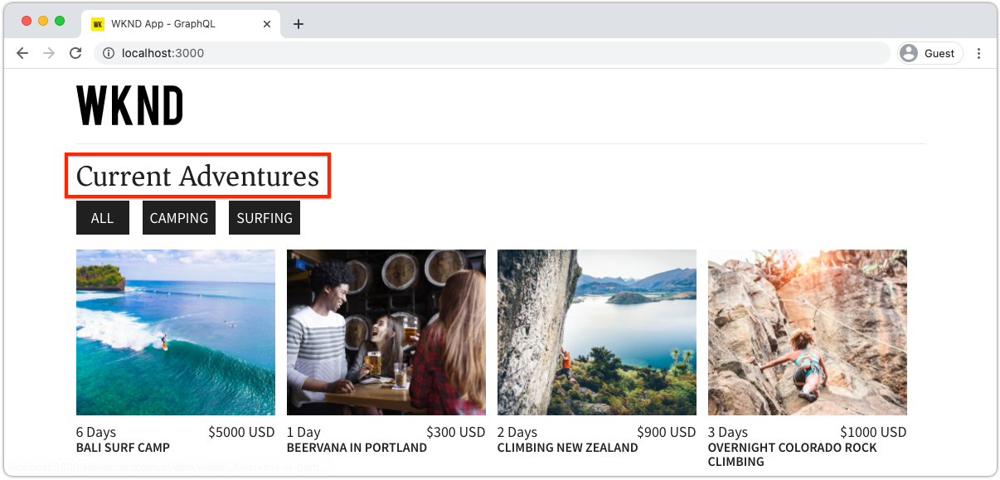

# Bewerkbare vaste componenten

Bewerkbare React-componenten kunnen &#39;vast&#39; zijn of hard gecodeerd in de SPA weergaven. Op deze manier kunnen ontwikkelaars SPA met de Editor compatibele componenten in de SPA weergaven plaatsen en kunnen gebruikers de inhoud van de componenten schrijven in AEM SPA Editor.



In dit hoofdstuk vervangen we de titel &quot;Huidige avonturen&quot; van de weergave Home. Dit is een harde tekst in `Home.js` met een vaste, maar bewerkbare component Titel. Vaste componenten garanderen de plaatsing van de titel, maar staan ook toe dat de tekst van de titel wordt geschreven en dat de titel buiten de ontwikkelingscyclus wordt gewijzigd.

## De WKND-app bijwerken

Als u een __Vast__ aan de mening van het Huis:

+ Creeer een douane editable component van de Titel en registreer het aan het middeltype van de Titel van het project
+ Plaats de bewerkbare component Titel in de SPA Home-weergave

### Een bewerkbare component React Title maken

Vervang de tekst met harde codes in de SPA Home `<h2>Current Adventures</h2>` met een aangepaste bewerkbare component Title. Voordat de component Titel kan worden gebruikt, moeten we:

1. Een aangepaste component Title React maken
1. De aangepaste component Title decorteren met methoden uit `@adobe/aem-react-editable-components` om het bewerkbaar te maken.
1. De bewerkbare titelcomponent registreren met `MapTo` zodat het kan worden gebruikt in [containercomponent later](./spa-container-component.md).

Dit doet u als volgt:

1. Externe SPA openen bij `~/Code/aem-guides-wknd-graphql/remote-spa-tutorial/react-app` in uw IDE
1. Een component React maken op `react-app/src/components/editable/core/Title.js`
1. De volgende code toevoegen aan `Title.js`.

   ```javascript
   import React from 'react'
   import { RoutedLink } from "./RoutedLink";
   
   const TitleLink = (props) => {
   return (
       <RoutedLink className={props.baseCssClass + (props.nested ? '-' : '__') + 'link'} 
           isRouted={props.routed} 
           to={props.linkURL}>
       {props.text}
       </RoutedLink>
   );
   };
   
   const TitleV2Contents = (props) => {
       if (!props.linkDisabled) {
           return <TitleLink {...props} />
       }
   
       return <>{props.text}</>
   };
   
   export const Title = (props) => {
       if (!props.baseCssClass) {
           props.baseCssClass = 'cmp-title'
       }
   
       const elementType = (!!props.type) ? props.type.toString() : 'h3';
       return (<div className={props.baseCssClass}>
           {
               React.createElement(elementType, {
                       className: props.baseCssClass + (props.nested ? '-' : '__') + 'text',
                   },
                   <TitleV2Contents {...props} />
               )
           }
   
           </div>)
   }
   
   export const titleIsEmpty = (props) => props.text == null || props.text.trim().length === 0
   ```

   Deze React-component kan nog niet worden bewerkt met AEM SPA Editor. Deze basiscomponent wordt in de volgende stap bewerkbaar gemaakt.

   Lees de opmerkingen van de code voor de implementatiedetails.

1. Een component React maken op `react-app/src/components/editable/EditableTitle.js`
1. De volgende code toevoegen aan `EditableTitle.js`.

   ```javascript
   // Import the withMappable API provided bu the AEM SPA Editor JS SDK
   import { EditableComponent, MapTo } from '@adobe/aem-react-editable-components';
   import React from 'react'
   
   // Import the AEM the Title component implementation and it's Empty Function
   import { Title, titleIsEmpty } from "./core/Title";
   import { withConditionalPlaceHolder } from "./core/util/withConditionalPlaceholder";
   import { withStandardBaseCssClass } from "./core/util/withStandardBaseCssClass";
   
   // The sling:resourceType of the AEM component used to collected and serialize the data this React component displays
   const RESOURCE_TYPE = "wknd-app/components/title";
   
   // Create an EditConfig to allow the AEM SPA Editor to properly render the component in the Editor's context
   const EditConfig = {
       emptyLabel: "Title",        // The component placeholder in AEM SPA Editor
       isEmpty: titleIsEmpty,      // The function to determine if this component has been authored
       resourceType: RESOURCE_TYPE // The sling:resourceType this component is mapped to
   };
   
   export const WrappedTitle = (props) => {
       const Wrapped = withConditionalPlaceHolder(withStandardBaseCssClass(Title, "cmp-title"), titleIsEmpty, "TitleV2")
       return <Wrapped {...props} />
   }
   
   // EditableComponent makes the component editable by the AEM editor, either rendered statically or in a container
   const EditableTitle = (props) => <EditableComponent config={EditConfig} {...props}><WrappedTitle /></EditableComponent>
   
   // MapTo allows the AEM SPA Editor JS SDK to dynamically render components added to SPA Editor Containers
   MapTo(RESOURCE_TYPE)(EditableTitle);
   
   export default EditableTitle;
   ```

   Dit `EditableTitle` React component verpakt `Title` Reageer de component, wikkelen en decoreren zodat deze in AEM SPA Editor kan worden bewerkt.

### De component React EditableTitle gebruiken

Nu de component EditableTitle React is geregistreerd in en beschikbaar is voor gebruik in de React-app, vervangt u de tekst van de hard-gecodeerde titel in de weergave Home.

1. Bewerken `react-app/src/components/Home.js`
1. In de `Home()` onderaan, importeren `EditableTitle` en vervang de hard-gecodeerde titel door de nieuwe `AEMTitle` component:

   ```javascript
   ...
   import EditableTitle from './editable/EditableTitle';
   ...
   function Home() {
       return (
           <div className="Home">
   
           <EditableTitle
               pagePath='/content/wknd-app/us/en/home'
               itemPath='root/title'/>
   
               <Adventures />
           </div>
       );
   }
   ```

De `Home.js` bestand moet er als volgt uitzien:


## De component Titel in AEM maken

1. Aanmelden bij AEM auteur
1. Navigeren naar __Sites > WKND App__
1. Tikken __Home__ en selecteert u __Bewerken__ van de bovenste actiebalk
1. Selecteren __Bewerken__ in de bewerkingsmoduskiezer rechtsboven in de Pagina-editor
1. Houd de muisaanwijzer boven de standaardtiteltekst onder het WKND-logo en boven de lijst met avonturen totdat de omtrek voor blauwe bewerking wordt weergegeven
1. Tik om de actiebalk van de component zichtbaar te maken en tik vervolgens op de __moersleutel__  bewerken

   

1. Auteur van de component Title:
   + Titel: __WKND Adventures__
   + Type/grootte: __H2__

     

1. Tikken __Gereed__ opslaan
1. Wijzigingen voorvertonen in AEM SPA Editor
1. De WKND-app vernieuwen die lokaal wordt uitgevoerd [http://localhost:3000](http://localhost:3000) en zie de veranderingen van de geschreven titel onmiddellijk weerspiegeld.

   

## Gefeliciteerd!

U hebt een vaste, bewerkbare component toegevoegd aan de WKND-app! Nu weet u hoe:

+ Een vaste, maar bewerkbare component voor de SPA maken
+ Auteur van de vaste component in AEM
+ Zie de geschreven inhoud in de Verre SPA

## Volgende stappen

De volgende stappen zijn: [een AEM component ResponsiveGrid toevoegen](./spa-container-component.md) aan de SPA die auteur toestaat om en editable componenten aan de SPA toe te voegen!
