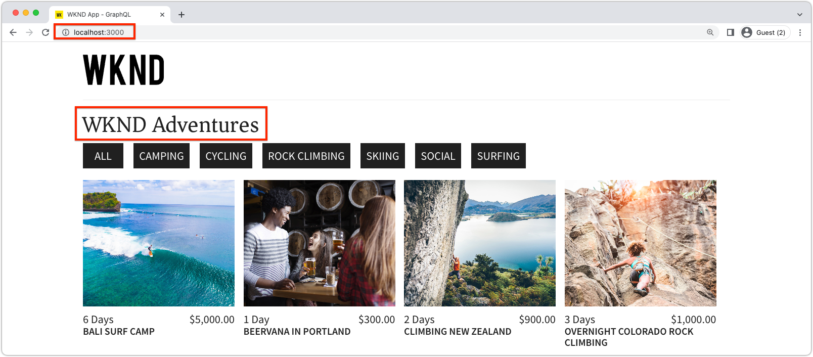

# Bewerkbare vaste componenten

{{spa-editor-deprecation}}

Bewerkbare React componenten kunnen &quot;vast&quot;zijn, of hard-gecodeerd in de meningen van het KUUROORD. Dit staat ontwikkelaars toe om SPA Editor-compatibele componenten in de meningen van het KUUROORD te plaatsen, en gebruikers toe te staan om de inhoud van de componenten&#39; in de Redacteur van AEM te schrijven SPA.


In dit hoofdstuk vervangen we de titel &#39;Huidige avonturen&#39; van de weergave Home. Dit is een vaste, maar bewerkbare titel in `Home.js` . Vaste componenten garanderen de plaatsing van de titel, maar staan ook toe dat de tekst van de titel wordt geschreven en dat de titel buiten de ontwikkelingscyclus wordt gewijzigd.

## De WKND-app bijwerken

Om a __Vaste__ component aan de mening van het Huis toe te voegen:

* Creeer een douane editable component van de Titel en registreer het aan het middeltype van de Titel van het project
* Plaats de editable component van de Titel op de mening van het Huis van SPA

### Een bewerkbare component React Title maken

In de mening van het Huis van het KUUROORD, vervang de hard-gecodeerde tekst `<h2>Current Adventures</h2>` met een douane editable component van de Titel. Voordat de component Titel kan worden gebruikt, moeten we:

1. Een aangepaste component Title React maken
1. Decoreer de component van de Titel van de douane gebruikend methodes van `@adobe/aem-react-editable-components` om het editable te maken.
1. Registreer de editable component van de Titel met `MapTo` zodat kan het in [&#x200B; containercomponent later &#x200B;](./spa-container-component.md) worden gebruikt.

Dit doet u als volgt:

1. Open Verre project van het KUUROORD bij `~/Code/aem-guides-wknd-graphql/remote-spa-tutorial/react-app` in uw winde
1. Een component React maken op `react-app/src/components/editable/core/Title.js`
1. Voeg de volgende code toe aan `Title.js` .

   ```javascript
   import React from 'react'
   import { RoutedLink } from "./RoutedLink";
   
   const TitleLink = (props) => {
   return (
       <RoutedLink className={props.baseCssClass + (props.nested ? '-' : '__') + 'link'} 
           isRouted={props.routed} 
           to={props.linkURL}>
       {props.text}
       </RoutedLink>
   );
   };
   
   const TitleV2Contents = (props) => {
       if (!props.linkDisabled) {
           return <TitleLink {...props} />
       }
   
       return <>{props.text}</>
   };
   
   export const Title = (props) => {
       if (!props.baseCssClass) {
           props.baseCssClass = 'cmp-title'
       }
   
       const elementType = (!!props.type) ? props.type.toString() : 'h3';
       return (<div className={props.baseCssClass}>
           {
               React.createElement(elementType, {
                       className: props.baseCssClass + (props.nested ? '-' : '__') + 'text',
                   },
                   <TitleV2Contents {...props} />
               )
           }
   
           </div>)
   }
   
   export const titleIsEmpty = (props) => props.text == null || props.text.trim().length === 0
   ```

   Merk op dat deze React component nog niet editable gebruikend de Redacteur van AEM SPA is. Deze basiscomponent wordt in de volgende stap bewerkbaar gemaakt.

   Lees de opmerkingen van de code voor de implementatiedetails.

1. Een component React maken op `react-app/src/components/editable/EditableTitle.js`
1. Voeg de volgende code toe aan `EditableTitle.js` .

   ```javascript
   // Import the withMappable API provided bu the AEM SPA Editor JS SDK
   import { EditableComponent, MapTo } from '@adobe/aem-react-editable-components';
   import React from 'react'
   
   // Import the AEM the Title component implementation and it's Empty Function
   import { Title, titleIsEmpty } from "./core/Title";
   import { withConditionalPlaceHolder } from "./core/util/withConditionalPlaceholder";
   import { withStandardBaseCssClass } from "./core/util/withStandardBaseCssClass";
   
   // The sling:resourceType of the AEM component used to collected and serialize the data this React component displays
   const RESOURCE_TYPE = "wknd-app/components/title";
   
   // Create an EditConfig to allow the AEM SPA Editor to properly render the component in the Editor's context
   const EditConfig = {
       emptyLabel: "Title",        // The component placeholder in AEM SPA Editor
       isEmpty: titleIsEmpty,      // The function to determine if this component has been authored
       resourceType: RESOURCE_TYPE // The sling:resourceType this component is mapped to
   };
   
   export const WrappedTitle = (props) => {
       const Wrapped = withConditionalPlaceHolder(withStandardBaseCssClass(Title, "cmp-title"), titleIsEmpty, "TitleV2")
       return <Wrapped {...props} />
   }
   
   // EditableComponent makes the component editable by the AEM editor, either rendered statically or in a container
   const EditableTitle = (props) => <EditableComponent config={EditConfig} {...props}><WrappedTitle /></EditableComponent>
   
   // MapTo allows the AEM SPA Editor JS SDK to dynamically render components added to SPA Editor Containers
   MapTo(RESOURCE_TYPE)(EditableTitle);
   
   export default EditableTitle;
   ```

   Met deze component React van `EditableTitle` wordt de component React van `Title` verpakt, verpakt en decoreert u deze om te kunnen worden bewerkt in de AEM SPA Editor.

### De component React EditableTitle gebruiken

Nu de component EditableTitle React is geregistreerd in en beschikbaar is voor gebruik in de React-app, vervangt u de tekst van de hard-gecodeerde titel in de weergave Home.

1. Bewerken `react-app/src/components/Home.js`
1. Importeer `EditableTitle` in de `Home()` onderaan en vervang de hard-gecodeerde titel door de nieuwe `AEMTitle` -component:

   ```javascript
   ...
   import EditableTitle from './editable/EditableTitle';
   ...
   function Home() {
       return (
           <div className="Home">
   
           <EditableTitle
               pagePath='/content/wknd-app/us/en/home'
               itemPath='root/title'/>
   
               <Adventures />
           </div>
       );
   }
   ```

Het bestand `Home.js` moet er als volgt uitzien:


## De component Title in AEM ontwerpen

1. Aanmelden bij AEM-auteur
1. Navigeer aan __Plaatsen > app WKND__
1. Tik __Huis__ en selecteer __uitgeven__ van de hoogste actiebar
1. Selecteer __uitgeven__ van uitgeeft wijzesselecteur in het hoogste recht van de Redacteur van de Pagina
1. Houd de muisaanwijzer boven de standaardtiteltekst onder het WKND-logo en boven de lijst met avonturen totdat de omtrek voor blauwe bewerking wordt weergegeven
1. Tik om de actiebar van de component bloot te stellen, en dan de __moersleutel__ te ontsteken om uit te geven

   

1. Auteur van de component Title:
   1. Titel: __WKND avonturen__
   1. Type/Grootte: __H2__

      

1. Tik __Gedaan__ om te bewaren
1. Voorvertoning van uw wijzigingen weergeven in de AEM SPA Editor
1. Vernieuw de WKND App die plaatselijk op [&#x200B; http://localhost:3000 &#x200B;](http://localhost:3000) loopt en zie de authored onmiddellijk weerspiegelde titelveranderingen.

   

## Gefeliciteerd!

U hebt een vaste, bewerkbare component toegevoegd aan de WKND-app! Nu weet u hoe:

* Creeerde een vaste, maar editable, component aan SPA
* Auteur van de vaste component in AEM
* Zie de authored inhoud in het Verre KUUROORD

## Volgende stappen

De volgende stappen moeten [&#x200B; een de containercomponent van AEM ResponsiveGrid &#x200B;](./spa-container-component.md) aan het KUUROORD toevoegen die auteur toestaat om en editable componenten aan het KUUROORD toe te voegen!
