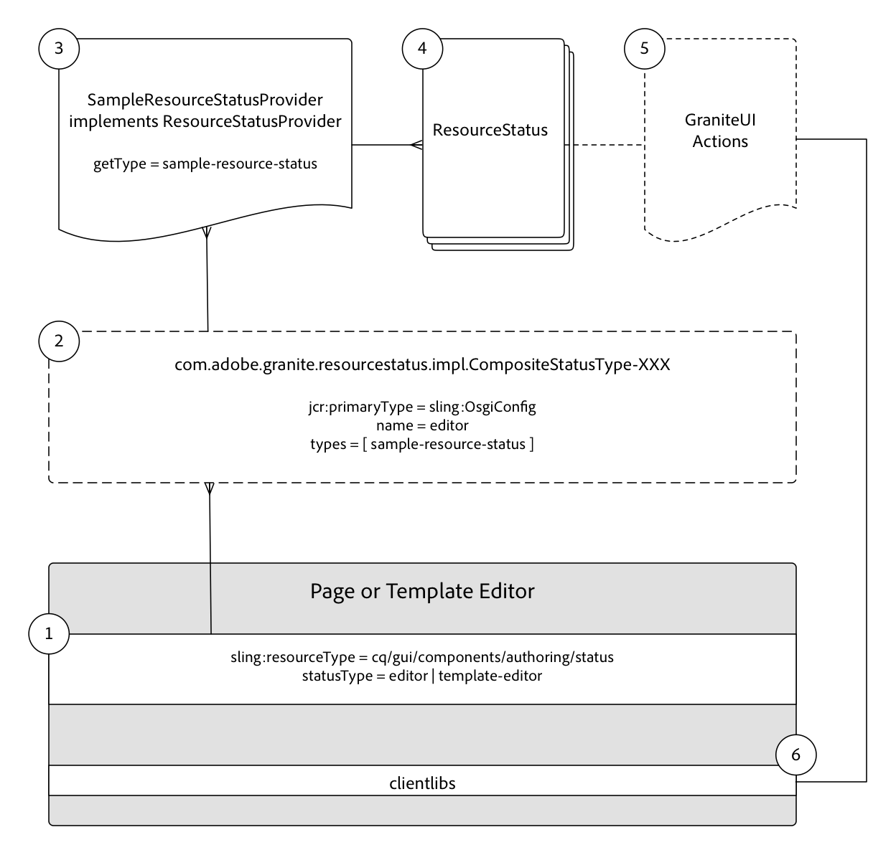

# Bronstatussen ontwikkelen {#developing-resource-statuses-in-aem-sites}

De status API&#39;s van de Adobe Experience Manager Resource Status, zijn een pluggable raamwerk voor het toegankelijk maken van statusberichten in AEM verschillende redacteursWeb UIs.

## Overzicht {#overview}

Het kader van de Status van het Middel voor Editors verstrekt server-kant en cliënt-kant APIs voor het tonen van en het in wisselwerking staan met redacteurstatussen, op een standaard en eenvormige manier.

De statusbalken van de editor zijn standaard beschikbaar in de editors Pagina, Ervaar fragment en Sjabloon van AEM.

Voorbeelden van gebruiksgevallen voor aangepaste bronnenstatusproviders zijn:

* Auteurs op de hoogte stellen wanneer een pagina binnen 2 uur na de geplande activering valt
* Auteurs ervan op de hoogte stellen dat een pagina in de afgelopen 15 minuten is geactiveerd
* Auteurs ervan in kennis stellen dat een pagina in de laatste 5 minuten is bewerkt en door wie


## Framework {#resource-status-provider-framework}

Wanneer het ontwikkelen van de Statussen van het douaneMiddel, wordt het ontwikkelingswerk samengesteld uit:

1. De implementatie ResourceStatusProvider, die voor het bepalen of een status wordt vereist, en de basisinformatie over de status verantwoordelijk is: titel, bericht, prioriteit, variant, pictogram en beschikbare acties.
2. Alternatief, GraniteUI JavaScript die de functionaliteit van om het even welke beschikbare acties uitvoert.

   

3. De statusbron die als onderdeel van de redacteurs van de Pagina, het Fragment van de Ervaring en van het Malplaatje wordt verstrekt wordt gegeven een type via het bezit &quot;[!DNL statusType]&quot;van middelen.

   * Pagina-editor: `editor`
   * Experience Fragment Editor: `editor`
   * Sjablooneditor: `template-editor`

4. De `statusType` van het statusmiddel wordt aangepast aan geregistreerd `CompositeStatusType` OSGi gevormd `name` bezit.

   Voor alle overeenkomsten, worden de `CompositeStatusType's` types verzameld, en gebruikt om `ResourceStatusProvider` implementaties te verzamelen die dit type, via `ResourceStatusProvider.getType()` hebben.

5. De overeenkomst `ResourceStatusProvider` wordt overgegaan `resource` in de redacteur, en bepaalt als `resource` status heeft om worden getoond. Als de status nodig is, is deze implementatie verantwoordelijk voor de bouw 0 of vele `ResourceStatuses` om terug te keren, elk die een status aan vertoning vertegenwoordigen.

   Doorgaans retourneert een `ResourceStatusProvider` 0 of 1 `ResourceStatus` per `resource`.

6. ResourceStatus is een interface die door de klant kan worden uitgevoerd, of nuttig `com.day.cq.wcm.commons.status.EditorResourceStatus.Builder` kan worden gebruikt om een status te construeren. Een status bestaat uit:

   * Titel
   * Bericht
   * Pictogram
   * Variant
   * Prioriteit
   * Acties
   * Data

7. Als `Actions` optioneel voor het `ResourceStatus` voorwerp wordt verstrekt, wordt de ondersteunende cliëntlibs vereist om functionaliteit aan de actieverbindingen in de statusbar te binden.

   ```js
   (function(jQuery, document) {
       'use strict';
   
       $(document).on('click', '.editor-StatusBar-action[data-status-action-id="do-something"]', function () {
           // Do something on the click of the resource status action
   
       });
   })(jQuery, document);
   ```

8. Elke ondersteunende JavaScript of CSS ter ondersteuning van de acties moet via de respectievelijke clientbibliotheken van elke editor worden uitgebreid om ervoor te zorgen dat de front-end code beschikbaar is in de editor.

   * Categorie Paginaeditor: `cq.authoring.editor.sites.page`
   * Categorie Experience Fragment Editor: `cq.authoring.editor.sites.page`
   * Categorie Sjablooneditor: `cq.authoring.editor.sites.template`

## De code {#view-the-code} weergeven

[Zie code op GitHub](https://github.com/Adobe-Consulting-Services/acs-aem-samples/tree/master/bundle/src/main/java/com/adobe/acs/samples/resourcestatus/impl/SampleEditorResourceStatusProvider.java)

## Aanvullende bronnen {#additional-resources}

* [`com.adobe.granite.resourcestatus` JavaDocs](https://helpx.adobe.com/experience-manager/6-5/sites/developing/using/reference-materials/javadoc/com/adobe/granite/resourcestatus/package-summary.html)
* [`com.day.cq.wcm.commons.status.EditorResourceStatus` JavaDocs](https://helpx.adobe.com/experience-manager/6-5/sites/developing/using/reference-materials/javadoc/com/day/cq/wcm/commons/status/EditorResourceStatus.html)
