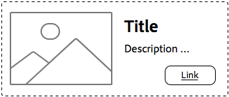

# Best practices voor stijlsystemen{#understanding-style-organization-with-the-aem-style-system}

>[!NOTE]
>
>Gelieve te herzien de inhoud bij [&#x200B; Begrip hoe te voor het Systeem van de Stijl &#x200B;](style-system-technical-video-understand.md) te coderen, om een inzicht in de BEM-als overeenkomsten te verzekeren die door het Systeem van de Stijl van AEM worden gebruikt.

Er zijn twee hoofdstijlen of stijlen die voor het Systeem van de Stijl van AEM worden uitgevoerd:

* **de stijlen van de Lay-out**
* **de stijlen van de Vertoning**

**de stijlen van de Lay-out** beïnvloeden vele elementen van een Component om een goed te bepalen en identificeerbare vertoning (ontwerp en lay-out) van de component tot stand te brengen, die vaak aan een specifiek herbruikbaar merkconcept richt. Een teascomponent kan bijvoorbeeld worden weergegeven in de traditionele, op kaarten gebaseerde lay-out, in een horizontale promotiestijl of als een hoofdlay-out die tekst op een afbeelding bedekt.

**de stijlen van de Vertoning** worden gebruikt om minder belangrijke variaties aan de stijlen van de Lay-out te beïnvloeden, nochtans, veranderen zij niet de fundamentele aard of de intentie van de stijl van de Lay-out. Een hoofdopmaakstijl kan bijvoorbeeld weergavestijlen hebben die het kleurenschema wijzigen van het kleurenschema voor het primaire merk in het kleurenschema voor het secundaire merk.

## Best practices voor organisatie {#style-organization-best-practices}

Wanneer u de stijlnamen definieert die beschikbaar zijn voor AEM-auteurs, kunt u het beste:

* Stijlen benoemen met behulp van een woordenlijst die de auteurs begrijpen
* Het aantal stijlopties minimaliseren
* Alleen stijlopties en combinaties beschikbaar maken die zijn toegestaan door merkstandaarden
* Alleen stijlcombinaties met een effect beschikbaar maken
   * Als ineffectieve combinaties worden blootgesteld, moet u ervoor zorgen dat deze ten minste geen slecht effect hebben

Naarmate het aantal mogelijke stijlcombinaties waarover AEM-auteurs beschikken toeneemt, zijn er meer permutaties die QA&#39;d moeten zijn en moeten worden gevalideerd volgens de merkstandaarden. Te veel opties kunnen auteurs ook verwarren, omdat het onduidelijk kan worden welke optie of combinatie nodig is om het gewenste effect te verkrijgen.

### Stijlnamen versus CSS-klassen {#style-names-vs-css-classes}

Stijlnamen, of de opties die aan AEM-auteurs worden gepresenteerd, en de namen van de implementerende CSS-klassen worden in AEM ontkoppeld.

Hiermee kunnen Stijlopties worden gelabeld in een woordenlijst die duidelijk is en door de AEM-auteurs wordt begrepen, maar CSS-ontwikkelaars kunnen de CSS-klassen op een semantische manier een naam geven die toekomstbestendig is. Bijvoorbeeld:

Een component moet de opties hebben om met het merk **worden gekleurd primaire** en **secundaire** kleuren, echter, de auteurs van AEM kennen de kleuren als **groen** en **geel**, eerder dan de ontwerptaal van primair en secundair.

Het Systeem van de Stijl van AEM kan deze het kleuren stijlen van de Vertoning blootstellen gebruikend auteursvriendelijke etiketten **Groen** en **Geel**, terwijl het toestaan van de CSS ontwikkelaars om semantische het noemen van `.cmp-component--primary-color` en `.cmp-component--secondary-color` te gebruiken om de daadwerkelijke stijlimplementatie in CSS te bepalen.

De naam van de Stijl van **Groen** wordt in kaart gebracht aan `.cmp-component--primary-color`, en **Geel** aan `.cmp-component--secondary-color`.

Als de merkkleur van het bedrijf in de toekomst verandert, hoeft u alleen de enkele implementaties van `.cmp-component--primary-color` en `.cmp-component--secondary-color` en de stijlnamen te wijzigen.

## De component Teaser als voorbeeld gebruikt case {#the-teaser-component-as-an-example-use-case}

Hieronder ziet u een voorbeeld van het gebruik van de stijl van een Taser-component voor verschillende lay-out- en weergavestijlen.

Hiermee wordt uitgelegd hoe stijlnamen (beschikbaar voor auteurs) en hoe de ondersteunende CSS-klassen worden ingedeeld.

### Configuratie van componentstijlen voor teaser {#component-styles-configuration}

In de volgende afbeelding ziet u de [!UICONTROL Styles] -configuratie voor de component Teaser voor de variaties die in het gebruiksgeval worden besproken.

De namen, lay-out en weergave van [!UICONTROL Style Group] komen per geval overeen met de algemene concepten Weergavestijlen en Lay-outstijlen die worden gebruikt om typen stijlen in dit artikel conceptueel te categoriseren.

De [!UICONTROL Style Group] -namen en het aantal [!UICONTROL Style Groups] -namen moeten zijn afgestemd op het gebruik van hoofdletters en kleine letters voor componenten en de stijlconventies voor projectspecifieke componenten.

Bijvoorbeeld, kon de **naam van de de stijlgroep van de Vertoning** **Kleuren** genoemd zijn.


### Menu Stijlselectie {#style-selection-menu}

In de onderstaande afbeelding ziet u de interactie tussen de auteurs van het menu [!UICONTROL Style] en de juiste stijlen voor de component. Let op: de namen [!UICONTROL Style Grpi] en Stijl worden allemaal weergegeven aan de auteur.


### Standaardstijl {#default-style}

De standaardstijl is vaak de meest gebruikte stijl van de component en de standaard, niet-opgemaakte weergave van het gummetje wanneer deze aan een pagina wordt toegevoegd.

Afhankelijk van de standaardinstelling kan de CSS rechtstreeks worden toegepast op de `.cmp-teaser` (zonder wijzigingstoetsen) of op een `.cmp-teaser--default` .

Als de standaardstijlregels vaker dan niet op alle variaties van toepassing zijn, kunt u `.cmp-teaser` het beste gebruiken als de CSS-klassen van de standaardstijl, aangezien alle variaties deze impliciet moeten overnemen, ervan uitgaande dat de BEM-achtige conventies worden gevolgd. Als niet, zouden zij via de standaardbepaling, zoals `.cmp-teaser--default` moeten worden toegepast, die beurtelings aan het [&#x200B; gebied van de de stijlconfiguratie van de component de StandaardCSS Klassen &#x200B;](#component-styles-configuration) moet worden toegevoegd, anders zullen deze stijlregels in elke variatie moeten worden met voeten getreden.

Het is zelfs mogelijk om een stijl &quot;benoemd&quot; als de standaardstijl toe te wijzen, bijvoorbeeld de hieronder gedefinieerde hoofdstijl `(.cmp-teaser--hero)` , maar het is duidelijker om de standaardstijl te implementeren in combinatie met de implementatie van de CSS-klasse `.cmp-teaser` of `.cmp-teaser--default` .

>[!NOTE]
>
>De standaardlay-outstijl heeft GEEN weergavestijlnaam, maar de auteur kan een weergaveoptie selecteren in het selectiegereedschap van het AEM-stijlsysteem.
>
>Dit is in strijd met de beste praktijken:
>
>**stelt slechts stijlcombinaties bloot die een effect** hebben
>
>Als een auteur de stijl van de Vertoning van **Groene** selecteert zal niets gebeuren.
>
>In dit geval geven we deze schending toe, aangezien alle andere layoutstijlen kleurbaar moeten zijn met de merkkleuren.
>
>In de **Bevordering (juist-gericht)** sectie hieronder zullen wij zien hoe te om ongewenste stijlcombinaties te verhinderen.


* **de stijl van de Lay-out**
   * Standaard
* **de stijl van de Vertoning**
   * Geen
* **Effectieve CSS Klassen**: `.cmp-teaser--promo` of `.cmp-teaser--default`

### Promo-stijl {#promo-style}

De **stijl van de lay-out van de Promo** wordt gebruikt om hoog-waardeinhoud op de plaats te bevorderen en horizontaal geplaatst om een band van ruimte op de Web-pagina op te nemen en moet stijl-geschikt door merkkleuren, met de standaard de lay-outstijl van Promo gebruikend zwarte tekst zijn.

Dit bereiken, a **lay-outstijl** van **Promo** en de **vertoningsstijlen** van **Groene** en **Geel** wordt gevormd in het Systeem van de Stijl van AEM voor de component van het Taser.

#### Standaardwaarde voor aanbieding



* **de stijl van de Lay-out**
   * Stijlnaam: **Promo**
   * CSS-klasse: `cmp-teaser--promo`
* **de stijl van de Vertoning**
   * Geen
* **Effectieve CSS Klassen**: `.cmp-teaser--promo`

#### Primaire aanbieding


* **de stijl van de Lay-out**
   * Stijlnaam: **Promo**
   * CSS-klasse: `cmp-teaser--promo`
* **de stijl van de Vertoning**
   * Stijlnaam: **Groen**
   * CSS-klasse: `cmp-teaser--primary-color`
* **Effectieve CSS Klassen**: `cmp-teaser--promo.cmp-teaser--primary-color`

#### Secundaire aanbieding


* **de stijl van de Lay-out**
   * Stijlnaam: **Promo**
   * CSS-klasse: `cmp-teaser--promo`
* **de stijl van de Vertoning**
   * Stijlnaam: **Geel**
   * CSS-klasse: `cmp-teaser--secondary-color`
* **Effectieve CSS Klassen**: `cmp-teaser--promo.cmp-teaser--secondary-color`

### Promo Right-align style {#promo-r-align}

De **Bevordering rechts-gerichte** lay-outstijl is een variatie van de stijl van de Bodemstijl die de stijl de plaats van het beeld en de tekst (beeld op recht, tekst op linkerzijde) omkeert.

De juiste uitlijning, in de kern, is een weergavestijl die u in het AEM Style System kunt invoeren als een weergavestijl die u samen met de Promo-lay-outstijl hebt geselecteerd. Dit is in strijd met de beste praktijken van:

**stelt slechts stijlcombinaties bloot die een effect** hebben

..die reeds in de [&#x200B; Standaardstijl &#x200B;](#default-style) werd geschonden.

Omdat de juiste uitlijning alleen van invloed is op de stijl van de Promo-lay-out en niet op de andere twee lay-outstijlen: standaard en held, kunnen we een nieuwe lay-outstijlpromotie (rechts uitgelijnd) maken die de CSS-klasse bevat die de inhoud van de Promo-lay-outstijlen met de rechtermuisknop uitlijnt: `cmp -teaser--alternate` .

Deze combinatie van meerdere stijlen tot één Stijl-item kan ook het aantal beschikbare stijlen en stijlpermutaties verminderen. Dit is het beste om deze te minimaliseren.

De naam van de CSS-klasse `cmp-teaser--alternate` hoeft niet overeen te komen met de auteurvriendelijke nomenclatuur van &#39;rechts uitgelijnd&#39;.

#### Standaard naar rechts uitgelijnde aanbieding


* **de stijl van de Lay-out**
   * De naam van de stijl: **Bevordering (juist-gericht)**
   * CSS-klassen: `cmp-teaser--promo cmp-teaser--alternate`
* **de stijl van de Vertoning**
   * Geen
* **Effectieve CSS Klassen**: `.cmp-teaser--promo.cmp-teaser--alternate`

#### Primaire aanbieding rechts uitgelijnd


* **de stijl van de Lay-out**
   * De naam van de stijl: **Bevordering (juist-gericht)**
   * CSS-klassen: `cmp-teaser--promo cmp-teaser--alternate`
* **de stijl van de Vertoning**
   * Stijlnaam: **Groen**
   * CSS-klasse: `cmp-teaser--primary-color`
* **Effectieve CSS Klassen**: `.cmp-teaser--promo.cmp-teaser--alternate.cmp-teaser--primary-color`

#### Secundaire promotie rechts uitgelijnd


* **de stijl van de Lay-out**
   * De naam van de stijl: **Bevordering (juist-gericht)**
   * CSS-klassen: `cmp-teaser--promo cmp-teaser--alternate`
* **de stijl van de Vertoning**
   * Stijlnaam: **Geel**
   * CSS-klasse: `cmp-teaser--secondary-color`
* **Effectieve CSS Klassen**: `.cmp-teaser--promo.cmp-teaser--alternate.cmp-teaser--secondary-color`

### Hero style {#hero-style}

In de lay-outstijl Hoofdafbeelding wordt de afbeelding van de componenten weergegeven als een achtergrond met de titel en de koppeling overlay. De hoofdlay-outstijl moet, net als de Promo-lay-outstijl, kleurbaar zijn met brandkleuren.

Als u de hoofdlay-outstijl wilt kleuren met merkkleuren, kunt u dezelfde weergavestijlen gebruiken die voor de Promo-lay-outstijl worden gebruikt.

Per component wordt de stijlnaam toegewezen aan de enkele set CSS-klassen. Dit betekent dat de CSS-klassennamen die de achtergrond van de indelingsstijl Promo kleuren, de tekst en koppeling van de hoofdlay-outstijl moeten kleuren.

Dit kan triviaal worden bereikt door de CSS-regels te verkennen, maar dit vereist wel dat de CSS-ontwikkelaars begrijpen hoe deze permutaties worden toegepast op AEM.

CSS voor het kleuren van de achtergrond van **bevordert** lay-outstijl met de primaire (groene) kleur:

```css
.cmp-teaser--promo.cmp-teaser--primary--color {
   ...
   background-color: green;
   ...
}
```

CSS voor het kleuren van de tekst van de **Hero** lay-outstijl met de primaire (groene) kleur:

```css
.cmp-teaser--hero.cmp-teaser--primary--color {
   ...
   color: green;
   ...
}
```

#### Hero Default


* **de stijl van de Lay-out**
   * Stijlnaam: **Hero**
   * CSS-klasse: `cmp-teaser--hero`
* **de stijl van de Vertoning**
   * Geen
* **Effectieve CSS Klassen**: `.cmp-teaser--hero`

#### Primaire hoofdafbeelding van Hero


* **de stijl van de Lay-out**
   * Stijlnaam: **Promo**
   * CSS-klasse: `cmp-teaser--hero`
* **de stijl van de Vertoning**
   * Stijlnaam: **Groen**
   * CSS-klasse: `cmp-teaser--primary-color`
* **Effectieve CSS Klassen**: `cmp-teaser--hero.cmp-teaser--primary-color`

#### Hero Secondary


* **de stijl van de Lay-out**
   * Stijlnaam: **Promo**
   * CSS-klasse: `cmp-teaser--hero`
* **de stijl van de Vertoning**
   * Stijlnaam: **Geel**
   * CSS-klasse: `cmp-teaser--secondary-color`
* **Effectieve CSS Klassen**: `cmp-teaser--hero.cmp-teaser--secondary-color`

## Aanvullende bronnen {#additional-resources}

* [&#x200B; Documentatie van het Systeem van de Stijl &#x200B;](https://helpx.adobe.com/nl/experience-manager/6-5/sites/authoring/using/style-system.html)
* [&#x200B; Creërend de bibliotheken van de Cliënt van AEM &#x200B;](https://helpx.adobe.com/nl/experience-manager/6-5/sites/developing/using/clientlibs.html)
* [&#x200B; BEM (de Modifier van het Element van het Blok) documentatiewebsite &#x200B;](https://getbem.com/)
* [&#x200B; LESS de website van de Documentatie &#x200B;](https://lesscss.org/)
* [&#x200B; jQuery website &#x200B;](https://jquery.com/)
