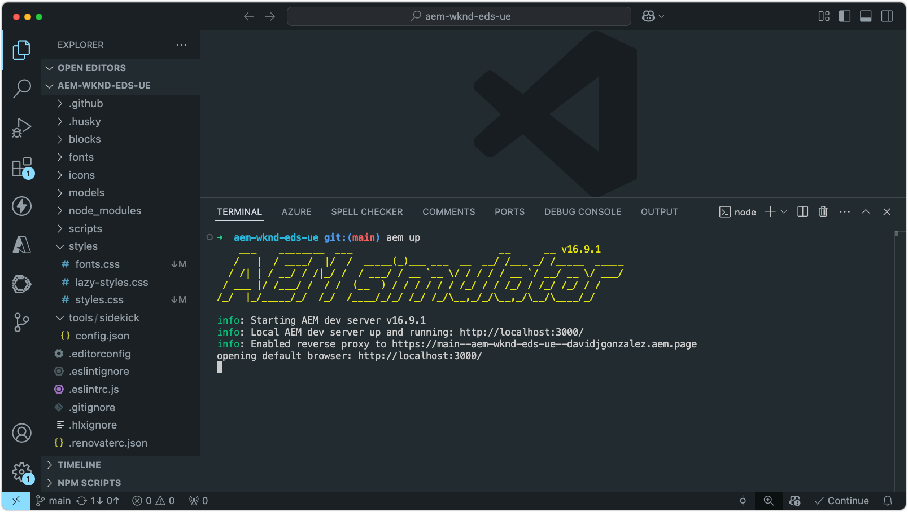
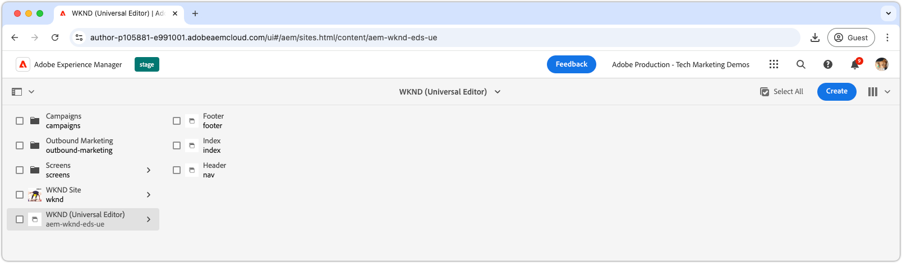

# Zelfstudie voor Edge Delivery Services en Universal Editor

In deze zelfstudie leert u de grondbeginselen van het bouwen van een AEM website die krachtige creatie met Universele Redacteur en bliksemsnelle levering gebruikend Edge Delivery Services combineert. Tegen het eind, zult u basisinzicht in hoe te om een nieuw project tot stand te brengen, opstelling een lokale ontwikkelomgeving, en een nieuw blok bouwen.

## Projectinstelling

Leer hoe u een codeproject maakt en een nieuwe site configureert in AEM as a Cloud Service. Deze instelling maakt naadloze ontwikkeling mogelijk met de Universal Editor voor het maken van inhoud en snelle levering van inhoud via Edge Delivery Services.

<!-- CARDS 

* ./1-new-code-project.md
  {}
* ./2-new-aem-site.md

-->
<!-- START CARDS HTML - DO NOT MODIFY BY HAND -->

    

        

            

                <figure class="image x-is-16by9">
                    
                </figure>
            

            

                

                    

                        <a href="./1-new-code-project.md" target="_blank" rel="referrer" title="Een nieuw project maken"> creeer een nieuw project </a>
                    

                    
Nieuw project maken voor Edge Delivery Services voor Universal Editor

                

                <a href="./1-new-code-project.md" target="_blank" rel="referrer" class="spectrum-Button spectrum-Button--outline spectrum-Button--primary spectrum-Button--sizeM" style="align-self: flex-start; margin-top: 1rem;">
                     Leer meer 
                </a>
            

        

    

    

        

            

                <figure class="image x-is-16by9">
                    
                </figure>
            

            

                

                    

                        <a href="./2-new-aem-site.md" target="_blank" rel="referrer" title="Een nieuwe site maken"> creeer een nieuwe plaats </a>
                    

                    
Een nieuwe site maken in AEM Sites voor Edge Delivery Services voor Universal Editor

                

                <a href="./2-new-aem-site.md" target="_blank" rel="referrer" class="spectrum-Button spectrum-Button--outline spectrum-Button--primary spectrum-Button--sizeM" style="align-self: flex-start; margin-top: 1rem;">
                     Leer meer 
                </a>
            

        

    

<!-- END CARDS HTML - DO NOT MODIFY BY HAND -->

## Ontwikkelinstellingen

Leer hoe u uw lokale ontwikkelomgeving configureert voor een snelle ontwikkeling van websites. Met deze setup kunt u probleemloos sites maken met de Universal Editor en content op efficiënte wijze leveren via Edge Delivery Services, waardoor een soepele en geoptimaliseerde ontwikkelingsworkflow wordt gegarandeerd.
<!-- CARDS 

* ./3-local-development-environment.md
* ./4-website-branding.md

-->
<!-- START CARDS HTML - DO NOT MODIFY BY HAND -->

    

        

            

                <figure class="image x-is-16by9">
                    
                </figure>
            

            

                

                    

                        <a href="./3-local-development-environment.md" target="_blank" rel="referrer" title="Een lokale ontwikkelomgeving instellen"> opstelling een lokaal dev milieu </a>
                    

                    
Nieuw project maken voor Edge Delivery Services voor Universal Editor

                

                <a href="./3-local-development-environment.md" target="_blank" rel="referrer" class="spectrum-Button spectrum-Button--outline spectrum-Button--primary spectrum-Button--sizeM" style="align-self: flex-start; margin-top: 1rem;">
                     Leer meer 
                </a>
            

        

    

    

        

            

                <figure class="image x-is-16by9">
                    
                </figure>
            

            

                

                    

                        <a href="./4-website-branding.md" target="_blank" rel="referrer" title="Branding van websites"> branding van de Website </a>
                    

                    
Algemene CSS-, CSS-variabelen en weblettertypen instellen.

                

                <a href="./4-website-branding.md" target="_blank" rel="referrer" class="spectrum-Button spectrum-Button--outline spectrum-Button--primary spectrum-Button--sizeM" style="align-self: flex-start; margin-top: 1rem;">
                     Leer meer 
                </a>
            

        

    

<!-- END CARDS HTML - DO NOT MODIFY BY HAND -->

## Blokontwikkeling

Leer hoe u een nieuw blok kunt maken door het inhoudsmodel te definiëren en voorbeeldinhoud in te stellen voor testen en ontwikkelen. Bekijk twee methoden om het blok te renderen en begrijp hoe u het kunt structureren voor optimale prestaties en flexibiliteit in AEM en Edge Delivery Services.

<!-- CARDS 

* ./5-new-block.md
* ./6-author-block.md
* ./7a-block-css.md
* ./7b-block-js-css.md

-->
<!-- START CARDS HTML - DO NOT MODIFY BY HAND -->

    

        

            

                <figure class="image x-is-16by9">
                    
                </figure>
            

            

                

                    

                        <a href="./5-new-block.md" target="_blank" rel="referrer" title="Een nieuw blok maken voor de Universal Editor"> creeer een nieuw blok voor Universele Redacteur </a>
                    

                    
Maak een nieuw blok.

                

                <a href="./5-new-block.md" target="_blank" rel="referrer" class="spectrum-Button spectrum-Button--outline spectrum-Button--primary spectrum-Button--sizeM" style="align-self: flex-start; margin-top: 1rem;">
                     Leer meer 
                </a>
            

        

    

    

        

            

                <figure class="image x-is-16by9">
                    
                </figure>
            

            

                

                    

                        <a href="./6-author-block.md" target="_blank" rel="referrer" title="Auteur van het blok"> Auteur het blok </a>
                    

                    
Maak het nieuwe blok zodat het zich ertegen kan ontwikkelen.

                

                <a href="./6-author-block.md" target="_blank" rel="referrer" class="spectrum-Button spectrum-Button--outline spectrum-Button--primary spectrum-Button--sizeM" style="align-self: flex-start; margin-top: 1rem;">
                     Leer meer 
                </a>
            

        

    

    

        

            

                <figure class="image x-is-16by9">
                    
                </figure>
            

            

                

                    

                        <a href="./7a-block-css.md" target="_blank" rel="referrer" title="Blokontwikkeling met CSS"> ontwikkeling van het Blok met CSS </a>
                    

                    
Bouw het blok gebruikend slechts CSS.

                

                <a href="./7a-block-css.md" target="_blank" rel="referrer" class="spectrum-Button spectrum-Button--outline spectrum-Button--primary spectrum-Button--sizeM" style="align-self: flex-start; margin-top: 1rem;">
                     Leer meer 
                </a>
            

        

    

    

        

            

                <figure class="image x-is-16by9">
                    
                </figure>
            

            

                

                    

                        <a href="./7b-block-js-css.md" target="_blank" rel="referrer" title="Blokontwikkeling met CSS en JS"> ontwikkeling van het Blok met CSS en JS </a>
                    

                    
Bouw een blok gebruikend CSS en JS.

                

                <a href="./7b-block-js-css.md" target="_blank" rel="referrer" class="spectrum-Button spectrum-Button--outline spectrum-Button--primary spectrum-Button--sizeM" style="align-self: flex-start; margin-top: 1rem;">
                     Leer meer 
                </a>
            

        

    

<!-- END CARDS HTML - DO NOT MODIFY BY HAND -->
