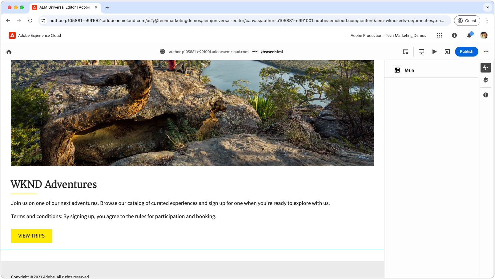
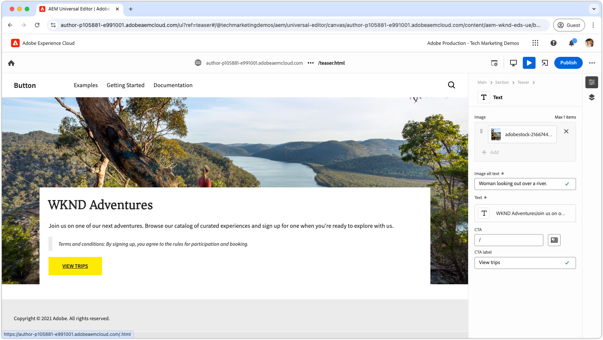

# Zelfstudie voor ontwikkelaars van Edge Delivery Services en Universal Editor

In deze zelfstudie leert u de grondbeginselen van het bouwen van een AEM-website die krachtige authoring combineert met Universal Editor en bliksemsnelle levering met Edge Delivery Services. Tegen het eind, zult u basisinzicht in hoe te om een nieuw project tot stand te brengen, opstelling een lokale ontwikkelomgeving, en een nieuw blok bouwen.

## Projectinstelling

Leer hoe u een codeproject maakt en een nieuwe site configureert in AEM as a Cloud Service. Met deze setup kunt u naadloos ontwikkelen met de Universal Editor voor het maken van inhoud en het snel leveren van inhoud via Edge Delivery Services.

<!-- CARDS 

* ./1-new-code-project.md
* ./2-new-aem-site.md

-->
<!-- START CARDS HTML - DO NOT MODIFY BY HAND -->

    

        

            

                <figure class="image x-is-16by9">
                    
                </figure>
            

            

                

                    

                        <a href="./1-new-code-project.md" target="_blank" rel="referrer" title="Een codeproject maken"> creeer een codeproject </a>
                    

                    
Maak een codeproject voor Edge Delivery Services dat u kunt bewerken met de Universal Editor.

                

                <a href="./1-new-code-project.md" target="_blank" rel="referrer" class="spectrum-Button spectrum-Button--outline spectrum-Button--primary spectrum-Button--sizeM" style="align-self: flex-start; margin-top: 1rem;">
                     Leer meer 
                </a>
            

        

    

    

        

            

                <figure class="image x-is-16by9">
                    
                </figure>
            

            

                

                    

                        <a href="./2-new-aem-site.md" target="_blank" rel="referrer" title="Een AEM-site maken"> creeer een plaats van AEM </a>
                    

                    
Maak een site in AEM Sites for Edge Delivery Services die u kunt bewerken met de Universal Editor.

                

                <a href="./2-new-aem-site.md" target="_blank" rel="referrer" class="spectrum-Button spectrum-Button--outline spectrum-Button--primary spectrum-Button--sizeM" style="align-self: flex-start; margin-top: 1rem;">
                     Leer meer 
                </a>
            

        

    

<!-- END CARDS HTML - DO NOT MODIFY BY HAND -->

## Ontwikkelinstellingen

Leer hoe u uw lokale ontwikkelomgeving configureert voor een snelle ontwikkeling van websites. Met deze setup kunt u probleemloos sites maken met de Universal Editor en content op efficiënte wijze leveren via Edge Delivery Services, waardoor een soepele en geoptimaliseerde ontwikkelingsworkflow wordt gegarandeerd.
<!-- CARDS 

* ./3-local-development-environment.md
* ./4-website-branding.md

-->
<!-- START CARDS HTML - DO NOT MODIFY BY HAND -->

    

        

            

                <figure class="image x-is-16by9">
                    
                </figure>
            

            

                

                    

                        <a href="./3-local-development-environment.md" target="_blank" rel="referrer" title="Een lokale ontwikkelomgeving instellen"> opstelling een lokale ontwikkelomgeving </a>
                    

                    
Stel een lokale ontwikkelomgeving in voor sites die worden geleverd met Edge Delivery Services en die kunnen worden bewerkt met Universal Editor.

                

                <a href="./3-local-development-environment.md" target="_blank" rel="referrer" class="spectrum-Button spectrum-Button--outline spectrum-Button--primary spectrum-Button--sizeM" style="align-self: flex-start; margin-top: 1rem;">
                     Leer meer 
                </a>
            

        

    

    

        

            

                <figure class="image x-is-16by9">
                    
                </figure>
            

            

                

                    

                        <a href="./4-website-branding.md" target="_blank" rel="referrer" title="Websitemarkering toevoegen"> voeg website branding </a> toe
                    

                    
Definieer algemene CSS, CSS-variabelen en weblettertypen voor een Edge Delivery Services-site.

                

                <a href="./4-website-branding.md" target="_blank" rel="referrer" class="spectrum-Button spectrum-Button--outline spectrum-Button--primary spectrum-Button--sizeM" style="align-self: flex-start; margin-top: 1rem;">
                     Leer meer 
                </a>
            

        

    

<!-- END CARDS HTML - DO NOT MODIFY BY HAND -->

## Blokontwikkeling

Leer hoe u een nieuw blok kunt maken door het inhoudsmodel te definiëren en voorbeeldinhoud in te stellen voor testen en ontwikkelen. Bekijk twee methoden om het blok te renderen en begrijp hoe u het kunt structureren voor optimale prestaties en flexibiliteit in AEM en Edge Delivery Services.

<!-- CARDS 

* ./5-new-block.md {image = ./assets/5-new-block/card.png}
* ./6-author-block.md {image = ./assets/6-author-block/card.png}
* ./7a-block-css.md {image = ./assets/7a-block-css/card.png}
* ./7b-block-js-css.md {image = ./assets/7b-block-js-css/card.png}

-->
<!-- START CARDS HTML - DO NOT MODIFY BY HAND -->

    

        

            

                <figure class="image x-is-16by9">
                    
                </figure>
            

            

                

                    

                        <a href="./5-new-block.md" target="_blank" rel="referrer" title="Een blok maken"> creeer een blok </a>
                    

                    
Bouw een blok voor een Edge Delivery Services-website die bewerkbaar is met Universal Editor.

                

                <a href="./5-new-block.md" target="_blank" rel="referrer" class="spectrum-Button spectrum-Button--outline spectrum-Button--primary spectrum-Button--sizeM" style="align-self: flex-start; margin-top: 1rem;">
                     Leer meer 
                </a>
            

        

    

    

        

            

                <figure class="image x-is-16by9">
                    
                </figure>
            

            

                

                    

                        <a href="./6-author-block.md" target="_blank" rel="referrer" title="Auteur van een blok"> Auteur een blok </a>
                    

                    
Schrijf een Edge Delivery Services-blok met Universal Editor.

                

                <a href="./6-author-block.md" target="_blank" rel="referrer" class="spectrum-Button spectrum-Button--outline spectrum-Button--primary spectrum-Button--sizeM" style="align-self: flex-start; margin-top: 1rem;">
                     Leer meer 
                </a>
            

        

    

    

        

            

                <figure class="image x-is-16by9">
                    
                </figure>
            

            

                

                    

                        <a href="./7a-block-css.md" target="_blank" rel="referrer" title="Een blok met CSS ontwikkelen"> ontwikkelt een blok met CSS </a>
                    

                    
Ontwikkel een blok met CSS voor Edge Delivery Services, editable gebruikend de Universele Redacteur.

                

                <a href="./7a-block-css.md" target="_blank" rel="referrer" class="spectrum-Button spectrum-Button--outline spectrum-Button--primary spectrum-Button--sizeM" style="align-self: flex-start; margin-top: 1rem;">
                     Leer meer 
                </a>
            

        

    

    

        

            

                <figure class="image x-is-16by9">
                    
                </figure>
            

            

                

                    

                        <a href="./7b-block-js-css.md" target="_blank" rel="referrer" title="Een blok ontwikkelen met CSS en JS"> ontwikkelt een blok met CSS en JS </a>
                    

                    
Ontwikkel een blok met CSS en JavaScript voor Edge Delivery Services, editable gebruikend de Universele Redacteur.

                

                <a href="./7b-block-js-css.md" target="_blank" rel="referrer" class="spectrum-Button spectrum-Button--outline spectrum-Button--primary spectrum-Button--sizeM" style="align-self: flex-start; margin-top: 1rem;">
                     Leer meer 
                </a>
            

        

    

<!-- END CARDS HTML - DO NOT MODIFY BY HAND -->

## Volgende stappen

Nu u deze zelfstudie hebt voltooid, bouwt u voort op wat u hebt geleerd met deze gefocuste Hoe-kan-ik&#39;s. Deze gidsen breiden zich op de code en de concepten uit die hier worden behandeld, het onderzoeken van rol-specifieke gebruiksgevallen, geavanceerde technieken, en extra uiteinden om Edge Delivery Services en Universele redacteur ontwikkelingsvaardigheden te verbeteren.

<!-- CARDS 

* ./how-to/block-options.md
* ./how-to/header-and-footer.md
* ./how-to/local-extension-preview.md {image = ./how-to/assets/local-extension-preview/extension-loaded.png}

-->
<!-- START CARDS HTML - DO NOT MODIFY BY HAND -->

    

        

            

                <figure class="image x-is-16by9">
                    
                </figure>
            

            

                

                    

                        <a href="./how-to/block-options.md" target="_blank" rel="referrer" title="Blokopties"> de opties van het Blok </a>
                    

                    
Leer hoe u een blok maakt met meerdere weergaveopties.

                

                <a href="./how-to/block-options.md" target="_blank" rel="referrer" class="spectrum-Button spectrum-Button--outline spectrum-Button--primary spectrum-Button--sizeM" style="align-self: flex-start; margin-top: 1rem;">
                     Leer meer 
                </a>
            

        

    

    

        

            

                <figure class="image x-is-16by9">
                    
                </figure>
            

            

                

                    

                        <a href="./how-to/header-and-footer.md" target="_blank" rel="referrer" title="Koptekst en voettekst"> Kopbal en Voettekst </a>
                    

                    
Leer hoe kop- en voetteksten zijn ontwikkeld in Edge Delivery Services en Universal Editor.

                

                <a href="./how-to/header-and-footer.md" target="_blank" rel="referrer" class="spectrum-Button spectrum-Button--outline spectrum-Button--primary spectrum-Button--sizeM" style="align-self: flex-start; margin-top: 1rem;">
                     Leer meer 
                </a>
            

        

    

    

        

            

                <figure class="image x-is-16by9">
                    
                </figure>
            

            

                

                    

                        <a href="./how-to/local-extension-preview.md" target="_blank" rel="referrer" title="Een voorvertoning weergeven van een extensie van Universal Editor"> Voorproef een Universele uitbreiding van de Redacteur </a>
                    

                    
Leer hoe u tijdens de ontwikkeling een voorvertoning kunt weergeven van een extensie van Universal Editor die lokaal wordt uitgevoerd.

                

                <a href="./how-to/local-extension-preview.md" target="_blank" rel="referrer" class="spectrum-Button spectrum-Button--outline spectrum-Button--primary spectrum-Button--sizeM" style="align-self: flex-start; margin-top: 1rem;">
                     Leer meer 
                </a>
            

        

    

<!-- END CARDS HTML - DO NOT MODIFY BY HAND -->
