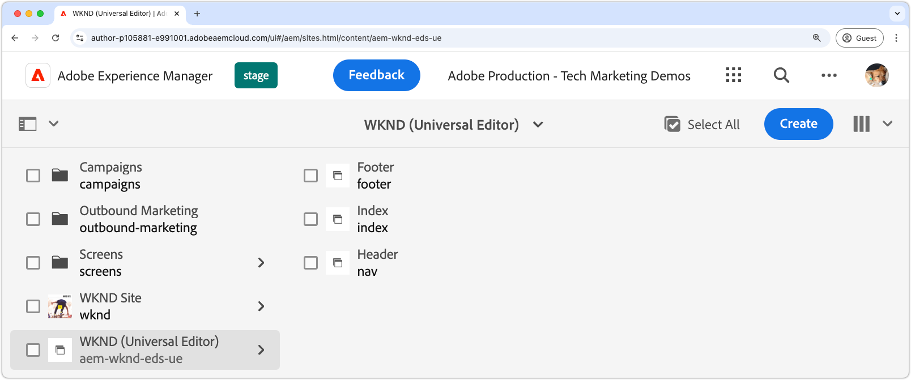

# Een AEM site maken

Op de AEM site wordt de inhoud van de website bewerkt, beheerd en gepubliceerd. Om een AEM plaats tot stand te brengen die via Edge Delivery Services wordt geleverd en gebruikend Universele Redacteur wordt geschreven, gebruik de [ Edge Delivery Services met AEM creërend plaatsmalplaatje ](https://github.com/adobe-rnd/aem-boilerplate-xwalk/releases) om een nieuwe plaats op AEM Auteur tot stand te brengen.

De AEM site is waar de inhoud van de website wordt opgeslagen en geschreven. De definitieve ervaring is een combinatie van de AEM plaatsinhoud met de [ code van de website ](./1-new-code-project.md)

Volg de [ gedetailleerde stappen die in documentatie ](https://experienceleague.adobe.com/en/docs/experience-manager-cloud-service/content/edge-delivery/wysiwyg-authoring/edge-dev-getting-started#create-aem-site) worden geschetst om een nieuwe AEM plaats tot stand te brengen.  Hieronder vindt u een overzicht van de stappen, inclusief de waarden die in deze zelfstudie worden gebruikt.
1. **creeer een nieuwe plaats** in AEM Auteur. In deze zelfstudie wordt de volgende sitenaam gebruikt:
   * Titel van site: `WKND (Universal Editor)`
   * Sitenaam: `aem-wknd-eds-ue`

      * De waarde van de plaatsnaam moet de naam van de plaatsweg [ aanpassen die aan `paths.json` ](https://experienceleague.adobe.com/en/docs/experience-manager-cloud-service/content/edge-delivery/wysiwyg-authoring/path-mapping) wordt toegevoegd.

2. **voer het recentste malplaatje** van de [ Edge Delivery Services met AEM creërende plaatsmalplaatje ](https://github.com/adobe-rnd/aem-boilerplate-xwalk/releases) in.
3. **Naam de plaats** om de naam van de bewaarplaats aan te passen GitHub en plaats GitHub URL als URL van de bewaarplaats.

## De nieuwe site op Publish plaatsen voor een voorvertoning

Na het creëren van de plaats in AEM Auteur, publiceer het aan de Edge Delivery Services voorproef die de inhoud ter beschikking stellen aan het [ lokale ontwikkelmilieu ](./3-local-development-environment.md).

1. Login aan **AEM Auteur** en navigeer aan **Plaatsen**.
2. Selecteer de **nieuwe plaats** (`WKND (Universal Editor)`) en klik **leidt Publicaties**.
3. Kies **Voorproef** onder **Doelen** en klik daarna **.**
4. Onder **omvat de Montages van Kinderen**, uitgezochte **omvat kinderen**, schrap andere opties, en klik **O.K.**.
5. Klik **Publish** om de inhoud van de plaats aan voorproef te publiceren.
6. Als de pagina&#39;s eenmaal zijn gepubliceerd om een voorvertoning weer te geven, zijn ze beschikbaar in de voorvertoningsomgeving van Edge Delivery Services (de pagina&#39;s worden niet weergegeven op de service AEM Voorvertoning).
