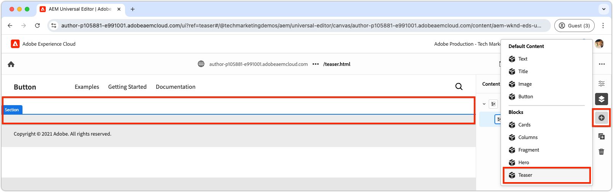

# Een nieuw blok maken

In dit hoofdstuk wordt beschreven hoe u met de Universal Editor een nieuw, bewerkbaar teasblok voor een Edge Delivery Services-website maakt.


In het blok met de naam `teaser` worden de volgende elementen weergegeven:

- **Beeld**: Een visueel aansprekend beeld.
- **inhoud van de Tekst**:
   - **Titel**: Een dwingende kop om nadruk te trekken.
   - **tekst van het Lichaam**: De beschrijvende inhoud die context of details, met inbegrip van facultatieve termijnen en voorwaarden verstrekt.
   - **vraag-aan-actie (CTA) knoop**: Een verbinding die wordt ontworpen om gebruikersinteractie te veroorzaken en hen te begeleiden aan verdere betrokkenheid.

De inhoud van het `teaser` -blok kan worden bewerkt in de Universal Editor, zodat u op de hele website gemakkelijk kunt gebruiken en opnieuw kunt gebruiken.

Het blok `teaser` is vergelijkbaar met het blok `hero` van de bouwsteen. Het blok `teaser` is dus alleen bedoeld als eenvoudig voorbeeld ter illustratie van ontwikkelingsconcepten.

## Een nieuwe Git-vertakking maken

Om een schone en georganiseerde werkstroom te handhaven, creeer een nieuwe tak voor elke specifieke ontwikkelingstaak. Dit helpt problemen met de implementatie van onvolledige of niet-geteste code voor productie te voorkomen.

1. **Begin van de belangrijkste tak**: Het werken van de meest bijgewerkte productiecode verzekert een stevige stichting.
2. **Vetch verre veranderingen**: Het Vetsen van de recentste updates van GitHub zorgt ervoor dat de huidigste code vóór beginnende ontwikkeling beschikbaar is.
   - Voorbeeld: na het samenvoegen van wijzigingen van de `wknd-styles` -vertakking in `main` , haalt u de meest recente updates op.
3. **creeer een nieuwe tak**:

```bash
# ~/Code/aem-wknd-eds-ue

$ git fetch origin  
$ git checkout -b teaser origin/main  
```

Wanneer de `teaser` -vertakking is gemaakt, kunt u beginnen met het ontwikkelen van het laserblok.

## Blokmap

Maak een nieuwe map met de naam `teaser` in de map `blocks` van het project. Deze map bevat de JSON-, CSS- en JavaScript-bestanden van het blok, waarbij de bestanden van het blok op één locatie worden gerangschikt:

```
# ~/Code/aem-wknd-eds-ue

/blocks/teaser
```

De naam van de blokmap fungeert als de id van het blok en wordt gebruikt om tijdens de ontwikkeling naar het blok te verwijzen.

## Block JSON

Het blok JSON definieert drie belangrijke aspecten van het blok:

- **Definitie**: Registreert het blok als editable component in de Universele Redacteur, die het met een blokmodel en naar keuze een filter verbindt.
- **Model**: Specificeert de auteursgebieden van het blok en hoe deze gebieden als semantische Edge Delivery Services HTML worden teruggegeven.
- **Filter**: Vormt het filtreren regels om te beperken welke containers het blok aan via de Universele Redacteur kan worden toegevoegd. De meeste blokken zijn geen containers, maar hun id&#39;s worden toegevoegd aan de filters van andere containerblokken.

Maak een nieuw bestand bij `/blocks/teaser/_teaser.json` met de volgende initiële structuur, in de exacte volgorde. Als de toetsen niet op de juiste wijze zijn, kunnen ze niet goed worden gemaakt.

[!BADGE &#x200B; /blocks/teaser/_teaser.json]{type=Neutral tooltip="Bestandsnaam van codevoorbeeld hieronder."}

```json
{
    "definitions": [],
    "models": [],
    "filters": []
}
```

### Blokmodel

Het blokmodel is een kritiek deel van de configuratie van het blok, aangezien het bepaalt:

1. De ontwerpervaring door de velden te definiëren die beschikbaar zijn voor bewerken.

   

2. De manier waarop de waarden van het veld worden gerenderd naar Edge Delivery Services HTML.

De modellen worden toegewezen een `id` die aan de [&#x200B; definitie van het blok &#x200B;](#block-definition) beantwoordt en een `fields` serie omvat om de editable gebieden te specificeren.

Elk veld in de array `fields` heeft een JSON-object dat de volgende vereiste eigenschappen bevat:

| JSON, eigenschap | Beschrijving |
|---------------|-----------------------------------------------------------------------------------------------------------------------|
| `component` | Het [&#x200B; gebiedstype &#x200B;](https://experienceleague.adobe.com/nl/docs/experience-manager-cloud-service/content/implementing/developing/universal-editor/field-types#component-types), zoals `text`, `reference`, of `aem-content`. |
| `name` | The name of the field, mapping to the JCR property where the value is stored in AEM. |
| `label` | Het label dat aan auteurs in de Universele Redacteur wordt getoond. |

Voor een uitvoerige lijst van eigenschappen, met inbegrip van facultatief, herzie de [&#x200B; Universele de gebiedsdocumentatie van de Redacteur &#x200B;](https://experienceleague.adobe.com/nl/docs/experience-manager-cloud-service/content/implementing/developing/universal-editor/field-types#fields).

#### Blokontwerp


Het teasblok bevat de volgende bewerkbare elementen:

1. **Beeld**: Vertegenwoordigt de visuele inhoud van het meetapparaat.
2. **inhoud van de Tekst**: Omvat de titel, lichaamstekst, en vraag-aan-actie knoop, en zit in een witte rechthoek.
   - De **titel** en **lichaamstekst** kan via de zelfde rijke tekstredacteur worden geschreven.
   - **CTA** kan via a `text` gebied voor het **etiket**, en `aem-content` gebied voor de **verbinding** worden authored.

Het ontwerp van het teasblok is opgedeeld in deze twee logische componenten (afbeelding en tekstinhoud) en zorgt voor een gestructureerde en intuïtieve ontwerpervaring voor gebruikers.

### Velden blokkeren

Definieer de velden die nodig zijn voor het blok: afbeelding, alternatieve afbeeldingstekst, tekst, CTA-label en CTA-koppeling.

>[!BEGINTABS]

>[!TAB  de juiste manier ]

**Dit lusje illustreert de juiste manier om het teaser blok te modelleren.**

De teaser bestaat uit twee logische gebieden: afbeelding en tekst. Om de code te vereenvoudigen die nodig is om de Edge Delivery Services HTML weer te geven als de gewenste webervaring, moet het blokmodel deze structuur weerspiegelen.

- Groepeer het **beeld** en **beeld alt tekst** samen gebruikend [&#x200B; gebiedsondergang &#x200B;](https://experienceleague.adobe.com/nl/docs/experience-manager-cloud-service/content/edge-delivery/wysiwyg-authoring/content-modeling#field-collapse).
- Groepeer de gebieden van de tekstinhoud samen gebruikend [&#x200B; element groeperend &#x200B;](https://experienceleague.adobe.com/nl/docs/experience-manager-cloud-service/content/edge-delivery/wysiwyg-authoring/content-modeling#element-grouping), en [&#x200B; gebiedsondergang voor CTA &#x200B;](https://experienceleague.adobe.com/nl/docs/experience-manager-cloud-service/content/edge-delivery/wysiwyg-authoring/content-modeling#field-collapse).

Als u niet vertrouwd met [&#x200B; gebiedsondergang &#x200B;](https://experienceleague.adobe.com/nl/docs/experience-manager-cloud-service/content/edge-delivery/wysiwyg-authoring/content-modeling#field-collapse) bent, [&#x200B; element groeperend &#x200B;](https://experienceleague.adobe.com/nl/docs/experience-manager-cloud-service/content/edge-delivery/wysiwyg-authoring/content-modeling#element-grouping), of [&#x200B; typegevolgtrekking &#x200B;](https://experienceleague.adobe.com/nl/docs/experience-manager-cloud-service/content/edge-delivery/wysiwyg-authoring/content-modeling#type-inference) herziet de verbonden documentatie alvorens verder te gaan, aangezien zij essentieel aan het creëren van een goed-gestructureerd blokmodel zijn.

In het onderstaande voorbeeld:

- [&#x200B; de conclusie van het Type &#x200B;](https://experienceleague.adobe.com/nl/docs/experience-manager-cloud-service/content/edge-delivery/wysiwyg-authoring/content-modeling#type-inference) wordt gebruikt om een `` element van HTML van het `image` gebied automatisch tot stand te brengen. Het samenvouwen van velden wordt samen met de velden `image` en `imageAlt` gebruikt om een HTML-element voor `` te maken. Het kenmerk `src` wordt ingesteld op de waarde van het veld `image` , terwijl het kenmerk `alt` wordt ingesteld op de waarde van het veld `imageAlt` .
- `textContent` is een groepsnaam waarmee velden worden gecategoriseerd. Het zou semantisch moeten zijn, maar kan iets uniek voor dit blok zijn. Hiermee wordt de Universal Editor geïnformeerd alle velden met dit voorvoegsel in hetzelfde `<div>` -element in de uiteindelijke HTML-uitvoer te renderen.
- Het samenvouwen van velden wordt ook toegepast binnen de `textContent` -groep voor de oproep tot actie (CTA). CTA wordt gecreeerd als a `<a>` via [&#x200B; typegevolgtrekking &#x200B;](https://experienceleague.adobe.com/nl/docs/experience-manager-cloud-service/content/edge-delivery/wysiwyg-authoring/content-modeling#type-inference). Het veld `cta` wordt gebruikt om het kenmerk `href` van het element `<a>` in te stellen en het veld `ctaText` bevat de tekstinhoud voor de koppeling binnen de tags `<a ...>` .

[!BADGE &#x200B; /blocks/teaser/_teaser.json]{type=Neutral tooltip="Bestandsnaam van codevoorbeeld hieronder."}

```json
{
    "definitions": [],
    "models": [
        {
            "id": "teaser", 
            "fields": [
                {
                    "component": "reference",
                    "valueType": "string",
                    "name": "image",
                    "label": "Image",
                    "multi": false
                },
                {
                    "component": "text",
                    "valueType": "string",
                    "name": "imageAlt",
                    "label": "Image alt text",
                    "required": true
                },
                {
                    "component": "richtext",
                    "name": "textContent_text",
                    "label": "Text",
                    "valueType": "string",
                    "required": true
                },
                {
                    "component": "aem-content",
                    "name": "textContent_cta",
                    "label": "CTA",
                    "valueType": "string"
                },
                {
                    "component": "text",
                    "name": "textContent_ctaText",
                    "label": "CTA label",
                    "valueType": "string"
                }
            ]
        }
    ],
    "filters": []
}
```

Dit model bepaalt de auteursinput in Universele Redacteur voor het blok.

De resulterende Edge Delivery Services HTML voor dit blok plaatst de afbeelding in de eerste div en de velden voor de elementgroep `textContent` in de tweede div.

```html
<div>
    <div>
        <!-- This div contains the field-collapsed image fields  -->
        <picture>
            ...
            <source .../>            
            
        </picture>
    </div>
    <div>
        <!-- This div, via element grouping contains the textContent fields -->
        <h2>The authored title</h2>
        <p>The authored body text</p>
        <a href="/authored/cta/link">The authored CTA label</a>
    </div>
</div>        
```

Zoals aangetoond [&#x200B; in het volgende hoofdstuk &#x200B;](./7a-block-css.md), vereenvoudigt deze structuur van HTML het stileren van het blok als samenhangende eenheid.

Om de gevolgen te begrijpen van het niet gebruiken van gebiedsondergang en element groeperen, zie **de verkeerde manier** hierboven tabel.

>[!TAB  De verkeerde manier ]

**dit lusje illustreert een suboptimale manier om het teaser blok te modelleren, en is slechts een juxtapositie aan de juiste manier.**

Het bepalen van elk gebied als standalone gebied in het blokmodel zonder [&#x200B; gebied te gebruiken doen ineenstorten &#x200B;](https://experienceleague.adobe.com/nl/docs/experience-manager-cloud-service/content/edge-delivery/wysiwyg-authoring/content-modeling#field-collapse) en [&#x200B; element groeperen &#x200B;](https://experienceleague.adobe.com/nl/docs/experience-manager-cloud-service/content/edge-delivery/wysiwyg-authoring/content-modeling#element-grouping) kan verleidelijk lijken. Dit overzicht bemoeilijkt echter het opmaken van het blok als een samenhangend geheel.

Bijvoorbeeld, kon het teaser model **zonder** gebiedsondergang of element groepering als volgt worden bepaald:

[!BADGE &#x200B; /blocks/teaser/_teaser.json]{type=Neutral tooltip="Bestandsnaam van codevoorbeeld hieronder."}

```json
{
    "definitions": [],
    "models": [
        {
            "id": "teaser", 
            "fields": [
                {
                    "component": "reference",
                    "valueType": "string",
                    "name": "image",
                    "label": "Image",
                    "multi": false
                },
                {
                    "component": "text",
                    "valueType": "string",
                    "name": "alt",
                    "label": "Image alt text",
                    "required": true
                },
                {
                    "component": "richtext",
                    "name": "text",
                    "label": "Text",
                    "valueType": "string",
                    "required": true
                },
                {
                    "component": "aem-content",
                    "name": "link",
                    "label": "CTA",
                    "valueType": "string"
                },
                {
                    "component": "text",
                    "name": "label",
                    "label": "CTA label",
                    "valueType": "string"
                }
            ]
        }
    ],
    "filters": []
}
```

De Edge Delivery Services HTML voor het blok geeft de waarde van elk veld in een aparte `div` weer, waardoor het begrip van de inhoud, de stijltoepassing en de HTML-structuuraanpassingen moeilijker worden om het gewenste ontwerp te verkrijgen.

```html
<div>
    <div>
        <!-- This div contains the field-collapsed image  -->
        <picture>
            ...
            <source .../>            
            
        </picture>
    </div>
    <div>
        <p>The authored alt text</p>
    </div>
    <div>
        <h2>The authored title</h2>
        <p>The authored body text</p>
    </div>
    <div>
        <a href="/authored/cta/link">/authored/cta/link</a>
    </div>
    <div>
        The authored CTA label
    </div>
</div>        
```

Elk veld wordt geïsoleerd in een eigen `div`, waardoor het moeilijk is om de afbeeldings- en tekstinhoud op te maken als een consistente eenheid. Het bereiken van het gewenste ontwerp met inspanning en creativiteit is mogelijk, maar het gebruiken van [&#x200B; element groeperend &#x200B;](https://experienceleague.adobe.com/nl/docs/experience-manager-cloud-service/content/edge-delivery/wysiwyg-authoring/content-modeling#element-grouping) om de gebieden van de tekstinhoud en [&#x200B; gebiedsondergang &#x200B;](https://experienceleague.adobe.com/nl/docs/experience-manager-cloud-service/content/edge-delivery/wysiwyg-authoring/content-modeling#field-collapse) te groeperen om authored waarden als elementenattributen toe te voegen is eenvoudiger, gemakkelijker, en semantisch correct.

Zie **de schrijfmanier** hierboven voor hoe te om het teaser blok beter te modelleren.

>[!ENDTABS]


### Blokdefinitie

De blokdefinitie registreert het blok in Universele Redacteur. Hier volgt een uitsplitsing van de JSON-eigenschappen die worden gebruikt in de blokdefinitie:

| JSON, eigenschap | Beschrijving |
|---------------|-------------|
| `definition.title` | De titel van het blok aangezien het in Universele **wordt getoond voegt** blokken toe. |
| `definition.id` | A unique ID for the block, used to control its use in `filters` . |
| `definition.plugins.xwalk.page.resourceType` | Bepaalt het het Verschuiven middeltype voor het teruggeven van de component in de Universele Redacteur. Gebruik altijd een `core/franklin/components/block/v#/block` resource type. |
| `definition.plugins.xwalk.page.template.name` | De naam van het blok. De naam moet lager zijn en worden afgebroken, zodat deze overeenkomt met de mapnaam van het blok. Deze waarde wordt ook gebruikt om het exemplaar van het blok in de Universele Redacteur te etiketteren. |
| `definition.plugins.xwalk.page.template.model` | Koppelt deze definitie aan de bijbehorende `model` -definitie, die de ontwerpvelden bepaalt die voor het blok in de Universal Editor worden weergegeven. De waarde hier moet overeenkomen met een `model.id` -waarde. |
| `definition.plugins.xwalk.page.template.classes` | Optionele eigenschap, waarvan de waarde wordt toegevoegd aan het kenmerk `class` van het blok HTML-element. Dit maakt varianten van hetzelfde blok mogelijk. De `classes` waarde kan worden gemaakt editable door [&#x200B; toevoegend een klassengebied &#x200B;](https://experienceleague.adobe.com/nl/docs/experience-manager-cloud-service/content/edge-delivery/wysiwyg-authoring/create-block#block-options) aan het 3&rbrace; model van het blok [&#128279;](#block-model). |


Hier is een voorbeeld van JSON voor de blokdefinitie:

[!BADGE &#x200B; /blocks/teaser/_teaser.json]{type=Neutral tooltip="Bestandsnaam van codevoorbeeld hieronder."}

```json
{
    "definitions": [{
      "title": "Teaser",
      "id": "teaser",
      "plugins": {
        "xwalk": {
          "page": {
            "resourceType": "core/franklin/components/block/v1/block",
            "template": {
              "name": "Teaser",
              "model": "teaser",
              "textContent_text": "<h2>Enter a title</h2><p>...and body text here!</p>",
              "textContent_cta": "/",
              "textContent_ctaText": "Click me!"
            }
          }
        }
      }
    }],
    "models": [... from previous section ...],
    "filters": []
}
```

In dit voorbeeld:

- Het blok heeft de naam &#39;Taser&#39; en gebruikt het `teaser` -model dat bepaalt welke velden beschikbaar zijn voor bewerking in de Universal Editor.
- Het blok bevat standaardinhoud voor het veld `textContent_text` . Dit is een RTF-gebied voor de titel en de hoofdtekst en `textContent_cta` en `textContent_ctaText` voor de koppeling en het label voor de CTA-koppeling (call-to-action). De het gebiedsnamen van het malplaatje die aanvankelijke inhoud bevatten, passen de gebiedsnamen aan die in de [&#x200B; de gebiedsserie van het inhoudsmodel &#x200B;](#block-model) worden bepaald;

Deze structuur zorgt ervoor dat het blok in de Universele Redacteur met de juiste gebieden, inhoudsmodel, en middeltype voor het teruggeven wordt opgesteld.

### Blokkeringsfilters

De serie van het blok `filters` bepaalt, voor [&#x200B; containerblokken &#x200B;](https://experienceleague.adobe.com/nl/docs/experience-manager-cloud-service/content/edge-delivery/wysiwyg-authoring/content-modeling#container), welke andere blokken aan de container kunnen worden toegevoegd. Filters definiëren een lijst met blok-id&#39;s (`model.id`) die aan de container kunnen worden toegevoegd.

[!BADGE &#x200B; /blocks/teaser/_teaser.json]{type=Neutral tooltip="Bestandsnaam van codevoorbeeld hieronder."}

```json
{
  "definitions": [... populated from previous section ...],
  "models": [... populated from previous section ...],
  "filters": []
}
```

De lasercomponent is geen a [&#x200B; containerblok &#x200B;](https://experienceleague.adobe.com/nl/docs/experience-manager-cloud-service/content/edge-delivery/wysiwyg-authoring/content-modeling#container), betekenend kunt u geen andere blokken aan het toevoegen. Hierdoor blijft de array `filters` leeg. Voeg in plaats daarvan de teaser-id toe aan de filterlijst van het sectieblok, zodat het teaser-object aan een sectie kan worden toegevoegd.



In door Adobe verschafte blokken, zoals het sectieblok, worden filters opgeslagen in de map `models` van het project. Als u de instellingen wilt aanpassen, zoekt u het JSON-bestand voor het door Adobe opgegeven blok (bijvoorbeeld `/models/_section.json` ) en voegt u de id van het gummetje ( `teaser` ) toe aan de lijst met filters. De configuratie signaleert de Universele Redacteur dat de lasercomponent aan het blok van de sectiecontainer kan worden toegevoegd.

[!BADGE &#x200B; /models/_section.json]{type=Neutral tooltip="Bestandsnaam van codevoorbeeld hieronder."}

```json
{
  "definitions": [],
  "models": [],
  "filters": [
    {
      "id": "section",
      "components": [
        "text",
        "image",
        "button",
        "title",
        "hero",
        "cards",
        "columns",
        "fragment",
        "teaser"
      ]
    }
  ]
}
```

De definitie-id van het teasblok `teaser` wordt toegevoegd aan de array `components` .

## JSON-bestanden plaatsen

Zorg ervoor u [&#x200B; vaak &#x200B;](./3-local-development-environment.md#linting) kleint uw veranderingen om het schoon en verenigbaar te verzekeren. Door regelmatig te koppelen worden problemen vroegtijdig afgevangen en neemt de totale ontwikkelingstijd af. Met de opdracht `npm run lint:js` kunt u ook JSON-bestanden koppelen en syntaxisfouten afvangen.

```bash
# ~/Code/aem-wknd-eds-ue

$ npm run lint:js
```

## Het JSON-project bouwen

Nadat de JSON-blokbestanden (bijvoorbeeld `blocks/teaser/_teaser.json` , `models/_section.json` ) zijn geconfigureerd, worden deze automatisch gecompileerd in de `component-models.json` -, `component-definitions.json` - en `component-filters.json` -bestanden van het project. Deze compilatie wordt automatisch behandeld door a [&#x200B; Echtgenoot &#x200B;](https://typicode.github.io/husky/) precommit haak inbegrepen in het [&#x200B; AEM Boilerplate XWalk projectmalplaatje &#x200B;](https://github.com/adobe-rnd/aem-boilerplate-xwalk).

Bouwt kan ook manueel of programmatically worden teweeggebracht gebruikend de manuscripten JSON [&#128279;](./3-local-development-environment.md#build-json-fragments) NPM van het project  bouwen.

## Het blok JSON implementeren

Om het blok beschikbaar te maken in de Universele Redacteur, moet het project worden begaan en aan de tak van een bewaarplaats GitHub, in dit geval de `teaser` tak worden geduwd.

De exacte vertakkingsnaam die Universal Editor gebruikt, kan per gebruiker worden aangepast via de URL van de Universal Editor.

```bash
# ~/Code/aem-wknd-eds-ue

$ git add .
$ git commit -m "Add teaser block JSON files so it is available in Universal Editor"
# JSON files are compiled automatically and added to the commit via a husky precommit hook
$ git push origin teaser
```

Wanneer de Universele Redacteur met de vraagparameter `?ref=teaser` wordt geopend, verschijnt het nieuwe `teaser` blok in het blokpalet. Merk op dat het blok geen het stileren heeft; het geeft de gebieden van het blok als semantische HTML terug, die slechts via [&#x200B; globale CSS &#x200B;](./4-website-branding.md#global-css) wordt gestileerd.
