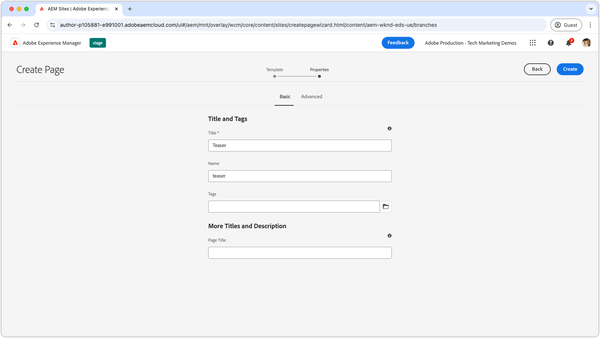
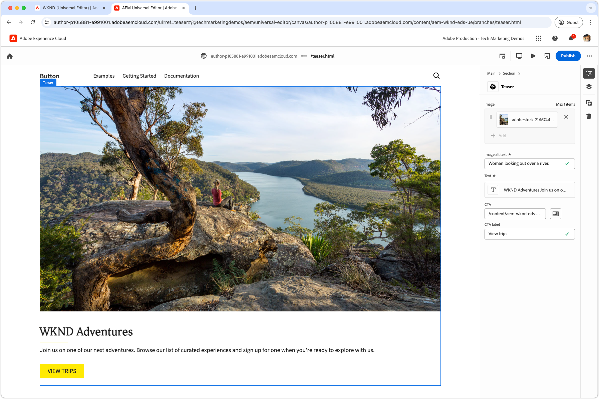

# Auteur van een blok

Na het duwen van JSON ](./5-new-block.md) van het [ laserblok aan de `teaser` tak, wordt het blok editable in de Universele Redacteur van AEM.

Het ontwerpen van een ontwikkelingsblok is om verschillende redenen belangrijk:

1. Het verifieert dat de definitie en het model van het blok nauwkeurig zijn.
1. Het stelt ontwikkelaars in staat om de semantische HTML van het blok te herzien, die als basis voor ontwikkeling dient.
1. Hierdoor kunnen zowel de inhoud als semantische HTML worden geïmplementeerd in de voorvertoningsomgeving, waardoor de blokontwikkeling sneller verloopt.

## Universal Editor openen met code uit de `teaser` -vertakking

1. Meld u aan bij AEM Author.
2. Navigeer aan **Plaatsen** en selecteer de plaats (WKND (Universele Redacteur)) die in het [ vorige hoofdstuk ](./2-new-aem-site.md) wordt gecreeerd.

   

3. Maak of bewerk een pagina om het nieuwe blok toe te voegen, zodat de context beschikbaar is voor ondersteuning van lokale ontwikkeling. Hoewel pagina&#39;s overal op de site kunnen worden gemaakt, is het vaak het beste om aparte pagina&#39;s te maken voor elk nieuw werkgebied. Creeer een nieuwe &quot;omslag&quot;pagina genoemd **Tanden**. Elke subpagina wordt gebruikt om de ontwikkeling van de zelfde-genoemde tak van de Git te steunen.

   

4. Onder de **Tak** pagina van Tanden, creeer een nieuwe pagina genoemd **Taser**, die de naam van de ontwikkelingstak aanpassen, en klik **Open** om de pagina uit te geven.

   

5. Werk de Universal Editor bij om de code vanuit de `teaser` -vertakking te laden door `?ref=teaser` aan de URL toe te voegen. Zorg ervoor om de vraagparameter **VÓÓR** toe te voegen het `#` symbool.

   

6. Selecteer de eerste sectie onder **Hoofd**, klik **toevoegen** knoop, en kies het **Taser** blok.

    toe

7. Selecteer op het canvas het net toegevoegde gummetje en maak de velden aan de rechterkant of via de inline bewerkingsfunctie.

   

8. Na voltooiing creatie, selecteer **publiceren** knoop in het hoogste recht van Universele Redacteur, kies publiceren aan **Voorproef**, en publiceer de veranderingen in het voorproefmilieu. De wijzigingen worden vervolgens gepubliceerd naar het `aem.page` -domein voor de website.
   

9. Wacht op de veranderingen om aan voorproef te publiceren, dan open webpage via [ AEM CLI ](./3-local-development-environment.md#install-the-aem-cli) in [ http://localhost:3000/branches/teaser ](http://localhost:3000/branches/teaser).

   

De inhoud en semantische HTML van het ontwerpblok zijn nu beschikbaar op de voorvertoningswebsite en zijn klaar voor ontwikkeling met de AEM CLI in de lokale ontwikkelomgeving.
