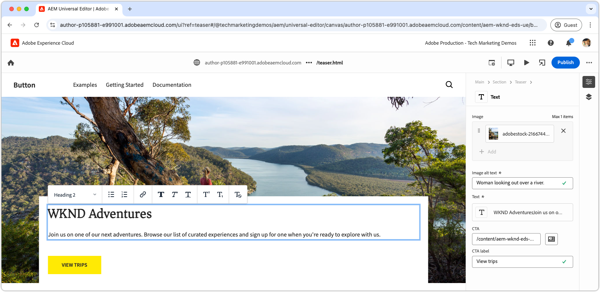

# Een blok met CSS ontwikkelen

Blokken in Edge Delivery Services worden opgemaakt met CSS. Het CSS-bestand voor een blok wordt opgeslagen in de map van het blok en heeft dezelfde naam als het blok. Het CSS-bestand voor een blok met de naam `teaser` bevindt zich bijvoorbeeld op `blocks/teaser/teaser.css` .

In het ideale geval heeft een blok alleen CSS voor opmaak nodig, zonder dat JavaScript de DOM moet wijzigen of CSS-klassen moet toevoegen. De behoefte aan JavaScript hangt van de inhoud van het blok [ modellering ](./5-new-block.md#block-model) en zijn ingewikkeldheid af. Indien nodig, [ blok JavaScript ](./7b-block-js-css.md) kan worden toegevoegd.

Met een CSS-benadering worden de (meestal) blote semantische HTML-elementen van het blok geactiveerd en opgemaakt.

## HTML blokkeren

Als u wilt begrijpen hoe u een blok opmaakt, bekijkt u eerst het DOM dat door Edge Delivery Services wordt weergegeven, aangezien dit het beschikbare element is voor opmaken. Het DOM kan worden gevonden door het blok te inspecteren dat door de lokale ontwikkelomgeving van AEM CLI wordt gediend. Vermijd het gebruik van het DOM van de Universal Editor, aangezien dit iets anders is.

>[!BEGINTABS]

>[!TAB  DOM aan stijl ]

Hier volgt de DOM van het teaserblok die het doel voor opmaken is.

Merk `<p class="button-container">...` op dat [ ](./4-website-branding.md#inferred-elements) automatisch als afgeleid element door Edge Delivery Services JavaScript wordt uitgebreid.

```html
...
<body>
    <header/>
    <main>
        <div>
            <!-- Start block HTML -->
            <div class="teaser block" data-block-name="teaser" data-block-status="loaded">
                <div>
                    <div>
                        <picture>
                            <source type="image/webp" srcset="./media_15ba2b455e29aca38c1ca653d24c40acaec8a008f.jpeg?width=2000&amp;format=webply&amp;optimize=medium" media="(min-width: 600px)">
                            <source type="image/webp" srcset="./media_15ba2b455e29aca38c1ca653d24c40acaec8a008f.jpeg?width=750&amp;format=webply&amp;optimize=medium">
                            <source type="image/jpeg" srcset="./media_15ba2b455e29aca38c1ca653d24c40acaec8a008f.jpeg?width=2000&amp;format=jpeg&amp;optimize=medium" media="(min-width: 600px)">
                            
                        </picture>
                    </div>
                </div>
                <div>
                    <div>
                        <h2 id="wknd-adventures">WKND Adventures</h2>
                        <p>Join us on one of our next adventures. Browse our list of curated experiences and sign up for one when you're ready to explore with us.</p>
                        <p class="button-container"><a href="/" title="View trips" class="button">View trips</a></p>
                    </div>
                </div>
            </div>     
            <!-- End block HTML -->
        </div>
    </main>
    <footer/>
</body>
...
```

>[!TAB  hoe te om DOM ] te vinden

Als u het DOM wilt zoeken dat u opmaakt, opent u de pagina met het naamloze blok in uw lokale ontwikkelomgeving, selecteert u het blok en inspecteert u het DOM.


>[!ENDTABS]

## CSS blokkeren

Maak een nieuw CSS-bestand in de map van het blok met de naam van het blok als bestandsnaam. Bijvoorbeeld, voor het **meetapparaat** blok, wordt het dossier gevestigd bij `/blocks/teaser/teaser.css`.

Dit CSS-bestand wordt automatisch geladen wanneer JavaScript van Edge Delivery Services een DOM-element detecteert op de pagina die een teasblok vertegenwoordigt.

[!BADGE  /blocks/teaser/teaser.css]{type=Neutral tooltip="Bestandsnaam van codevoorbeeld hieronder."}

```css
/* /blocks/teaser/teaser.css */

/* Scope each selector in the block with `.block.teaser` using CSS nesting (https://developer.mozilla.org/en-US/docs/Web/CSS/CSS_nesting) to avoid accidental conflicts outside the block */
.block.teaser {
    animation: teaser-fade-in .6s;
    position: relative;
    width: 1600px;
    max-width: 100vw;
    left: 50%; 
    transform: translateX(-50%);
    height: 500px;

    /* The image is rendered to the first div in the block */
    & picture {
        position: absolute;
        z-index: -1;
        inset: 0;
        box-sizing: border-box;

        & img {
            object-fit: cover;
            object-position: center;
            width: 100%;
            height: 100%;
        }
    }

    /** 
    The teaser's text is rendered to the second (also the last) div in the block.

    These styles are scoped to the second (also the last) div in the block (.block.teaser > div:last-child).

    This div order can be used to target different styles to the same semantic elements in the block. 
    For example, if the block has two images, we could target the first image with `.block.teaser > div:first-child img`, 
    and the second image with `.block.teaser > div:nth-child(2) img`.
    **/
    & > div:last-child {
        position: absolute;
        bottom: 0;
        left: 50%;
        transform: translateX(-50%);
        background: var(--background-color);
        padding: 1.5rem 1.5rem 1rem;
        width: 80vw;
        max-width: 1200px;

        /** 
        The following elements reside within `.block.teaser > div:last-child` and could be scoped as such, for example:

        .block.teaser > div:last-child p { .. }

        However since these element can only appear in the second/last div per our block's model, it's unnecessary to add this additional scope.
        **/

        /* Regardless of the authored heading level, we only want one style the heading */
        & h1,
        & h2,
        & h3,
        & h4,
        & h5,
        & h6 {
            font-size: var(--heading-font-size-xl);
            margin: 0;
        }

        & h1::after,
        & h2::after,
        & h3::after,
        & h4::after,
        & h5::after,
        & h6::after {
            border-bottom: 0;
        }

        & p {
            font-size: var(--body-font-size-s);
            margin-bottom: 1rem;
        }

        /* Add underlines to links in the text */
        & a:hover {
            text-decoration: underline;
        }

        /* Add specific spacing to buttons. These button CSS classes are automatically added by Edge Delivery Services. */
        & .button-container {
            margin: 0;
            padding: 0;
        }

        & .button {
            background-color: var(--primary-color);
            border-radius: 0;
            color: var(--dark-color);
            font-size: var(--body-font-size-xs);
            font-weight: bold;
            padding: 1em 2.5em;
            margin: 0;
            text-transform: uppercase;
        }
    }

}

/** Animations 
    Scope the @keyframes to the block (teaser) to avoid accidental conflicts outside the block

    Global @keyframes can defines in styles/styles.css and used in this file.
**/

@keyframes teaser-fade-in {
    from {
        opacity: 0;
    }

    to {
        opacity: 1;
    }
}
```

## Ontwikkelvoorbeeld

Aangezien CSS in het codeproject wordt geschreven, is het heet herladen van AEM CLI de veranderingen, die het snel en gemakkelijk maken om te begrijpen hoe CSS het blok beïnvloedt.


## Uw code plaatsen

Zorg ervoor u [ vaak ](./3-local-development-environment.md#linting) uw codescheidingen plukt om het schoon en verenigbaar te verzekeren. Met koppelingen worden problemen vroegtijdig afgevangen en de totale ontwikkeltijd verkort. U kunt uw ontwikkelingswerk niet samenvoegen tot `main` totdat alle problemen met koppelingen zijn opgelost.

```bash
# ~/Code/aem-wknd-eds-ue

$ npm run lint:css
```

## Voorvertoning in Universal Editor

Als u wijzigingen wilt bekijken in AEM Universal Editor, voegt u deze toe, past u ze toe en duwt u ze door naar de vertakking Git-opslagplaats die door de Universal Editor wordt gebruikt. Deze stap helpt ervoor te zorgen dat de blokimplementatie de ontwerpervaring niet verstoort.

```bash
# ~/Code/aem-wknd-eds-ue

$ git add .
$ git commit -m "Add CSS-only implementation for teaser block"
$ git push origin teaser
```

U kunt nu een voorvertoning van de wijzigingen weergeven in de Universal Editor wanneer u de queryparameter `?ref=teaser` toevoegt.


