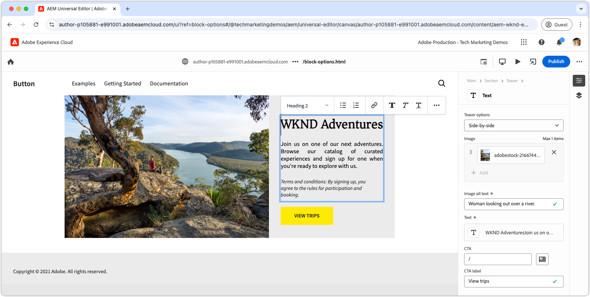

# Een blok met opties ontwikkelen

Deze zelfstudie bouwt verder op de zelfstudie Edge Delivery Services en Universal Editor en begeleidt u bij het toevoegen van blokopties aan een blok. Door blokopties te definiëren, kunt u de weergave en functionaliteit van een blok aanpassen, zodat verschillende variaties kunnen worden aangepast aan de verschillende behoeften aan inhoud. Hierdoor is het ontwerpsysteem van uw site flexibeler en gebruiksvriendelijker.

{align="center"}

In dit leerprogramma, zult u blokopties aan het blok van het Teaser toevoegen, toestaand auteurs om tussen twee vertoningsopties te kiezen: **Gebrek** en **zij aan zij**. De **Standaard** optie toont het beeld hierboven en achter de tekst, terwijl de **zij aan zij** optie de beeld en de tekst zij aan zij toont.

## Vaak voorkomende gevallen

De gemeenschappelijke gebruiksgevallen voor het gebruiken van **Opties van het Blok** in **Edge Delivery Services** en **Universele ontwikkeling van de Redacteur** omvatten, maar zijn niet beperkt tot:

1. **variaties van de Lay-out:** gemakkelijk schakelaar tussen lay-outs. Bijvoorbeeld horizontaal versus verticaal of raster versus lijst.
2. **het stileren variaties:** gemakkelijk schakelaar tussen thema&#39;s, of visuele behandelingen. Bijvoorbeeld, licht versus donkere wijze, of grote versus kleine teksten.
3. **de vertoningscontrole van de inhoudsvertoning:** knevel zicht van elementen of schakelaar tussen inhoudsstijlen (compact tegenover gedetailleerd).

Deze opties bieden flexibiliteit en efficiëntie bij het bouwen van dynamische en aanpasbare blokken.

Dit leerprogramma toont het gebruiksgeval van lay-outvariaties aan, waar het blok van het Taser in twee verschillende lay-outs kan worden getoond: **Gebrek** en **zij aan zij**.

## Blokmodel

Als u blokopties wilt toevoegen aan het blok Taser, opent u het JSON-fragment bij `/block/teaser/_teaser.json` en voegt u een nieuw veld toe aan de modeldefinitie. In dit veld wordt de eigenschap `name` ingesteld op `classes` . Dit is een beveiligd veld dat door AEM wordt gebruikt om blokopties op te slaan. Deze worden op de Edge Delivery Services HTML van het blok toegepast.

### Veldconfiguraties

In de onderstaande tabbladen ziet u verschillende manieren om blokopties in het blokmodel te configureren, waaronder enkele selectie met één CSS-klasse, één selectie met meerdere CSS-klassen en meerdere selecties met meerdere CSS-klassen. Dit leerprogramma [ voert de eenvoudigere benadering ](#field-configuration-for-this-tutorial) uit die in **wordt gebruikt uitgezocht met enige CSS klasse**.

>[!BEGINTABS]

>[!TAB  Uitgezocht met enige CSS klasse ]

In deze zelfstudie wordt getoond hoe u een invoertype `select` (vervolgkeuzelijst) kunt gebruiken om auteurs één blokoptie te laten kiezen. Deze wordt vervolgens toegepast als één corresponderende CSS-klasse.

{align="center"}

#### Blokmodel

De **Standaard** optie wordt vertegenwoordigd door een leeg koord (`""`), terwijl **zij aan zij** optie gebruikt `"side-by-side"`. De naam van de optie **&#x200B;**&#x200B;en **waarde** moet niet het zelfde zijn, maar de **waarde** bepaalt de CSS klasse(n) die op HTML van het blok worden toegepast. Bijvoorbeeld, kon de **zij aan zij** waarde van de optie `layout-10` in plaats van `side-by-side` zijn. Het is echter het beste om semantisch betekenisvolle namen te gebruiken voor CSS-klassen, zodat de optiewaarden duidelijk en consistent zijn.

[!BADGE &#x200B; /blocks/teaser/_teaser.json]{type=Neutral tooltip="Bestandsnaam van codevoorbeeld hieronder."}

```json{highlight="4,8,9-18"}
...
"fields": [
    {
        "component": "select",
        "name": "classes",
        "value": "",
        "label": "Teaser options",
        "valueType": "string",
        "options": [
            {
                "name": "Default",
                "value": ""
            },
            {
                "name": "Side-by-side",
                "value": "side-by-side"
            }
        ]
    }
]
...
```

#### HTML blokkeren

Wanneer de auteur een optie selecteert, wordt de bijbehorende waarde als CSS-klasse toegevoegd aan de HTML van het blok:

- Als **Gebrek** wordt geselecteerd:

  ```html
  <div class="block teaser">
      <!-- Block content here -->
  </div>
  ```

- Als **zij aan zij** wordt geselecteerd:

  ```html
  <div class="block teaser side-by-side">
      <!-- Block content here -->
  </div>
  ```

Op deze manier kunnen verschillende stijlen en voorwaardelijke JavaScript worden toegepast, afhankelijk van de gekozen opening.


>[!TAB  Uitgezocht met veelvoudige CSS klassen ]

**deze benadering wordt niet gebruikt in dit leerprogramma maar illustreert een alternatieve methode en geavanceerde blokopties.**

Met het invoertype `select` kunnen auteurs één blokoptie kiezen, die optioneel aan meerdere CSS-klassen kan worden toegewezen. Hiervoor geeft u de CSS-klassen op als door spaties gescheiden waarden.

{align="center"}

#### Blokmodel

Bijvoorbeeld, kan de **zij aan zij** optie variaties steunen waar het beeld op de linkerzijde (`side-by-side left`) of het recht (`side-by-side right`) verschijnt.

[!BADGE &#x200B; /blocks/teaser/_teaser.json]{type=Neutral tooltip="Bestandsnaam van codevoorbeeld hieronder."}

```json{highlight="4,8,9-21"}
...
"fields": [
    {
        "component": "select",
        "name": "classes",
        "value": "",
        "label": "Teaser options",
        "valueType": "string",
        "options": [
            {
                "name": "Default",
                "value": ""
            },
            {
                "name": "Side-by-side with Image on left",
                "value": "side-by-side left"
            },
            {
                "name": "Side-by-side with Image on right",
                "value": "side-by-side right"
            }
        ]
    }
]
...
```

#### HTML blokkeren

Wanneer de auteur een optie selecteert, wordt de corresponderende waarde toegepast als een set CSS-klassen met spaties in de HTML van het blok:

- Als **Gebrek** wordt geselecteerd:

  ```html
  <div class="block teaser">
      <!-- Block content here -->
  </div>
  ```

- Als **zij aan zij met Beeld op linkerzijde** wordt geselecteerd:

  ```html
  <div class="block teaser side-by-side left">
      <!-- Block content here -->
  </div>
  ```

- Als **zij aan zij met Beeld op recht** wordt geselecteerd:

  ```html
  <div class="block teaser side-by-side right">
      <!-- Block content here -->
  </div>
  ```

Hierdoor kunnen verschillende stijlen en voorwaardelijke JavaScript worden toegepast, afhankelijk van de gekozen optie.


>[!TAB  Multi-select met veelvoudige CSS klassen ]

**deze benadering wordt niet gebruikt in dit leerprogramma maar illustreert een alternatieve methode en geavanceerde blokopties.**

Met het invoertype van `"component": "multiselect"` kan de auteur meerdere opties tegelijk selecteren. Dit maakt complexe permutaties van de weergave van het blok mogelijk door meerdere ontwerpkeuzes te combineren.

{align="center"}

### Blokmodel

Bijvoorbeeld, kan het **zij aan zij**, **Beeld op linkerzijde**, en **Beeld op recht** variaties steunen waar het beeld op de linkerzijde (`side-by-side left`) of op het recht (`side-by-side right`) wordt geplaatst.

[!BADGE &#x200B; /blocks/teaser/_teaser.json]{type=Neutral tooltip="Bestandsnaam van codevoorbeeld hieronder."}

```json{highlight="4,6,8,10-21"}
...
"fields": [
    {
        "component": "multiselect",
        "name": "classes",
        "value": [],
        "label": "Teaser options",
        "valueType": "array",
        "options": [
            {
                "name": "Side-by-side",
                "value": "side-by-side"
            },
            {
                "name": "Image on left",
                "value": "left"
            },
            {
                "name": "Image on right",
                "value": "right"
            }
        ]
    }
]
...
```

#### HTML blokkeren

Wanneer de auteur meerdere opties selecteert, worden de bijbehorende waarden toegepast als CSS-klassen met spaties in de HTML van het blok:

- Als **zij aan zij** en **Beeld op linkerzijde** worden geselecteerd:

  ```html{highlight="1"}
  <div class="block teaser side-by-side left">
      <!-- Block content here -->
  </div>
  ```

- Als **zij aan zij** en **Beeld op recht** worden geselecteerd:

  ```html{highlight="1"}
  <div class="block teaser side-by-side right">
      <!-- Block content here -->
  </div>
  ```

Multiselect biedt flexibiliteit, maar het zorgt voor complexiteit bij het beheren van ontwerppermutaties. Zonder beperkingen kunnen conflicterende selecties leiden tot verbroken of buitenmerkse ervaringen.

Bijvoorbeeld:

- **Beeld op verlaten** of **Beeld op recht** zonder **te selecteren zij aan zij** impliciet toepast hen op **Gebrek**, dat altijd het beeld als achtergrond plaatst, zodat linker en juiste groepering irrelevant zijn.
- Het selecteren van zowel **Beeld op verlaten** en **Beeld op recht is** tegenstrijdig.
- Het selecteren van **zij aan zij** zonder **Beeld op verlaten** of **Beeld op recht** kan als dubbelzinnig worden beschouwd, aangezien de positie van het beeld niet gespecificeerd is.

Om problemen te voorkomen en verwarring tussen auteurs te voorkomen bij het gebruik van multi-select, zorgt u ervoor dat de opties goed zijn gepland en dat alle permutaties zijn getest. Multi-select werkt het beste voor eenvoudige, niet-conflicterende verbeteringen, zoals &#39;groot&#39; of &#39;hooglicht&#39;, in plaats van lay-outveranderende keuzes.


>[!TAB  Standaard optie ]

**deze benadering wordt niet gebruikt in dit leerprogramma maar illustreert een alternatieve methode en geavanceerde blokopties.**

Blokopties kunnen als standaardopties worden ingesteld wanneer u een nieuwe blokinstantie aan een pagina in de Universal Editor toevoegt. Dit wordt gedaan door de standaardwaarde van het `classes` bezit in de [ definitie van het blok ](../5-new-block.md#block-definition) te plaatsen.

#### Blokdefinitie

In het voorbeeld hieronder, wordt de standaardoptie geplaatst aan **zij aan zij** door het `value` bezit van het `classes` gebied aan `side-by-side` toe te wijzen. De invoer van de bijbehorende blokoptie in het blokmodel is optioneel.

U kunt ook meerdere items voor hetzelfde blok definiëren, elk met een andere naam en klasse. Dit staat Universele Redacteur toe om verschillende blokingangen te tonen, elk pre-gevormd met een specifieke blokoptie. Terwijl deze als afzonderlijke blokken in de redacteur verschijnen, bevat codebase één enkel blok dat dynamisch teruggeeft gebaseerd op de geselecteerde optie.

[!BADGE &#x200B; /blocks/teaser/_teaser.json]{type=Neutral tooltip="Bestandsnaam van codevoorbeeld hieronder."}

```json{highlight="12"}
{
    "definitions": [{
      "title": "Teaser",
      "id": "teaser",
      "plugins": {
        "xwalk": {
          "page": {
            "resourceType": "core/franklin/components/block/v1/block",
            "template": {
              "name": "Teaser",
              "model": "teaser",
              "classes": "side-by-side",
              "textContent_text": "<h2>Enter a title</h2><p>...and body text here!</p>",
              "textContent_cta": "/",
              "textContent_ctaText": "Click me!"
            }
          }
        }
      }
    }],
    "models": [... from previous section ...],
    "filters": []
}
```

>[!ENDTABS]


### Veldconfiguratie voor deze zelfstudie


In dit leerprogramma, zullen wij selecteren met één enkele hierboven beschreven CSS klassenbenadering in het eerste lusje gebruiken, dat voor twee discrete blokopties toestaat: **Gebrek** en **zij aan zij**.

Voeg in de modeldefinitie in het JSON-fragment van het blok één selectieveld voor blokopties toe. In dit veld kunnen auteurs kiezen tussen de standaardlay-out en een lay-out Naast elkaar.

[!BADGE &#x200B; /blocks/teaser/_teaser.json]{type=Neutral tooltip="Bestandsnaam van codevoorbeeld hieronder."}

```json{highlight="7-24"}
{
    "definitions": [...],
    "models": [
        {
            "id": "teaser", 
            "fields": [
                {
                    "component": "select",
                    "name": "classes",
                    "value": "",
                    "label": "Teaser options",
                    "description": "",
                    "valueType": "string",
                    "options": [
                        {
                            "name": "Default",
                            "value": ""
                        },
                        {
                            "name": "Side-by-side",
                            "value": "side-by-side"
                        }
                    ]
                },
                {
                    "component": "reference",
                    "valueType": "string",
                    "name": "image",
                    "label": "Image",
                    "multi": false
                },
                {
                    "component": "text",
                    "valueType": "string",
                    "name": "imageAlt",
                    "label": "Image alt text",
                    "required": true
                },
                {
                    "component": "richtext",
                    "name": "textContent_text",
                    "label": "Text",
                    "valueType": "string",
                    "required": true
                },
                {
                    "component": "aem-content",
                    "name": "textContent_cta",
                    "label": "CTA",
                    "valueType": "string"
                },
                {
                    "component": "text",
                    "name": "textContent_ctaText",
                    "label": "CTA label",
                    "valueType": "string"
                }
            ]
        }
    ],
    "filters": []
}
```

## Blok bijwerken in universele editor

Om de bijgewerkte blokopties te maken beschikbaar in Universele Redacteur, stel de JSON codeveranderingen in GitHub op, creeer een nieuwe pagina, voeg en auteur het blok van het Taser met de **zij aan zij** optie toe, dan publiceer de pagina aan voorproef. Laad na publicatie de pagina voor codering in de lokale ontwikkelomgeving.

### Push-wijzigingen in GitHub

Om de bijgewerkte blokopties beschikbaar te maken input in Universele Redacteur voor het plaatsen van blokopties en het ontwikkelen tegen de resulterende HTML, moet het project worden gelinkt, en de veranderingen die aan een tak GitHub worden geduwd— in dit geval, de `block-options` tak.

```bash
# ~/Code/aem-wknd-eds-ue

# Lint the changes to catch any syntax errors
$ npm run lint 

$ git add .
$ git commit -m "Add Teaser block option to JSON file so it is available in Universal Editor"
$ git push origin teaser
```

### Een testpagina maken

Maak in de AEM Author-service een nieuwe pagina waaraan het Teaser-blok voor ontwikkeling moet worden toegevoegd. Na de overeenkomst in de [ Auteur a het hoofdstuk van het Blok ](../6-author-block.md) van het [ Edge Delivery Services en Universele leerprogramma van de Ontwikkelaar van de Redacteur ](../0-overview.md), creeer een testpagina onder a `branches` pagina, noemend het na de tak van het Git u aan werkt - in dit geval, `block-options`.

### Auteur van het blok

Bewerk de nieuwe **pagina van de Opties van het Blok** in Universele Redacteur en voeg het **Taser** blok toe. Voeg de queryparameter `?ref=block-options` toe aan de URL om de pagina te laden met code uit de `block-options` GitHub-vertakking.

Het blokdialoog omvat nu a **Opties van het Teken** dropdown met **Gebrek** en **zij aan zij** selecties. Kies **zij aan zij** en voltooi de resterende inhoud creatie.

{align="center"}

Naar keuze, voeg twee **Taser** blokken-één reeks aan **Gebrek** en andere aan **zij aan zij** toe. Dit staat u toe om beide opties naast elkaar tijdens ontwikkeling voor te vertonen en ervoor te zorgen dat het uitvoeren van **zij aan zij** niet de **Standaard** optie beïnvloedt.

### Publiceren voor voorvertoning

Zodra het blok van het Taser aan de pagina wordt toegevoegd, [ publiceert de pagina aan voorproef ](../6-author-block.md) gebruikend **publiceer** knoop en het kiezen publiceert aan **Voorproef** in Universele Redacteur.

## HTML blokkeren

Om blokontwikkeling te beginnen, begin door de DOM structuur te herzien die door de voorproef van Edge Delivery Services wordt blootgesteld. Het DOM wordt uitgebreid met JavaScript en is opgemaakt met CSS, waardoor de basis wordt gelegd voor het maken en aanpassen van het blok.

>[!BEGINTABS]

>[!TAB  DOM om te versieren ]

Het volgende is DOM van het blok van het Taser, met de **zij aan zij** geselecteerde blokoptie, die het doel is om het gebruiken van JavaScript en CSS te versieren.

```html{highlight="7"}
...
<body>
    <header/>
    <main>
        <div>
            <!-- Start block HTML -->
            <div class="teaser block side-by-side" data-block-name="teaser" data-block-status="loaded">
                <div>
                    <div>
                    <picture>
                        <source type="image/webp" srcset="./media_15ba2b455e29aca38c1ca653d24c40acaec8a008f.jpeg?width=2000&amp;format=webply&amp;optimize=medium" media="(min-width: 600px)">
                        <source type="image/webp" srcset="./media_15ba2b455e29aca38c1ca653d24c40acaec8a008f.jpeg?width=750&amp;format=webply&amp;optimize=medium">
                        <source type="image/jpeg" srcset="./media_15ba2b455e29aca38c1ca653d24c40acaec8a008f.jpeg?width=2000&amp;format=jpeg&amp;optimize=medium" media="(min-width: 600px)">
                        
                    </picture>
                    </div>
                </div>
                <div>
                    <div>
                    <h2 id="wknd-adventures">WKND Adventures</h2>
                    <p>Join us on one of our next adventures. Browse our list of curated experiences and sign up for one when you're ready to explore with us.</p>
                    <p>Terms and conditions: By signing up, you agree to the rules for participation and booking.</p>
                    <p class="button-container"><a href="/" title="View trips" class="button">View trips</a></p>
                    </div>
                </div>
            </div>     
            <!-- End block HTML -->
        </div>
    </main>
    <footer/>
</body>
...
```

>[!TAB hoe te om DOM  te vinden]

Als u het DOM voor decoratie wilt zoeken, opent u de pagina met het blok in uw lokale ontwikkelomgeving, selecteert u het blok met de ontwikkelaarsgereedschappen van uw webbrowser en inspecteert u het DOM. Zo kunt u de relevante elementen identificeren die u wilt versieren.

{align="center"}

>[!ENDTABS]

## CSS blokkeren

Bewerk `blocks/teaser/teaser.css` om specifieke CSS stijlen voor de **zij aan zij** optie toe te voegen. Dit bestand bevat de standaard-CSS voor het blok.

Om stijlen voor de **zij aan zij** optie te wijzigen, voeg een nieuwe scoped CSS regel in het `teaser.css` dossier toe dat laserblokken richt die met de `side-by-side` klasse worden gevormd.

```css
.block.teaser.side-by-side { ... }
```

U kunt ook CSS Nesten gebruiken voor een beknoptere versie:

```css
.block.teaser {
    ... Default teaser block styles ...

    &.side-by-side {
        ... Side-by-side teaser block styles ...
    }
}
```

Voeg binnen de regel `&.side-by-side` de benodigde CSS-eigenschappen toe om het blok op te maken wanneer de klasse `side-by-side` wordt toegepast.

Een veelgebruikte methode is om standaardstijlen opnieuw in te stellen door `all: initial` toe te passen op gedeelde kiezers en vervolgens de vereiste stijlen voor de `side-by-side` -variant toe te voegen. Als de meeste stijlen worden gedeeld door meerdere opties, is het misschien gemakkelijker om bepaalde eigenschappen te overschrijven. Als er echter wijzigingen moeten worden aangebracht in meerdere kiezers, kunt u de code helderder en onderhoudsvriendelijker maken door alle stijlen opnieuw in te stellen en alleen de vereiste stijlen opnieuw toe te passen.
[!BADGE &#x200B; /blocks/teaser/teaser.css]{type=Neutral tooltip="Bestandsnaam van codevoorbeeld hieronder."}

```css
/* /blocks/teaser/teaser.css */

/* Scope each selector in the block with `.block.teaser` to avoid accidental conflicts outside the block */
.block.teaser {
    animation: teaser-fade-in 1s;
    position: relative;
    width: 1600px;
    max-width: 100vw;
    left: 50%; 
    transform: translateX(-50%);
    height: 500px;
    overflow: hidden; 


    /* The teaser image */
    .image-wrapper {
        position: absolute;
        z-index: -1;
        inset: 0;
        box-sizing: border-box;
        overflow: hidden; 

        .image {
            object-fit: cover;
            object-position: center;
            width: 100%;
            height: 100%;
            transform: scale(1); 
            transition: transform 0.6s ease-in-out;

            .zoom {
                transform: scale(1.1);
            }            
        }
    }

    /* The teaser text content */
    .content {
        position: absolute;
        bottom: 0;
        left: 50%;
        transform: translateX(-50%);
        background: var(--background-color);
        padding: 1.5rem 1.5rem 1rem;
        width: 80vw;
        max-width: 1200px;
  
        .title {
            font-size: var(--heading-font-size-xl);
            margin: 0;
        }

        .title::after {
            border-bottom: 0;
        }

        p {
            font-size: var(--body-font-size-s);
            margin-bottom: 1rem;
            animation: teaser-fade-in .6s;
        }

        p.terms-and-conditions {
            font-size: var(--body-font-size-xs);
            color: var(--secondary-color);
            padding: .5rem 1rem;
            font-style: italic;
            border: solid var(--light-color);
            border-width: 0 0 0 10px;
        }

        /* Add underlines to links in the text */
        a:hover {
            text-decoration: underline;
        }

        /* Add specific spacing to buttons. These button CSS classes are automatically added by Edge Delivery Services. */
        .button-container {
            margin: 0;
            padding: 0;        

            .button {   
                background-color: var(--primary-color);
                border-radius: 0;
                color: var(--dark-color);
                font-size: var(--body-font-size-xs);
                font-weight: bold;
                padding: 1em 2.5em;
                margin: 0;
                text-transform: uppercase;
            }
        }
    }

    /**
    *  Add styling for the side-by-side variant 
    **/

    /* This evaluates to .block.teaser.side-by-side */
    &.side-by-side {    
        /* Since this default teaser option doesn't have a style (such as `.default`), we use `all: initial` to reset styles rather than overriding individual styles. */
        all: initial;
        display: flex;
        margin: auto;
        max-width: 900px;

        .image-wrapper {
            all: initial;
            flex: 2;
            overflow: hidden;                 
            
            * {
                height: 100%;
            }        

            .image {
                object-fit: cover;
                object-position: center;
                width: 100%;
                height: 100%;
                transform: scale(1); 
                transition: transform 0.6s ease-in-out;                

                &.zoom {
                    /* This option has a different zoom level than the default */
                    transform: scale(1.5);
                }
            }
        }

        .content {
            all: initial;
            flex: 1;
            background-color: var(--light-color);
            padding: 3.5em 2em 2em;
            font-size: var(--body-font-size-s);
            font-family: var(--body-font-family);
            text-align: justify;
            text-justify: newspaper;
            hyphens: auto;

            p.terms-and-conditions {
                border: solid var(--text-color);
                border-width: 0;
                padding-left: 0;
                text-align: left;
            }
        }

        /* Media query for mobile devices */
        @media (width <= 900px) {
            flex-direction: column; /* Stack elements vertically on mobile */
        }
    }
}

/** Animations 
    Scope the @keyframes to the block (teaser) to avoid accidental conflicts outside the block

    Global @keyframes can defines in styles/styles.css and used in this file.
**/
@keyframes teaser-fade-in {
    from {
        opacity: 0;
    }

    to {
        opacity: 1;
    }
}
```


## JavaScript blokkeren

U kunt de actieve optie(s) voor het blok eenvoudig identificeren door de klassen te controleren die op het blokelement zijn toegepast. In dit voorbeeld moeten we afhankelijk van de actieve optie bepalen waar de `.image-wrapper` -stijlen worden toegepast.

De functie `getOptions` retourneert een array met klassen die op het blok zijn toegepast, met uitzondering van `block` en `teaser` (aangezien alle blokken de klasse `block` hebben en alle Teaser-blokken de klasse `teaser` hebben). Eventuele resterende klassen in de array geven de actieve opties aan. Als de array leeg is, wordt de standaardoptie toegepast.

```javascript
function getOptions(block) {
  // Get the block's classes, excluding 'block' and 'teaser'; anything remaining is a block option.
  return [...block.classList].filter((c) => !['block', 'teaser'].includes(c));
}
```

Deze optielijst kan worden gebruikt om voorwaardelijk aangepaste logica in de JavaScript van het blok uit te voeren:

```javascript
if (getOptions(block).includes('side-by-side')) {
  /* For side-by-side teaser, add the image-wrapper to a higher-level div to support CSS */
  block.querySelector(':scope > div:first-child').classList.add('image-wrapper');
} else if (!getOptions(block)) {
  /* For the default option, add the image-wrapper to the picture element to support CSS */
  block.querySelector('picture').classList.add('image-wrapper');
}
```

Het volledig bijgewerkte JavaScript-bestand voor het teasblok met de opties Standaard en Naast elkaar ziet er als volgt uit:

[!BADGE &#x200B; /blocks/teaser/teaser.js]{type=Neutral tooltip="Bestandsnaam van codevoorbeeld hieronder."}

```javascript
/* /blocks/teaser/teaser.js */

/**
 * Block options are applied as classes to the block's DOM element
 * alongside the `block` and `<block-name>` classes.
 *
 * @param {HTMLElement} block represents the block's DOM element/tree
 */
function getOptions(block) {
  // Get the block's classes, excluding 'block' and 'teaser'.
  return [...block.classList].filter((c) => !['block', 'teaser'].includes(c));
}

/**
 * Adds a zoom effect to the image using event listeners.
 *
 * When the CTA button is hovered over, the image zooms in.
 *
 * @param {HTMLElement} block represents the block's DOM tree
 */
function addEventListeners(block) {
  block.querySelector('.button').addEventListener('mouseover', () => {
    block.querySelector('.image').classList.add('zoom');
  });

  block.querySelector('.button').addEventListener('mouseout', () => {
    block.querySelector('.image').classList.remove('zoom');
  });
}

/**
 * Entry point to the block's JavaScript.
 * Must be exported as default and accept a block's DOM element.
 * This function is called by the project's style.js, passing the block's element.
 *
 * @param {HTMLElement} block represents the block's DOM element/tree
 */
export default function decorate(block) {
  /* Common treatments for all options */
  block.querySelector(':scope > div:last-child').classList.add('content');
  block.querySelector('h1,h2,h3,h4,h5,h6').classList.add('title');
  block.querySelector('img').classList.add('image');

  // Process each paragraph and mark it as text or terms-and-conditions
  block.querySelectorAll('p').forEach((p) => {
    const innerHTML = p.innerHTML?.trim();
    if (innerHTML?.startsWith('Terms and conditions:')) {
      p.classList.add('terms-and-conditions');
    }
  });

  /* Conditional treatments for specific options */
  if (getOptions(block).includes('side-by-side')) {
    /* For side-by-side teaser, add the image-wrapper to a higher-level div to support CSS */
    block.querySelector(':scope > div:first-child').classList.add('image-wrapper');
  } else if (!getOptions(block)) {
    /* For the default option, add the image-wrapper to the picture element to support CSS */
    block.querySelector('picture').classList.add('image-wrapper');
  }

  addEventListeners(block);
}
```

## Ontwikkelvoorbeeld

Terwijl de CSS en JavaScript worden toegevoegd, laadt de lokale ontwikkelomgeving van de AEM CLI de wijzigingen hot-reload, zodat u snel en gemakkelijk kunt zien hoe code van invloed is op het blok. Houd de muisaanwijzer boven de CTA en controleer of de afbeelding van de taser in- en uitzoomt.


## Uw code plaatsen

Zorg ervoor aan [ vaak ](../3-local-development-environment.md#linting) uw codescheidingen om het schoon en verenigbaar te houden. Regelmatige lijnen helpen vangstkwesties vroeg, die algemene ontwikkelingstijd verminderen. U kunt uw ontwikkelingswerk pas samenvoegen in de `main` -vertakking als alle problemen met koppelingen zijn opgelost.

```bash
# ~/Code/aem-wknd-eds-ue

$ npm run lint
```

## Voorvertoning in Universal Editor

Als u wijzigingen wilt weergeven in de AEM Universal Editor, voegt u deze toe, past u ze toe en duwt u ze door naar de vertakking Git-opslagplaats die door de Universal Editor wordt gebruikt. Dit zorgt ervoor dat de blokimplementatie de ontwerpervaring niet verstoort.

```bash
# ~/Code/aem-wknd-eds-ue

$ git add .
$ git commit -m "CSS and JavaScript implementation for Teaser block option Side-by-side"
# JSON files are compiled automatically and added to the commit via a Husky pre-commit hook
$ git push origin block-options
```

De wijzigingen zijn nu zichtbaar in de Universal Editor wanneer u de query-parameter `?ref=block-options` gebruikt.

{align="center"}


## Gefeliciteerd!

U hebt nu blokopties onderzocht in Edge Delivery Services en de Universele Redacteur, die u de hulpmiddelen geven om inhoud het uitgeven met grotere flexibiliteit aan te passen en te stroomlijnen. Begin deze opties in uw projecten toe te passen om efficiency te verbeteren en consistentie te handhaven.

Voor meer beste praktijken en geavanceerde technieken, controleer de [ Universele documentatie van de Redacteur ](https://experienceleague.adobe.com/en/docs/experience-manager-cloud-service/content/edge-delivery/wysiwyg-authoring/create-block#block-options).
